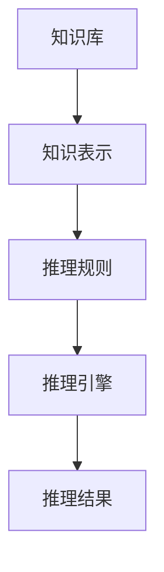

                 


# 知识推理：增强AI Agent的逻辑思考能力

---

## 关键词：
知识推理、AI Agent、逻辑思考、算法原理、系统架构、数学模型

---

## 摘要：
知识推理是AI Agent实现逻辑思考能力的核心技术之一，它通过从已有知识中推导出新的结论，帮助AI Agent更好地理解和处理复杂问题。本文从知识推理的基本概念出发，深入分析其算法原理、数学模型，并结合实际应用场景，详细阐述如何通过知识推理增强AI Agent的逻辑思考能力。文章内容包括知识推理的核心概念、算法实现、系统架构设计以及项目实战，旨在为读者提供一个全面的知识框架，帮助他们更好地理解和应用知识推理技术。

---

# 第1章: 知识推理的背景与概念

## 1.1 知识推理的基本概念
### 1.1.1 知识推理的定义
知识推理是指通过已有的知识或信息，运用逻辑规则或推理方法，推导出新的结论或知识的过程。它是人工智能（AI）系统实现智能决策、问题解决和自主学习的核心技术之一。

### 1.1.2 知识推理的核心要素
知识推理的核心要素包括：
1. **知识表示**：将知识以某种形式表示出来，例如符号、语义网络、知识图谱等。
2. **推理规则**：用于指导推理过程的逻辑规则或算法。
3. **推理引擎**：实现推理过程的软件或算法。

### 1.1.3 知识推理的分类与特点
知识推理主要分为以下几类：
- **基于符号的推理**：通过符号逻辑进行推理，例如命题逻辑和谓词逻辑。
- **基于概率的推理**：通过概率模型进行推理，例如贝叶斯推理。
- **基于知识图谱的推理**：利用知识图谱中的实体关系进行推理。

其特点包括：
1. **确定性**：基于符号逻辑的推理通常具有明确的规则和结论。
2. **不确定性**：基于概率的推理需要处理不确定性问题。
3. **可解释性**：知识推理的结果通常具有较高的可解释性。

### 1.1.4 知识推理的核心流程
知识推理的核心流程包括以下步骤：
1. **知识获取**：从数据源中获取知识。
2. **知识表示**：将知识转化为可处理的形式。
3. **推理规则设计**：设计推理规则或算法。
4. **推理过程**：根据推理规则，从已知知识中推导出新结论。
5. **结果验证**：验证推理结果的正确性。

---

## 1.2 AI Agent的逻辑思考能力
### 1.2.1 AI Agent的定义与特点
AI Agent（智能体）是指在计算机系统中，能够感知环境、自主决策并执行任务的实体。AI Agent的特点包括：
- **自主性**：能够在没有外部干预的情况下自主运行。
- **反应性**：能够根据环境的变化调整自己的行为。
- **目标导向性**：具有明确的目标，并通过行动实现目标。

### 1.2.2 逻辑思考能力在AI Agent中的作用
逻辑思考能力是AI Agent实现自主决策和问题解决的关键能力。它使AI Agent能够：
1. **理解环境**：通过逻辑推理理解环境中的信息。
2. **制定计划**：根据逻辑推理制定行动计划。
3. **解决问题**：通过逻辑推理解决复杂问题。

### 1.2.3 知识推理与逻辑思考的关系
知识推理是实现逻辑思考能力的基础技术。通过知识推理，AI Agent能够从已有的知识中推导出新的结论，从而实现逻辑思考。

---

## 1.3 知识推理在AI Agent中的应用背景
### 1.3.1 当前AI Agent的发展现状
随着人工智能技术的快速发展，AI Agent已经在许多领域得到了广泛应用，例如自动驾驶、智能助手、推荐系统等。

### 1.3.2 知识推理在AI Agent中的必要性
在复杂环境下，AI Agent需要处理大量不确定性和模糊性信息。通过知识推理，AI Agent能够从这些信息中提取有用的知识，从而做出更智能的决策。

### 1.3.3 知识推理技术的演进历程
知识推理技术经历了从简单符号逻辑推理到复杂知识图谱推理的演进过程。随着深度学习和大数据技术的发展，知识推理技术也在不断进步。

---

## 1.4 本章小结
本章主要介绍了知识推理的基本概念、AI Agent的逻辑思考能力以及知识推理在AI Agent中的应用背景。通过这些内容，读者可以初步理解知识推理在AI Agent中的重要性。

---

# 第2章: 知识推理的核心概念与原理

## 2.1 知识表示
### 2.1.1 知识表示的基本概念
知识表示是指将知识以某种形式表示出来，以便计算机能够理解和处理。常见的知识表示方法包括符号表示、语义网络表示、知识图谱表示等。

### 2.1.2 知识表示的优缺点对比
- **符号表示**：简单直观，易于处理，但难以表示复杂语义。
- **语义网络表示**：能够表示概念之间的关系，但难以处理大规模数据。
- **知识图谱表示**：能够表示实体之间的关系，支持大规模数据的处理。

---

## 2.2 逻辑推理的基本原理
### 2.2.1 逻辑推理的定义
逻辑推理是指通过逻辑规则从已知事实中推导出新的结论的过程。

### 2.2.2 命题逻辑与谓词逻辑
- **命题逻辑**：研究简单命题及其组合的逻辑关系。
- **谓词逻辑**：研究包含变量和谓词的命题，能够表示更复杂的语义关系。

### 2.2.3 推理规则与推理方法
常见的推理方法包括：
- **演绎推理**：从一般性知识推导出特定结论。
- **归纳推理**：从特定事实推导出一般性结论。
- ** abduction推理**：通过排除法推导出最可能的结论。

---

## 2.3 知识推理与逻辑推理的关系
### 2.3.1 知识推理的逻辑基础
知识推理以逻辑推理为基础，通过逻辑规则从知识库中推导出新结论。

### 2.3.2 逻辑推理在知识推理中的应用
逻辑推理是知识推理的核心技术之一，广泛应用于知识图谱推理、自然语言处理等领域。

### 2.3.3 知识推理与逻辑推理的差异与联系
- **差异**：知识推理侧重于从知识库中推导新知识，而逻辑推理侧重于从逻辑规则中推导结论。
- **联系**：知识推理依赖于逻辑推理的规则和方法。

---

## 2.4 本章小结
本章主要介绍了知识表示和逻辑推理的基本原理，并分析了知识推理与逻辑推理的关系。通过这些内容，读者可以理解知识推理的核心概念和基本原理。

---

# 第3章: 知识推理的算法原理

## 3.1 知识推理的算法概述
### 3.1.1 基于符号的推理算法
基于符号的推理算法主要包括命题逻辑推理和谓词逻辑推理。

### 3.1.2 基于概率的推理算法
基于概率的推理算法主要包括贝叶斯推理和马尔可夫逻辑网络推理。

### 3.1.3 基于深度学习的推理算法
基于深度学习的推理算法主要包括神经符号推理和图神经网络推理。

---

## 3.2 逻辑推理的算法实现
### 3.2.1 命题逻辑推理算法
命题逻辑推理算法包括真值表法、自然推理法和归结推理法。

### 3.2.2 谓词逻辑推理算法
谓词逻辑推理算法包括统一算法和归结法。

---

## 3.3 知识图谱推理算法
### 3.3.1 知识图谱推理的基本流程
知识图谱推理的基本流程包括知识表示、关系抽取、路径搜索和结论推导。

### 3.3.2 知识图谱推理的优化方法
知识图谱推理的优化方法包括路径剪枝、概率推理和上下文推理。

---

## 3.4 本章小结
本章主要介绍了知识推理的算法原理，包括基于符号、概率和深度学习的推理算法。通过这些内容，读者可以理解知识推理的实现方法和优化策略。

---

# 第4章: 知识推理的数学模型与公式

## 4.1 命题逻辑的数学模型
### 4.1.1 命题逻辑的基本公式
命题逻辑的基本公式包括逻辑与（$\land$）、逻辑或（$\lor$）和逻辑非（$\lnot$）。

### 4.1.2 命题逻辑的真值表
命题逻辑的真值表是表示命题在不同输入组合下的输出结果。

---

## 4.2 谓词逻辑的数学模型
### 4.2.1 谓词逻辑的基本公式
谓词逻辑的基本公式包括全称量词（$\forall$）和存在量词（$\exists$）。

### 4.2.2 谓词逻辑的符号化表示
谓词逻辑的符号化表示是将自然语言句子转化为符号逻辑表达式。

---

## 4.3 概率推理的数学模型
### 4.3.1 贝叶斯定理的应用
贝叶斯定理的应用公式为：
$$ P(A|B) = \frac{P(B|A) \cdot P(A)}{P(B)} $$

### 4.3.2 概率推理的计算方法
概率推理的计算方法包括联合概率计算和条件概率计算。

---

## 4.4 本章小结
本章主要介绍了知识推理的数学模型与公式，包括命题逻辑、谓词逻辑和概率推理的公式。通过这些内容，读者可以理解知识推理的数学基础。

---

# 第5章: 知识推理的系统分析与架构设计

## 5.1 系统功能设计
### 5.1.1 领域模型设计
领域模型设计包括知识表示、推理规则和推理引擎。

---

## 5.2 系统架构设计
### 5.2.1 系统架构图
以下是系统架构设计的mermaid图：



---

## 5.3 系统接口设计
系统接口设计包括知识表示接口、推理规则接口和推理结果接口。

---

## 5.4 本章小结
本章主要介绍了知识推理系统的分析与架构设计，包括系统功能设计、系统架构设计和系统接口设计。

---

# 第6章: 知识推理的项目实战

## 6.1 项目环境安装
### 6.1.1 安装Python环境
安装Python 3.8及以上版本，并安装必要的库，例如pandas和numpy。

### 6.1.2 安装推理算法库
安装逻辑推理库，例如logica和networkx。

---

## 6.2 知识推理的核心实现
### 6.2.1 知识表示的实现
以下是知识表示的Python代码示例：

```python
from logica import Symbol, And, Or, Not

a = Symbol('a')
b = Symbol('b')
c = Symbol('c')

knowledge_base = {
    a: True,
    b: False,
    c: And(a, Or(b, c))
}
```

---

## 6.3 实际案例分析
### 6.3.1 案例背景
假设我们有一个简单的知识库，其中包含学生、课程和成绩之间的关系。

### 6.3.2 推理过程
通过知识推理，我们可以推导出学生是否通过了某门课程。

---

## 6.4 项目小结
本章主要介绍了知识推理的项目实战，包括环境安装、核心实现和实际案例分析。

---

# 第7章: 总结与展望

## 7.1 本章总结
知识推理是AI Agent实现逻辑思考能力的核心技术之一。通过知识推理，AI Agent能够从已有的知识中推导出新的结论，从而实现智能决策和问题解决。

---

## 7.2 未来展望
随着人工智能技术的不断发展，知识推理技术也将不断进步。未来的研究方向包括：
1. **复杂知识图谱的推理**：研究如何处理大规模复杂知识图谱的推理问题。
2. **多模态推理**：研究如何结合文本、图像等多种模态信息进行推理。
3. **强化学习推理**：研究如何通过强化学习提高推理的准确性和效率。

---

## 7.3 最佳实践Tips
- 在进行知识推理时，建议先明确知识表示的形式和推理规则。
- 在处理复杂问题时，可以结合多种推理方法，如符号推理和概率推理。
- 在实际应用中，要注意数据质量和推理规则的合理性。

---

## 7.4 本章小结
本章总结了知识推理的核心内容，并展望了未来的研究方向。通过这些内容，读者可以更好地理解和应用知识推理技术。

---

# 作者：AI天才研究院/AI Genius Institute & 禅与计算机程序设计艺术 /Zen And The Art of Computer Programming

