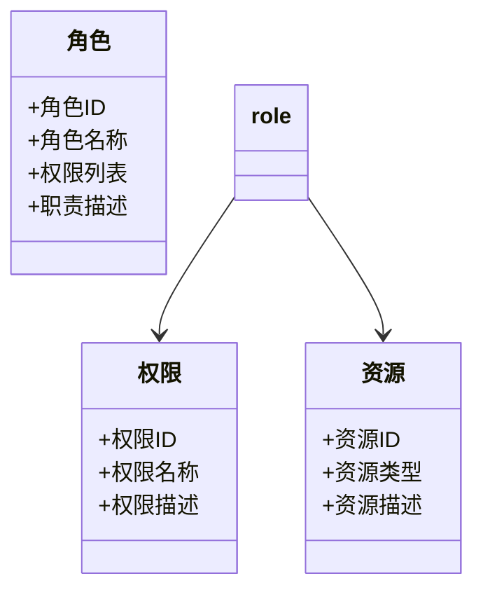
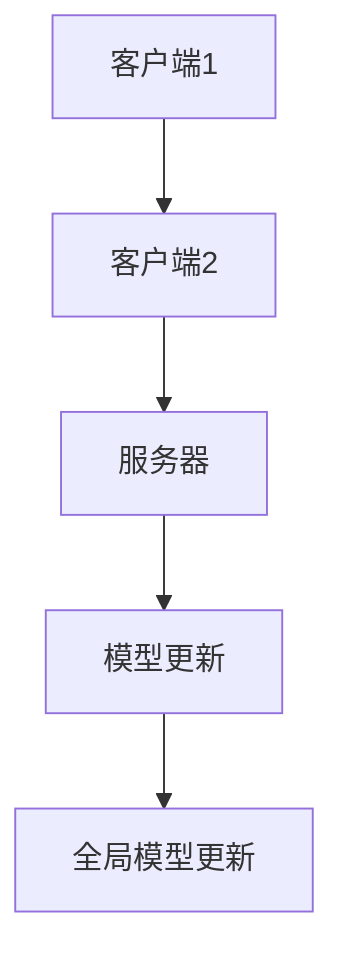
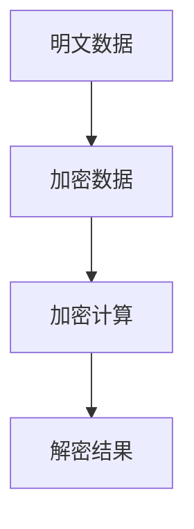
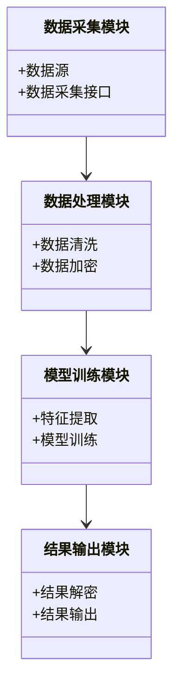
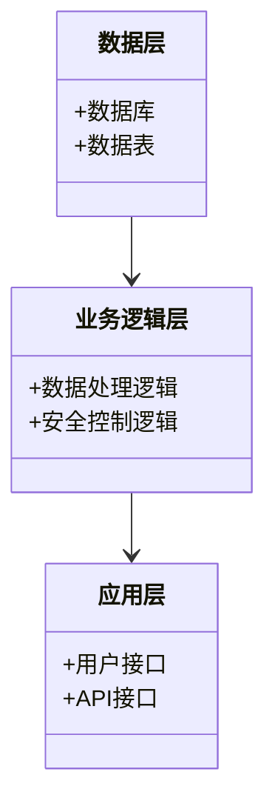
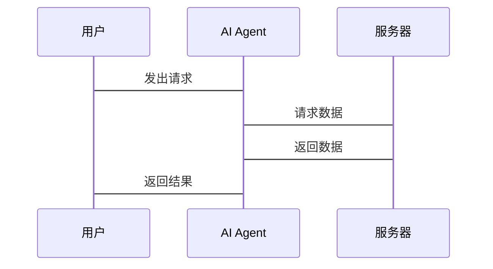

                 


# 确保AI Agent的安全性与隐私保护

> 关键词：AI Agent，数据安全，隐私保护，联邦学习，同态加密，数据匿名化，访问控制模型

> 摘要：AI Agent作为人工智能领域的重要技术，正在被广泛应用于各个行业。然而，其安全性与隐私保护问题也随之浮现。本文从技术角度详细分析AI Agent的安全性与隐私保护的核心概念、算法原理、系统架构设计，并通过实际案例展示如何在项目中实现这些保护措施，为AI Agent的安全与隐私保护提供全面的解决方案。

---

## 第一章: AI Agent的基本概念与应用场景

### 1.1 AI Agent的定义与特点

AI Agent（智能体）是指能够感知环境并采取行动以实现目标的实体。它不同于传统的被动程序，能够主动与环境交互，动态调整策略以应对变化。AI Agent的核心特点包括自主性、反应性、主动性、社会性和学习能力。

- **自主性**：AI Agent可以在没有外部干预的情况下独立运作。
- **反应性**：能够实时感知环境并做出反应。
- **主动性**：主动采取行动以实现目标。
- **社会性**：能够与其他Agent或人类进行交互和协作。
- **学习能力**：通过机器学习技术不断优化自身行为。

### 1.2 AI Agent的应用场景

AI Agent在多个领域展现出广泛的应用潜力：

- **智能助手**：如Siri、Alexa等，帮助用户完成日常任务。
- **企业级应用**：在金融、医疗等领域提供自动化服务。
- **智能决策系统**：用于复杂决策过程中的辅助判断。

---

## 第二章: AI Agent的安全性与隐私保护的重要性

### 2.1 安全性与隐私保护的背景

随着AI Agent的应用越来越广泛，其面临的安全威胁也在增加。常见的安全威胁包括数据泄露、身份 spoofing 和拒绝服务攻击（DoS）。这些威胁可能导致严重的经济损失和隐私泄露。

### 2.2 隐私泄露的潜在风险

AI Agent通常需要处理大量的敏感数据，如用户的行为数据、个人信息等。如果这些数据未得到妥善保护，可能导致隐私泄露，引发法律问题和信任危机。

### 2.3 安全与隐私保护的目标

- **数据完整性与机密性**：确保数据在传输和存储过程中不被篡改或泄露。
- **用户隐私的保护原则**：遵循最小化数据收集、数据匿名化等原则。
- **系统安全性的保障措施**：通过多层次的安全策略和访问控制来保护系统。

---

## 第三章: 安全性与隐私保护的核心原理

### 3.1 数据安全与隐私保护的模型

数据安全与隐私保护的模型包括数据泄露模型、数据加密模型和数据匿名化模型。以下是它们的对比：

```mermaid
| 模型类型      | 描述                                      | 优点                                   | 缺点                                   |
|---------------|------------------------------------------|---------------------------------------|---------------------------------------|
| 数据泄露模型  | 识别数据泄露的途径和风险                 | 精准识别潜在威胁                     | 需要大量历史数据进行训练               |
| 数据加密模型  | 对敏感数据进行加密处理                   | 高效保护数据机密性                   | 加密强度可能影响性能                   |
| 数据匿名化模型 | 对数据进行匿名化处理，去除标识符         | 保护隐私，适用于大数据分析           | 可能导致数据可用性降低                 |

```

### 3.2 安全策略与访问控制

安全策略与访问控制是保护AI Agent的重要手段。以下是三种主要的访问控制模型：



---

## 第四章: 隐私保护与数据安全的关系

### 4.1 隐私保护的核心要素

隐私保护的核心要素包括数据的所有权、使用权和共享权。以下是它们的对比：

```mermaid
| 要素      | 描述                                      | 权利与义务                             |
|-----------|------------------------------------------|---------------------------------------|
| 数据所有权 | 数据的归属权                            | 数据所有者有权控制数据的使用和共享   |
| 数据使用权 | 数据的使用权限                          | 数据所有者或授权方有权使用数据       |
| 数据共享权 | 数据的共享权限                          | 数据所有者有权决定数据的共享范围     |

```

### 4.2 数据安全与隐私保护的对比分析

数据安全与隐私保护在目标和实现上有显著差异。以下是它们的对比：

```mermaid
| 方面       | 数据安全                               | 隐私保护                               |
|------------|---------------------------------------|---------------------------------------|
| 目标       | 保护数据的机密性、完整性和可用性         | 保护个人隐私，防止未经授权的数据使用 |
| 实现方法   | 加密、访问控制、防火墙等                | 数据匿名化、脱敏、隐私计算             |
| 关注点     | 数据本身                               | 数据中的个人隐私信息                   |

```

---

## 第五章: AI Agent安全性与隐私保护的算法原理

### 5.1 联邦学习（Federated Learning）

联邦学习是一种分布式机器学习技术，允许多个参与者在不共享原始数据的情况下进行模型训练。以下是联邦学习的流程图：



实现联邦学习的Python代码示例：

```python
import numpy as np

# 模拟两个客户端的数据
client1_data = np.random.rand(100, 2)
client2_data = np.random.rand(100, 2)

# 定义模型结构
model = tf.keras.Sequential([
    tf.keras.layers.Dense(64, activation='relu'),
    tf.keras.layers.Dense(1, activation='sigmoid')
])

# 定义损失函数和优化器
model.compile(loss='binary_crossentropy', optimizer='adam')

# 客户端1训练
model.fit(client1_data, np.random.randint(0,2,100), epochs=1)

# 客户端2训练
model.fit(client2_data, np.random.randint(0,2,100), epochs=1)

# 上传更新参数到服务器
# （实际实现中，客户端仅上传梯度或模型参数增量）
```

---

### 5.2 同态加密（Homomorphic Encryption）

同态加密允许在加密数据上进行计算，结果解密后与直接在明文上计算的结果相同。以下是同态加密的流程图：



实现同态加密的Python代码示例：

```python
from cryptography.hazmat import backends
from cryptography.hazmat.primitives.asymmetric import padding
from cryptography.hazmat.primitives.asymmetric.rsa import *
from cryptography.hazmat.primitives import hashes

# 生成RSA密钥对
key = generate_private_key(
    rsa.OAEP(
        hash Algorithm=hashes.SHA256(),
        mgfAlgorithm=rsa.MGF1(
            hash Algorithm=hashes.SHA256()
        ),
        saltLength=32
    ),
    backend=backends.default_backend()
)

# 加密数据
ciphertext = key.public_key().encrypt(
    b"Sensitive data",
    padding.OAEP(
        mgf=padding.MGF1(salt_length=32),
        algorithm=hashes.SHA256()
    )
)

# 解密数据
plaintext = key.decrypt(ciphertext)
```

---

## 第六章: 系统分析与架构设计方案

### 6.1 项目背景与目标

本项目旨在设计一个AI Agent系统，确保其在数据处理和传输过程中的安全性与隐私保护。目标包括实现数据加密、访问控制和隐私保护机制。

### 6.2 系统功能设计

系统功能设计包括数据采集、数据处理、模型训练和结果输出四个模块。



### 6.3 系统架构设计

系统架构采用分层设计，包括数据层、业务逻辑层和应用层。



### 6.4 系统交互设计

系统交互设计包括用户与AI Agent的交互流程，以及AI Agent与后端系统的交互。



---

## 第七章: 项目实战

### 7.1 环境配置

项目实战以电商推荐系统为例，以下是环境配置：

```bash
# 安装依赖
pip install numpy scikit-learn flask
```

### 7.2 核心代码实现

以下是AI Agent的安全性与隐私保护的核心代码实现：

```python
from flask import Flask, request, jsonify
from sklearn.neighbors import NearestNeighbors
import numpy as np

app = Flask(__name__)
model = NearestNeighbors(n_neighbors=3)

@app.route('/train', methods=['POST'])
def train():
    data = request.json['data']
    model.fit(data)
    return jsonify({'status': 'success'})

@app.route('/predict', methods=['POST'])
def predict():
    data = request.json['data']
    nearest_neighbors = model.kneighbors(data)
    return jsonify({'neighbors': nearest_neighbors.tolist()})

if __name__ == '__main__':
    app.run(debug=True)
```

### 7.3 案例分析与总结

通过电商推荐系统的实战，我们展示了如何在实际项目中实现AI Agent的安全性与隐私保护。关键点包括：

- 数据加密与匿名化处理
- 访问控制与权限管理
- 使用联邦学习等技术保护数据隐私

---

## 第八章: 总结与展望

### 8.1 内容总结

本文从技术角度详细探讨了AI Agent的安全性与隐私保护问题，涵盖了核心概念、算法原理、系统架构设计和项目实战。通过实际案例展示了如何在项目中实现这些保护措施。

### 8.2 未来展望

随着AI技术的不断发展，AI Agent的安全性与隐私保护将面临更多挑战。未来的研究方向包括：

- 更先进的加密算法
- 更高效的隐私保护技术
- 更智能的安全监控系统

### 8.3 最佳实践 Tips

- 在设计AI Agent系统时，优先考虑数据安全和隐私保护。
- 定期进行安全审计和漏洞测试。
- 使用成熟的开源工具和库来实现加密和访问控制。

---

## 作者：AI天才研究院/AI Genius Institute & 禅与计算机程序设计艺术 /Zen And The Art of Computer Programming

---

**本文由AI天才研究院撰写，转载请注明出处。**

