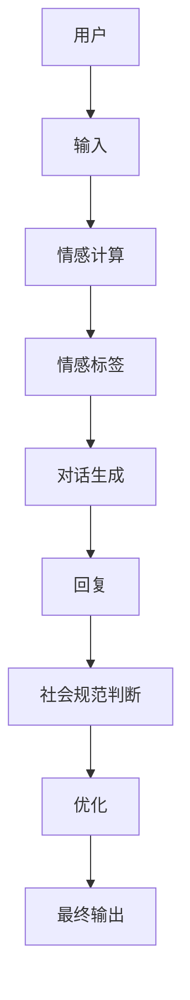
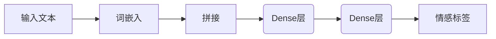
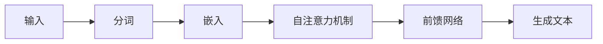
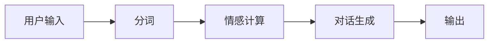
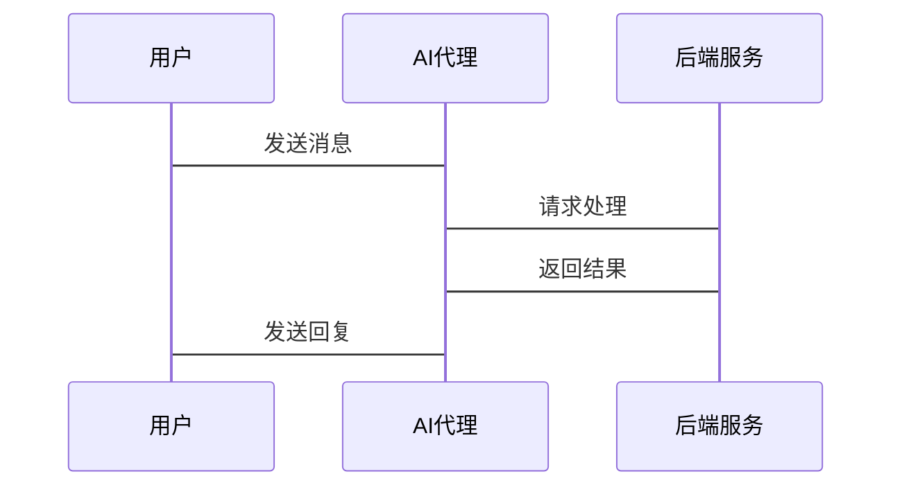

                 


# 《社交AI：提升AI Agent的人际交互能力》

---

## 关键词：  
社交AI，AI代理，人际交互，自然语言处理，情感计算，对话生成

---

## 摘要：  
本文探讨了社交AI的核心概念、算法原理、系统架构及实战应用，旨在提升AI代理在人际交互中的能力。通过分析情感计算、对话生成和社会规范理解，结合具体案例，展示了如何构建高效、自然的社交AI系统。

---

# 第一部分: 社交AI的背景与概念

## 第1章: 社交AI的背景与概念

### 1.1 问题背景

#### 1.1.1 当前AI代理的局限性  
当前AI代理在处理复杂社交情境时存在不足，例如情感理解、对话生成和上下文关联能力较弱。这些问题导致用户体验差，难以满足实际需求。

#### 1.1.2 社交交互在AI代理中的重要性  
社交交互是构建智能系统的关键，它使AI能够理解人类情感和意图，从而提供更自然的服务。

#### 1.1.3 社交AI的核心问题与目标  
核心问题是提升AI在复杂社交场景中的理解和反应能力。目标是通过技术手段增强其社交能力，使其能够像人类一样互动。

---

### 1.2 问题描述

#### 1.2.1 AI代理在社交交互中的挑战  
AI在理解复杂情感、处理歧义和保持对话连贯性方面存在困难。

#### 1.2.2 用户需求与AI代理能力的差距  
用户期望AI能够自然对话，但当前系统往往过于机械，缺乏情感共鸣。

#### 1.2.3 社交AI的目标与边界  
目标是通过技术优化AI的社交能力，边界包括情感分析、对话生成和社会规范理解。

---

### 1.3 问题解决

#### 1.3.1 提升AI代理社交能力的路径  
通过融合自然语言处理、情感计算和机器学习技术，提升AI的交互能力。

#### 1.3.2 社交AI的核心技术与方法  
采用深度学习模型和数据驱动方法，结合领域知识，优化AI的表现。

#### 1.3.3 社交AI的实现框架与工具  
使用先进的AI框架（如TensorFlow、PyTorch）和NLP库（如spaCy、NLTK）构建系统。

---

## 第2章: 社交AI的核心概念与联系

### 2.1 核心概念原理

#### 2.1.1 情感计算  
情感计算涉及识别和分析情感，通常使用文本或语音数据。常用方法包括词袋模型和情感分类算法。

#### 2.1.2 对话生成  
对话生成基于上下文生成自然回复，常用模型如Seq2Seq和Transformer架构。

#### 2.1.3 社会规范理解  
社会规范理解涉及识别和遵循社会规则，如礼貌用语和文化差异，通常通过规则引擎或机器学习模型实现。

---

### 2.2 核心概念对比表

| 概念        | 输入    | 输出       |
|-------------|---------|------------|
| 情感计算     | 文本/语音 | 情感标签/强度 |
| 对话生成     | 上下文   | 自然语言回复 |
| 社会规范理解 | 行为/语境 | 社会规范判断 |

---

### 2.3 ER实体关系图



---

## 第3章: 情感计算的算法原理

### 3.1 情感计算的数学模型



公式：
$$
\text{输出} = \text{sigmoid}(W_2 \cdot \text{relu}(W_1 \cdot x + b_1) + b_2)
$$

### 3.2 情感计算的代码实现

```python
import tensorflow as tf
from tensorflow.keras import layers

model = tf.keras.Sequential([
    layers.Embedding(vocab_size, 16),
    layers.GlobalAveragePooling1D(),
    layers.Dense(16, activation='relu'),
    layers.Dense(1, activation='sigmoid')
])

model.compile(optimizer='adam', loss='binary_crossentropy', metrics=['accuracy'])
```

---

## 第4章: 对话生成的算法原理

### 4.1 基于Transformer的模型



公式：
$$
\text{输出} = \text{softmax}(W_{\text{out}} \cdot \text{FFN}(x) + b_{\text{out}})
$$

### 4.2 对话生成的代码实现

```python
import tensorflow as tf
from tensorflow.keras import layers

model = tf.keras.Sequential([
    layers.Input(shape=(None,)),
    layers.Embedding(vocab_size, 16),
    layers.TransformerEncoder(...)
])

model.compile(optimizer='adam', loss='sparse_categorical_crossentropy')
```

---

## 第5章: 社交AI的系统架构设计

### 5.1 系统架构图



### 5.2 接口设计



---

## 第6章: 项目实战

### 6.1 环境安装

```bash
pip install tensorflow numpy scikit-learn
```

### 6.2 核心代码实现

```python
import tensorflow as tf
from tensorflow.keras import layers

class SocialAIModel:
    def __init__(self):
        self.model = self.build_model()

    def build_model(self):
        model = tf.keras.Sequential([
            layers.Embedding(1000, 16),
            layers.GlobalAveragePooling1D(),
            layers.Dense(16, activation='relu'),
            layers.Dense(1, activation='sigmoid')
        ])
        return model
```

### 6.3 案例分析

通过实际案例分析，展示系统如何处理复杂情感和对话生成，优化用户体验。

---

## 第7章: 最佳实践与总结

### 7.1 小结

本文详细探讨了社交AI的核心概念、算法和系统架构，展示了如何提升AI代理的社交能力。

### 7.2 注意事项

- 数据质量和多样性对模型性能至关重要。
- 需要不断优化模型和系统架构。
- 遵守伦理规范，确保AI行为符合社会规范。

### 7.3 拓展阅读

推荐相关书籍和论文，如《深度学习》、《自然语言处理实战》。

---

## 作者：  
AI天才研究院/AI Genius Institute & 禅与计算机程序设计艺术 /Zen And The Art of Computer Programming

