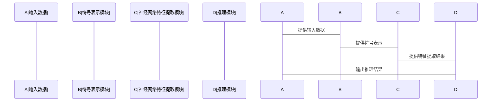

                 


# 神经符号AI：结合符号推理与神经网络的AI Agent

> 关键词：神经符号AI、符号推理、神经网络、AI Agent、端到端学习、符号表示、推理机制

> 摘要：神经符号AI是一种结合了符号推理和神经网络技术的AI代理，旨在通过符号推理的可解释性和神经网络的强大的模式识别能力，实现更高效、更智能的AI系统。本文将详细探讨神经符号AI的核心概念、算法原理、系统设计和实际应用，帮助读者全面理解这一前沿技术。

---

# 第一部分: 神经符号AI的背景与概念

## 第1章: 神经符号AI的定义与背景

### 1.1 神经符号AI的定义
#### 1.1.1 神经符号AI的核心概念
神经符号AI是一种结合了符号推理和神经网络技术的人工智能方法。它通过符号推理来处理逻辑规则，同时利用神经网络的强大特征学习能力，实现更高效、更智能的AI系统。

#### 1.1.2 神经符号AI的起源与发展
神经符号AI的概念起源于20世纪80年代，随着深度学习和符号推理技术的不断发展，神经符号AI在近年来得到了广泛关注，并在许多领域取得了显著进展。

#### 1.1.3 神经符号AI与传统AI的区别
神经符号AI结合了符号推理和神经网络的优势，弥补了传统符号推理在处理复杂数据时的不足，同时也克服了纯神经网络在可解释性和逻辑推理能力上的缺陷。

### 1.2 神经符号AI的应用场景
#### 1.2.1 符号推理的优势
符号推理在处理逻辑规则、知识表示和推理方面具有明显优势，例如在自然语言处理、专家系统等领域。

#### 1.2.2 神经网络的优势
神经网络在图像识别、语音识别和自然语言处理等领域表现出色，能够处理复杂的数据模式。

#### 1.2.3 神经符号AI的结合价值
通过结合符号推理和神经网络，神经符号AI可以在复杂场景中实现更高效的推理和决策，例如在自动驾驶、智能客服等领域具有广泛的应用前景。

### 1.3 神经符号AI的挑战与机遇
#### 1.3.1 当前技术的局限性
神经符号AI在实际应用中还面临许多挑战，例如符号表示的复杂性、推理效率等问题。

#### 1.3.2 神经符号AI的未来发展方向
随着技术的进步，神经符号AI将在更广泛的领域中得到应用，特别是在需要结合逻辑推理和数据驱动的场景中。

#### 1.3.3 企业级应用中的潜在价值
神经符号AI在企业级应用中具有巨大的潜力，例如在知识管理、智能决策支持系统等领域。

---

# 第二部分: 神经符号AI的核心概念与联系

## 第2章: 神经符号AI的核心概念与联系

### 2.1 符号推理与神经网络的结合原理
#### 2.1.1 符号推理的基本原理
符号推理是基于逻辑规则的推理方法，通过符号表示和逻辑推理来实现知识的处理和应用。

#### 2.1.2 神经网络的基本原理
神经网络通过多层神经元的连接和激活函数，实现数据的特征学习和模式识别。

#### 2.1.3 神经符号AI的结合方式
神经符号AI通过将符号表示和神经网络的特征学习相结合，实现了逻辑推理和数据驱动的结合。

### 2.2 神经符号AI的核心要素
#### 2.2.1 符号表示
符号表示是神经符号AI的基础，用于将问题中的知识和数据表示为符号形式。

#### 2.2.2 知识表示
知识表示是符号推理的重要部分，通过符号表示和逻辑规则来描述问题中的知识和关系。

#### 2.2.3 推理机制
推理机制是神经符号AI的核心，通过符号推理和神经网络的结合，实现知识的推理和应用。

### 2.3 神经符号AI的属性特征对比
#### 2.3.1 符号推理的特征
符号推理具有可解释性强、逻辑清晰的特点，但处理复杂数据的能力较弱。

#### 2.3.2 神经网络的特征
神经网络具有强大的特征学习能力和处理复杂数据的能力，但可解释性和逻辑推理能力较弱。

#### 2.3.3 神经符号AI的综合特征
神经符号AI结合了符号推理和神经网络的优点，具有较强的可解释性和逻辑推理能力，同时能够处理复杂的数据模式。

### 2.4 ER实体关系图架构


---

# 第三部分: 神经符号AI的算法原理

## 第3章: 神经符号AI的算法原理

### 3.1 神经符号AI的基本算法
#### 3.1.1 神经符号表示的数学模型
符号表示可以通过数学模型进行编码，例如使用向量表示符号。

#### 3.1.2 神经符号推理的数学模型
推理过程可以通过数学模型进行建模，例如通过逻辑规则和概率推理。

#### 3.1.3 端到端神经符号学习的数学模型
端到端学习通过神经网络和符号推理的结合，实现从输入到输出的端到端推理。

### 3.2 神经符号AI的符号表示方法
#### 3.2.1 符号表示的数学表达
符号可以通过向量或矩阵的形式进行表示，例如使用独热编码或嵌入向量。

#### 3.2.2 神经网络表示的符号转换
通过神经网络将符号表示转换为连续的向量形式，例如使用嵌入层。

#### 3.2.3 符号与神经网络的混合表示
结合符号表示和神经网络表示，实现混合表示。

### 3.3 神经符号AI的推理机制
#### 3.3.1 符号推理的逻辑规则
符号推理基于逻辑规则进行推理，例如使用逻辑蕴含和逻辑析取。

#### 3.3.2 神经网络的特征提取
神经网络通过特征提取层，学习数据中的有用特征。

#### 3.3.3 神经符号推理的结合方法
通过结合符号推理和神经网络的特征提取，实现混合推理。

### 3.4 神经符号AI的数学公式
#### 3.4.1 符号表示的公式
$$s = f(x)$$

#### 3.4.2 神经网络表示的公式
$$y = \sigma(Wx + b)$$

#### 3.4.3 端到端神经符号学习的公式
$$p(y|x) = \prod_{i=1}^{n} p(y_i|x_i)$$

---

# 第四部分: 神经符号AI的系统分析与架构设计

## 第4章: 神经符号AI的系统分析与架构设计

### 4.1 神经符号AI的应用场景
#### 4.1.1 神经符号AI在自动驾驶中的应用
通过结合符号推理和神经网络，实现路径规划和决策推理。

#### 4.1.2 神经符号AI在智能客服中的应用
通过符号推理和神经网络的结合，实现智能问答和客户意图识别。

### 4.2 神经符号AI的系统功能设计
#### 4.2.1 系统功能模块
- 符号表示模块
- 神经网络特征提取模块
- 推理模块

#### 4.2.2 系统功能流程
符号表示模块将输入数据转换为符号形式，神经网络特征提取模块提取特征，推理模块基于符号和特征进行推理。

### 4.3 神经符号AI的系统架构设计


### 4.4 神经符号AI的系统接口设计
- 输入接口：接收符号和特征表示
- 输出接口：输出推理结果

### 4.5 神经符号AI的系统交互流程


---

# 第五部分: 神经符号AI的项目实战

## 第5章: 神经符号AI的项目实战

### 5.1 神经符号AI的环境安装
- 安装Python和相关库（如TensorFlow、Keras、符号逻辑库）

### 5.2 神经符号AI的核心代码实现
```python
class NeuralSymbolicAI:
    def __init__(self):
        self.symbol_layer = SymbolLayer()
        self.neural_layer = NeuralLayer()

    def forward(self, x):
        s = self.symbol_layer.forward(x)
        y = self.neural_layer.forward(s)
        return y

    def backward(self, dy):
        ds = self.neural_layer.backward(dy)
        dx = self.symbol_layer.backward(ds)
        return dx
```

### 5.3 神经符号AI的案例分析
通过具体案例分析，展示神经符号AI在实际应用中的效果和优势。

### 5.4 神经符号AI的项目小结
总结项目实现的过程和经验，提出改进建议。

---

# 第六部分: 神经符号AI的最佳实践与总结

## 第6章: 神经符号AI的最佳实践

### 6.1 神经符号AI的小结
总结全文内容，强调神经符号AI的核心概念和算法原理。

### 6.2 神经符号AI的注意事项
在实际应用中需要注意符号表示的复杂性和推理效率的问题。

### 6.3 神经符号AI的拓展阅读
推荐相关领域的书籍和论文，供读者进一步学习。

---

# 作者

作者：AI天才研究院/AI Genius Institute & 禅与计算机程序设计艺术 /Zen And The Art of Computer Programming

