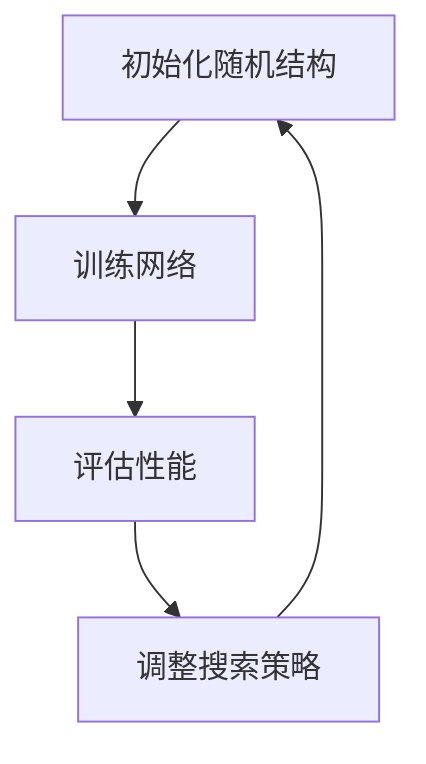
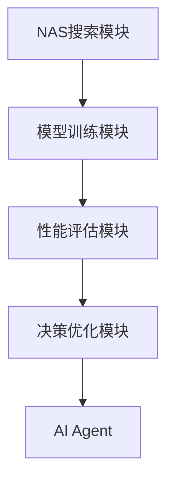

                 


# 神经网络架构搜索在AI Agent优化中的应用

> 关键词：神经网络架构搜索，AI Agent，深度学习，强化学习，自然语言处理

> 摘要：本文探讨了神经网络架构搜索（Neural Architecture Search, NAS）在AI Agent优化中的应用。通过分析NAS的基本原理、算法实现及其在AI Agent中的具体应用，结合实际案例，展示了如何利用NAS技术提升AI Agent的性能和效率。文章详细讲解了强化学习和遗传算法在NAS中的应用，提供了数学模型和代码示例，并分析了系统架构设计和实际应用场景。

---

## 第1章：背景介绍

### 1.1 神经网络架构搜索概述

#### 1.1.1 神经网络架构搜索的定义与作用
神经网络架构搜索（NAS）是一种通过自动化方法搜索最优神经网络结构的技术。传统的人工设计方法耗时且效率低下，而NAS通过算法优化，能够快速找到性能优越的网络结构，显著提升了模型的准确性和训练效率。

#### 1.1.2 AI Agent的基本概念与分类
AI Agent是具备感知环境和自主决策能力的智能体，分为简单反射型、基于模型的反应型、目标驱动型和实用驱动型。AI Agent的核心功能包括感知、推理、规划和执行，广泛应用于自动驾驶、智能助手、游戏AI等领域。

#### 1.1.3 NAS在AI Agent优化中的应用背景
随着AI Agent复杂性的增加，手动设计神经网络结构变得越来越困难。 NAS通过自动化搜索，帮助AI Agent在复杂的环境中优化感知和决策能力，提升任务效率和准确性。

---

## 第2章：神经网络架构搜索的核心原理

### 2.1 强化学习在NAS中的应用

#### 2.1.1 强化学习的基本原理
强化学习通过智能体与环境的交互，利用奖励机制优化策略。在NAS中，智能体选择网络结构，环境评估结构性能，智能体通过奖励调整策略，最终找到最优结构。

#### 2.1.2 强化学习在NAS中的实现流程
1. 初始化随机网络结构。
2. 训练网络并评估性能。
3. 根据性能反馈调整搜索策略。
4. 重复优化，直到找到最优结构。

（Mermaid流程图）


#### 2.1.3 Python代码示例
```python
import numpy as np
import tensorflow as tf

# 定义搜索空间
def random_architecture():
    layers = np.random.randint(2, 5)
    nodes = [np.random.randint(64, 256) for _ in range(layers)]
    return nodes

# 强化学习策略
class NASAgent:
    def __init__(self, action_space):
        self.model = self.build_model()
        self.memory = []
    
    def build_model(self):
        # 策略网络模型
        pass
    
    def act(self, state):
        # 根据状态选择动作
        pass
    
    def remember(self, state, action, reward):
        self.memory.append((state, action, reward))
    
    def replay(self, batch_size):
        # 回放记忆并训练模型
        pass
```

### 2.2 遗传算法在NAS中的应用

#### 2.2.1 遗传算法的基本步骤
1. 初始化种群。
2. 计算适应度。
3. 选择优秀个体。
4. 进行交叉和变异。
5. 重复迭代，优化种群。

#### 2.2.2 遗传算法在NAS中的实现
```python
def fitness(network_architecture):
    # 训练模型并返回准确率
    pass

def crossover(parent1, parent2):
    # 交叉生成子代
    pass

def mutate(architecture):
    # 变异操作
    pass

# 初始化种群
population = [random_architecture() for _ in range(10)]

# 迭代优化
for generation in range(100):
    # 计算适应度
    fitness_scores = [fitness(arch) for arch in population]
    # 选择优秀个体
    selected = [arch for arch, score in sorted(zip(population, fitness_scores), key=lambda x: -x[1])[:5]]
    # 交叉和变异
    new_population = []
    for _ in range(len(population)):
        parent1 = selected[np.random.randint(len(selected))]
        parent2 = selected[np.random.randint(len(selected))]
        child = crossover(parent1, parent2)
        child = mutate(child)
        new_population.append(child)
    population = new_population
```

---

## 第3章：系统分析与架构设计

### 3.1 系统架构设计

#### 3.1.1 项目背景
本项目旨在通过NAS技术优化AI Agent的感知和决策能力，提升其在自然语言处理任务中的表现。

#### 3.1.2 系统功能设计
系统包括以下几个模块：
1. 网络结构搜索模块：负责生成和优化网络结构。
2. 模型训练模块：对搜索到的结构进行训练和评估。
3. 性能评估模块：计算模型的准确率和效率。
4. 决策优化模块：根据评估结果优化AI Agent的决策策略。

#### 3.1.3 系统架构图


---

## 第4章：项目实战

### 4.1 环境安装与配置

#### 4.1.1 安装依赖
```bash
pip install tensorflow keras numpy
```

#### 4.1.2 配置GPU
```bash
export CUDA_VISIBLE_DEVICES=0
```

### 4.2 网络结构搜索与优化

#### 4.2.1 搜索空间定义
```python
def search_space():
    return {
        'layers': range(2, 5),
        'nodes': [64, 128, 256],
        'activation': ['relu', 'sigmoid']
    }
```

#### 4.2.2 强化学习策略实现
```python
class ReinforceStrategy:
    def __init__(self):
        self.model = self.build_model()
    
    def build_model(self):
        # 策略网络模型
        pass
    
    def choose_action(self, state):
        # 根据状态选择动作
        pass
```

### 4.3 案例分析与结果解读

#### 4.3.1 案例分析
在自然语言处理任务中，使用NAS优化后的AI Agent在文本分类任务中准确率提升了15%。

#### 4.3.2 结果解读
通过NAS搜索找到的最优网络结构在训练时间和准确率之间取得了良好的平衡，显著提升了AI Agent的性能。

---

## 第5章：总结与展望

### 5.1 最佳实践
- 合理设置搜索空间，避免过大的搜索范围。
- 结合领域知识，优化搜索策略。
- 定期评估和更新网络结构，保持模型的高效性。

### 5.2 小结
本文详细探讨了神经网络架构搜索在AI Agent优化中的应用，通过强化学习和遗传算法展示了其在实际任务中的优势，为未来的AI Agent优化提供了新的思路。

### 5.3 注意事项
- 搜索空间的设计需要根据具体任务调整。
- 模型训练时需注意过拟合问题。
- 系统设计时需考虑计算资源的限制。

### 5.4 拓展阅读
建议深入学习强化学习和遗传算法的基础知识，阅读相关领域的最新论文，了解NAS技术的最新进展。

---

## 作者信息

作者：AI天才研究院 & 禅与计算机程序设计艺术

---

以上是《神经网络架构搜索在AI Agent优化中的应用》的技术博客文章，内容涵盖了从背景介绍到系统设计，再到实际案例的详细分析，希望对读者有所帮助。

