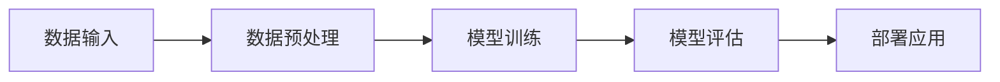

                 


# 离线强化学习：利用历史数据训练AI Agent

> 关键词：离线强化学习、AI Agent、历史数据、强化学习、机器学习、深度学习

> 摘要：离线强化学习是一种利用历史数据训练智能体的方法，无需实时与环境互动，适用于数据丰富的场景。本文将详细探讨其核心概念、算法原理、系统架构设计及项目实战，帮助读者全面理解并掌握离线强化学习的应用。

---

## 第1章：离线强化学习的背景与重要性

### 1.1 强化学习的基本概念

**智能体（Agent）**：智能体是强化学习的核心，能够感知环境并采取行动。环境通过状态和奖励与智能体互动，智能体的目标是通过最大化累积奖励来学习最优策略。

**环境（Environment）**：环境是智能体所处的外部世界，可以是真实世界（如机器人）或虚拟世界（如游戏）。环境的状态决定了智能体的决策。

**动作（Action）**：智能体在每个时间步采取的行动，如移动、点击等。

**奖励（Reward）**：环境对智能体行动的反馈，指导智能体判断行动的好坏。

### 1.2 离线强化学习的背景与重要性

**定义**：离线强化学习利用历史数据训练智能体，无需实时互动。数据通常来自模拟器或过去的真实交互。

**特点**：
- 数据驱动：依赖历史数据进行训练。
- 离线训练：无需实时环境互动。
- 适用场景：适用于数据丰富的环境，如游戏、推荐系统和机器人控制。

**优势**：
- **数据复用**：利用历史数据，避免频繁与环境互动。
- **安全性**：在危险环境中避免实时测试。
- **效率提升**：减少在线训练的时间和资源消耗。

**挑战**：
- 数据偏差：历史数据可能不完全代表所有可能状态。
- 稀疏性：某些状态或动作可能不存在于历史数据中。

---

## 第2章：离线强化学习的核心概念与算法原理

### 2.1 离线强化学习的核心概念

**策略（Policy）**：定义智能体在给定状态下采取的动作，分为确定性策略和概率性策略。

**价值函数（Value Function）**：评估状态或动作-状态对的价值，帮助智能体判断当前状态的好坏。

### 2.2 离线强化学习的关键算法

#### 2.2.1 Q-Learning

**算法流程**：
1. **初始化**：设置初始Q值。
2. **选择动作**：根据当前状态选择动作。
3. **执行动作**：执行动作，观察新状态和奖励。
4. **更新Q值**：根据奖励和新状态更新Q值。

**数学公式**：
$$ Q(s, a) \leftarrow Q(s, a) + \alpha \left[r + \gamma \max_{a'} Q(s', a') - Q(s, a)\right] $$
其中，$\alpha$是学习率，$\gamma$是折扣因子。

**特点**：基于表格存储，适用于离散状态和动作空间。

#### 2.2.2 Deep Q-Networks (DQN)

**网络结构**：
- 输入层：接收状态输入。
- 隐藏层：进行特征提取。
- 输出层：预测每个动作的Q值。

**经验回放**：将经验存储在回放缓冲区，随机抽取样本训练，减少样本偏差。

**双网络结构**：主网络评估当前策略，目标网络作为目标值，定期更新。

**算法步骤**：
1. **环境互动**：与环境互动，收集状态、动作和奖励。
2. **存储经验**：将经验存储在回放缓冲区。
3. **采样经验**：随机抽取小批量经验训练。
4. **更新网络**：优化主网络参数，同步到目标网络。

#### 2.2.3 Policy Gradient Methods

**策略梯度法**：
- 直接优化策略，寻找使期望奖励最大的参数。
- 使用概率梯度上升方法更新参数。

**数学公式**：
$$ \theta \leftarrow \theta + \alpha \nabla_\theta J(\theta) $$
其中，$J(\theta)$是目标函数，$\nabla_\theta$是梯度。

**特点**：适用于高维状态空间，但训练过程可能不稳定。

#### 2.2.4 贝叶斯强化学习

**贝叶斯方法**：
- 利用贝叶斯定理更新先验概率，估计最优策略。
- 适用于不确定环境，通过概率建模处理数据稀疏性。

**优势**：能够处理部分可观测问题，提供概率预测。

### 2.3 离线强化学习的算法原理

#### 2.3.1 Q-Learning算法

**流程图**：
```mermaid
graph LR
    A[初始化Q表] --> B[当前状态s]
    B --> C[选择动作a]
    C --> D[执行动作a，获得新状态s'和奖励r]
    D --> E[更新Q(s,a)]
    E --> F[结束或返回A]
```

**代码实现**：
```python
import numpy as np

class QLearning:
    def __init__(self, state_space, action_space):
        self.state_space = state_space
        self.action_space = action_space
        self.Q = np.zeros((state_space, action_space))

    def choose_action(self, state, epsilon=0.1):
        if np.random.random() < epsilon:
            return np.random.randint(self.action_space)
        else:
            return np.argmax(self.Q[state])

    def update_Q(self, state, action, reward, next_state, alpha=0.1, gamma=0.9):
        current_q = self.Q[state, action]
        next_max_q = np.max(self.Q[next_state])
        self.Q[state, action] = current_q + alpha * (reward + gamma * next_max_q - current_q)
```

---

## 第3章：离线强化学习的系统架构与设计

### 3.1 离线强化学习系统的架构设计

**系统架构**：


**功能模块**：
- 数据预处理：清洗、归一化、特征提取。
- 模型训练：选择算法、调整超参数。
- 模型评估：验证模型在新数据上的表现。
- 部署应用：将模型集成到目标系统中。

### 3.2 系统设计

**数据流分析**：
1. **数据收集**：从历史日志、模拟器或其他来源获取数据。
2. **数据预处理**：清洗、归一化、特征工程。
3. **模型训练**：选择算法，训练模型。
4. **模型评估**：测试模型在验证集上的表现。
5. **部署应用**：将模型部署到生产环境。

**交互设计**：
- 用户输入：通过接口输入状态和动作。
- 模型输出：预测最优动作，指导下一步操作。

---

## 第4章：离线强化学习的项目实战

### 4.1 项目介绍

**案例：离线训练AI代理在游戏环境中的应用**

**目标**：训练AI代理在固定规则下做出最优决策，如游戏中的策略选择。

**环境配置**：
- 使用OpenAI Gym库，选择一个适合离线强化学习的环境，如CartPole。

### 4.2 核心实现

**代码实现**：
```python
import gym
import numpy as np

env = gym.make('CartPole-v0')
state_space = env.observation_space.shape[0]
action_space = env.action_space.n

# 初始化DQN模型
class DQN:
    def __init__(self, state_space, action_space, epsilon=0.1):
        self.state_space = state_space
        self.action_space = action_space
        self.epsilon = epsilon
        self.Q = np.zeros((state_space, action_space))

    def choose_action(self, state):
        if np.random.random() < self.epsilon:
            return np.random.randint(self.action_space)
        else:
            return np.argmax(self.Q[state])

    def update_Q(self, state, action, reward, next_state, alpha=0.1, gamma=0.9):
        current_q = self.Q[state, action]
        next_max_q = np.max(self.Q[next_state])
        self.Q[state, action] = current_q + alpha * (reward + gamma * next_max_q - current_q)

# 训练过程
dqn = DQN(state_space, action_space)
episodes = 1000
rewards = []

for episode in range(episodes):
    state = env.reset()
    total_reward = 0
    done = False

    while not done:
        action = dqn.choose_action(state)
        next_state, reward, done, _ = env.step(action)
        dqn.update_Q(state, action, reward, next_state)
        total_reward += reward
        state = next_state

    rewards.append(total_reward)
    if episode % 10 == 0:
        print(f"Episode {episode}: Total Reward = {total_reward}")

print("Training Complete")
```

**结果分析**：
- 训练过程中，奖励逐渐增加，说明模型逐渐掌握最优策略。
- 最终，AI代理能够在游戏环境中稳定获得高奖励。

### 4.3 总结与优化

**总结**：
- 通过离线强化学习，AI代理能够有效利用历史数据，快速掌握策略，无需实时互动。
- 项目实现了DQN算法，验证了其在离线环境中的有效性。

**优化建议**：
- 增加经验回放机制，提升模型泛化能力。
- 使用更深的神经网络结构，如卷积神经网络，提高处理复杂环境的能力。

---

## 第5章：总结与展望

### 5.1 总结

离线强化学习通过利用历史数据，为智能体提供了一种无需实时互动的训练方式。本文详细探讨了其核心概念、算法原理、系统架构设计及项目实战，展示了其在实际应用中的潜力和优势。

### 5.2 展望

随着技术的发展，离线强化学习将在更多领域得到应用。未来的研究方向包括：
- 更高效的算法设计，如结合深度学习的离线强化学习方法。
- 处理高维复杂环境，如多智能体协作和复杂任务规划。
- 跨领域应用，如结合自然语言处理和计算机视觉，提升智能体的综合能力。

---

## 附录：参考文献与工具

- **参考文献**：
  1. Deep Q-Networks (DQN)论文：Mnih, V., et al. "Human-level control through deep reinforcement learning." Nature, 2015.
  2. 策略梯度方法论文：Sutton, R. S., et al. "Policy gradient methods for reinforcement learning." Technical Report, 1999.

- **工具推荐**：
  - OpenAI Gym：强化学习环境库。
  - TensorFlow/PyTorch：深度学习框架。
  - Matplotlib/Seaborn：数据可视化库。

---

## 作者信息

作者：AI天才研究院/AI Genius Institute & 禅与计算机程序设计艺术 /Zen And The Art of Computer Programming

---

以上是《离线强化学习：利用历史数据训练AI Agent》的完整目录大纲及内容概要。读者可以通过此结构详细了解离线强化学习的各个方面，并通过实际案例掌握其应用方法。

