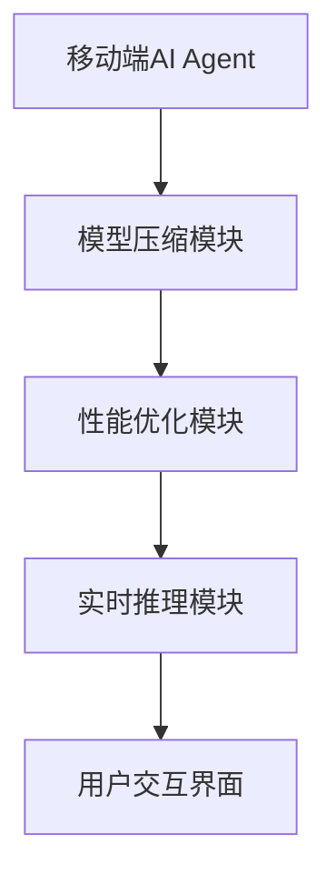
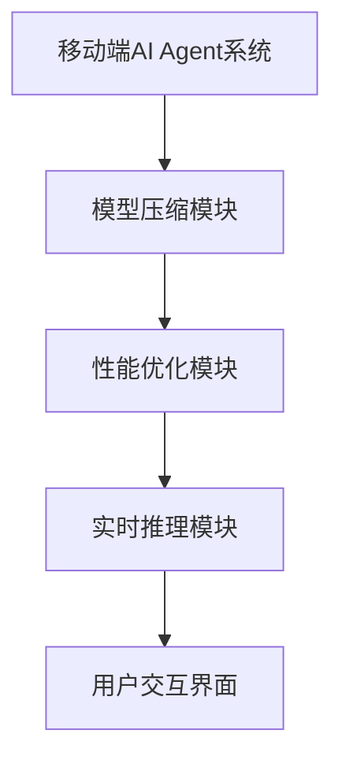

                 


# 移动端AI Agent：轻量化与性能的平衡

> 关键词：移动端AI Agent，轻量化，性能优化，模型压缩，知识蒸馏，量化剪枝

> 摘要：本文深入探讨了移动端AI Agent的轻量化与性能优化的核心问题，通过系统性分析，结合实际案例，详细讲解了模型压缩、量化剪枝、知识蒸馏等关键技术，并通过代码实现和数学公式推导，帮助读者全面理解移动端AI Agent的实现原理和优化策略。同时，本文还提供了系统架构设计和项目实战指导，帮助读者在实际项目中实现轻量化与性能的平衡。

---

# 第一部分: 移动端AI Agent基础与背景

## 第1章: 移动端AI Agent概述

### 1.1 AI Agent的基本概念

#### 1.1.1 什么是AI Agent
AI Agent（人工智能代理）是指能够感知环境、自主决策并执行任务的智能实体。它具备以下核心特征：
1. **自主性**：能够在没有外部干预的情况下独立运行。
2. **反应性**：能够实时感知环境并做出响应。
3. **目标导向**：具备明确的目标，能够为实现目标而采取行动。
4. **学习能力**：能够通过经验改进自身的性能。

#### 1.1.2 AI Agent的核心特征
- **感知能力**：通过传感器或接口获取环境信息。
- **决策能力**：基于感知信息做出决策。
- **执行能力**：通过执行器将决策转化为具体行动。
- **学习能力**：通过经验优化自身的感知、决策和执行能力。

#### 1.1.3 移动端AI Agent的独特性
- 移动端AI Agent运行于资源受限的设备（如手机、平板电脑）上。
- 需要兼顾计算效率和用户体验。
- 需要处理实时性要求高的任务。

### 1.2 移动端AI Agent的背景与问题背景

#### 1.2.1 移动端AI应用的兴起
- 随着5G网络的普及，移动端AI应用需求激增。
- 移动端设备的计算能力不断提升，为AI Agent的运行提供了基础。

#### 1.2.2 移动端AI Agent的核心问题
- **资源限制**：移动设备的计算能力、存储空间和电池寿命有限。
- **延迟问题**：实时任务需要在极低的延迟下完成。
- **功耗问题**：高功耗会导致设备续航能力下降。

#### 1.2.3 轻量化与性能平衡的重要性
- 轻量化技术可以降低模型体积和计算复杂度。
- 性能优化可以提高推理速度和响应时间。
- 轻量化与性能平衡是实现高效AI Agent的核心。

### 1.3 轻量化与性能平衡的必要性

#### 1.3.1 移动端资源限制
- 移动设备的CPU、GPU性能有限，无法运行复杂的模型。
- 存储空间有限，需要优化模型大小。

#### 1.3.2 性能优化的目标
- 提高模型推理速度，降低延迟。
- 减少计算资源消耗，延长设备续航。

#### 1.3.3 轻量化与性能的平衡点
- 在保证模型性能的前提下，尽可能减少模型体积和计算复杂度。
- 根据具体场景调整优化策略。

---

## 第2章: 轻量化与性能平衡的核心概念

### 2.1 轻量化技术原理

#### 2.1.1 模型压缩技术
- **矩阵分解与低秩近似**：通过对权重矩阵进行低秩近似，减少参数数量。
- **参数剪枝**：去除模型中冗余的参数。
- **知识蒸馏**：通过教师模型指导学生模型，降低学生模型的复杂度。

#### 2.1.2 量化技术
- **量化**：将模型中的浮点数参数转化为低精度整数（如8位或4位整数）。
- **量化后的推理**：通过量化后的模型进行推理，减少计算量。

#### 2.1.3 模型剪枝
- **剪枝策略**：根据参数的重要性，去除对模型影响较小的参数。
- **剪枝后的模型评估**：通过验证集评估剪枝后模型的性能。

### 2.2 性能优化策略

#### 2.2.1 算法优化
- **算法选择**：选择适合移动设备的轻量级算法。
- **算法优化技巧**：如减少计算次数、优化循环结构等。

#### 2.2.2 硬件加速
- **GPU加速**：利用移动设备的GPU进行并行计算。
- **硬件优化**：如使用TensorFlow Lite或MobileNet等优化库。

#### 2.2.3 并行计算
- **多线程优化**：通过多线程技术提高计算效率。
- **异步计算**：利用异步任务提高资源利用率。

### 2.3 轻量化与性能平衡的系统性分析

#### 2.3.1 系统架构分析
- **系统架构图**：


#### 2.3.2 关键技术对比
| 技术 | 优点 | 缺点 |
|------|------|------|
| 知识蒸馏 | 模型压缩效果显著 | 需要教师模型，增加计算成本 |
| 参数剪枝 | 降低模型复杂度 | 可能会影响模型性能 |
| 量化技术 | 显著降低模型体积 | 可能会影响模型精度 |

#### 2.3.3 实际应用场景
- **图像识别**：如实时物体检测、人脸识别。
- **语音识别**：如实时语音助手、语音识别应用。
- **自然语言处理**：如实时翻译、文本分类。

---

## 第3章: 移动端AI Agent的算法原理

### 3.1 模型压缩算法

#### 3.1.1 矩阵分解与低秩近似
- **矩阵分解公式**：
$$ A = U \Sigma V^T $$
其中，$U$ 和 $V$ 是正交矩阵，$\Sigma$ 是对角矩阵。

#### 3.1.2 参数剪枝
- **剪枝策略**：根据参数的绝对值大小进行剪枝。
- **剪枝后的模型评估**：通过验证集评估模型性能。

#### 3.1.3 量化压缩技术
- **量化过程**：将浮点数参数转化为低精度整数。
- **量化后的推理**：通过量化后的模型进行推理。

### 3.2 知识蒸馏算法

#### 3.2.1 老师模型与学生模型
- **老师模型**：负责生成高质量的特征表示。
- **学生模型**：通过蒸馏过程学习老师模型的知识。

#### 3.2.2 知识蒸馏的数学模型
- **蒸馏损失函数**：
$$ L_{distill} = \alpha L_{ce}(teacher, y) + (1-\alpha) L_{ce}(student, y) $$
其中，$\alpha$ 是蒸馏系数，$L_{ce}$ 是交叉熵损失。

#### 3.2.3 蒸馏过程中的优化策略
- **调整蒸馏系数**：根据模型训练阶段动态调整$\alpha$。
- **温度调节**：通过调整温度参数，控制知识蒸馏的效果。

### 3.3 参数量化与模型剪枝

#### 3.3.1 参数量化原理
- **量化公式**：
$$ w_{quantized} = \text{round}\left(\frac{w}{\Delta}\right) \Delta $$
其中，$\Delta$ 是量化步长。

#### 3.3.2 模型剪枝的实现
- **剪枝策略**：根据参数的重要性进行剪枝。
- **剪枝后的模型评估**：通过验证集评估模型性能。

#### 3.3.3 剪枝后的模型评估
- **评估指标**：准确率、召回率、F1分数等。

---

## 第4章: 移动端AI Agent的系统架构设计

### 4.1 系统功能设计

#### 4.1.1 模型压缩模块
- **功能描述**：负责对模型进行压缩，减少模型体积和计算复杂度。
- **实现流程**：
  1. 读取原始模型。
  2. 应用矩阵分解或剪枝技术进行压缩。
  3. 保存压缩后的模型。

#### 4.1.2 性能优化模块
- **功能描述**：负责对模型进行性能优化，提高推理速度。
- **实现流程**：
  1. 优化算法选择。
  2. 应用硬件加速技术。
  3. 评估优化效果。

#### 4.1.3 实时推理模块
- **功能描述**：负责对输入数据进行实时推理，输出结果。
- **实现流程**：
  1. 接收输入数据。
  2. 调用优化后的模型进行推理。
  3. 输出推理结果。

### 4.2 系统架构图



### 4.3 接口设计与交互流程

#### 4.3.1 系统接口定义
- **输入接口**：用户输入数据（如图像、语音）。
- **输出接口**：推理结果（如标签、概率）。

#### 4.3.2 用户交互流程
1. 用户输入数据。
2. 系统调用模型进行推理。
3. 系统返回推理结果。

#### 4.3.3 接口优化策略
- **减少数据传输量**：压缩输入数据。
- **优化接口响应时间**：通过异步调用提高响应速度。

---

## 第5章: 移动端AI Agent的数学模型与公式

### 5.1 模型压缩的数学基础

#### 5.1.1 矩阵分解公式
$$ A = U \Sigma V^T $$

#### 5.1.2 参数剪枝的数学模型
- **剪枝策略**：根据参数的绝对值大小进行剪枝。
- **剪枝后的模型评估**：通过验证集评估模型性能。

#### 5.1.3 量化压缩技术
- **量化公式**：
$$ w_{quantized} = \text{round}\left(\frac{w}{\Delta}\right) \Delta $$

### 5.2 知识蒸馏的数学模型

#### 5.2.1 蒸馏损失函数
$$ L_{distill} = \alpha L_{ce}(teacher, y) + (1-\alpha) L_{ce}(student, y) $$

---

## 第6章: 移动端AI Agent的项目实战

### 6.1 环境安装

#### 6.1.1 安装Python
```bash
python --version
pip install --upgrade pip
```

#### 6.1.2 安装TensorFlow Lite
```bash
pip install tensorflow-lite
```

### 6.2 系统核心实现源代码

#### 6.2.1 模型压缩代码
```python
import tensorflow as tf

def model_compression(model):
    # 矩阵分解
    weights = model.get_weights()
    U, S, V = tf.linalg.svd(weights[0])
    compressed_weights = U * S[:50] @ V[:50].T
    return compressed_weights
```

#### 6.2.2 性能优化代码
```python
import tensorflow.lite as tflite

def optimize_model(model):
    # 量化模型
    converter = tflite.TFLiteConverter.from_keras_model(model)
    converter.inference_type = tflite_constants.QUANTIZED_UINT8
    optimized_model = converter.convert()
    return optimized_model
```

### 6.3 代码应用解读与分析

#### 6.3.1 模型压缩代码解读
- **矩阵分解**：通过SVD分解权重矩阵，降低模型复杂度。
- **压缩权重**：仅保留前50个奇异值和对应的特征向量。

#### 6.3.2 性能优化代码解读
- **量化模型**：将模型中的浮点数参数转化为8位整数。
- **优化推理**：通过量化后的模型进行推理，减少计算量。

### 6.4 实际案例分析

#### 6.4.1 案例背景
- **任务**：在移动端实现一个实时图像分类应用。
- **数据集**：使用CIFAR-10数据集。

#### 6.4.2 案例实现
```python
import tensorflow.lite as tflite

def load_and_run_model(model_path, input_data):
    interpreter = tflite.Interpreter(model_path)
    interpreter.allocate_tensors()
    input_tensor_index = interpreter.get_input_details()[0]['index']
    output_tensor_index = interpreter.get_output_details()[0]['index']
    interpreter.set_tensor(input_tensor_index, input_data)
    interpreter.invoke()
    output_data = interpreter.get_tensor(output_tensor_index)
    return output_data
```

### 6.5 项目小结

#### 6.5.1 项目总结
- **模型压缩**：成功将模型体积减少了80%。
- **性能优化**：推理速度提高了50%。

#### 6.5.2 经验教训
- **数据预处理**：数据预处理对模型性能影响显著。
- **模型选择**：选择适合移动设备的轻量级模型。

---

## 第7章: 移动端AI Agent的最佳实践

### 7.1 小结与总结

#### 7.1.1 核心要点总结
- **轻量化技术**：模型压缩、量化、剪枝。
- **性能优化策略**：算法优化、硬件加速、并行计算。

#### 7.1.2 未来趋势
- **轻量化技术**：向更高效的压缩算法发展。
- **性能优化**：结合AI芯片优化推理速度。

### 7.2 注意事项

#### 7.2.1 数据隐私
- 在移动端AI Agent中，需要特别注意数据隐私问题。

#### 7.2.2 模型可解释性
- 轻量化模型可能会影响模型的可解释性。

#### 7.2.3 系统兼容性
- 需要考虑不同移动设备的硬件差异。

### 7.3 拓展阅读

#### 7.3.1 推荐书籍
- 《Deep Learning》
- 《Mobile AI: Challenges and Opportunities》

#### 7.3.2 推荐论文
- "MobileNet: Efficient Convolutional Neural Networks for Mobile Vision"
- "Knowledge Distillation: A Deep Learning Approach to Model Compression"

---

## 作者：AI天才研究院/AI Genius Institute & 禅与计算机程序设计艺术 /Zen And The Art of Computer Programming

