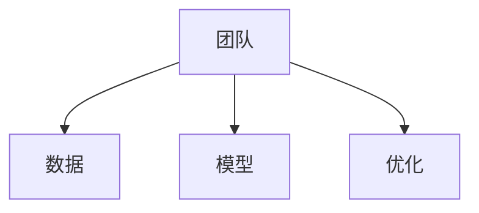
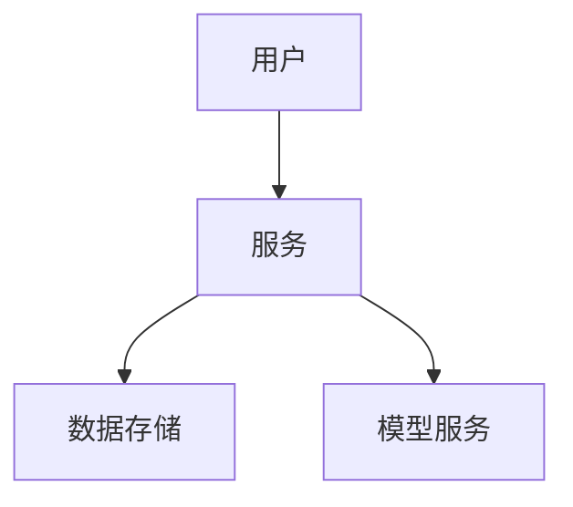

                 


# 组建高效AI开发团队的技巧

> 关键词：高效AI团队，团队协作，AI开发，系统架构，算法优化

> 摘要：本文将深入探讨如何组建和管理高效的AI开发团队，从背景介绍、核心概念、算法原理、系统架构到项目实战，逐步分析团队协作的技巧与方法，帮助读者掌握高效AI开发团队的关键要素。

---

## 第1章: AI开发团队的背景与挑战

### 1.1 AI开发的现状与趋势

随着人工智能技术的飞速发展，AI已经渗透到各个行业，从医疗到金融，从教育到交通，AI正在改变我们的生活方式。然而，AI开发并不是一项简单的任务，它需要多学科的结合，包括数据处理、算法设计、系统实现等。与此同时，AI开发的复杂性也在不断增加，模型的训练需要大量的计算资源和数据支持，这对开发团队提出了更高的要求。

### 1.2 AI开发中的主要挑战

在AI开发过程中，团队面临的挑战主要集中在以下几个方面：

1. **数据管理**：数据是AI模型的核心，如何高效地获取、存储和处理数据是一个关键问题。
2. **算法选择**：不同的场景需要不同的算法，选择合适的算法需要对业务有深刻的理解。
3. **计算资源**：AI模型的训练通常需要大量的计算资源，团队需要具备高效的资源管理能力。
4. **团队协作**：AI开发是一个复杂的过程，需要团队内部高效协作，确保各环节无缝衔接。

### 1.3 高效AI开发团队的重要性

高效AI开发团队是AI项目成功的关键。一个高效的团队能够快速迭代模型，及时发现和解决问题，并在有限的时间内完成高质量的交付。通过高效的团队协作，可以显著提高开发效率，降低项目成本，同时确保AI模型的准确性和稳定性。

---

## 第2章: AI开发团队的核心概念与联系

### 2.1 团队协作的核心概念

在AI开发中，团队协作是一个复杂的系统工程，涉及多个角色和环节。以下是一些关键概念：

1. **角色分工**：明确团队成员的职责，确保每个人都能发挥自己的优势。
2. **协作流程**：制定清晰的开发流程，从需求分析到模型部署，每个环节都需要无缝衔接。
3. **协作工具**：选择合适的工具，如版本控制系统、项目管理工具等，可以显著提高协作效率。

### 2.2 AI开发中的关键要素

AI开发团队需要关注以下几个关键要素：

1. **数据管理**：数据是AI模型的基石，团队需要具备高效的数据处理能力。
2. **模型开发**：模型的准确性和效率直接影响最终的成果。
3. **部署与优化**：模型的部署和优化是确保AI系统稳定运行的关键。

### 2.3 团队协作与AI开发的实体关系图

以下是团队协作与AI开发的实体关系图：



---

## 第3章: AI开发团队协作的算法原理

### 3.1 团队协作的算法基础

AI开发中的团队协作需要依赖一些算法基础，例如：

1. **分布式计算**：通过分布式计算，团队成员可以并行处理数据，提高计算效率。
2. **并行计算**：并行计算可以在多台设备上同时执行任务，加快计算速度。
3. **异步协作**：团队成员可以在不同的时间点进行任务处理，确保高效协作。

### 3.2 AI模型开发中的算法选择

在AI模型开发中，选择合适的算法至关重要。以下是几种常见的算法及其应用场景：

1. **监督学习**：适用于分类、回归等任务，需要标注的数据。
2. **无监督学习**：适用于聚类、降维等任务，适用于未标注的数据。
3. **强化学习**：适用于游戏、机器人控制等任务，需要通过试错进行优化。

### 3.3 团队协作与算法优化

算法优化是AI开发中的一个重要环节，团队协作在这一过程中起着关键作用。以下是几种常见的优化方法：

1. **并行训练**：通过分布式计算加速模型训练。
2. **分布式推理**：在多个设备上进行模型推理，提高处理速度。
3. **模型压缩**：通过剪枝、量化等技术减少模型大小，提高推理效率。

---

## 第4章: AI开发团队协作的系统分析与架构设计

### 4.1 系统分析与设计方法

在系统分析与设计阶段，团队需要明确需求、设计系统架构，并制定实现方案。以下是具体步骤：

1. **问题场景分析**：识别问题的关键点，明确需求。
2. **领域模型设计**：通过类图等方式描述系统的组成部分。
3. **系统架构设计**：设计系统的整体架构，包括各个模块的交互关系。

### 4.2 系统架构设计

以下是AI开发团队协作的系统架构设计图：



### 4.3 接口设计与交互流程

1. **接口定义**：通过API定义系统之间的交互接口。
2. **交互流程图**：描述用户与系统之间的交互流程。
3. **接口优化**：通过优化接口设计，提高系统的响应速度和稳定性。

---

## 第5章: AI开发团队协作的项目实战

### 5.1 环境安装与配置

在进行AI开发之前，需要先配置开发环境。以下是具体的步骤：

1. **安装开发工具**：如Jupyter Notebook、PyCharm等。
2. **依赖管理**：使用pip等工具管理Python库。
3. **环境配置**：配置GPU环境，安装NVIDIA驱动和CUDA toolkit。

### 5.2 项目核心实现

以下是项目的核心实现部分：

1. **团队协作模块**：实现任务分配、进度跟踪等功能。
2. **数据处理模块**：实现数据清洗、特征提取等功能。
3. **模型训练模块**：实现模型训练、评估和优化。

### 5.3 代码实现与解读

以下是模型训练的代码示例：

```python
import numpy as np
from sklearn.linear_model import LinearRegression

# 数据准备
X = np.array([[1], [2], [3], [4], [5]])
y = np.array([2, 4, 5, 4, 6])

# 模型训练
model = LinearRegression()
model.fit(X, y)

# 预测
print(model.predict([[6]]))
```

### 5.4 案例分析与优化

通过分析实际案例，我们可以总结出以下优化措施：

1. **数据预处理**：确保数据质量，减少训练过程中的误差。
2. **模型调优**：通过网格搜索等方法选择最优模型参数。
3. **团队协作优化**：通过定期会议和代码审查，确保代码质量。

---

## 第6章: 最佳实践与注意事项

### 6.1 最佳实践

1. **明确角色分工**：确保每个团队成员都有明确的职责。
2. **制定清晰的开发流程**：从需求分析到模型部署，每个环节都需要明确。
3. **选择合适的工具**：如版本控制系统、项目管理工具等。

### 6.2 注意事项

1. **数据安全**：在处理数据时，需要注意数据的安全性，防止数据泄露。
2. **模型可解释性**：在模型部署时，需要考虑模型的可解释性，方便后续的优化和维护。
3. **团队沟通**：保持团队内部的高效沟通，及时解决问题。

---

## 作者简介

作者：AI天才研究院/AI Genius Institute & 禅与计算机程序设计艺术 /Zen And The Art of Computer Programming

---

通过本文的系统分析和详细讲解，读者可以全面了解如何组建和管理高效的AI开发团队，掌握团队协作的关键技巧与方法，从而在实际工作中提高开发效率和项目成功率。

