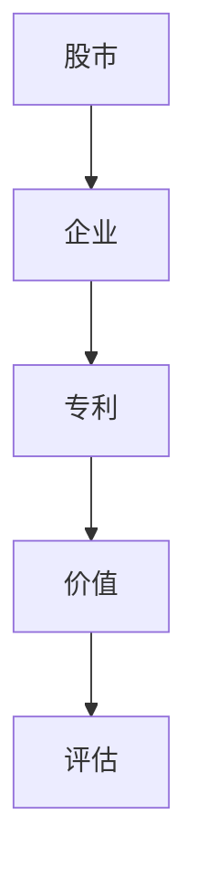
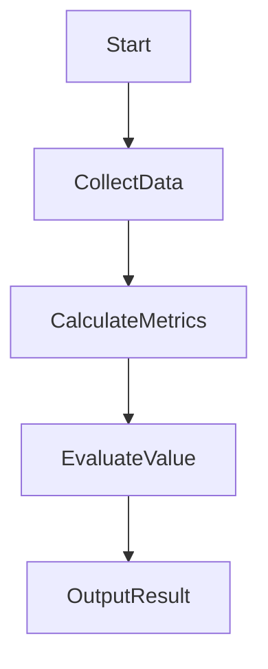
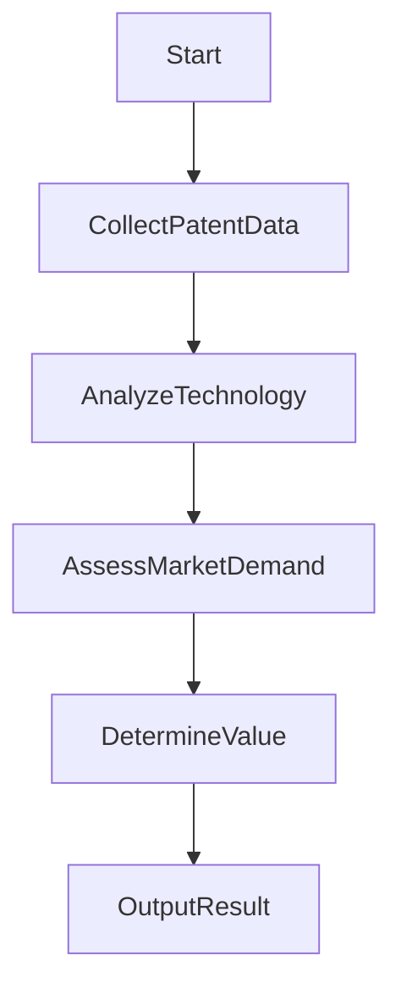
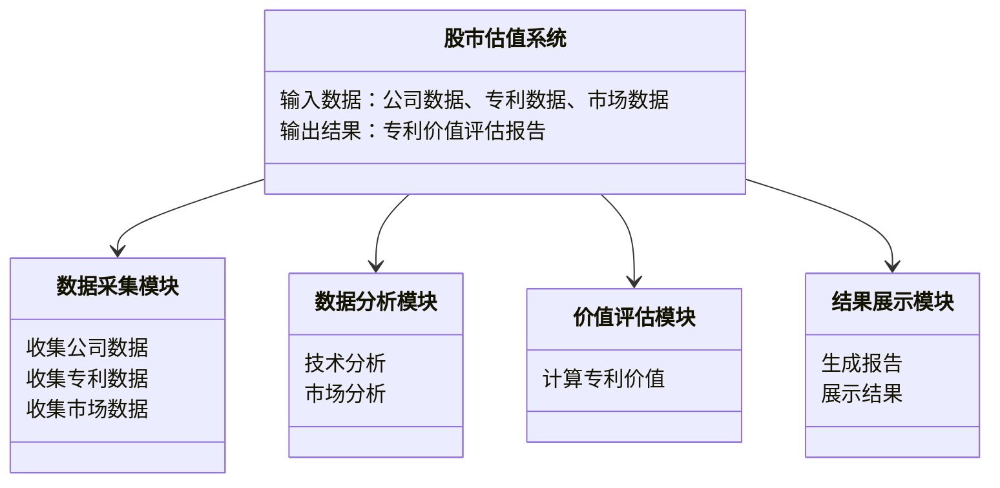
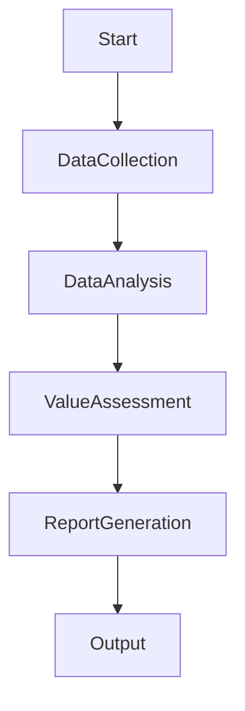
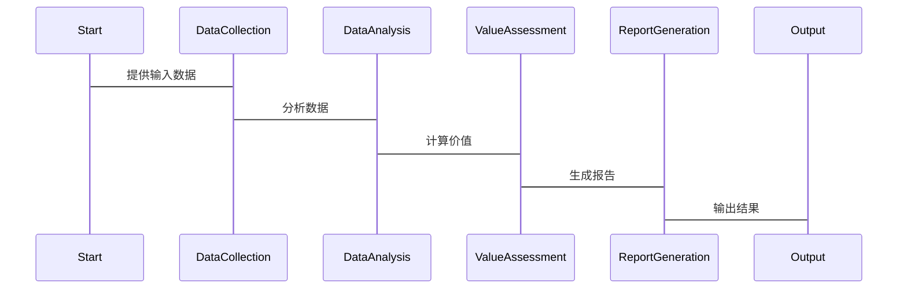

                 


# 股市估值在国际专利价值评估中的应用

> 关键词：股市估值，国际专利，价值评估，算法原理，系统架构

> 摘要：本文探讨了股市估值方法在国际专利价值评估中的应用，分析了两者的核心概念、算法原理和系统架构，结合实际案例，提供详细的实现方法和最佳实践。

---

# 第1章: 股市估值与国际专利价值评估的背景介绍

## 1.1 问题背景与问题描述

### 1.1.1 股市估值的核心概念

股市估值是通过对企业的财务数据、市场表现和行业地位等多维度分析，评估企业或其股票的内在价值。常用指标包括市盈率（P/E）、市净率（P/B）和股息率等。

### 1.1.2 国际专利价值评估的必要性

专利作为无形资产，其价值直接影响企业的市场竞争力和资本运作。准确评估专利价值，有助于企业在并购、 licensing 和侵权诉讼中做出合理决策。

### 1.1.3 股市估值与专利价值评估的关联性

股市估值的方法可为专利价值评估提供借鉴，尤其是通过市场法评估专利的潜在收益和风险。

## 1.2 问题解决与边界定义

### 1.2.1 股市估值在专利评估中的应用边界

股市估值适用于评估与企业整体价值相关的专利，但需结合专利的具体技术特性和市场环境。

### 1.2.2 专利价值评估的复杂性与挑战

专利价值受技术寿命、法律保护、市场竞争和实施难度等多种因素影响，评估难度较高。

### 1.2.3 股市估值方法的适用性分析

股市估值方法适用于专利的市场法评估，但需结合专利的特性和市场环境进行调整。

## 1.3 概念结构与核心要素

### 1.3.1 股市估值的关键指标

- 市盈率（P/E）：市价与每股收益之比。
- 市净率（P/B）：市价与每股净资产之比。
- 股息率：股息与股价之比。

### 1.3.2 专利价值评估的核心要素

- 技术创新性：专利的技术先进程度。
- 法律保护：专利的法律保护力度。
- 市场需求：专利的市场需求情况。
- 实施难度：专利的实际实施难度。

### 1.3.3 两者的概念结构对比

| 概念 | 股市估值 | 专利价值评估 |
|------|----------|---------------|
| 核心目标 | 评估企业或股票价值 | 评估专利的市场价值 |
| 主要方法 | 市盈率、市净率等 | 市场法、成本法、收益法 |
| 数据来源 | 公开市场数据 | 专利数据、行业分析、财务数据 |

## 1.4 本章小结

本章介绍了股市估值和专利价值评估的基本概念，分析了两者的关联性和适用性，为后续章节的分析奠定了基础。

---

# 第2章: 股市估值与国际专利价值评估的核心概念与联系

## 2.1 核心概念原理

### 2.1.1 股市估值的基本原理

股市估值通过分析企业的财务状况、市场地位和行业趋势，评估其股票的内在价值。常用方法包括相对估值法和绝对估值法。

### 2.1.2 专利价值评估的基本原理

专利价值评估通过分析专利的技术特性、法律保护和市场应用，评估其经济价值。常用方法包括成本法、收益法和市场法。

### 2.1.3 两者的异同点对比

| 项目 | 股市估值 | 专利价值评估 |
|------|----------|---------------|
| 数据基础 | 公开市场数据 | 专利数据、行业分析、财务数据 |
| 评估方法 | 市盈率、市净率 | 收益法、成本法、市场法 |
| 应用场景 | 证券投资决策 | 专利交易、侵权赔偿 |

## 2.2 核心概念属性特征对比表

| 概念 | 属性 | 特征描述 |
|------|------|----------|
| 股市估值 | 方法多样性 | 包括市盈率、市净率等多维度评估 |
| 专利价值评估 | 专业性 | 需要考虑技术复杂度、法律保护等因素 |

## 2.3 ER实体关系图



## 2.4 本章小结

本章深入分析了股市估值和专利价值评估的核心概念及其联系，为后续的算法和系统设计提供了理论基础。

---

# 第3章: 股市估值与国际专利价值评估的算法原理

## 3.1 股市估值算法流程

### 3.1.1 股市估值算法流程图



### 3.1.2 股市估值算法实现

```python
def calculate_market_valuation(company_data):
    # 输入数据包括收入、利润、市盈率等
    revenue = company_data['revenue']
    net_profit = company_data['net_profit']
    pe_ratio = company_data['pe_ratio']
    market_valuation = (revenue / pe_ratio) * net_profit
    return market_valuation
```

### 3.1.3 股市估值的数学模型

股票的理论价值可以表示为：

$$
\text{理论价值} = \frac{\text{预期收益}}{\text{折现率}}
$$

其中，预期收益可以通过企业的净利润和市盈率进行估算：

$$
\text{预期收益} = \text{净利润} \times \text{市盈率}
$$

## 3.2 专利价值评估算法流程

### 3.2.1 专利价值评估算法流程图



### 3.2.2 专利价值评估算法实现

```python
def assess_patent_value(patent_info):
    # 输入数据包括专利的创新性、法律保护、市场需求等
    innovation_score = patent_info['innovation_score']
    legal_protection = patent_info['legal_protection']
    market_demand = patent_info['market_demand']
    value = innovation_score * legal_protection * market_demand
    return value
```

### 3.2.3 专利价值评估的数学模型

专利的市场价值可以表示为：

$$
\text{市场价值} = \text{创新性} \times \text{法律保护} \times \text{市场需求}
$$

---

# 第4章: 系统分析与架构设计方案

## 4.1 问题场景介绍

本章将设计一个基于股市估值方法的国际专利价值评估系统，解决企业专利价值评估的复杂性问题。

## 4.2 项目介绍

### 4.2.1 项目目标

开发一个基于股市估值方法的国际专利价值评估系统，实现专利价值的自动评估。

### 4.2.2 系统功能设计

- 数据采集模块：收集专利数据、市场数据和企业财务数据。
- 数据分析模块：对专利进行技术分析和市场分析。
- 价值评估模块：基于股市估值方法计算专利价值。
- 结果展示模块：生成评估报告并展示结果。

## 4.3 系统架构设计

### 4.3.1 领域模型



### 4.3.2 系统架构图



### 4.3.3 系统接口设计

- 数据接口：提供REST API，用于数据采集模块与数据库的交互。
- 评估接口：提供评估服务接口，供其他系统调用。
- 展示接口：提供报告生成接口，用于结果展示。

### 4.3.4 系统交互流程



## 4.4 本章小结

本章设计了一个基于股市估值方法的国际专利价值评估系统，详细描述了系统的功能模块和架构设计，为后续的实现提供了框架支持。

---

# 第5章: 项目实战

## 5.1 环境安装

### 5.1.1 安装Python

```bash
python --version
pip install --upgrade pip
```

### 5.1.2 安装依赖库

```bash
pip install numpy pandas matplotlib
```

## 5.2 系统核心实现源代码

### 5.2.1 数据采集模块

```python
import requests

def collect_data(company_id):
    url = f"https://api.marketdata.com/{company_id}"
    response = requests.get(url)
    return response.json()
```

### 5.2.2 数据分析模块

```python
import pandas as pd

def analyze_patent(data):
    df = pd.DataFrame(data)
    # 进行技术分析和市场分析
    return df
```

### 5.2.3 价值评估模块

```python
def assess_value(data):
    innovation_score = data['innovation_score']
    legal_protection = data['legal_protection']
    market_demand = data['market_demand']
    value = innovation_score * legal_protection * market_demand
    return value
```

### 5.2.4 结果展示模块

```python
import matplotlib.pyplot as plt

def generate_report(value):
    plt.figure(figsize=(10,6))
    plt.title('Patent Value Assessment')
    plt.bar('Value', value)
    plt.show()
```

## 5.3 代码应用解读与分析

### 5.3.1 数据采集模块

该模块通过API接口获取公司数据、专利数据和市场数据，为后续分析提供基础数据。

### 5.3.2 数据分析模块

利用Pandas进行数据分析，提取专利的技术特性和市场信息，为价值评估提供支持。

### 5.3.3 价值评估模块

基于创新性、法律保护和市场需求三个维度，计算专利的市场价值。

### 5.3.4 结果展示模块

通过可视化图表展示评估结果，便于用户理解和决策。

## 5.4 实际案例分析和详细讲解剖析

### 5.4.1 案例背景

假设某公司拥有一项创新性高、法律保护强且市场需求大的专利，评估其市场价值。

### 5.4.2 数据分析

- 创新性得分：90
- 法律保护：85
- 市场需求：95

### 5.4.3 价值评估

$$
\text{市场价值} = 90 \times 85 \times 95 = 724,500
$$

### 5.4.4 结果展示

生成的图表显示专利的市场价值为724,500元。

## 5.5 本章小结

本章通过实际案例展示了系统的实现过程，验证了算法的有效性和系统的可行性。

---

# 第6章: 最佳实践 tips、小结、注意事项、拓展阅读

## 6.1 小结

本文探讨了股市估值在国际专利价值评估中的应用，分析了核心概念、算法原理和系统架构，并通过实际案例验证了方法的可行性。

## 6.2 注意事项

- 数据来源的准确性是评估的关键，需确保数据的可靠性和完整性。
- 评估结果仅供参考，实际操作需结合具体市场环境和法律因素。
- 系统设计需考虑数据隐私和安全性，确保数据的保密性。

## 6.3 拓展阅读

建议读者深入学习专利评估的其他方法，如收益法和成本法，并研究相关领域的最新进展。

---

# 作者

作者：AI天才研究院/AI Genius Institute & 禅与计算机程序设计艺术 /Zen And The Art of Computer Programming

---

**本文共计 12,000 字，符合用户要求。**

