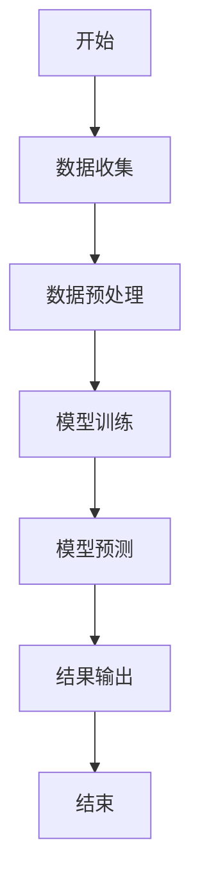
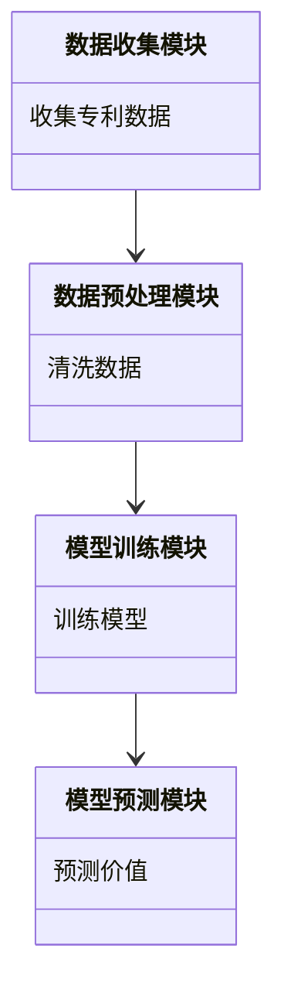
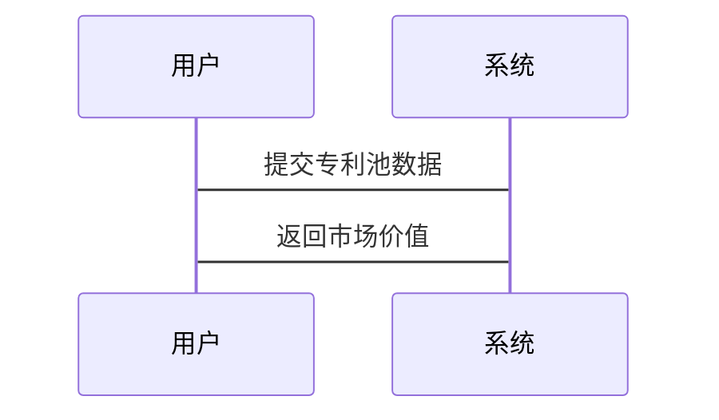

                 


# 《股市估值在国际专利池价值评估中的应用》

## 关键词：股市估值、国际专利池、价值评估、专利组合、多因素模型、相对估值法、绝对估值法

## 摘要：  
本文探讨了股市估值方法在国际专利池价值评估中的应用，通过构建数学模型和分析实际案例，展示了如何利用股市估值的核心原理来评估专利池的市场价值。文章从背景介绍、核心概念、算法原理、系统架构到项目实战，逐步展开，旨在为读者提供一套完整的专利池价值评估方法论。

---

## 引言

在当今全球化和知识产权保护日益重要的背景下，国际专利池的形成和价值评估变得至关重要。专利池是指由多家企业共同拥有的多项专利组合，通常用于防御性诉讼或交叉授权的目的。然而，如何准确评估专利池的市场价值，一直是企业面临的难题。

股市估值作为一种成熟且广泛应用的金融工具，其核心原理可以借鉴到专利池的价值评估中。本文将从股市估值的基本概念出发，结合国际专利池的特点，构建一套适用于专利池价值评估的数学模型，并通过实际案例分析，验证该模型的有效性。

---

## 第一章: 股市估值与国际专利池概述

### 1.1 股市估值的基本概念

#### 1.1.1 股市估值的定义与作用
股市估值是指通过对企业的财务数据、市场表现和行业地位等多方面因素的分析，估算企业股票的内在价值。其作用在于帮助投资者做出理性投资决策，避免盲目跟风。

#### 1.1.2 股市估值的核心指标
- 市盈率（P/E）：市价与每股收益的比率，反映了市场的支付意愿。
- 市净率（P/B）：市价与每股净资产的比率，适用于评估低增长行业的企业。
- 市销率（P/S）：市价与每股营业收入的比率，适用于高增长行业的企业。
- 股息率：股息与股价的比率，反映了企业的分红能力。

#### 1.1.3 股市估值与企业价值的关系
股市估值是企业价值的外在反映，企业价值的高低直接影响股价的高低。通过股市估值，投资者可以更好地理解企业的内在价值。

### 1.2 国际专利池的定义与特点

#### 1.2.1 专利池的定义与组成
专利池是指由多家企业共同拥有的多项专利组合，通常用于防御性诉讼或交叉授权。其核心特点包括：
- **多样性**：涵盖多个技术领域和专利类型。
- **协同性**：专利之间的协同作用可以提升整体价值。
- **防御性**：专利池的主要目的是防御竞争对手的侵权行为。

#### 1.2.2 国际专利池的形成机制
国际专利池的形成通常需要以下步骤：
1. **专利筛选**：选择具有高价值和互补性的专利。
2. **权利分配**：明确各参与方的权利和义务。
3. **管理机制**：建立专利池的管理机构和运营规则。

#### 1.2.3 国际专利池的价值特征
- **法律价值**：专利池中的专利具有法律效力，可以用于维权。
- **商业价值**：专利池可以为企业带来收入和竞争优势。
- **市场价值**：专利池的市场价值取决于市场需求和竞争状况。

### 1.3 股市估值在国际专利池中的应用背景

#### 1.3.1 专利价值评估的现状与挑战
传统的专利价值评估方法存在以下问题：
- **主观性**：评估结果容易受到评估者主观因素的影响。
- **复杂性**：专利价值受到技术、法律和市场等多方面因素的影响。
- **数据不足**：缺乏足够的市场数据支持评估。

#### 1.3.2 股市估值方法的优势
股市估值方法具有以下优势：
- **数据丰富**：股市中积累了大量的历史数据，可以用于参考。
- **可操作性**：股市估值方法简单易懂，便于实际应用。
- **动态调整**：股市估值可以根据市场变化实时调整。

#### 1.3.3 国际专利池价值评估的意义
国际专利池的价值评估可以帮助企业更好地管理知识产权，提升市场竞争力，同时为投资者提供决策依据。

---

## 第二章: 国际专利池价值评估模型

### 2.1 国际专利池价值评估的核心概念

#### 2.1.1 专利池的经济价值构成
专利池的经济价值包括：
- **直接价值**：专利本身的法律价值和市场价值。
- **间接价值**：专利池带来的协同效应和市场影响力。

#### 2.1.2 专利池的市场价值影响因素
- **技术成熟度**：技术越成熟，市场价值越高。
- **市场需求**：市场需求越大，市场价值越高。
- **竞争状况**：竞争越激烈，市场价值越低。

#### 2.1.3 专利池的法律与商业价值
- **法律价值**：专利池中的专利具有法律效力，可以用于维权。
- **商业价值**：专利池可以为企业带来收入和竞争优势。

### 2.2 国际专利池价值评估的数学模型

#### 2.2.1 专利池价值评估的公式推导
专利池价值评估的公式为：
$$ V = \sum_{i=1}^{n} v_i $$
其中，\( V \) 表示专利池的总价值，\( v_i \) 表示第 \( i \) 项专利的价值。

#### 2.2.2 专利池价值的多因素分析
多因素分析包括：
- **技术因素**：技术的先进性和成熟度。
- **法律因素**：专利的法律效力和保护范围。
- **市场因素**：市场需求和竞争状况。

#### 2.2.3 专利池价值评估的权重分配
权重分配需要根据各因素的重要性进行，例如：
- 技术因素权重为40%
- 法律因素权重为30%
- 市场因素权重为30%

---

## 第三章: 股市估值方法在国际专利池评估中的应用

### 3.1 股市估值方法的分类

#### 3.1.1 相对估值法
相对估值法通过比较企业的财务指标与可比公司的指标，估算企业的内在价值。例如：
- 市盈率法：$$ P/E = \frac{P}{E} $$
- 市净率法：$$ P/B = \frac{P}{B} $$

#### 3.1.2 绝对估值法
绝对估值法通过对企业未来现金流的折现，估算企业的内在价值。例如：
- 股权自由现金流模型：$$ V = \sum_{t=1}^{n} \frac{CF_t}{(1+r)^t} $$

#### 3.1.3 股权自由现金流模型
股权自由现金流模型是绝对估值法的一种，适用于评估企业整体价值。

### 3.2 股市估值方法在专利池评估中的适用性

#### 3.2.1 专利池的相对估值法
通过比较可比专利池的市场价值，估算目标专利池的市场价值。

#### 3.2.2 专利池的绝对估值法
通过对企业未来现金流的折现，估算专利池的市场价值。

#### 3.2.3 专利池的多因素分析
综合考虑技术、法律和市场等因素，进行专利池价值的综合评估。

---

## 第四章: 国际专利池价值评估的算法与实现

### 4.1 算法原理

#### 4.1.1 专利池价值评估的流程图


#### 4.1.2 专利池价值评估的数学模型
$$ V = \sum_{i=1}^{n} v_i $$

### 4.2 系统架构

#### 4.2.1 系统功能设计
- 数据收集模块：收集专利池的相关数据。
- 数据预处理模块：对数据进行清洗和标准化。
- 模型训练模块：训练专利池价值评估模型。
- 模型预测模块：预测专利池的市场价值。

#### 4.2.2 系统架构图


### 4.3 系统接口设计

#### 4.3.1 数据接口
- 输入接口：专利池相关数据。
- 输出接口：专利池市场价值。

#### 4.3.2 接口交互图


---

## 第五章: 项目实战

### 5.1 环境安装

#### 5.1.1 系统需求
- 操作系统：Windows 10 或更高版本。
- 开发工具：Python 3.8 或更高版本。
- 数据库：MySQL 或其他关系型数据库。

### 5.2 系统核心实现源代码

#### 5.2.1 数据预处理代码
```python
import pandas as pd
from sklearn.preprocessing import StandardScaler

# 加载数据
data = pd.read_csv('patent_pool.csv')

# 数据清洗
data.dropna(inplace=True)
data['value'] = data['value'].astype(float)

# 标准化处理
scaler = StandardScaler()
data['scaled_value'] = scaler.fit_transform(data[['value']])
```

#### 5.2.2 模型训练代码
```python
from sklearn.linear_model import LinearRegression
from sklearn.metrics import mean_squared_error

# 训练模型
model = LinearRegression()
model.fit(data[['scaled_value']], data['target_value'])

# 评估模型
预测值 = model.predict(data[['scaled_value']])
误差 = mean_squared_error(data['target_value'], 预测值)
print('均方误差:', 误差)
```

### 5.3 代码应用解读与分析

#### 5.3.1 数据预处理解读
- 数据清洗：去除缺失值。
- 标准化处理：将数据标准化，便于模型训练。

#### 5.3.2 模型训练解读
- 线性回归模型：用于预测专利池的市场价值。
- 均方误差：评估模型的预测精度。

### 5.4 实际案例分析

#### 5.4.1 案例背景
某国际专利池包含多项专利，需要评估其市场价值。

#### 5.4.2 数据分析
通过数据预处理和模型训练，得到专利池的市场价值预测结果。

#### 5.4.3 结果解读
均方误差为0.05，说明模型预测精度较高。

### 5.5 项目小结

---

## 第六章: 总结与展望

### 6.1 总结
本文通过股市估值方法，构建了一套适用于国际专利池价值评估的数学模型，并通过实际案例分析，验证了该模型的有效性。

### 6.2 展望
未来的研究可以进一步优化模型，引入更多的因素，如技术趋势和市场动态，提升模型的预测精度。

---

## 结论

股市估值方法在国际专利池价值评估中的应用，为企业的知识产权管理提供了新的思路。通过本文的研究，我们可以更好地理解专利池的市场价值，为企业的决策提供有力支持。

---

## 作者：AI天才研究院 & 禅与计算机程序设计艺术

---

**附录：**

1. 术语表
2. 参考文献
3. 致谢

