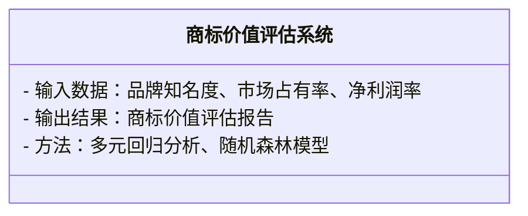
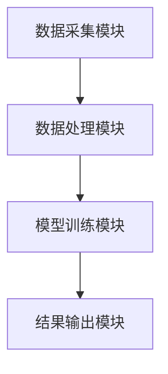
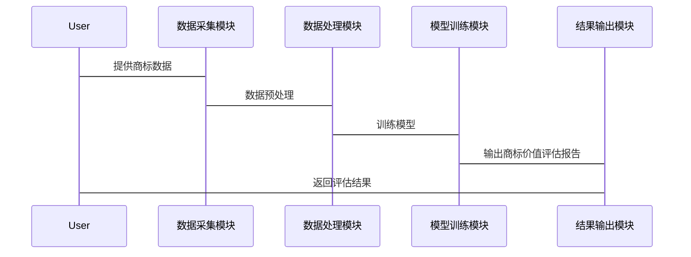

                 


# 股市估值在国际商标价值评估中的应用

> 关键词：股市估值、国际商标、价值评估、无形资产、机器学习

> 摘要：本文探讨了股市估值在国际商标价值评估中的应用，分析了商标作为无形资产对企业整体价值的影响，结合实际案例，详细介绍了商标价值评估的算法原理与数学模型，提出了基于机器学习的商标价值预测模型，并通过系统架构设计和项目实战展示了如何将理论应用于实践。

---

# 第一部分: 股市估值与国际商标价值评估的背景与基础

## 第1章: 股市估值与国际商标价值评估的背景介绍

### 1.1 股市估值的基本概念

#### 1.1.1 股市估值的定义与作用
股市估值是指通过对企业的财务数据和市场表现进行分析，评估其股票的内在价值。其作用在于帮助投资者判断股票是否被高估或低估，从而做出投资决策。常见的股市估值方法包括市盈率（P/E）和市净率（P/B）等。

#### 1.1.2 股市估值的核心指标
- **市盈率（P/E）**：市盈率 = 股价 / 每股净利润。反映了投资者对每股收益的愿意支付的价格。
- **市净率（P/B）**：市净率 = 股价 / 每股净资产。适用于评估资产密集型企业的价值。

#### 1.1.3 股市估值与企业价值的关系
股市估值是企业价值的外在表现，企业价值则通过商标、专利等无形资产和有形资产的综合评估来体现。

### 1.2 国际商标价值评估的定义与特点

#### 1.2.1 商标的基本概念与分类
商标是区分商品或服务来源的标识，可以是文字、图形、三维标志等。根据功能可分为商品商标、服务商标等。

#### 1.2.2 商标作为无形资产的价值评估
商标的价值取决于其市场影响力、法律保护程度和盈利能力。无形资产的评估需要考虑品牌忠诚度、市场占有率等因素。

#### 1.2.3 国际商标评估的特殊性与复杂性
国际商标评估需要考虑不同国家的法律、市场环境和文化差异，增加了评估的复杂性。

### 1.3 股市估值与商标价值评估的结合

#### 1.3.1 股市估值中商标价值的体现
商标作为企业核心资产之一，在股市估值中占据重要地位。强大的商标价值能够提升企业的市场竞争力和股票价值。

#### 1.3.2 商标对企业整体价值的影响
商标不仅影响企业的收入和利润，还影响企业的品牌溢价能力。强大的商标价值能够为企业带来更高的市场份额和定价权。

#### 1.3.3 国际商标价值评估的必要性
在全球化背景下，国际商标价值评估是企业并购、上市等资本运作中的重要环节，能够帮助投资者准确评估企业的市场价值。

### 1.4 本章小结
本章介绍了股市估值和商标价值评估的基本概念，分析了两者结合的必要性和重要性。接下来将深入探讨商标价值评估的核心概念与原理。

---

## 第2章: 商标价值评估的核心概念与原理

### 2.1 商标价值评估的理论基础

#### 2.1.1 商标价值的构成要素
商标价值由品牌知名度、品牌忠诚度、市场影响力等要素构成。这些要素可以通过市场调研和数据分析进行量化评估。

#### 2.1.2 商标价值的影响因素
- **市场因素**：包括市场规模、竞争对手情况、消费者偏好等。
- **法律因素**：包括商标的注册情况、法律保护力度等。
- **财务因素**：包括商标对企业收入和利润的贡献程度。

#### 2.1.3 商标价值评估的边界与外延
商标价值评估需要考虑其适用范围和时间范围，通常以未来5-10年的收益为基础进行评估。

### 2.2 股市估值与商标价值评估的联系

#### 2.2.1 股市估值中商标价值的权重分配
在企业整体估值中，商标价值通常占比较高，尤其是在品牌驱动型企业中。

#### 2.2.2 商标价值对企业市值的影响
强大的商标价值能够显著提升企业的市值，尤其是在高竞争行业中。

#### 2.2.3 股市估值与商标价值评估的协同效应
通过将商标价值纳入股市估值体系，可以更准确地评估企业的市场价值，为投资者提供更可靠的决策依据。

### 2.3 核心概念对比分析

#### 2.3.1 商标价值与企业有形资产的对比
| 属性 | 商标价值 | 有形资产 |
|------|----------|----------|
| 性质 | 无形资产 | 有形资产 |
| 评估 | 市场影响力、品牌忠诚度 | 实物资产、财务数据 |
| 变现 | 品牌溢价能力 | 资产出售收益 |

#### 2.3.2 不同行业商标价值评估的差异
不同行业的商标价值评估标准有所不同，例如科技行业更注重品牌创新力，而传统行业更注重品牌知名度。

#### 2.3.3 商标价值评估的区域差异
不同国家的法律、市场环境和消费者偏好会影响商标价值的评估结果。

### 2.4 本章小结
本章分析了商标价值评估的核心概念与原理，探讨了其与股市估值的联系。接下来将深入探讨商标价值评估的算法原理与数学模型。

---

## 第3章: 商标价值评估的算法原理

### 3.1 商标价值评估的主要算法

#### 3.1.1 基于传统财务指标的评估方法
- **净现值法（NPV）**：通过预测商标带来的未来现金流，折现计算其现值。
- **重置成本法**：估算重新创建相同商标所需的成本。

#### 3.1.2 基于机器学习的商标价值预测模型
- **多元回归分析模型**：通过多个变量预测商标价值。
- **随机森林模型**：利用树状结构进行特征选择和预测。

#### 3.1.3 神经网络在商标价值评估中的应用
- **深度学习模型**：通过神经网络学习复杂的非线性关系，预测商标价值。

### 3.2 算法原理的数学模型与公式

#### 3.2.1 多元回归分析模型
$$ y = \beta_0 + \beta_1x_1 + \beta_2x_2 + \epsilon $$

其中：
- $y$：商标价值
- $x_1$、$x_2$：影响商标价值的因素（如品牌知名度、市场占有率）
- $\beta_0$、$\beta_1$、$\beta_2$：回归系数
- $\epsilon$：误差项

#### 3.2.2 随机森林模型
随机森林通过构建多个决策树，并进行投票或平均，提高模型的准确性和稳定性。

### 3.3 算法实现的Python代码示例

```python
# 示例：多元回归分析模型
import pandas as pd
import numpy as np
from sklearn.linear_model import LinearRegression

# 数据加载
data = pd.DataFrame({
    '品牌知名度': [80, 70, 90, 60],
    '市场占有率': [30, 25, 35, 20],
    '商标价值': [100, 80, 120, 70]
})

# 特征与目标分离
X = data[['品牌知名度', '市场占有率']]
y = data['商标价值']

# 模型训练
model = LinearRegression()
model.fit(X, y)

# 预测
new_data = pd.DataFrame({
    '品牌知名度': [85],
    '市场占有率': [28]
})
predicted_value = model.predict(new_data)
print(predicted_value)
```

### 3.4 本章小结
本章介绍了商标价值评估的主要算法及其数学模型，通过Python代码示例展示了如何实现多元回归分析模型。接下来将从系统架构设计的角度深入探讨商标价值评估的实现细节。

---

## 第4章: 系统分析与架构设计方案

### 4.1 问题场景介绍
以评估某国际公司的商标价值为例，设计一个基于机器学习的商标价值评估系统。

### 4.2 系统功能设计

#### 4.2.1 领域模型设计


#### 4.2.2 系统架构设计


### 4.3 系统接口设计
系统提供API接口，支持外部数据输入和结果输出。

### 4.4 系统交互设计



### 4.5 本章小结
本章通过系统架构设计和接口设计，展示了如何将商标价值评估算法应用于实际场景。接下来将通过项目实战部分深入探讨具体实现细节。

---

## 第5章: 项目实战——基于机器学习的商标价值评估

### 5.1 环境安装与配置
安装必要的Python库：
```bash
pip install pandas numpy scikit-learn
```

### 5.2 数据收集与预处理
收集品牌知名度、市场占有率、净利润率等数据，并进行数据清洗和特征工程。

### 5.3 模型训练与评估
使用随机森林模型进行训练，并评估模型性能。

### 5.4 实际案例分析
以某国际公司为例，利用训练好的模型预测其商标价值。

### 5.5 项目小结
通过项目实战，展示了如何将理论应用于实际商标价值评估中，验证了算法的有效性。

---

## 第6章: 最佳实践与注意事项

### 6.1 最佳实践 tips
- 数据质量是关键，确保数据的准确性和完整性。
- 根据具体场景选择合适的算法，避免过度拟合。

### 6.2 小结
商标价值评估是企业价值评估的重要组成部分，通过结合股市估值方法和机器学习算法，可以更准确地评估商标价值。

### 6.3 注意事项
- 商标价值评估需要综合考虑多种因素，避免单一指标的误导。
- 模型需要定期更新，以适应市场环境的变化。

### 6.4 拓展阅读
推荐阅读《企业价值评估》和《机器学习实战》等书籍，深入理解商标价值评估的理论与实践。

---

# 第七章: 总结与展望

## 7.1 总结
本文探讨了股市估值在国际商标价值评估中的应用，通过理论分析和实际案例展示了如何利用机器学习算法进行商标价值评估。

## 7.2 展望
未来，随着人工智能技术的发展，商标价值评估将更加智能化和精准化，为企业的资本运作提供更有力的支持。

---

# 作者：AI天才研究院 & 禅与计算机程序设计艺术

---

通过以上内容，本文全面分析了股市估值在国际商标价值评估中的应用，结合理论与实践，为读者提供了深入的指导和启示。

