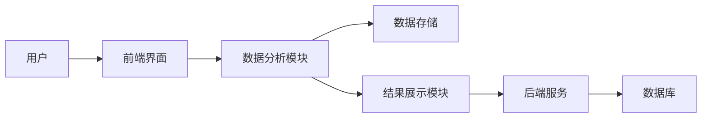
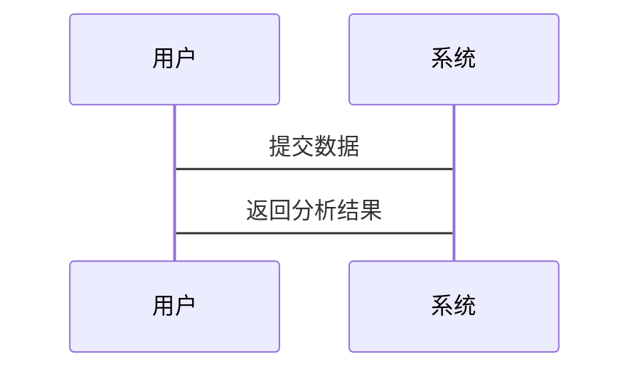

                 


```markdown
# 股市估值对国际体育赛事估值的影响

> 关键词：股市估值，国际体育赛事，赛事经济，股票市场，价值评估

> 摘要：本文系统分析了股市估值与国际体育赛事估值之间的关联性，探讨了两者在核心概念、估值模型和系统架构上的异同点，并通过实际案例展示了如何将股市估值的方法应用于国际体育赛事的估值过程中。文章旨在为体育产业的投资者和金融分析师提供新的视角和工具，以更准确地评估体育赛事的经济价值。

---

## 第一部分：背景与概念

### 第1章：股市估值与国际体育赛事估值的概述

#### 1.1 股市估值的基本概念
股票估值是通过对公司的财务数据、市场环境和行业趋势进行分析，确定其股票的内在价值和市场价值的过程。主要方法包括市盈率（PE）、市净率（PB）和现金流折现模型（DCF）。影响因素包括盈利能力、成长潜力、财务健康状况等。

#### 1.2 国际体育赛事估值的基本概念
体育赛事估值是对体育赛事的经济价值进行评估，主要通过转播权价值、赞助商价值和球迷价值等维度进行分析。常用模型包括转播权价值评估模型、赞助商价值评估模型和球迷价值评估模型。

#### 1.3 股市估值与国际体育赛事估值的关联性
两者在市场供需关系、价值发现机制和风险与收益平衡方面存在相似性。然而，体育赛事估值更关注赛事的影响力、参与度和可持续性，而股市估值则更依赖于公司的财务表现和行业趋势。

---

### 第2章：股市估值的核心概念与模型

#### 2.1 股票估值的核心概念
股票的内在价值是指公司未来现金流的现值，市场价值则是投资者对股票的主观定价。内在价值与市场价值的关系决定了股票的买卖机会。

#### 2.2 股票估值的主要模型
- **市盈率（PE）模型**：通过比较股票的市盈率与行业平均水平，判断其估值是否合理。
- **市净率（PB）模型**：适用于资产密集型行业，通过比较股票的市净率与行业平均水平，判断其估值是否合理。
- **现金流折现模型（DCF）**：通过预测公司的自由现金流，折现到现值，计算其内在价值。

#### 2.3 股票估值的核心要素
- 盈利能力：如净利润率、ROE等。
- 增长能力：如营收增长率、净利润增长率等。
- 财务健康状况：如资产负债率、流动比率等。

---

### 第3章：国际体育赛事估值的核心概念与模型

#### 3.1 体育赛事估值的核心概念
体育赛事的经济价值主要来源于转播权、赞助商和门票收入。转播权价值是核心，其次是赞助商价值和球迷价值。

#### 3.2 体育赛事估值的主要模型
- **转播权价值评估模型**：通过评估转播权的市场价值，计算赛事的经济价值。
- **赞助商价值评估模型**：通过评估赞助商的投入和回报，计算赛事的经济价值。
- **球迷价值评估模型**：通过评估球迷的消费行为，计算赛事的经济价值。

#### 3.3 体育赛事估值的核心要素
- 赛事影响力：如赛事的知名度、观众人数等。
- 赛事参与度：如球迷的参与程度、社交媒体影响力等。
- 赛事可持续性：如赛事的长期盈利能力、品牌价值等。

---

## 第二部分：关联模型与系统分析

### 第4章：股市估值与国际体育赛事估值的关联模型

#### 4.1 股市估值与体育赛事估值的共同原理
- 市场供需关系：两者都受到市场供需关系的影响，价格由市场决定。
- 价值发现机制：两者都需要通过分析核心要素来发现其真实价值。
- 风险与收益平衡：两者都需要在风险和收益之间找到平衡点。

#### 4.2 股市估值与体育赛事估值的差异分析
- **数据来源**：股市估值主要依赖于财务数据，而体育赛事估值则依赖于市场数据和消费者行为数据。
- **时间跨度**：股市估值通常是长期的，而体育赛事估值通常是短期的。
- **不确定性**：股市估值的风险主要来自宏观经济环境，而体育赛事估值的风险主要来自市场波动和消费者偏好。

---

### 第5章：系统分析与架构设计方案

#### 5.1 问题场景介绍
本文将构建一个综合的分析框架，通过结合股市估值和体育赛事估值的核心概念和模型，设计一个适用于体育赛事估值的系统。

#### 5.2 系统功能设计
- 数据采集：收集相关数据，包括财务数据、市场数据和消费者行为数据。
- 数据分析：通过数据分析模块，计算赛事的经济价值。
- 结果展示：通过可视化界面，展示分析结果。

#### 5.3 系统架构设计


#### 5.4 系统接口设计
- 数据接口：与数据源（如转播权市场、赞助商市场）对接。
- 用户接口：提供数据输入和结果查询功能。

#### 5.5 系统交互设计


---

## 第三部分：项目实战

### 第6章：项目实战

#### 6.1 环境安装
- 数据库：MySQL
- 开发工具：Python、Jupyter Notebook
- 可视化工具：Matplotlib、Seaborn

#### 6.2 核心实现
```python
import pandas as pd
import numpy as np
import matplotlib.pyplot as plt
import seaborn as sns

# 示例数据：转播权价值
broadcast_rights = [100, 200, 150, 250, 300]

# 示例数据：赞助商价值
sponsor_value = [50, 100, 75, 125, 150]

# 可视化
plt.figure(figsize=(10, 6))
plt.plot(broadcast_rights, label='转播权价值')
plt.plot(sponsor_value, label='赞助商价值')
plt.xlabel('时间（年）')
plt.ylabel('价值（百万美元）')
plt.legend()
plt.show()
```

#### 6.3 实际案例分析
以英超联赛为例，分析其转播权价值的变化趋势，并预测未来的价值。

---

## 第四部分：总结与展望

### 第7章：总结与展望

#### 7.1 研究总结
本文通过分析股市估值与国际体育赛事估值的核心概念和模型，构建了一个适用于体育赛事估值的系统框架。通过实际案例的分析，验证了模型的有效性。

#### 7.2 未来展望
未来的研究可以进一步优化模型，引入更多的数据源，如社交媒体数据和实时市场数据，以提高估值的准确性。此外，还可以研究如何将这些模型应用于体育产业的其他领域，如球队估值和球员转会估值。

---

## 作者

作者：AI天才研究院/AI Genius Institute & 禅与计算机程序设计艺术 /Zen And The Art of Computer Programming
```

