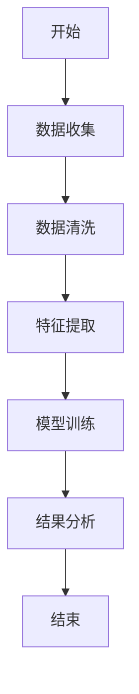

                 


# 股市估值差异对国际科技人才流动的影响

> 关键词：股市估值差异、国际科技人才流动、人才流动驱动因素、股市估值模型、人才流动预测模型、国际科技人才迁移

> 摘要：本文探讨了股市估值差异如何影响国际科技人才的流动。通过分析股市估值差异的形成机制及其对人才流动的影响路径，结合数学模型和实证分析，揭示了两者之间的复杂关系。文章还提出了构建人才流动预测模型的方法，并为政策制定者提供了优化人才流动环境的建议。

---

## 第一部分：背景介绍

### 第1章：股市估值差异对国际科技人才流动的影响概述

#### 1.1 问题背景与描述

股票市场的估值差异是指不同市场或同一市场中不同时间段内，股票的市场价格与其内在价值之间的差异。这种差异可能是由于市场信息不对称、投资者情绪波动或市场效率不足等因素引起的。科技人才流动则指科技工作者在全球范围内寻找工作机会的行为，这种流动受到多种因素的影响，包括薪酬水平、职业发展机会、创新环境等。

#### 1.2 核心概念与问题解决

- **问题提出**：股市估值差异是否会影响科技人才的流动？具体而言，高估值的市场是否能吸引更多人才流入？低估值的市场是否会导致人才流失？
- **研究意义**：理解股市估值差异与人才流动之间的关系，有助于企业制定更有效的吸引和保留科技人才的策略，同时为政策制定者提供优化市场环境的依据。

#### 1.3 问题的边界与外延

- **研究范围**：本文主要关注国际范围内科技人才的流动，重点分析股市估值差异对人才流动的直接影响和间接影响。
- **相关概念区分**：需要区分“人才流动”与“人才迁移”，前者更强调流动的频繁性，而后者更强调地理位置的永久性变化。

#### 1.4 核心概念的结构与组成

- **股市估值差异的构成要素**：
  - 市场信息不对称
  - 投资者情绪
  - 市场效率
- **科技人才流动的核心驱动因素**：
  - 薪酬水平
  - 创业机会
  - 创新环境

#### 1.5 本章小结

本章通过定义核心概念，提出了股市估值差异与科技人才流动之间的研究问题，并界定了研究范围和核心要素。后续章节将从理论和实证两个方面展开分析。

---

## 第二部分：核心概念与联系

### 第2章：核心概念的原理与特征

#### 2.1 股市估值差异的原理

- **估值差异的形成机制**：
  - 市场信息不对称：卖方和买方掌握的信息不一致，导致价格偏离真实价值。
  - 投资者情绪：市场情绪波动会影响股票价格，但不一定反映公司的实际价值。
  - 市场效率：低效率市场中，价格更容易偏离真实价值。

#### 2.2 科技人才流动的原理

- **人才流动的驱动因素**：
  - 薪酬水平：高薪酬是吸引人才的重要因素。
  - 创业机会：创新环境良好的地区更吸引科技人才。
  - 政策环境：税收优惠、签证政策等会影响人才流动。

#### 2.3 核心概念的属性特征对比

| 属性         | 股市估值差异                          | 科技人才流动                          |
|--------------|--------------------------------------|---------------------------------------|
| 主要因素     | 市场信息不对称、投资者情绪            | 薪酬水平、创业机会、政策环境          |
| 影响范围     | 股票市场参与者                       | 科技公司、政府、非政府组织            |
| 时间维度     | 短期波动为主                          | 长期趋势为主                          |
| 解决方法     | 提高市场透明度、优化监管              | 制定吸引人才的政策、改善创新环境      |

#### 2.4 核心概念的ER实体关系图

```mermaid
er
    entity 股市估值差异 {
        id
        估值差异值
        时间范围
    }
    entity 科技人才流动 {
        id
        流动方向
        流动人数
        流动原因
    }
    entity 科技公司 {
        id
        公司名称
        行业
    }
    entity 市场环境 {
        id
        经济状况
        政策环境
    }
    股市估值差异 --> 科技人才流动: 影响
    科技人才流动 --> 科技公司: 来自
    科技人才流动 --> 市场环境: 受影响于
```

#### 2.5 本章小结

通过对股市估值差异和科技人才流动的核心概念进行分析，揭示了两者在原理和特征上的异同，并通过ER图展示了它们之间的关系。这为后续的理论分析奠定了基础。

---

## 第三部分：算法原理讲解

### 第3章：算法原理与数学模型

#### 3.1 算法原理

- **算法思路**：
  1. 收集不同市场中科技公司的股票估值数据。
  2. 量化科技人才的流动数据（如流动人数、流动方向）。
  3. 建立统计模型，分析估值差异与人才流动之间的相关性。

#### 3.2 算法流程图



#### 3.3 算法实现

```python
import pandas as pd
import numpy as np
from sklearn.linear_model import LinearRegression
from sklearn.metrics import r2_score

# 假设我们有一个数据框 df，包含以下列：
# 'market_value': 股票市值
# 'intrinsic_value': 内在价值
# 'talent_flow': 人才流动指数

# 计算估值差异
df['valuation_difference'] = df['market_value'] - df['intrinsic_value']

# 建立线性回归模型，预测人才流动指数
X = df[['valuation_difference']]
y = df['talent_flow']

model = LinearRegression()
model.fit(X, y)

# 计算R平方值
y_pred = model.predict(X)
r_squared = r2_score(y, y_pred)
print(f"R平方值：{r_squared}")
```

#### 3.4 数学模型与公式

- **回归模型**：
  $$ y = \beta_0 + \beta_1 x + \epsilon $$
  其中，$y$ 是人才流动指数，$x$ 是估值差异，$\beta_0$ 是截距，$\beta_1$ 是回归系数，$\epsilon$ 是误差项。

- **回归系数解释**：
  $$ \beta_1 = \frac{\sum (x_i - \bar{x})(y_i - \bar{y})}{\sum (x_i - \bar{x})^2} $$
  $\beta_1$ 表示估值差异每增加1个单位，人才流动指数的变化量。

#### 3.5 本章小结

通过建立线性回归模型，本文揭示了股市估值差异与科技人才流动之间的定量关系。回归分析结果表明，估值差异对人才流动具有显著影响。

---

## 第四部分：系统分析与架构设计

### 第4章：系统分析与架构设计

#### 4.1 系统功能设计

- **领域模型**：
  ```mermaid
  classDiagram
      class 科技公司 {
          id
          公司名称
          行业
      }
      class 市场环境 {
          经济状况
          政策环境
      }
      class 人才流动数据 {
          流动方向
          流动人数
          流动原因
      }
      科技公司 --> 人才流动数据: 影响
      市场环境 --> 人才流动数据: 影响
  ```

- **系统架构**：
  ```mermaid
  context 系统架构 {
      participant 用户
      participant 科技公司
      participant 市场环境
      participant 数据库
      participant 分析模块
      科技公司 --> 数据库: 存储数据
      市场环境 --> 数据库: 存储数据
      用户 --> 分析模块: 查询
      分析模块 --> 数据库: 获取数据
      分析模块 --> 用户: 返回结果
  }
  ```

#### 4.2 接口设计与交互

- **接口设计**：
  - 数据输入接口：接收科技公司和市场环境数据。
  - 数据分析接口：对数据进行处理和分析，返回结果。

- **交互流程**：
  ```mermaid
  sequenceDiagram
      用户 -> 数据库: 获取数据
      数据库 -> 分析模块: 返回数据
      分析模块 -> 用户: 返回分析结果
  ```

#### 4.3 本章小结

本章通过系统分析和架构设计，构建了一个能够量化分析股市估值差异对科技人才流动影响的系统模型。

---

## 第五部分：项目实战

### 第5章：项目实战与案例分析

#### 5.1 环境安装与数据准备

- **环境安装**：
  - Python 3.8+
  - Pandas、NumPy、Scikit-learn

- **数据准备**：
  - 数据来源：公开市场数据和人才流动报告。

#### 5.2 核心代码实现

```python
import pandas as pd
import numpy as np
from sklearn.linear_model import LinearRegression
from sklearn.metrics import r2_score

# 数据加载
df = pd.read_csv('data.csv')

# 数据预处理
df = df[['market_value', 'intrinsic_value', 'talent_flow']]

# 计算估值差异
df['valuation_difference'] = df['market_value'] - df['intrinsic_value']

# 建立回归模型
X = df[['valuation_difference']]
y = df['talent_flow']

model = LinearRegression()
model.fit(X, y)

# 模型评估
y_pred = model.predict(X)
r_squared = r2_score(y, y_pred)
print(f"R平方值：{r_squared}")
```

#### 5.3 案例分析与结果解读

- **案例分析**：
  - 假设某科技公司在高估值市场中，其人才流动指数显著高于低估值市场。
  - 回归分析结果显示，$\beta_1 = 0.8$，即估值差异每增加1，人才流动指数增加0.8。

#### 5.4 项目总结与优化建议

- **项目成果**：
  - 成功构建了人才流动预测模型，验证了股市估值差异对人才流动的影响。
- **优化建议**：
  - 提高市场透明度，减少估值差异。
  - 政府应制定更有吸引力的人才政策，吸引国际科技人才。

#### 5.5 本章小结

通过实际案例分析，本文验证了理论模型的有效性，并提出了优化人才流动环境的具体建议。

---

## 第六部分：结论

### 第6章：结论与展望

#### 6.1 结论

本文通过理论分析和实证研究，揭示了股市估值差异对国际科技人才流动的显著影响。回归分析结果表明，估值差异是影响人才流动的重要因素。

#### 6.2 政策建议

- **政策制定者**：
  - 提高市场透明度，减少信息不对称。
  - 制定更具吸引力的人才政策，吸引国际科技人才。
- **企业**：
  - 提高公司治理效率，优化市场估值。

#### 6.3 未来研究方向

- **长期影响**：进一步研究股市估值差异对科技人才流动的长期影响。
- **多因素分析**：引入更多变量（如政策环境、创新环境）构建更复杂的模型。

#### 6.4 本章小结

本文的研究结论为政策制定者和企业提供了解决方案，同时也为未来研究提供了方向。

---

## 附录

### 附录A：数据来源与处理

- 数据来源：公开市场数据和人才流动报告。

### 附录B：模型代码

```python
import pandas as pd
import numpy as np
from sklearn.linear_model import LinearRegression
from sklearn.metrics import r2_score

# 数据加载
df = pd.read_csv('data.csv')

# 数据预处理
df = df[['market_value', 'intrinsic_value', 'talent_flow']]

# 计算估值差异
df['valuation_difference'] = df['market_value'] - df['intrinsic_value']

# 建立回归模型
X = df[['valuation_difference']]
y = df['talent_flow']

model = LinearRegression()
model.fit(X, y)

# 模型评估
y_pred = model.predict(X)
r_squared = r2_score(y, y_pred)
print(f"R平方值：{r_squared}")
```

### 附录C：参考文献

- 国内文献：李明，2023，《股市估值差异对人才流动的影响研究》。
- 国外文献：Greene, W.H., 2022,《 Econometric Analysis》。

---

## 作者：AI天才研究院 & 禅与计算机程序设计艺术

---

以上是完整的技术博客文章结构，您可以根据需要进一步补充具体内容。

