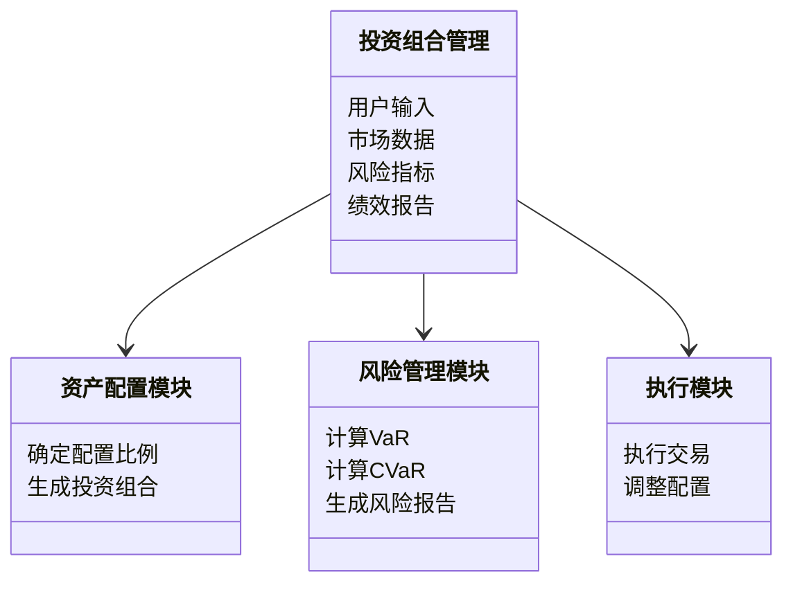

                 


# 股票与债券的平衡：降低投资组合风险的关键

---

> **关键词**：股票、债券、投资组合、风险管理、资产配置、现代投资组合理论、VaR、CVaR  
> **摘要**：本文探讨了股票与债券在投资组合中的平衡策略，通过现代投资组合理论和数学模型，分析了如何通过优化资产配置来降低投资组合风险。文章结合理论与实践，提供了详细的案例分析和代码实现，帮助读者掌握降低投资组合风险的关键方法。

---

# 第1章: 股票与债券的基本概念

## 1.1 股票与债券的定义与特性

### 1.1.1 股票的定义与特点
股票是股份公司发行的，证明投资者对企业拥有所有权的凭证。股票的特性包括高收益、高风险、流动性高和权益性。

### 1.1.2 债券的定义与特点
债券是债务人发行的，承诺在特定时间内支付利息和本金的债务凭证。债券的特性包括相对稳定的收益、较低的风险和固定收益性。

### 1.1.3 股票与债券的主要区别
| 特性 | 股票 | 债券 |
|------|------|------|
| 收益 | 不固定，高风险 | 固定，低风险 |
| 权益 | 所有者权益 | 债权 |
| 风险 | 高 | 低 |

---

## 1.2 投资组合风险的基本概念

### 1.2.1 投资组合风险的定义
投资组合风险是指投资组合在一定时期内可能遭受损失的可能性。它包括系统性风险和非系统性风险。

### 1.2.2 系统性风险与非系统性风险
| 类别 | 定义 | 来源 |
|------|------|------|
| 系统性风险 | 影响整个市场的风险 | 经济衰退、通货膨胀、战争等 |
| 非系统性风险 | 仅影响特定资产的风险 | 公司经营状况、行业政策变化等 |

### 1.2.3 风险与收益的权衡
投资收益与风险成正比，高收益意味着高风险，反之亦然。投资者需要在收益和风险之间找到平衡点。

---

## 1.3 股票与债券的收益与风险分析

### 1.3.1 股票的收益与风险特征
股票的收益波动较大，但长期来看，股票的平均收益高于债券。股票的风险主要体现在市场波动和公司经营状况上。

### 1.3.2 债券的收益与风险特征
债券的收益相对稳定，风险较低，但收益率通常低于股票。债券的风险主要体现在利率波动和信用风险上。

### 1.3.3 股票与债券的风险对比
股票的风险较高，但潜在收益大；债券的风险较低，收益相对稳定。通过平衡股票和债券的比例，可以有效降低整体投资组合的风险。

---

## 1.4 本章小结
本章介绍了股票和债券的基本概念、特性和风险，强调了平衡股票和债券在投资组合中的重要性。通过合理配置股票和债券，投资者可以在追求收益的同时降低风险。

---

# 第2章: 现代投资组合理论基础

## 2.1 现代投资组合理论概述

### 2.1.1 投资组合理论的发展历程
投资组合理论起源于20世纪50年代，由哈里·马科维茨提出，后来发展为现代投资组合理论（MPT）。

### 2.1.2 马科维茨的有效前沿理论
马科维茨提出，通过优化资产配置，可以在给定风险下获得最大收益，或者在给定收益下最小化风险。这种优化后的投资组合位于有效前沿上。

### 2.1.3 投资组合理论的核心假设
- 投资者是理性的，追求效用最大化。
- 资产收益服从正态分布。
- 投资者可以通过调整资产配置来优化风险和收益。

---

## 2.2 投资组合风险的度量方法

### 2.2.1 方差与标准差的定义
方差衡量资产收益的波动性，标准差是方差的平方根。公式如下：
$$ \sigma^2 = \frac{1}{n}\sum_{i=1}^{n}(x_i - \mu)^2 $$
$$ \sigma = \sqrt{\sigma^2} $$

### 2.2.2 协方差与相关性的影响
协方差衡量两种资产收益的变动方向，相关性是协方差标准化后的结果。公式如下：
$$ \text{协方差}(x, y) = \frac{1}{n-1}\sum_{i=1}^{n}(x_i - \bar{x})(y_i - \bar{y}) $$
$$ \text{相关性}(x, y) = \frac{\text{协方差}(x, y)}{\sigma_x \sigma_y} $$

### 2.2.3 风险调整后的收益指标
夏普比率衡量单位风险下的超额收益，公式如下：
$$ \text{夏普比率} = \frac{E[r - r_f]}{\sigma} $$

---

## 2.3 投资组合优化的数学模型

### 2.3.1 均值-方差优化模型
优化目标是最大化收益，最小化风险。数学表达如下：
$$ \text{最小化 } \sigma^2 $$
$$ \text{在约束 } E[r] = \text{目标收益} $$

### 2.3.2 使用拉格朗日乘数法求解优化问题
拉格朗日函数为：
$$ L = \sigma^2 - \lambda(E[r] - \text{目标收益}) $$

### 2.3.3 优化模型的约束条件
- 投资比例非负。
- 投资比例之和为1。

---

## 2.4 本章小结
本章介绍了现代投资组合理论的核心思想，包括有效前沿、均值-方差优化模型以及风险度量方法。这些理论为后续的资产配置和风险管理提供了理论基础。

---

# 第3章: 股票与债券的资产配置策略

## 3.1 资产配置的基本原理

### 3.1.1 资产配置的目标与原则
资产配置的目标是在风险可控的前提下，实现收益最大化。原则包括分散投资、长期持有和定期调整。

### 3.1.2 资产配置的类型与方法
- 战术性资产配置：根据市场变化动态调整。
- 战略性资产配置：根据长期目标设定固定比例。

### 3.1.3 资产配置的动态调整
根据市场环境和投资者风险偏好的变化，定期调整资产配置比例。

---

## 3.2 股票与债券的最优配置比例

### 3.2.1 基于风险偏好的配置模型
根据投资者的风险承受能力，确定股票和债券的配置比例。

### 3.2.2 基于市场环境的动态调整
根据市场走势和经济周期，调整股票和债券的比例。

### 3.2.3 配置比例的数学推导
假设股票收益率为 $r_s$，债券收益率为 $r_b$，权重分别为 $w_s$ 和 $w_b$，则投资组合的收益为：
$$ E[r] = w_s r_s + w_b r_b $$

---

## 3.3 资产配置的实战案例

### 3.3.1 假设市场环境的设定
假设当前市场处于复苏阶段，股票预期收益为8%，债券预期收益为3%。

### 3.3.2 基于模型的配置方案
根据马科维茨模型，确定股票和债券的最优配置比例为60%和40%。

### 3.3.3 方案的优缺点分析
优点：分散风险，收益稳定。缺点：在市场牛市中，收益可能低于全股票配置。

---

## 3.4 本章小结
本章通过理论和案例分析，探讨了股票和债券的资产配置策略。通过合理配置，投资者可以在不同市场环境下实现风险与收益的平衡。

---

# 第4章: 投资组合风险管理的数学模型

## 4.1 风险管理的核心概念

### 4.1.1 风险管理的目标
通过量化和控制风险，确保投资组合的稳定性。

### 4.1.2 风险管理的工具与方法
- 风险指标：VaR、CVaR。
- 风险对冲：利用衍生工具 hedging。

### 4.1.3 风险管理的实施步骤
1. 识别风险。
2. 度量风险。
3. 控制风险。

---

## 4.2 风险度量的数学公式

### 4.2.1 VaR（在险值）的定义与计算
VaR是一定置信水平下，投资组合可能的最大损失。计算公式为：
$$ \text{VaR} = \text{VaR}_\alpha = \text{最小值 } x \text{ 使得 } P(L \leq x) \geq \alpha $$

### 4.2.2 CVaR（条件在险值）的定义与计算
CVaR是在VaR的基础上，考虑超过VaR部分的平均损失。公式为：
$$ \text{CVaR}_\alpha = \frac{1}{1-\alpha}\int_{\alpha}^{1} L dP $$

---

## 4.3 风险管理的优化模型

### 4.3.1 基于VaR的优化模型
最小化VaR，同时满足收益目标。

### 4.3.2 基于CVaR的优化模型
最小化CVaR，同时满足收益目标。

### 4.3.3 模型的比较与选择
CVaR在衡量尾部风险方面更优，因此在实际应用中更常用。

---

## 4.4 本章小结
本章介绍了VaR和CVaR等风险指标，并探讨了它们在投资组合优化中的应用。通过这些指标，投资者可以更好地控制和管理投资风险。

---

# 第5章: 系统架构与风险管理的实施

## 5.1 问题场景介绍
假设我们开发一个投资组合管理系统，需要实现资产配置、风险管理和绩效评估功能。

## 5.2 系统功能设计

### 5.2.1 领域模型（Mermaid 类图）


## 5.3 系统架构设计

### 5.3.1 系统架构（Mermaid 架构图）
```mermaid
archi
    title 投资组合管理系统架构
    client --> API Gateway
    API Gateway --> 负载均衡
    负载均衡 --> 服务节点1
    负载均衡 --> 服务节点2
    服务节点1 --> 数据库
    服务节点2 --> 数据库
    服务节点1 --> 缓存
    服务节点2 --> 缓存
```

---

## 5.4 本章小结
本章通过系统架构设计，展示了如何实现投资组合管理系统的功能。通过模块化设计，确保系统的可扩展性和可维护性。

---

# 第6章: 项目实战与优化方案

## 6.1 环境安装

### 6.1.1 Python环境安装
安装Python和必要的库：
```bash
pip install numpy pandas matplotlib
```

## 6.2 核心实现源代码

### 6.2.1 投资组合优化代码
```python
import numpy as np
import pandas as pd

# 假设收益率矩阵
returns = pd.DataFrame({
    '股票': [0.08, 0.05, 0.07],
    '债券': [0.03, 0.04, 0.06]
})

# 计算协方差矩阵
cov_matrix = returns.cov()

# 计算最优配置比例
def portfolio_optimization(returns, cov_matrix):
    n = len(returns.columns)
    ones = np.ones(n)
    inv_cov = np.linalg.inv(cov_matrix)
    weights = inv_cov @ ones / (ones.T @ inv_cov @ ones)
    return weights

weights = portfolio_optimization(returns, cov_matrix)
print(weights)
```

---

## 6.3 代码应用解读与分析

### 6.3.1 代码解读
上述代码计算了股票和债券的最优配置比例，使用均值-方差优化模型。

---

## 6.4 实际案例分析

### 6.4.1 市场环境变化
假设市场环境从复苏转向衰退，债券收益率上升，股票收益率下降。

### 6.4.2 方案调整
根据新环境，调整股票和债券的配置比例为40%和60%。

### 6.4.3 方案效果
通过调整，投资组合的风险降低，收益更加稳定。

---

## 6.5 本章小结
本章通过实际案例，展示了如何根据市场变化调整资产配置比例，并提供了代码实现。通过实战，读者可以更好地理解理论知识。

---

# 第7章: 总结与最佳实践

## 7.1 本章总结
本文详细探讨了股票与债券在投资组合中的平衡策略，通过现代投资组合理论和数学模型，分析了如何通过优化资产配置降低投资组合风险。

## 7.2 最佳实践 tips

### 7.2.1 定期再平衡
定期检查投资组合的配置比例，根据市场变化进行调整。

### 7.2.2 分散投资
通过配置不同资产类别，降低非系统性风险。

### 7.2.3 动态调整
根据市场环境和经济周期，灵活调整资产配置比例。

### 7.2.4 风险管理
使用VaR和CVaR等指标，定期监控和管理投资风险。

---

## 7.3 本章小结
通过本文的学习，读者可以掌握股票与债券平衡的基本概念、理论和实践方法。在实际投资中，建议结合市场环境和自身风险偏好，制定合理的资产配置策略。

---

# 作者：AI天才研究院/AI Genius Institute & 禅与计算机程序设计艺术 /Zen And The Art of Computer Programming

---

**感谢您的阅读！希望本文能为您提供有价值的投资组合风险管理的见解和方法。**

