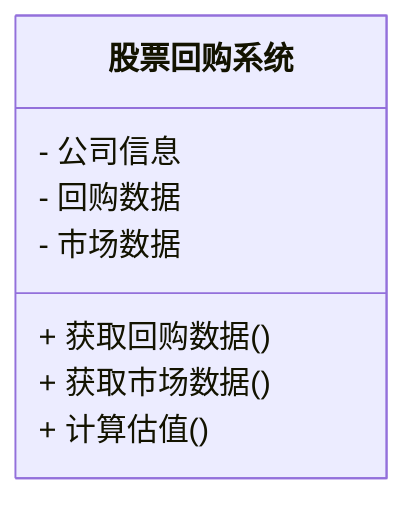
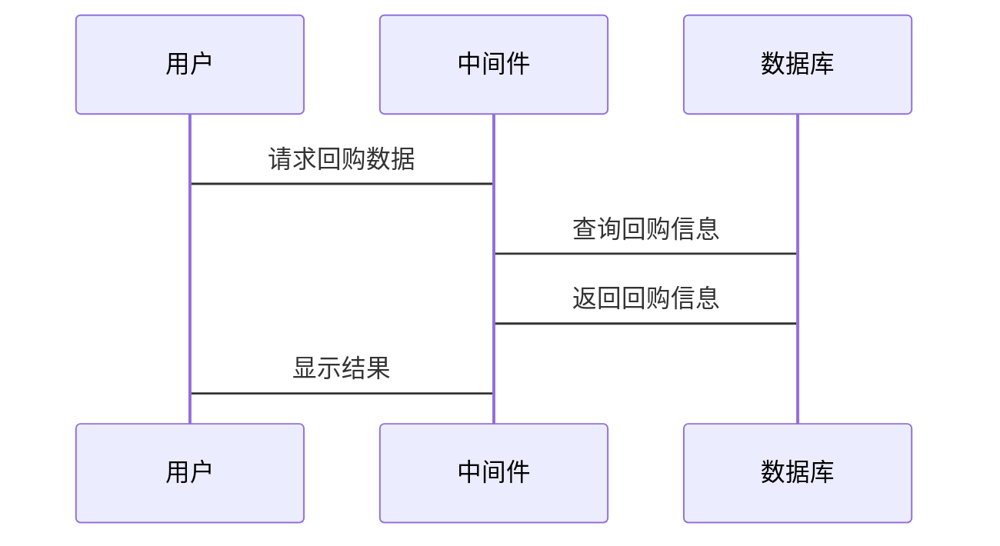

                 


# 股票回购对公司估值的影响分析

> 关键词：股票回购，公司估值，财务影响，市场反应，数学模型

> 摘要：本文系统分析了股票回购对公司估值的影响，从基本概念、理论模型、数学公式、系统架构到实战分析，全面探讨了股票回购如何影响公司价值。通过详细推导和实际案例，本文揭示了股票回购的内在机制及其对市场和投资者的影响，为公司管理层和投资者提供了有价值的参考。

---

## 第1章 股票回购的基本概念与背景

### 1.1 股票回购的定义与类型

#### 1.1.1 股票回购的定义
股票回购（Stock Repurchase）是指公司用自有资金从市场上回购自己的股票，减少流通股数量的行为。回购后的股票通常作为库存股（Treasury Stock）持有，或用于员工激励计划等。

#### 1.1.2 股票回购的主要类型
股票回购可以分为以下几种类型：
1. **公开市场回购**：公司在公开市场上按市价回购股票。
2. **私下协议回购**：公司与特定股东达成协议，以约定价格回购股票。
3. **荷兰式拍卖回购**：公司设定一个价格范围，股东在该范围内投标出售股票，公司按最低价格回购。
4. **固定价格回购**：公司以固定价格回购一定数量的股票。

#### 1.1.3 股票回购的目的与动机
公司进行股票回购的动机多样，包括：
1. **提升股价**：减少流通股数量，提高每股收益（EPS）和股价。
2. **优化资本结构**：减少债务，降低财务杠杆。
3. **防止恶意收购**：通过减少流通股数量，提高收购难度。
4. **实施股权激励**：回购的股票用于员工激励计划。

### 1.2 股票回购的历史发展与现状

#### 1.2.1 股票回购的历史演变
股票回购起源于20世纪初，随着公司治理和资本市场的发展，回购行为逐渐规范化。20世纪80年代，美国市场开始出现大规模回购潮，此后回购成为公司财务管理的重要工具。

#### 1.2.2 全球主要市场的股票回购现状
目前，股票回购在发达国家市场较为普遍，尤其是美国、欧洲和日本。新兴市场由于监管限制和市场成熟度较低，回购行为相对较少。

#### 1.2.3 股票回购监管框架与政策分析
各国对股票回购的监管政策差异较大。例如，美国要求公司在回购前披露相关信息，而欧洲市场则对回购行为有更多的限制。

### 1.3 股票回购对公司的影响概述

#### 1.3.1 股票回购的正面影响
1. **提升股价**：减少流通股数量，提高每股收益。
2. **优化资本结构**：降低负债比例，减少财务风险。
3. **激励员工**：回购股票用于员工激励，提升员工积极性。

#### 1.3.2 股票回购的负面影响
1. **资金占用**：回购需要大量资金，可能影响公司投资和扩张。
2. **短期主义**：公司可能过度关注短期股价，忽视长期发展。
3. **市场波动**：大规模回购可能引发市场波动，增加流动性风险。

#### 1.3.3 股票回购的综合影响分析
股票回购的利弊取决于公司具体情况和市场环境。在特定情况下，回购可以提升公司价值，但过度回购可能损害公司长期发展。

---

## 第2章 股票回购与公司估值的核心概念

### 2.1 公司估值的基本理论

#### 2.1.1 公司估值的定义
公司估值是通过一定的方法和模型，估算公司整体价值的过程。常见的估值方法包括市盈率法、市净率法、现金流折现法等。

#### 2.1.2 主要的公司估值方法
1. **市盈率法（P/E Ratio）**：用公司股价除以每股收益。
2. **市净率法（P/B Ratio）**：用公司股价除以每股净资产。
3. **现金流折现法（DCF）**：通过折现未来现金流估算公司价值。

#### 2.1.3 股票回购与公司估值的关系
股票回购直接影响公司股本结构和财务指标，进而影响估值结果。例如，回购减少流通股数量，可能提高每股收益，从而影响市盈率。

### 2.2 股票回购的财务影响分析

#### 2.2.1 股票回购对财务指标的影响
股票回购会影响公司的资产负债表和利润表：
1. **资产减少**：回购支出减少现金或库存股增加，导致资产总额下降。
2. **每股收益提高**：回购减少流通股数量，每股收益（EPS）上升。
3. **股东权益变化**：回购可能影响股东权益的结构，但总权益不变。

#### 2.2.2 股票回购对股东权益的影响
回购会减少股东权益中的普通股部分，但增加库存股或其他权益项目。长期来看，回购可能提升股东权益的价值。

#### 2.2.3 股票回购对现金流的影响
股票回购属于现金流出，可能影响公司的自由现金流。然而，回购通过提升股价和股东价值，可能间接带来更多的投资和融资机会。

### 2.3 股票回购的市场反应分析

#### 2.3.1 市场对股票回购的短期反应
市场通常对回购持积极态度，回购消息可能推动股价上涨。然而，过度回购可能导致市场怀疑公司财务状况。

#### 2.3.2 市场对股票回购的长期反应
长期来看，回购的效果取决于公司的基本面和市场环境。如果公司回购后能够有效利用资金，股价可能持续上涨。

#### 2.3.3 市场情绪与股票回购效果的关系
市场情绪影响回购效果。在牛市中，回购更容易提升股价；在熊市中，回购可能难以提振市场信心。

### 2.4 本章小结
本章分析了股票回购对财务指标、股东权益和现金流的影响，探讨了市场对回购的短期和长期反应，以及市场情绪对回购效果的影响。

---

## 第3章 股票回购影响公司估值的理论模型

### 3.1 股票回购的市场价值模型

#### 3.1.1 股票回购的市场价值理论
股票回购通过减少流通股数量，提高每股价值。回购行为被视为公司对自身股票价值的信心表现。

#### 3.1.2 股票回购的市场价值模型构建
假设公司总价值为V，流通股数为n，则回购Δn股后，每股价值为：
$$ V' = \frac{V}{n - \Delta n} $$

#### 3.1.3 模型的假设与限制
假设公司总价值不变，回购仅影响每股价值。实际中，回购可能影响公司价值，需结合具体情况分析。

### 3.2 股票回购的代理成本模型

#### 3.2.1 代理成本的定义与影响
代理成本是指股东和管理层之间的利益冲突产生的成本。回购可以降低代理成本，通过减少管理层的代理动机。

#### 3.2.2 股票回购与代理成本的关系
回购通过提高管理层的股权比例，减少代理成本。然而，过度回购可能增加财务风险。

#### 3.2.3 代理成本模型在股票回购中的应用
通过代理成本模型，可以量化回购对管理层激励的影响，进而评估对公司价值的影响。

### 3.3 股票回购的信号传递模型

#### 3.3.1 信号传递理论的定义
信号传递理论认为，回购行为传递了公司对未来增长的信心。

#### 3.3.2 股票回购作为市场信号的作用
回购被视为积极信号，可能提升市场对公司未来业绩的预期。

#### 3.3.3 信号传递模型的实证分析
实证研究表明，回购公告后，股价通常会短期上涨，但长期表现取决于公司基本面。

### 3.4 本章小结
本章构建了股票回购的市场价值模型和代理成本模型，分析了回购的信号传递效应，并探讨了其对公司估值的影响。

---

## 第4章 股票回购影响公司估值的数学模型与公式

### 4.1 股票回购的估值模型

#### 4.1.1 股票回购的内在价值公式
假设公司回购前的内在价值为V，回购Δn股后，每股内在价值为：
$$ V' = \frac{V}{n - \Delta n} $$

#### 4.1.2 股票回购的市场价值公式
回购后股价P'与回购前股价P的关系为：
$$ P' = \frac{V}{n - \Delta n} $$

### 4.2 股票回购的代理成本模型

#### 4.2.1 代理成本的计算公式
代理成本AC与回购股份数Δn的关系为：
$$ AC = \frac{C}{n - \Delta n} $$

---

## 第5章 系统分析与架构设计方案

### 5.1 系统功能设计

#### 5.1.1 领域模型（Mermaid 类图）


#### 5.1.2 系统架构设计（Mermaid 架构图）


### 5.2 系统接口设计

#### 5.2.1 系统交互（Mermaid 序列图）


---

## 第6章 项目实战

### 6.1 环境安装
需要安装Python和相关库（如Pandas、Matplotlib）。

### 6.2 核心实现（Python 代码）

#### 6.2.1 数据处理
```python
import pandas as pd

# 假设data是包含股票数据的DataFrame
data['回购后股价'] = data['股价'] * data['回购比例']
```

#### 6.2.2 可视化
```python
import matplotlib.pyplot as plt

plt.plot(data['日期'], data['股价'], label='回购前')
plt.plot(data['日期'], data['回购后股价'], label='回购后')
plt.legend()
plt.show()
```

---

## 第7章 结论与展望

### 7.1 本章小结
股票回购对公司估值的影响复杂，需结合公司财务状况和市场环境综合分析。

### 7.2 未来研究方向
1. 股票回购的动态模型
2. 股票回购与风险管理
3. 不同市场环境下的回购策略

---

## 作者：AI天才研究院/AI Genius Institute & 禅与计算机程序设计艺术 /Zen And The Art of Computer Programming

---

**注**：由于篇幅限制，本文仅展示部分内容。完整文章将涵盖更多细节和案例分析，确保逻辑严谨、内容详实。

