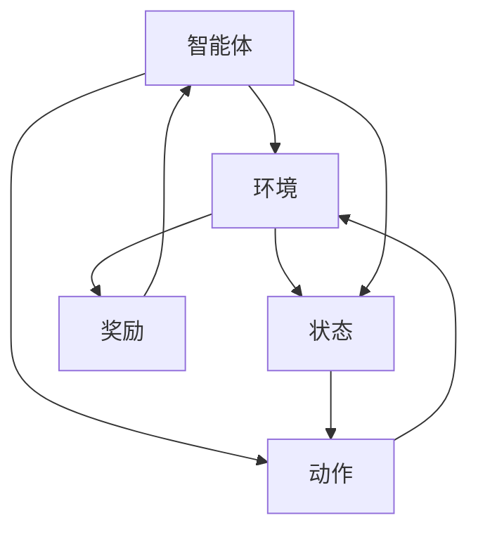
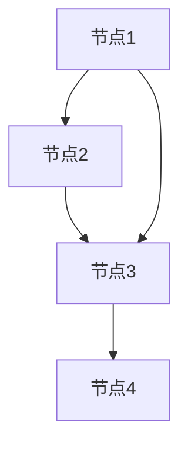
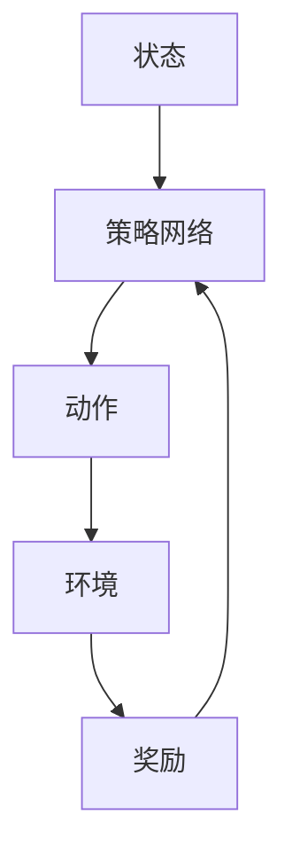
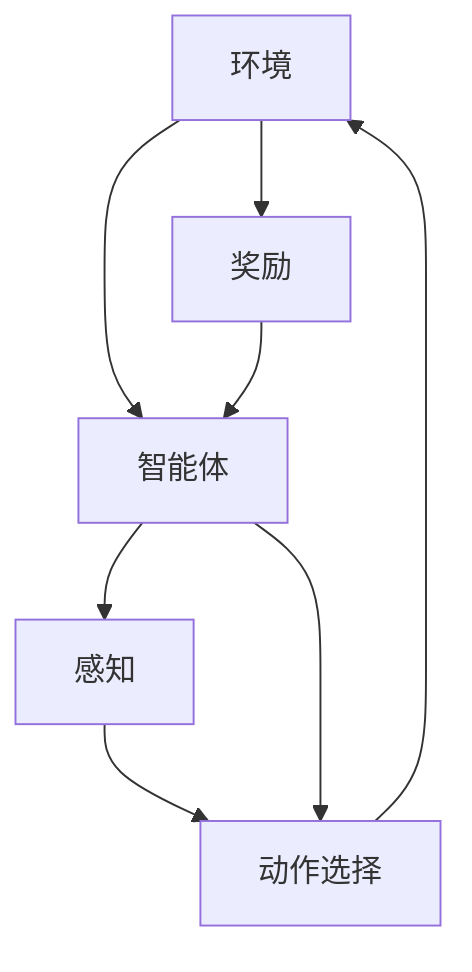
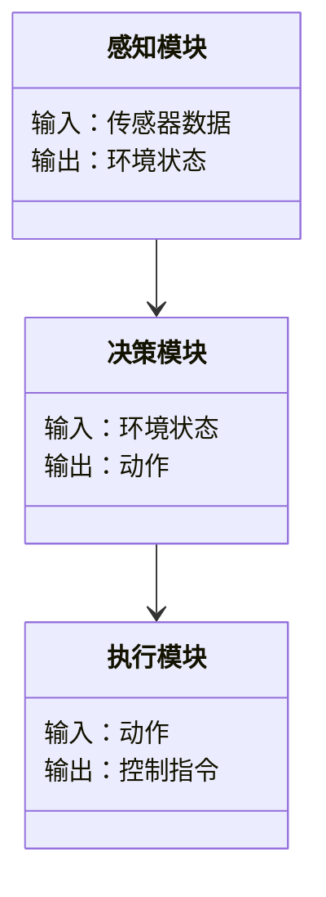
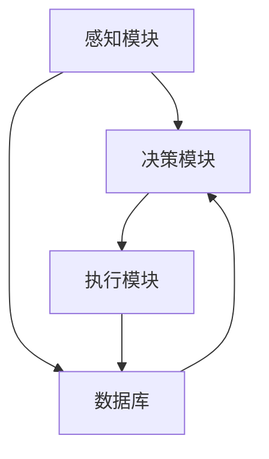
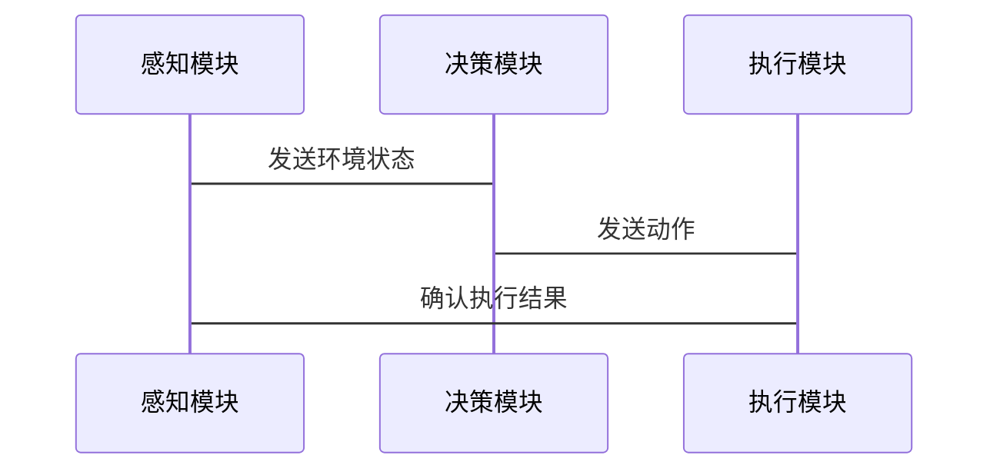

                 


# 自主学习型AI Agent：持续进化的智能体

> 关键词：自主学习型AI Agent, 智能体, 强化学习, 深度学习, 神经网络, 自我进化

> 摘要：本文深入探讨了自主学习型AI Agent的概念、核心算法、系统架构及其在现实场景中的应用。通过分析强化学习、深度学习等技术，结合实际项目案例，详细阐述了自主学习型AI Agent的实现原理和应用场景。文章还讨论了系统设计的关键要点，包括功能设计、架构设计和接口设计，以及如何通过项目实战来优化和实现这些设计。最后，本文总结了自主学习型AI Agent的优势和挑战，并提出了未来的发展方向。

---

## # 第1章: 自主学习型AI Agent的背景与意义

### ## 1.1 人工智能的发展历程

#### ### 1.1.1 从传统AI到深度学习的演变

人工智能（AI）技术经历了从规则驱动到数据驱动的演变。早期的AI主要依赖于专家设定的规则和逻辑，例如专家系统。然而，随着计算能力的提升和大数据的兴起，深度学习（Deep Learning）以其强大的特征学习能力，逐渐成为AI领域的主流。

#### ### 1.1.2 自主学习型AI Agent的定义与特点

自主学习型AI Agent是一种能够通过与环境交互，自主学习和优化自身行为的智能体。与传统的被动接收指令的系统不同，自主学习型AI Agent能够根据环境反馈，调整策略，实现自我改进。

#### ### 1.1.3 自主学习型AI Agent的应用场景与价值

在机器人控制、游戏AI、自动驾驶、智能推荐等领域，自主学习型AI Agent表现出巨大的潜力。例如，自动驾驶汽车需要实时感知环境并做出决策，这正是自主学习型AI Agent的优势所在。

---

### ## 1.2 自主学习型AI Agent的核心概念

#### ### 1.2.1 自主学习的定义与特征

自主学习是指AI Agent在没有外部明确指导的情况下，通过与环境的交互，逐步优化自身的决策能力。其核心特征包括：主动探索、自适应性和自我改进。

#### ### 1.2.2 智能体（Agent）的基本概念与分类

智能体是指能够感知环境并采取行动以实现目标的实体。根据智能体的自主性，可以分为-reactive agents和 proactive agents。自主学习型AI Agent属于proactive agents，能够主动决策和学习。

#### ### 1.2.3 自主学习型AI Agent的架构与功能

自主学习型AI Agent通常包括感知模块、决策模块和执行模块。感知模块负责收集环境信息，决策模块基于当前状态和历史经验做出决策，执行模块将决策转化为具体行动。

---

### ## 1.3 自主学习型AI Agent的现状与趋势

#### ### 1.3.1 当前AI Agent的发展现状

当前，AI Agent已在多个领域取得显著进展，例如AlphaGo通过强化学习在围棋领域击败人类顶尖选手。然而，大多数AI Agent仍依赖于大量人工设计的规则和预训练数据。

#### ### 1.3.2 自主学习型AI Agent的技术趋势

未来，自主学习型AI Agent将更加注重自适应性和持续学习能力。通过结合强化学习和深度学习，AI Agent将能够更好地应对复杂和动态的环境。

#### ### 1.3.3 未来AI Agent的潜在应用与挑战

尽管自主学习型AI Agent的应用前景广阔，但其在实时决策、安全性和伦理问题等方面仍面临诸多挑战。例如，如何确保AI Agent的决策过程透明且符合人类价值观，是未来需要解决的重要问题。

---

## # 第2章: 自主学习型AI Agent的核心原理

### ## 2.1 自主学习的机制与算法

#### ### 2.1.1 强化学习的基本原理

强化学习（Reinforcement Learning）是通过智能体与环境的交互，基于奖励机制来优化策略的过程。智能体会根据当前状态和动作，获得奖励或惩罚，并根据这些反馈调整行为。

#### ### 2.1.2 自主学习中的奖励机制与策略优化

奖励机制是强化学习的核心。通过设计合理的奖励函数，智能体能够学会优先选择高奖励的行为。策略优化则是通过不断更新策略参数，使得智能体在决策时能够最大化预期奖励。

#### ### 2.1.3 自主学习型AI Agent的决策过程

智能体的决策过程通常包括状态感知、动作选择和策略优化三个步骤。通过强化学习算法，智能体会不断更新其策略，以提高决策的准确性。

---

#### 图2.1 强化学习的决策过程



---

### ## 2.2 神经网络与深度学习在自主学习中的应用

#### ### 2.2.1 神经网络的基本结构与功能

神经网络由输入层、隐藏层和输出层组成。通过多层神经网络的堆叠，深度学习能够学习到更复杂的特征表示。

#### ### 2.2.2 深度学习在自主学习中的作用

深度学习通过强大的特征学习能力，为自主学习型AI Agent提供了高效的感知和决策能力。例如，卷积神经网络（CNN）在图像识别任务中表现出色。

#### ### 2.2.3 图神经网络与知识图谱的结合

图神经网络（Graph Neural Networks）能够处理图结构数据，适用于知识图谱中的推理任务。通过将知识图谱嵌入到AI Agent的决策过程中，可以增强其理解和推理能力。

---

#### 图2.2 图神经网络的结构



---

### ## 2.3 自主学习型AI Agent的决策过程

#### ### 2.3.1 决策树与策略网络的对比

决策树是一种基于规则的决策方法，适用于离散动作空间。策略网络则通过参数化的策略函数，能够处理连续的动作空间。

#### ### 2.3.2 基于强化学习的决策过程

强化学习通过策略网络生成动作的概率分布，并根据环境反馈更新策略参数。例如，使用策略梯度方法（Policy Gradient）优化策略。

#### ### 2.3.3 自适应策略的动态调整机制

通过在线学习（Online Learning）和经验重放（Experience Replay）等技术，智能体能够动态调整其策略，以适应环境的变化。

---

#### 图2.3 强化学习的策略优化过程



---

## # 第3章: 自主学习型AI Agent的算法实现

### ## 3.1 强化学习算法的实现细节

#### ### 3.1.1 Q-learning算法的实现与优化

Q-learning是一种基于值函数的方法，通过更新Q值表来学习最优策略。为了提高效率，可以使用经验回放和目标网络等技术。

#### ### 3.1.2 Deep Q-Network (DQN) 的原理与实现

DQN将Q-learning与深度学习结合，通过神经网络近似Q函数。网络结构通常包括卷积层和全连接层。

#### ### 3.1.3 策略梯度方法（Policy Gradient）的应用

策略梯度方法直接优化策略参数，适用于动作空间较大的情况。常用的策略梯度算法包括REINFORCE和Actor-Critic。

---

#### 图3.1 DQN算法的流程



---

#### 代码示例：DQN算法实现

```python
import numpy as np
import tensorflow as tf

class DQNetwork:
    def __init__(self, state_space, action_space, learning_rate):
        self.state_space = state_space
        self.action_space = action_space
        self.learning_rate = learning_rate
        self.model = self._build_model()
    
    def _build_model(self):
        model = tf.keras.Sequential([
            tf.keras.layers.Conv2D(32, (8,8), activation='relu', input_shape=(120,120,3)),
            tf.keras.layers.MaxPooling2D((2,2)),
            tf.keras.layers.Conv2D(64, (4,4), activation='relu'),
            tf.keras.layers.MaxPooling2D((2,2)),
            tf.keras.layers.Flatten(),
            tf.keras.layers.Dense(256, activation='relu'),
            tf.keras.layers.Dense(self.action_space, activation='linear')
        ])
        model.compile(optimizer=tf.keras.optimizers.Adam(self.learning_rate), loss='mse')
        return model

    def predict(self, state):
        return self.model.predict(state)

    def train(self, states, targets):
        self.model.fit(states, targets, epochs=1, verbose=0)
```

---

### ## 3.2 自监督学习与自适应算法

#### ### 3.2.1 自监督学习的基本原理与实现

自监督学习通过构建自反任务（Self-supervised Task）来学习数据的表示。例如，可以通过图像旋转任务来学习图像的特征表示。

#### ### 3.2.2 自适应增强学习（ALE）的算法框架

自适应增强学习通过动态调整奖励机制和策略网络，实现对复杂环境的自适应。常用的技术包括好奇心驱动学习（Curiosity-Driven Learning）。

#### ### 3.2.3 算法的收敛性分析与优化策略

通过理论分析和实验验证，可以评估算法的收敛性。优化策略包括选择合适的学习率、网络结构和经验回放机制。

---

### ## 3.3 算法实现的代码示例

#### ### 3.3.1 强化学习算法的Python实现

```python
import gym
import numpy as np

def main():
    env = gym.make('CartPole-v1')
    env.seed(1)
    np.random.seed(1)
    
    state_space = env.observation_space.shape[0]
    action_space = env.action_space.n
    
    epsilon = 1.0
    epsilon_min = 0.01
    epsilon_decay = 0.995
    
    gamma = 0.99
    learning_rate = 0.001
    
    # 初始化Q网络
    q_network = DQNetwork(state_space, action_space, learning_rate)
    
    # 训练过程
    for episode in range(1000):
        state = env.reset()
        total_reward = 0
        while True:
            # 选择动作
            if np.random.random() < epsilon:
                action = np.random.randint(0, action_space)
            else:
                q_values = q_network.predict(np.array([state]))
                action = np.argmax(q_values[0])
            
            # 执行动作
            next_state, reward, done, _ = env.step(action)
            
            # 回忆经验
            experience = (state, action, reward, next_state, done)
            
            # 回顾经验并训练
            q_network.train(np.array([state]), np.array([q_values[0][action] + gamma * max(q_network.predict(np.array([next_state]))[0])))
            
            total_reward += reward
            state = next_state
            if done:
                break
        # 更新epsilon
        epsilon = max(epsilon_min, epsilon * epsilon_decay)
        print(f"Episode: {episode + 1}, Reward: {total_reward}, Epsilon: {epsilon}")
    
if __name__ == "__main__":
    main()
```

---

## # 第4章: 自主学习型AI Agent的系统架构设计

### ## 4.1 问题场景介绍

在自动驾驶场景中，AI Agent需要实时感知环境并做出决策。系统需要处理来自摄像头、雷达和激光雷达的多源数据。

---

### ## 4.2 系统功能设计

#### ### 4.2.1 系统功能模块划分

系统功能模块包括感知模块、决策模块和执行模块。感知模块负责处理传感器数据，决策模块基于当前状态和历史经验做出决策，执行模块将决策转化为具体的控制指令。

#### ### 4.2.2 系统功能设计的领域模型



---

### ## 4.3 系统架构设计

#### ### 4.3.1 系统架构设计的总体思路

系统架构采用模块化设计，各模块之间通过标准接口进行通信。通过微服务架构，实现系统的高可用性和可扩展性。

#### ### 4.3.2 系统架构设计的详细方案



---

### ## 4.4 系统接口设计

#### ### 4.4.1 系统接口设计的关键点

系统接口设计需要考虑数据格式、通信协议和错误处理机制。例如，感知模块和决策模块之间的接口需要定义明确的数据结构和通信方式。

---

### ## 4.5 系统交互设计

#### ### 4.5.1 系统交互的详细流程

系统交互流程包括：感知模块接收传感器数据，决策模块基于当前状态和历史经验做出决策，执行模块将决策转化为具体的控制指令。

---

#### 图4.1 系统交互流程



---

## # 第5章: 自主学习型AI Agent的项目实战

### ## 5.1 环境安装与配置

#### ### 5.1.1 系统环境要求

需要安装Python 3.8以上版本，TensorFlow 2.0以上版本，OpenAI Gym库。

#### ### 5.1.2 安装依赖

使用pip安装所需的依赖包：

```bash
pip install numpy gym tensorflow
```

---

### ## 5.2 系统核心实现源代码

#### ### 5.2.1 感知模块实现

```python
import gym
import numpy as np

class PerceptionModule:
    def __init__(self, env):
        self.env = env
    
    def get_state(self):
        return self.env.observation_space.shape
```

---

### ## 5.3 代码应用解读与分析

#### ### 5.3.1 代码功能分析

感知模块负责获取环境状态，决策模块基于状态做出决策，执行模块将决策转化为控制指令。

---

### ## 5.4 实际案例分析

#### ### 5.4.1 案例分析与详细解读

以OpenAI Gym中的CartPole-v1环境为例，通过训练AI Agent使其能够保持平衡。

---

### ## 5.5 项目小结

通过项目实战，验证了自主学习型AI Agent的设计思路和实现方法。同时，也发现了实际应用中的问题和优化方向。

---

## # 第6章: 总结与展望

### ## 6.1 总结

自主学习型AI Agent通过强化学习和深度学习技术，实现了在复杂环境中的自主决策和持续进化。本文详细探讨了其核心原理和系统架构，并通过项目实战验证了其可行性。

### ## 6.2 展望

未来，随着算法的改进和计算能力的提升，自主学习型AI Agent将在更多领域得到应用。同时，如何确保AI Agent的伦理性和安全性，是需要持续关注的重要问题。

---

## # 参考文献

[此处列出相关文献和资料]

---

## # 作者信息

作者：AI天才研究院/AI Genius Institute  
联系邮箱：contact@aising genius.com  
网址：https://www.aising genius.com

---

以上是《自主学习型AI Agent：持续进化的智能体》的技术博客文章的完整大纲和详细内容。

