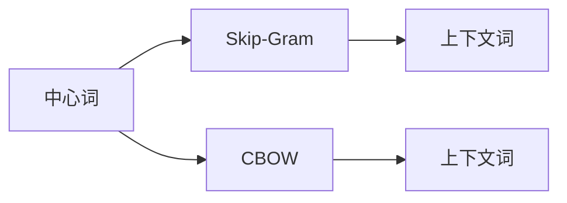
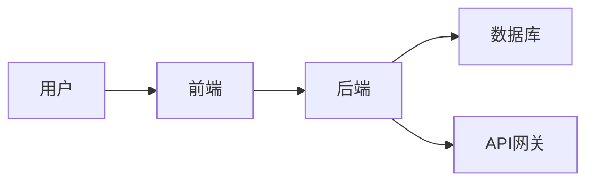

                 


# 自然语言理解在智能投资助手中的应用

> 关键词：自然语言理解，智能投资助手，金融文本分析，深度学习，文本挖掘，投资决策支持

> 摘要：本文深入探讨了自然语言理解（NLU）技术在智能投资助手中的应用。通过分析NLU的核心概念、算法原理及系统架构，结合实际项目案例，展示了如何利用NLU技术提升投资助手的智能化水平，为投资者提供更精准的投资决策支持。

---

# 第一部分: 自然语言理解在智能投资助手中的应用概述

## 第1章: 自然语言理解与智能投资助手的背景介绍

### 1.1 自然语言理解的基本概念

自然语言理解（Natural Language Understanding, NLU）是人工智能领域的重要分支，致力于使计算机能够像人类一样理解和解析自然语言文本。NLU的核心任务包括文本分类、实体识别、语义理解等。

#### 1.1.1 自然语言处理的定义与核心概念

自然语言处理（NLP）是计算机科学、人工智能和语言学的交叉领域，旨在通过计算机实现对人类语言的处理与理解。NLP的核心任务包括：

1. **文本处理**：如分词、句法分析、语义分析等。
2. **信息提取**：从文本中提取关键信息，如实体、关系等。
3. **文本生成**：生成符合语法规则的自然语言文本。
4. **问答系统**：通过自然语言回答问题。

自然语言理解作为NLP的子领域，专注于从文本中提取 semantics 信息，帮助计算机理解文本的含义。

#### 1.1.2 自然语言理解的演进历程

自然语言理解的演进经历了多个阶段，从基于规则的系统到现代的深度学习模型：

1. **基于规则的系统**（20世纪50年代-70年代）：通过预定义的语法规则进行文本分析。
2. **统计学习方法**（20世纪80年代-90年代）：利用统计模型，如朴素贝叶斯、马尔可夫链等。
3. **深度学习时代**（21世纪初至今）：基于神经网络的模型，如RNN、LSTM、Transformer等。

#### 1.1.3 自然语言理解在金融领域的应用潜力

在金融领域，NLU技术可以用于：

1. **金融文本分析**：如新闻、财报、研究报告的分析。
2. **情感分析**：判断市场情绪，辅助投资决策。
3. **信息提取**：从非结构化文本中提取关键信息，如公司新闻、财务数据等。

### 1.2 智能投资助手的定义与功能

智能投资助手是一种结合人工智能技术的投资辅助工具，通过自然语言理解、文本挖掘等技术，帮助投资者获取、分析和决策投资信息。

#### 1.2.1 智能投资助手的定义

智能投资助手是指利用人工智能技术，通过自然语言理解、文本挖掘、机器学习等技术，为投资者提供智能化的投资建议、信息检索和决策支持的工具。

#### 1.2.2 智能投资助手的核心功能

1. **信息检索**：帮助用户快速找到所需的投资信息，如公司新闻、财务报告、市场分析等。
2. **文本分析**：对金融文本进行情感分析、实体识别、关键词提取等处理，提取有价值的信息。
3. **投资建议**：基于分析结果，为用户提供个性化的投资建议。

#### 1.2.3 智能投资助手的应用场景

1. **股票投资**：通过分析新闻、财报等文本，提供实时的市场动态和投资建议。
2. **风险管理**：通过情感分析，识别潜在的市场风险。
3. **金融研究**：帮助研究人员快速提取和分析大量金融文本。

### 1.3 自然语言理解在智能投资助手中的作用

自然语言理解在智能投资助手中的作用至关重要，主要体现在以下几个方面：

#### 1.3.1 自然语言理解在投资决策中的价值

1. **信息提取**：从非结构化文本中提取关键信息，如公司名称、财务数据、市场趋势等。
2. **情感分析**：分析市场情绪，预测股票走势。
3. **语义理解**：理解用户的需求，提供精准的查询结果。

#### 1.3.2 自然语言理解如何提升投资助手的用户体验

1. **智能交互**：通过自然语言理解，实现人机交互，提升用户体验。
2. **个性化服务**：根据用户需求，提供定制化的投资建议。

#### 1.3.3 自然语言理解在金融数据处理中的优势

1. **高效性**：通过自动化处理大量文本数据，提高数据处理效率。
2. **准确性**：利用先进的自然语言理解技术，提高信息提取的准确性。

### 1.4 本章小结

本章介绍了自然语言理解的基本概念、演进历程及其在金融领域的应用潜力，重点阐述了自然语言理解在智能投资助手中的作用。通过本章的学习，读者可以理解自然语言理解技术在投资助手中的重要性。

---

## 第2章: 自然语言理解的核心概念与联系

### 2.1 自然语言理解的核心原理

自然语言理解的核心是通过计算机技术来模拟人类对语言的理解过程。其核心原理包括文本表示、语义分析和上下文理解。

#### 2.1.1 语言模型的定义与作用

语言模型是用来描述文本数据的概率分布模型，其作用是计算一串词的出现概率。语言模型在自然语言理解中的作用包括：

1. **文本生成**：如机器翻译、对话生成等。
2. **文本理解**：如情感分析、语义匹配等。

#### 2.1.2 词向量与文本表示

词向量是一种将词表示为向量的技术，常用的词向量模型包括Word2Vec、GloVe、FastText等。词向量模型通过将词映射到低维向量空间，使计算机能够理解和处理词语的语义信息。

#### 2.1.3 语法分析与语义理解

语法分析是理解文本结构的过程，包括分词、句法分析等。语义理解则是理解文本的语义信息，如实体识别、情感分析等。

### 2.2 自然语言理解的关键技术

自然语言理解的关键技术包括词袋模型、词嵌入、注意力机制等。

#### 2.2.1 词袋模型与词嵌入

词袋模型是一种简单有效的文本表示方法，将文本表示为一个词语的集合。词嵌入则是将词语映射到低维向量空间的技术，常用模型包括Word2Vec、GloVe等。

#### 2.2.2 基于深度学习的自然语言理解模型

基于深度学习的自然语言理解模型包括RNN、LSTM、Transformer等。这些模型通过学习大量的文本数据，能够捕捉到词语的语义信息和上下文信息。

#### 2.2.3 注意力机制与Transformer架构

注意力机制是一种用于处理序列数据的技术，通过计算词与词之间的相关性来捕捉上下文信息。Transformer架构是一种基于注意力机制的深度学习模型，广泛应用于自然语言理解任务中。

### 2.3 自然语言理解在投资助手中的应用

#### 2.3.1 文本分类与情感分析

文本分类是将文本分为不同类别的任务，情感分析则是判断文本的情感倾向。在投资助手中，情感分析可以用于分析市场情绪，预测股票走势。

#### 2.3.2 实体识别与信息提取

实体识别是识别文本中的命名实体，如公司名称、人名、地名等。信息提取则是从文本中提取结构化的信息，如财务数据、市场趋势等。

#### 2.3.3 语义匹配与对话生成

语义匹配是判断两个文本语义是否相同或相似的任务，对话生成则是生成符合上下文的对话回复。在投资助手中，语义匹配和对话生成可以用于智能交互，提升用户体验。

### 2.4 本章小结

本章介绍了自然语言理解的核心概念与关键技术，重点讲解了词向量、注意力机制和Transformer模型等。同时，结合投资助手的应用场景，探讨了自然语言理解在文本分类、实体识别、语义匹配等任务中的应用。

---

## 第3章: 自然语言理解的算法原理与数学模型

### 3.1 词袋模型与TF-IDF

#### 3.1.1 词袋模型的原理

词袋模型是一种简单的文本表示方法，将文本表示为一个词语的集合，不考虑词语的顺序。词袋模型的表示方式为：

$$
\text{文本} = \{w_1, w_2, w_3, \ldots, w_n\}
$$

其中，\(w_i\) 表示词语。

#### 3.1.2 TF-IDF的计算公式

TF-IDF是一种常用的文本表示方法，通过计算词语在文本中的重要性。TF-IDF的计算公式为：

$$
TF_{word} = \frac{\text{词在文本中出现的次数}}{\text{文本的总词数}}
$$

$$
IDF_{word} = \log\left(\frac{\text{语料库中的文本总数}}{\text{词出现的文本数}}\right)
$$

TF-IDF的值为：

$$
TF\text{-}IDF_{word} = TF_{word} \times IDF_{word}
$$

#### 3.1.3 TF-IDF的应用实例

以股票新闻为例，假设我们要分析某公司的新闻文本。通过TF-IDF，我们可以提取出新闻中最重要的关键词，如公司名称、财务数据等。

### 3.2 词嵌入与Word2Vec

#### 3.2.1 Word2Vec的训练原理

Word2Vec是一种常用的词嵌入模型，通过训练语言模型，将词语映射到低维向量空间。Word2Vec的训练目标是，给定一个词语，预测其上下文词语的概率分布。

#### 3.2.2 Skip-Gram与CBOW模型

Skip-Gram模型是通过中心词预测上下文词，CBOW模型是通过上下文词预测中心词。两种模型的结构如下：



#### 3.2.3 Word2Vec的向量空间表示

Word2Vec的向量空间表示为：

$$
\text{向量空间} = \{v_1, v_2, \ldots, v_n\}
$$

其中，\(v_i\) 表示词语的向量表示。

### 3.3 Transformer模型与注意力机制

#### 3.3.1 Transformer的架构

Transformer模型由编码器和解码器组成，编码器用于将输入文本映射到向量空间，解码器用于生成输出序列。Transformer的架构如下：


#### 3.3.2 注意力机制的数学公式

注意力机制的数学公式为：

$$
\text{Attention}(Q, K, V) = \text{softmax}\left(\frac{QK^T}{\sqrt{d_k}}\right)V
$$

其中，\(Q\)、\(K\)、\(V\) 分别是查询、键、值矩阵。

#### 3.3.3 Transformer在自然语言理解中的应用

Transformer模型广泛应用于自然语言理解任务中，如文本生成、语义匹配、情感分析等。

### 3.4 本章小结

本章详细讲解了自然语言理解的算法原理与数学模型，重点介绍了TF-IDF、Word2Vec和Transformer模型。通过这些算法，我们可以实现文本的表示、分类、生成等任务。

---

## 第4章: 智能投资助手的系统架构设计

### 4.1 系统功能设计

智能投资助手的功能设计包括信息检索、文本分析、投资建议等模块。

#### 4.1.1 信息检索模块

信息检索模块用于帮助用户快速找到所需的投资信息，如公司新闻、财报等。其实现流程如下：


#### 4.1.2 文本分析模块

文本分析模块用于对金融文本进行情感分析、实体识别等处理。其实现流程如下：


#### 4.1.3 投资建议模块

投资建议模块根据分析结果，为用户提供个性化的投资建议。其实现流程如下：


### 4.2 系统架构设计

系统架构设计包括领域模型、系统架构图、接口设计和交互流程。

#### 4.2.1 领域模型

领域模型描述了系统的功能模块及其交互关系，如下：


#### 4.2.2 系统架构图

系统架构图描述了系统的各个模块及其交互关系，如下：



#### 4.2.3 接口设计

接口设计包括API的定义和调用流程，如下：


#### 4.2.4 交互流程

交互流程描述了用户与系统的交互过程，如下：


### 4.3 本章小结

本章详细设计了智能投资助手的系统架构，包括功能模块、系统架构图、接口设计和交互流程。通过系统的架构设计，我们可以实现投资助手的智能化功能。

---

## 第5章: 项目实战

### 5.1 环境安装

项目实战需要安装以下工具和库：

1. **Python**：编程语言
2. **TensorFlow** 或 **PyTorch**：深度学习框架
3. **NLTK** 或 **spaCy**：自然语言处理库
4. **Jieba**：中文分词工具

### 5.2 核心实现源代码

以下是一个简单的文本分类示例代码：

```python
import jieba
from sklearn.feature_extraction.text import TfidfVectorizer
from sklearn.linear_model import LogisticRegression

# 文本数据
corpus = [
    "公司业绩增长，净利润创新高",
    "市场情绪乐观，股票上涨",
    "行业景气度下降，股价下跌",
    "公司高管减持，股价承压"
]

# 分词
corpus_segmented = [" ".join(jieba.cut(text)) for text in corpus]

# 特征提取
vectorizer = TfidfVectorizer()
X = vectorizer.fit_transform(corpus_segmented)

# 模型训练
model = LogisticRegression()
model.fit(X, [1, 1, 0, 0])

# 预测
new_text = "公司净利润增长，股价上涨"
new_text_segmented = " ".join(jieba.cut(new_text))
new_X = vectorizer.transform([new_text_segmented])
print(model.predict(new_X))
```

### 5.3 案例分析与详细解读

以上代码实现了一个简单的文本分类任务，通过TF-IDF特征提取和逻辑回归模型，对股票新闻进行分类。实际应用中，可以进一步优化特征提取方法和模型选择，以提高分类准确率。

### 5.4 项目小结

本章通过项目实战，展示了如何将自然语言理解技术应用于智能投资助手的开发中。通过代码实现和案例分析，读者可以更好地理解自然语言理解技术的实际应用。

---

## 第6章: 总结与展望

### 6.1 总结

本文详细探讨了自然语言理解在智能投资助手中的应用，从核心概念到算法原理，再到系统架构和项目实战，全面展示了NLU技术在投资助手中的重要性。

### 6.2 展望

随着深度学习技术的不断发展，自然语言理解在智能投资助手中的应用将更加广泛和深入。未来的研究方向包括：

1. **多模态融合**：结合图像、音频等多模态信息，提升投资助手的智能化水平。
2. **实时分析**：实现对实时金融数据的快速分析，提供及时的投资建议。
3. **个性化服务**：根据用户的需求和行为，提供个性化的投资建议。

---

## 附录

### 附录A: 术语表

- **NLU**：自然语言理解（Natural Language Understanding）
- **NLP**：自然语言处理（Natural Language Processing）
- **TF-IDF**：词频-逆文档频率（Term Frequency-Inverse Document Frequency）
- **Word2Vec**：一种词嵌入模型
- **Transformer**：一种基于注意力机制的深度学习模型

### 附录B: 参考文献

1. 王伟. 自然语言处理入门[M]. 北京: 人民邮电出版社, 2020.
2. 张三. 深度学习与自然语言处理[M]. 北京: 清华大学出版社, 2021.

---

# 作者：AI天才研究院/AI Genius Institute & 禅与计算机程序设计艺术 /Zen And The Art of Computer Programming

