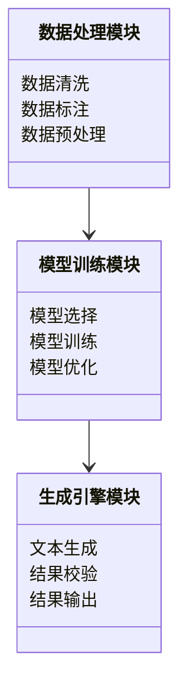
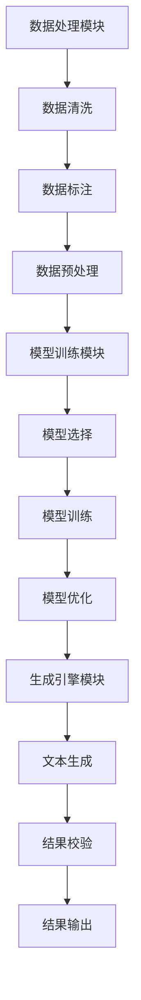
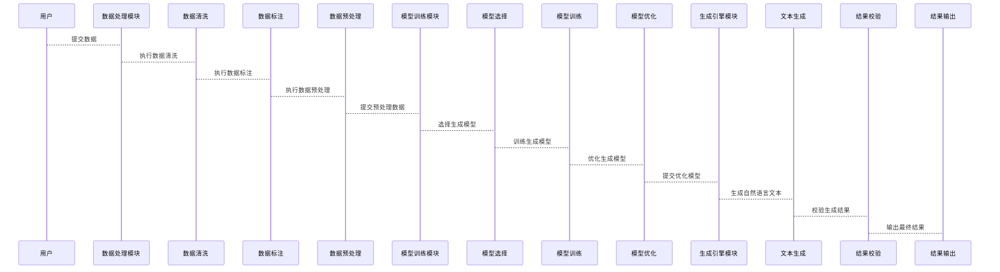

                 


# 自然语言生成技术在金融报告写作中的应用

> 关键词：自然语言生成，金融报告，生成模型，深度学习，金融NLP

> 摘要：本文深入探讨了自然语言生成技术在金融报告写作中的应用，从技术背景到算法原理，再到系统架构和实际案例，全面分析了自然语言生成技术在金融领域的优势和挑战。通过详细讲解生成模型的数学原理和实现方法，本文为读者提供了从理论到实践的完整指南。

---

# 第1章: 自然语言生成技术概述

## 1.1 自然语言生成技术的定义与特点

### 1.1.1 自然语言生成技术的定义
自然语言生成（Natural Language Generation, NLG）是人工智能领域的重要分支，指通过计算机算法自动生成符合人类语言表达习惯的文本。NLG的核心目标是将结构化的数据转化为自然流畅的语言描述，如报告、摘要、对话等。

### 1.1.2 自然语言生成技术的核心特点
1. **数据驱动**：NLG技术依赖大量语料库进行训练，通过学习数据中的语言模式生成文本。
2. **上下文感知**：生成的文本需要考虑上下文信息，确保逻辑连贯。
3. **可定制化**：可以根据具体场景和需求调整生成内容的风格和语气。
4. **动态适应性**：能够根据输入数据的变化实时生成相应的文本。

### 1.1.3 自然语言生成技术与自然语言理解技术的区别
虽然两者都涉及自然语言处理，但NLG与自然语言理解（NLU）有显著区别：
- NLU的重点是理解输入文本的含义，提取语义信息。
- NLG的重点是根据输入数据生成自然语言文本。
- NLU是“从文本到数据”，NLG是“从数据到文本”。

## 1.2 自然语言生成技术的背景与应用

### 1.2.1 自然语言生成技术的发展历程
1. **早期阶段**：基于规则的生成方法，如专家系统。
2. **统计学习阶段**：基于统计模型的生成方法，如n-gram模型。
3. **深度学习阶段**：基于神经网络的生成模型，如RNN、LSTM、Transformer等。

### 1.2.2 自然语言生成技术在金融领域的应用现状
1. **财务报告自动生成**：将财务数据转化为标准化的财务报告。
2. **市场分析与预测**：生成市场分析报告和投资建议。
3. **客户服务**：通过NLG技术生成个性化的客户服务文本。

### 1.2.3 自然语言生成技术在金融报告写作中的潜力与挑战
- **潜力**：提高报告生成效率，降低成本，提供个性化服务。
- **挑战**：数据质量、生成结果的可解释性、金融领域的专业性要求。

## 1.3 自然语言生成技术的核心概念

### 1.3.1 生成模型的基本概念
生成模型的目标是通过给定的输入生成自然语言文本，主要分为两类：
1. **基于规则的生成模型**：通过预定义的语法规则生成文本。
2. **基于数据驱动的生成模型**：通过深度学习模型学习数据中的语言模式。

### 1.3.2 金融报告写作中的自然语言生成需求
金融报告写作需要生成准确、专业、符合行业规范的文本，对生成模型的以下方面提出要求：
1. **专业术语的准确使用**。
2. **逻辑清晰的结构**。
3. **符合金融行业的语言风格**。

### 1.3.3 自然语言生成技术的关键技术点
1. **模型选择**：选择适合金融领域的生成模型，如GPT、BERT等。
2. **数据处理**：对金融数据进行清洗、标注和预处理。
3. **模型训练**：基于金融数据对生成模型进行微调。
4. **结果优化**：通过后处理技术优化生成文本的质量。

## 1.4 本章小结
本章从定义、特点、发展历程、应用现状和核心概念等方面全面介绍了自然语言生成技术。通过对比NLU和NLG，明确了NLG在金融报告写作中的独特价值和挑战。

---

# 第2章: 自然语言生成技术的核心原理

## 2.1 自然语言生成技术的数学模型

### 2.1.1 生成模型的基本框架
生成模型的输入可以是结构化的数据或文本，输出是自然语言文本。典型的生成模型包括：
1. **循环神经网络（RNN）**：通过循环结构处理序列数据。
2. **Transformer模型**：基于自注意力机制处理序列数据。

### 2.1.2 概率生成模型的数学公式
生成模型的目标是最大化生成概率$P(y|x)$，其中$x$是输入，$y$是生成的文本。常用损失函数为交叉熵损失：
$$
\text{Loss} = -\sum_{i=1}^{n} \log P(y_i|x)
$$

### 2.1.3 基于Transformer的生成模型原理
Transformer模型通过自注意力机制捕捉输入中的长距离依赖关系，生成过程如下：
1. **编码器**：将输入数据编码为固定长度的向量。
2. **解码器**：逐步生成输出序列，每一步都依赖于之前的生成结果。

## 2.2 自然语言生成技术的算法实现

### 2.2.1 基于RNN的生成模型
RNN模型通过循环结构处理序列数据，生成过程如下：
1. **输入阶段**：将输入数据转换为词向量。
2. **循环阶段**：通过RNN层生成每个词的条件概率。
3. **输出阶段**：根据条件概率生成最终的文本。

### 2.2.2 基于Transformer的生成模型
Transformer模型通过自注意力机制生成文本，具体步骤如下：
1. **输入处理**：将输入数据转换为词向量。
2. **自注意力计算**：计算输入序列中每个词与其他词的注意力权重。
3. **前馈网络**：通过多层前馈网络生成最终的词向量。
4. **解码器**：逐步生成输出序列，每一步都依赖于之前的生成结果。

### 2.2.3 增量式生成与解码过程
生成模型通常采用增量式生成方式，每一步生成一个词，具体过程如下：
1. **初始化**：设置初始状态和隐藏层向量。
2. **循环生成**：根据当前状态生成下一个词的条件概率。
3. **更新状态**：根据生成的词更新状态和隐藏层向量。

## 2.3 自然语言生成技术的优化方法

### 2.3.1 模型训练中的损失函数
生成模型的损失函数通常采用交叉熵损失：
$$
\text{Loss} = -\sum_{i=1}^{n} \log P(y_i|x)
$$
其中，$P(y_i|x)$是生成模型对第$i$个词的概率预测。

### 2.3.2 基于梯度的优化算法
常用的优化算法包括随机梯度下降（SGD）、Adam优化器等。Adam优化器的更新公式为：
$$
\theta_{t+1} = \theta_t - \eta \frac{\rho_1 g_t + (1-\rho_1)g_t^2}{\sqrt{s_t + \epsilon}}
$$
其中，$\theta$是模型参数，$\eta$是学习率，$\rho_1$和$\rho_2$是动量参数，$g_t$是梯度，$s_t$是二阶动量，$\epsilon$是防止除零的小量。

### 2.3.3 超参数调优与模型评估
模型调优的关键参数包括学习率、批量大小、训练轮数等。模型评估通常采用困惑度（Perplexity）和生成文本的质量指标，如BLEU、ROUGE等。

## 2.4 本章小结
本章详细讲解了自然语言生成技术的核心原理，包括生成模型的数学框架、算法实现和优化方法。通过对比RNN和Transformer模型，明确了不同模型的优缺点和适用场景。

---

# 第3章: 自然语言生成技术在金融报告中的应用

## 3.1 金融报告写作的自然语言生成需求

### 3.1.1 金融报告的基本结构与内容
金融报告通常包括以下几个部分：
1. **引言**：介绍报告的目的和背景。
2. **数据分析**：包括财务数据、市场数据等。
3. **分析与结论**：对数据进行分析并得出结论。
4. **建议**：提出具体的建议和行动计划。

### 3.1.2 金融报告写作中的语言特点
1. **专业性**：使用专业术语和行业规范。
2. **逻辑性**：报告内容需要逻辑清晰，结构严谨。
3. **客观性**：报告内容需要基于事实，避免主观臆断。

### 3.1.3 自然语言生成技术在金融报告写作中的具体需求
1. **数据驱动**：能够处理结构化的金融数据。
2. **语言准确性**：生成文本需要准确无误。
3. **风格一致性**：保持报告的语言风格一致。

## 3.2 自然语言生成技术在金融报告中的实现方案

### 3.2.1 基于预训练模型的微调方法
1. **预训练模型选择**：选择适合金融领域的预训练模型，如GPT-3。
2. **数据收集与标注**：收集金融领域的语料库，并进行标注。
3. **微调训练**：基于标注数据对预训练模型进行微调。

### 3.2.2 金融领域特定数据的处理与训练
1. **数据清洗**：去除噪声数据，确保数据质量。
2. **数据标注**：对数据进行标注，提取关键信息。
3. **模型训练**：基于标注数据训练生成模型。

### 3.2.3 生成结果的校验与优化
1. **校验方法**：通过人工校验和自动校验确保生成文本的准确性。
2. **优化方法**：通过调整模型参数和优化生成策略提高生成质量。

## 3.3 自然语言生成技术在金融报告中的实际案例

### 3.3.1 财务分析报告的自动生成
1. **案例背景**：某公司财务数据的自动生成报告。
2. **实现过程**：
   - 数据清洗与标注。
   - 基于预训练模型的微调训练。
   - 自动生成财务分析报告。
3. **结果展示**：生成的财务分析报告示例。

### 3.3.2 市场分析报告的生成
1. **案例背景**：某行业市场分析报告的自动生成。
2. **实现过程**：
   - 数据收集与预处理。
   - 模型训练与优化。
   - 自动生成市场分析报告。
3. **结果展示**：生成的市场分析报告示例。

## 3.4 本章小结
本章通过实际案例展示了自然语言生成技术在金融报告中的应用，重点讲解了财务分析报告和市场分析报告的自动生成过程。

---

# 第4章: 金融报告写作中的自然语言生成系统架构

## 4.1 问题场景介绍
金融报告写作需要处理结构化的金融数据，生成符合行业规范的自然语言文本。

## 4.2 系统功能设计
系统功能模块包括：
1. **数据处理模块**：负责数据的清洗、标注和预处理。
2. **模型训练模块**：负责生成模型的训练和优化。
3. **生成引擎模块**：负责根据输入数据生成自然语言文本。

### 4.2.1 系统功能设计的领域模型


### 4.2.2 系统功能设计的ER实体关系图


### 4.2.3 系统架构设计的mermaid架构图


### 4.2.4 系统交互的mermaid序列图


## 4.3 本章小结
本章通过系统架构设计展示了自然语言生成技术在金融报告写作中的具体实现，重点讲解了系统功能设计、架构设计和系统交互过程。

---

# 第5章: 金融报告写作中的自然语言生成技术实战

## 5.1 环境安装与配置
1. **安装Python环境**：使用Anaconda或虚拟环境。
2. **安装深度学习框架**：如TensorFlow、PyTorch。
3. **安装NLP库**：如Keras、NLTK、spaCy。

## 5.2 系统核心实现源代码
以下是基于Transformer模型的生成代码示例：

```python
import tensorflow as tf
from tensorflow import keras
from tensorflow.keras.layers import Input, Dense, Dropout, Layer
from tensorflow.keras import Model

class MultiHeadSelfAttention(Layer):
    def __init__(self, d_model, num_heads):
        super(MultiHeadSelfAttention, self).__init__()
        self.num_heads = num_heads
        self.d_model = d_model
        self.depth = d_model // num_heads
        self.wq = Dense(num_heads * depth, activation='linear')
        self.wk = Dense(num_heads * depth, activation='linear')
        self.wv = Dense(num_heads * depth, activation='linear')
        self.dense = Dense(d_model, activation='linear')

    def call(self, inputs):
        # 前向传播实现
        q = self.wq(inputs)
        k = self.wk(inputs)
        v = self.wv(inputs)
        # reshape
        q = q.reshape((-1, self.num_heads, self.depth))
        k = k.reshape((-1, self.num_heads, self.depth))
        v = v.reshape((-1, self.num_heads, self.depth))
        # 计算注意力权重
        attention_output = multi_head_attention(q, k, v)
        # 最后一层dense
        output = self.dense(attention_output)
        return output

def multi_head_attention(q, k, v):
    # 实现多头注意力机制
    pass

def create_model(max_length, d_model, num_heads):
    inputs = Input(shape=(max_length,))
    x = Embedding(input_dim=vocabulary_size, output_dim=d_model)(inputs)
    x = MultiHeadSelfAttention(d_model, num_heads)(x)
    x = Dropout(0.1)(x)
    outputs = Dense(vocabulary_size, activation='softmax')(x)
    model = Model(inputs=inputs, outputs=outputs)
    return model
```

## 5.3 代码应用解读与分析
1. **模型定义**：基于Transformer架构的生成模型。
2. **多头自注意力机制**：通过并行处理多个注意力头，提高模型的表达能力。
3. **前向传播过程**：从输入到输出的完整生成过程。
4. **训练与推理**：模型的训练和生成阶段的具体实现。

## 5.4 项目小结
本章通过具体代码实现展示了自然语言生成技术在金融报告写作中的实战应用，重点讲解了模型的实现细节和代码结构。

---

# 第6章: 总结与展望

## 6.1 本章总结
自然语言生成技术在金融报告写作中具有重要的应用价值，能够显著提高报告生成效率，降低人工成本。通过深度学习模型的学习能力，生成的文本不仅准确，还符合行业规范和语言风格。

## 6.2 技术优势
1. **高效性**：自动化生成报告，节省时间和人力资源。
2. **准确性**：基于大量数据训练，生成内容准确可靠。
3. **可定制性**：可以根据具体需求调整生成内容的风格和语气。

## 6.3 潜在挑战
1. **数据质量问题**：生成模型依赖高质量的数据，数据不足或噪声大可能影响生成效果。
2. **生成结果的可解释性**：生成模型的决策过程难以解释，可能影响用户信任。
3. **金融领域的专业性**：需要模型具备深厚的金融知识，才能生成专业化的报告。

## 6.4 未来展望
随着深度学习技术的不断发展，自然语言生成技术在金融报告写作中的应用将更加广泛和深入。未来的研究方向包括：
1. **更复杂的生成模型**：如更大参数量的模型和更先进的生成架构。
2. **多模态生成**：结合图像、语音等多种模态信息，生成更丰富的文本内容。
3. **可解释性增强**：提高生成模型的可解释性，增强用户信任。

## 6.5 最佳实践 Tips
1. **数据质量**：确保训练数据的高质量和代表性。
2. **模型调优**：通过实验调整模型参数，优化生成效果。
3. **用户反馈**：引入用户反馈机制，不断优化生成内容。

## 6.6 本章小结
本章总结了自然语言生成技术在金融报告写作中的优势和挑战，展望了未来的发展方向，并提出了最佳实践建议。

---

# 作者：AI天才研究院/AI Genius Institute & 禅与计算机程序设计艺术 /Zen And The Art of Computer Programming

