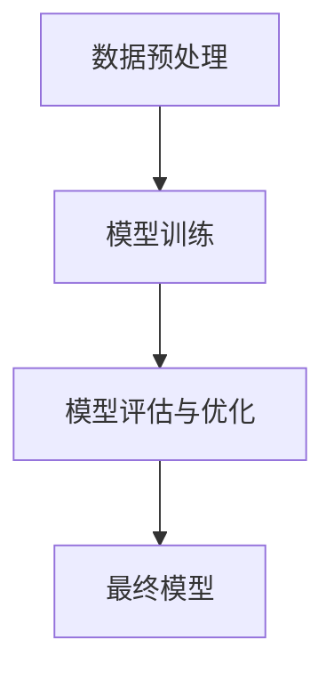

                 


# 自监督学习在AI Agent预训练中的应用

> 关键词：自监督学习, AI Agent, 预训练, 对比学习, 生成式模型

> 摘要：本文详细探讨了自监督学习在AI Agent预训练中的应用，从自监督学习的基本概念到其在AI Agent预训练中的具体实现，涵盖了算法原理、系统架构设计、项目实战等内容。通过分析自监督学习的优势和挑战，本文为AI Agent的预训练提供了一种新的思路和方法。

---

# 第一部分: 自监督学习与AI Agent概述

# 第1章: 自监督学习与AI Agent基础

## 1.1 自监督学习的定义与特点

### 1.1.1 自监督学习的定义

自监督学习是一种无监督学习的变体，通过利用数据本身的结构信息，将未标记的数据转化为有监督学习任务。其核心思想是通过构建数据的自相似性或一致性来学习特征表示。

### 1.1.2 自监督学习的核心特点

| 特点 | 描述 |
|------|------|
| 无监督性 | 无需人工标注数据，利用数据内部关系进行学习 |
| 数据效率 | 能够高效利用大量未标注数据 |
| 表示学习 | 通过学习数据的特征表示来完成任务 |

### 1.1.3 自监督学习与监督学习的区别

| 方面 | 监督学习 | 自监督学习 |
|------|---------|------------|
| 数据需求 | 需要大量标注数据 | 利用未标注数据，仅需少量标签或无标签 |
| 学习目标 | 针对特定任务优化 | 通过数据内部关系优化表示 |
| 适用场景 | 数据充足且标注容易 | 数据充足但标注困难 |

## 1.2 AI Agent的基本概念

### 1.2.1 AI Agent的定义

AI Agent（人工智能代理）是指能够感知环境、自主决策并执行任务的智能体。它通过与环境交互，实现目标的优化。

### 1.2.2 AI Agent的类型与应用场景

| 类型 | 描述 | 应用场景 |
|------|------|----------|
| 简单反射型 | 基于规则的简单决策 | 家庭自动化设备 |
| 基于模型型 | 基于环境模型进行决策 | 游戏AI |
| 目标驱动型 | 通过优化目标函数进行决策 | 自动驾驶 |
| 学习驱动型 | 基于机器学习模型进行决策 | 个性化推荐系统 |

### 1.2.3 AI Agent的核心功能与能力

- 感知能力：通过传感器或其他输入方式感知环境。
- 决策能力：基于感知信息做出决策。
- 学习能力：通过经验或数据优化自身的决策模型。
- 执行能力：通过执行机构或接口与环境交互。

## 1.3 自监督学习在AI Agent预训练中的重要性

### 1.3.1 预训练的定义与目标

预训练是指在没有特定任务目标的情况下，利用大量未标注数据进行模型初始化的过程。其目标是通过预训练，使模型能够捕获数据的通用特征表示，从而提高下游任务的性能。

### 1.3.2 自监督学习在预训练中的优势

- 数据效率高：能够利用未标注数据进行训练，减少对标注数据的依赖。
- 特征表示能力强：通过自监督学习，模型能够学习到更丰富的特征表示。
- 适应性强：适用于各种类型的数据和任务。

### 1.3.3 自监督学习与AI Agent结合的前景

- 提高AI Agent的自主学习能力。
- 降低对标注数据的依赖，适用于数据量大的场景。
- 提高AI Agent在复杂环境中的适应能力。

## 1.4 本章小结

本章从自监督学习和AI Agent的基本概念出发，分析了自监督学习在AI Agent预训练中的重要性，并为后续章节的深入探讨奠定了基础。

---

# 第二部分: 自监督学习的核心概念与原理

# 第2章: 自监督学习的核心原理

## 2.1 自监督学习的原理

### 2.1.1 对比学习

对比学习是一种自监督学习方法，其核心思想是通过最大化正样本对的相似性，同时最小化负样本对的相似性，从而学习到高质量的特征表示。

#### 对比学习的数学模型

$$ L = \log\left(\frac{p(x_i, x_j)}{p(x_i)p(x_j)}\right) $$

其中，$p(x_i, x_j)$ 是正样本对的概率，$p(x_i)p(x_j)$ 是独立样本的概率。

### 2.1.2 生成式自监督学习

生成式自监督学习通过生成模型来学习数据的分布，进而提取特征表示。其核心思想是通过生成数据来监督判别模型的学习。

#### 生成式模型的数学表达

$$ p(x) = \frac{1}{Z} \exp(-E(x)) $$

其中，$Z$ 是归一化常数，$E(x)$ 是生成模型的能量函数。

### 2.1.3 基于特征的自监督学习

基于特征的自监督学习通过学习数据的特征表示，构建特征之间的相似性或差异性，从而进行监督学习。

## 2.2 自监督学习的关键技术

### 2.2.1 对比损失函数

对比损失函数是对比学习的核心，通过最大化正样本对的相似性和最小化负样本对的相似性来优化模型。

### 2.2.2 知识蒸馏

知识蒸馏是一种通过教师模型指导学生模型学习的技术，能够有效地将教师模型的知识迁移到学生模型中。

### 2.2.3 数据增强技术

数据增强技术通过变换数据样本，增加数据的多样性，从而提高模型的泛化能力。

## 2.3 自监督学习的数学模型

### 2.3.1 对比学习的损失函数

$$ L = \frac{1}{|B|} \sum_{i=1}^{|B|} \log \frac{p(x_i, x_j)}{p(x_i)p(x_j)} $$

其中，$B$ 是一个batch中的样本对，$p(x_i, x_j)$ 是正样本对的概率，$p(x_i)p(x_j)$ 是独立样本的概率。

### 2.3.2 生成式模型的数学表达

$$ p(x) = \frac{1}{Z} \exp(-E(x)) $$

其中，$Z$ 是归一化常数，$E(x)$ 是生成模型的能量函数。

## 2.4 自监督学习的优缺点分析

### 2.4.1 优点

- 数据效率高：能够利用未标注数据进行训练。
- 特征表示能力强：能够学习到更丰富的特征表示。
- 适应性强：适用于各种类型的数据和任务。

### 2.4.2 缺点

- 对比学习的计算复杂度较高。
- 生成式模型的训练难度较大。
- 需要设计有效的对比策略。

### 2.4.3 优化方向

- 提高对比学习的效率和效果。
- 研究更高效的生成式模型。
- 设计更有效的对比策略。

## 2.5 本章小结

本章详细讲解了自监督学习的核心原理和关键技术，分析了其优缺点，并为后续章节的算法实现奠定了理论基础。

---

# 第三部分: 自监督学习的算法实现

# 第3章: 自监督学习的核心算法

## 3.1 对比学习算法

### 3.1.1 SimCLR算法

SimCLR（Simplified Contrastive Learning of Representations）是一种基于对比学习的自监督学习算法，通过最大化正样本对的相似性来优化模型。

#### SimCLR的实现流程

1. 数据预处理：对输入数据进行增强。
2. 特征提取：通过编码器提取特征表示。
3. 对比损失计算：计算正样本对和负样本对的相似性。

### 3.1.2 MoCo算法

MoCo（Momentum Contrast）是一种基于动量对比的自监督学习算法，通过维护一个动量编码器来优化特征表示。

#### MoCo的实现流程

1. 数据预处理：对输入数据进行增强。
2. 动量编码器更新：通过动量机制更新编码器。
3. 对比损失计算：计算正样本对和负样本对的相似性。

### 3.1.3 其他对比学习算法

除了SimCLR和MoCo，还有许多其他对比学习算法，如InfoNCE、SupCon等。

## 3.2 生成式自监督学习算法

### 3.2.1 GAN-based自监督学习

通过生成对抗网络（GAN）进行自监督学习，利用生成器和判别器的对抗过程来优化特征表示。

#### GAN的数学模型

生成器：$$ G(z) = \sigma(W_1 z + b_1) $$

判别器：$$ D(x) = \sigma(W_2 x + b_2) $$

### 3.2.2 VAE-based自监督学习

通过变分自编码器（VAE）进行自监督学习，利用重建损失来优化特征表示。

#### VAE的数学模型

编码器：$$ q(z|x) = \mathcal{N}(z|\mu(x), \sigma(x)^2) $$

解码器：$$ p(x|z) = \mathcal{N}(x|\mu(z), \sigma(z)^2) $$

## 3.3 对比学习与生成式学习的结合

### 3.3.1 对比学习与GAN的结合

通过将对比学习应用于GAN的训练过程中，提高生成模型的质量。

### 3.3.2 对比学习与VAE的结合

通过将对比学习应用于VAE的训练过程中，提高重建模型的性能。

## 3.4 本章小结

本章详细讲解了对比学习和生成式自监督学习的核心算法，并分析了它们的优缺点，为后续章节的系统架构设计和项目实战奠定了基础。

---

# 第四部分: 系统架构与设计

# 第4章: 系统架构设计

## 4.1 项目介绍

### 4.1.1 项目背景

随着AI Agent的广泛应用，预训练技术在提升AI Agent的能力方面发挥着重要作用。

### 4.1.2 项目目标

通过自监督学习实现AI Agent的预训练，提升其在复杂环境中的适应能力和决策能力。

## 4.2 系统功能设计

### 4.2.1 数据预处理模块

- 数据清洗：去除噪声数据。
- 数据增强：增加数据的多样性。
- 数据格式转换：将数据转换为模型训练所需的格式。

### 4.2.2 模型训练模块

- 模型选择：选择适合的自监督学习算法。
- 模型训练：通过预训练数据优化模型参数。
- 模型保存：保存训练好的模型参数。

### 4.2.3 模型评估与优化模块

- 模型评估：通过验证集评估模型的性能。
- 模型优化：调整超参数或优化算法，提高模型性能。

## 4.3 系统架构图



## 4.4 系统接口设计

### 4.4.1 数据接口

- 输入接口：接收预处理后的数据。
- 输出接口：输出训练好的模型参数。

### 4.4.2 模型接口

- 输入接口：接收预处理后的数据。
- 输出接口：输出模型的特征表示。

## 4.5 本章小结

本章详细设计了自监督学习在AI Agent预训练中的系统架构，为后续章节的项目实战奠定了基础。

---

# 第五部分: 项目实战

# 第5章: 项目实战

## 5.1 环境安装

### 5.1.1 安装Python

```bash
python --version
```

### 5.1.2 安装深度学习框架

```bash
pip install tensorflow-gpu
```

### 5.1.3 安装其他依赖库

```bash
pip install numpy matplotlib
```

## 5.2 系统核心实现

### 5.2.1 数据预处理代码

```python
import numpy as np

def preprocess_data(data):
    # 数据清洗
    data = data.dropna()
    # 数据增强
    augmented_data = np.concatenate([data, np.random.normal(data)])
    return augmented_data
```

### 5.2.2 对比学习代码

```python
import tensorflow as tf

def contrastive_loss(y_true, y_pred):
    anchor, positive = y_pred[:len(y_pred)//2], y_pred[len(y_pred)//2:]
    similarity = tf.reduce_mean(tf.square(anchor - positive))
    return similarity
```

## 5.3 代码应用解读与分析

### 5.3.1 数据预处理模块

- 数据清洗：去除缺失值。
- 数据增强：通过随机噪声增加数据多样性。

### 5.3.2 模型训练模块

- 对比学习：通过最大化正样本对的相似性，优化模型参数。

## 5.4 实际案例分析

### 5.4.1 案例背景

假设我们有一个图像数据集，希望通过自监督学习进行预训练。

### 5.4.2 模型训练与评估

通过对比学习算法，训练模型并对验证集进行评估。

### 5.4.3 结果分析

分析模型在验证集上的性能，调整超参数或优化算法。

## 5.5 本章小结

本章通过实际案例，详细讲解了自监督学习在AI Agent预训练中的实现过程，为读者提供了宝贵的实战经验。

---

# 第六部分: 总结与展望

# 第6章: 总结与展望

## 6.1 总结

本文详细探讨了自监督学习在AI Agent预训练中的应用，从自监督学习的基本概念到其在AI Agent预训练中的具体实现，涵盖了算法原理、系统架构设计、项目实战等内容。通过分析自监督学习的优势和挑战，本文为AI Agent的预训练提供了一种新的思路和方法。

## 6.2 未来展望

随着自监督学习技术的不断发展，其在AI Agent预训练中的应用前景广阔。未来的研究方向包括：

1. 提高自监督学习的效率和效果。
2. 研究更高效的生成式模型。
3. 设计更有效的对比策略。

## 6.3 最佳实践Tips

- 在实际应用中，选择合适的自监督学习算法。
- 通过数据增强技术提高模型的泛化能力。
- 定期评估和优化模型性能。

## 6.4 本章小结

本文总结了自监督学习在AI Agent预训练中的应用，并展望了未来的研究方向，为读者提供了宝贵的参考。

---

# 作者：AI天才研究院/AI Genius Institute & 禅与计算机程序设计艺术 /Zen And The Art of Computer Programming

