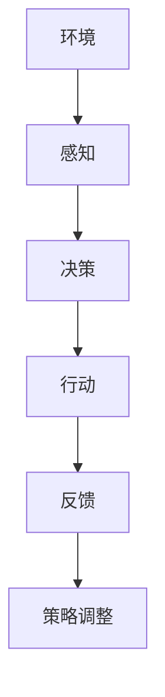
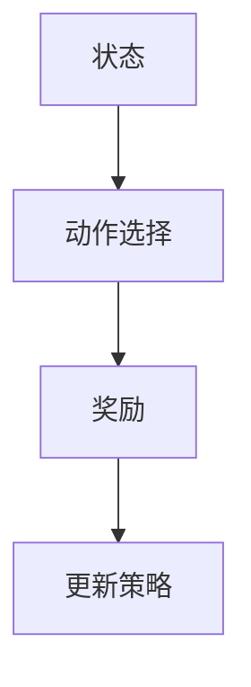
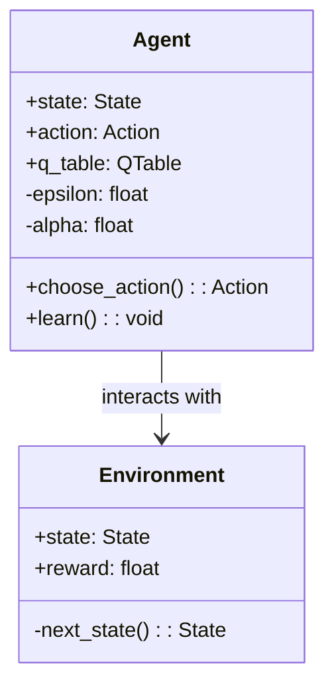

                 


# 设计AI Agent的自适应探索策略

## 关键词
- AI Agent
- 自适应探索策略
- 强化学习
- 算法设计
- 系统架构
- 项目实战

## 摘要
本文深入探讨AI Agent的自适应探索策略设计，涵盖背景、核心概念、算法原理、系统架构、项目实战及最佳实践，帮助读者全面掌握设计方法。

---

## 1. 引言

### 1.1 AI Agent的基本概念

#### 1.1.1 AI Agent的定义与类型
AI Agent（人工智能代理）是能够感知环境并采取行动以实现目标的智能体。AI Agent分为简单反射型、基于模型的反射型、目标驱动型和效用驱动型。

#### 1.1.2 自适应探索策略的背景与意义
自适应探索策略是AI Agent在动态环境中调整行为以适应变化的能力，是实现智能决策的关键。动态环境中的不确定性、复杂性和多变性要求AI Agent具备自适应能力。

#### 1.1.3 问题背景与应用场景
AI Agent在实时策略游戏、自动驾驶、机器人控制等领域面临动态环境，需自适应调整策略以应对挑战。通过优化探索策略，AI Agent能有效应对未知环境。

---

## 2. 自适应探索策略的核心概念

### 2.1 自适应探索策略的核心要素

| 核心要素 | 描述 | 示例 |
|----------|------|------|
| 环境感知 | 感知环境状态 | 游戏中感知对手动作 |
| 动态调整 | 根据反馈调整策略 | 根据游戏结果调整策略 |

### 2.2 自适应探索策略的原理



---

## 3. 算法原理讲解

### 3.1 强化学习



```python
class QLearning:
    def __init__(self, actions, epsilon=0.1, alpha=0.1):
        self.actions = actions
        self.epsilon = epsilon
        self.alpha = alpha
        self.q_table = {}

    def get_q_value(self, state, action):
        return self.q_table.get((state, action), 0)

    def choose_action(self, state):
        if random.random() < self.epsilon:
            return random.choice(self.actions)
        max_q = max([self.get_q_value(state, a) for a in self.actions])
        actions_with_max_q = [a for a in self.actions if self.get_q_value(state, a) == max_q]
        return random.choice(actions_with_max_q)

    def learn(self, state, action, reward, next_state):
        q = self.get_q_value(state, action)
        max_next_q = max([self.get_q_value(next_state, a) for a in self.actions])
        new_q = q + self.alpha * (reward + max_next_q - q)
        self.q_table[(state, action)] = new_q
```

---

## 4. 系统架构设计方案

### 4.1 问题场景介绍



---

## 5. 项目实战与分析

### 5.1 项目实战

```python
import random

class QLearningAgent:
    def __init__(self, actions, epsilon=0.1, alpha=0.1):
        self.actions = actions
        self.epsilon = epsilon
        self.alpha = alpha
        self.q_table = {}

    def get_q_value(self, state, action):
        return self.q_table.get((state, action), 0)

    def choose_action(self, state):
        if random.random() < self.epsilon:
            return random.choice(self.actions)
        max_q = max([self.get_q_value(state, a) for a in self.actions])
        actions_with_max_q = [a for a in self.actions if self.get_q_value(state, a) == max_q]
        return random.choice(actions_with_max_q)

    def learn(self, state, action, reward, next_state):
        q = self.get_q_value(state, action)
        max_next_q = max([self.get_q_value(next_state, a) for a in self.actions])
        new_q = q + self.alpha * (reward + max_next_q - q)
        self.q_table[(state, action)] = new_q
```

---

## 6. 最佳实践与总结

### 6.1 最佳实践
1. **环境感知**：精准感知环境，确保反馈准确。
2. **策略调整**：动态调整策略，保持适应性。
3. **算法优化**：选择合适算法，优化性能。

### 6.2 小结
AI Agent的自适应探索策略是实现智能决策的核心，通过强化学习、系统架构设计等方法，可有效提升AI Agent在动态环境中的表现。

### 6.3 注意事项
- 确保数据质量
- 避免过拟合
- 定期测试与优化

### 6.4 拓展阅读
- 强化学习经典书籍
- 最新研究论文

---

## 作者

作者：AI天才研究院 & 禅与计算机程序设计艺术

