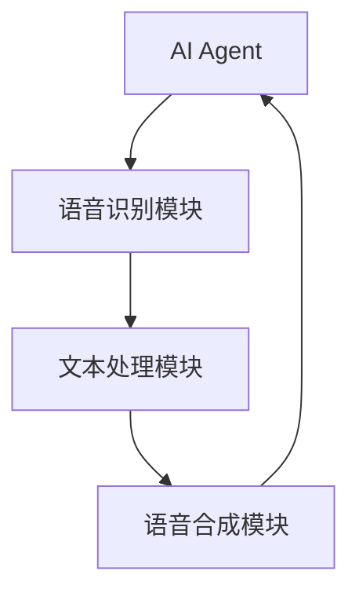

                 

# 语音识别与合成：为AI Agent添加语音交互能力

> 关键词：语音识别，语音合成，AI Agent，语音交互，机器学习，深度学习

> 摘要：本文深入探讨了为AI Agent添加语音交互能力所需的语音识别与合成技术。通过分析语音识别和合成的核心概念、算法原理、系统设计以及项目实战，详细讲解了如何利用这些技术实现高效的语音交互功能。文章内容涵盖了从基础理论到实际应用的全链条，帮助读者系统地掌握语音交互的核心技术。

---

## 第1章: 语音识别与合成概述

### 1.1 语音识别的基本概念

#### 1.1.1 语音识别的定义
语音识别是将人类的语音信号转换为文本或命令的过程，属于模式识别的范畴。它是自然语言处理（NLP）的重要组成部分，广泛应用于智能音箱、语音助手（如Siri、Alexa）等领域。

#### 1.1.2 语音识别的核心技术
语音识别的核心技术包括声音信号处理、特征提取、声学模型、语言模型和解码器。声学模型负责将语音信号映射到潜在的表征空间，语言模型则用于处理上下文信息，解码器则是将声学特征解码为具体的文本或命令。

#### 1.1.3 语音识别的应用场景
语音识别的应用场景包括语音助手、智能客服、语音搜索、语音控制等。这些场景中，语音识别技术能够将用户的语音指令转换为可执行的代码或文本信息，从而实现人机交互。

### 1.2 语音合成的基本概念

#### 1.2.1 语音合成的定义
语音合成是将文本信息转换为人类可听的语音信号的过程，属于语音处理技术的一种。它是语音交互的重要组成部分，使得AI Agent能够“说话”。

#### 1.2.2 语音合成的核心技术
语音合成的核心技术包括特征提取、声学模型和生成器。特征提取用于将文本信息转化为语音信号的特征，声学模型则负责生成语音波形，生成器则是将这些特征转化为实际的语音信号。

#### 1.2.3 语音合成的应用场景
语音合成的应用场景包括语音助手、智能音箱、虚拟客服、有声读物生成等。这些场景中，语音合成技术能够让AI Agent以自然的方式与用户进行交流。

### 1.3 语音交互的背景与意义

#### 1.3.1 语音交互的发展历程
语音交互的发展可以追溯到20世纪50年代，经历了从简单的语音命令识别到复杂的自然语言处理的演变。随着深度学习技术的兴起，语音交互的准确性和自然度得到了显著提升。

#### 1.3.2 语音交互在AI Agent中的作用
在AI Agent中，语音交互是实现人机交互的重要方式之一。它能够让用户以更自然、更便捷的方式与AI Agent进行互动，提升用户体验。

#### 1.3.3 语音交互的挑战与未来趋势
语音交互的主要挑战包括语音信号的噪声干扰、多语种支持、复杂场景下的准确识别等。未来，随着人工智能和深度学习技术的进一步发展，语音交互的准确性和智能化水平将不断提升。

---

## 第2章: 语音识别的核心概念与原理

### 2.1 语音识别的基本原理

#### 2.1.1 声音信号的特征提取
声音信号的特征提取是语音识别的关键步骤之一。常用的特征包括梅尔频率倒谱系数（MFCC）、线性预测编码（LPC）等。这些特征能够有效地捕捉语音信号中的音调、音色和节奏信息。

#### 2.1.2 声学模型的构建
声学模型负责将语音信号的特征映射到潜在的表征空间。常用的声学模型包括隐马尔可夫模型（HMM）和深度神经网络（DNN）。HMM适用于小规模数据，而DNN则更适合大规模数据。

#### 2.1.3 语言模型的应用
语言模型用于处理上下文信息，消除语音识别中的歧义。常用的语言模型包括n-gram模型和基于神经网络的语言模型。语言模型的引入能够显著提高语音识别的准确率。

#### 2.1.4 解码器的作用
解码器的作用是将声学特征解码为具体的文本或命令。解码器通常基于动态规划算法，结合声学模型和语言模型的结果，输出最可能的识别结果。

### 2.2 常见语音识别算法

#### 2.2.1 随机森林在语音识别中的应用
随机森林是一种基于决策树的集成学习算法，常用于特征选择和分类任务。在语音识别中，随机森林可以用于分类任务，如音素识别和词识别。

#### 2.2.2 基于DNN的语音识别算法
基于深度神经网络的语音识别算法是当前的研究热点。DNN能够自动提取语音信号的特征，具有较高的准确率和鲁棒性。常用的DNN模型包括卷积神经网络（CNN）和循环神经网络（RNN）。

#### 2.2.3 基于HMM的语音识别算法
隐马尔可夫模型是一种经典的统计模型，广泛应用于语音识别领域。HMM通过状态转移和观测概率的建模，能够有效地捕捉语音信号的时序特征。

---

## 第3章: 语音合成的核心概念与原理

### 3.1 语音合成的基本原理

#### 3.1.1 声音信号的特征提取
语音合成的过程通常始于特征提取。特征提取的目的是将文本信息转化为语音信号的特征，如基频、振幅、音调等。这些特征能够有效地捕捉语音信号的音色和节奏信息。

#### 3.1.2 声学模型的构建
声学模型负责将文本特征映射到语音信号的特征空间。常用的声学模型包括深度神经网络（DNN）和生成对抗网络（GAN）。DNN能够自动提取特征，而GAN则通过对抗训练生成逼真的语音信号。

#### 3.1.3 语音生成器的作用
语音生成器是语音合成的核心模块，负责将声学模型生成的特征转化为实际的语音信号。生成器通常基于波形生成网络（WaveNet）或长短时记忆网络（LSTM）。

#### 3.1.4 解码器的应用
解码器的作用是将生成的语音信号解码为可听的语音。解码器通常基于自适应波形合成算法，能够将生成的特征转化为高质量的语音信号。

### 3.2 常见语音合成算法

#### 3.2.1 基于单元的语音合成
基于单元的语音合成是一种传统的语音合成方法，通过将预先录制的语音单元（如音素、音节）拼接生成目标语音。这种方法的缺点是生成的语音缺乏自然度。

#### 3.2.2 基于统计的语音合成
基于统计的语音合成方法通过统计建模生成语音信号。这种方法能够捕捉语音信号的统计特性，生成较为自然的语音。

#### 3.2.3 基于端到端的语音合成
基于端到端的语音合成方法通过深度学习模型直接将文本映射为语音信号。这种方法能够生成高质量的语音，具有较高的准确率和自然度。

---

## 第4章: 语音识别的算法原理与实现

### 4.1 语音识别算法原理

#### 4.1.1 声音信号的预处理
声音信号的预处理包括降噪、增益调整和分帧处理。这些步骤能够提高语音识别的准确率和鲁棒性。

#### 4.1.2 特征提取与模型训练
特征提取是将语音信号转化为特征向量的过程，如MFCC和LPC。模型训练则是基于特征向量进行分类任务，如音素识别和词识别。

#### 4.1.3 解码器的实现
解码器的实现基于动态规划算法，结合声学模型和语言模型的结果，输出最可能的识别结果。

#### 4.1.4 算法优化与调优
算法优化与调优包括参数调整、模型剪枝和训练数据增强。这些步骤能够提高语音识别的准确率和运行效率。

### 4.2 语音识别的Python实现

#### 4.2.1 环境搭建与依赖安装
语音识别的Python实现需要安装相应的库，如Librosa、Scipy和Kaldi。这些库能够帮助开发者快速实现语音信号处理和模型训练。

#### 4.2.2 数据集的准备与处理
数据集的准备与处理包括数据采集、预处理和分割。预处理步骤包括降噪、增益调整和分帧处理。分割则是将数据集划分为训练集、验证集和测试集。

#### 4.2.3 模型训练与测试
模型训练与测试包括特征提取、模型训练和性能评估。性能评估指标包括准确率、召回率和F1值。

#### 4.2.4 结果分析与优化
结果分析与优化包括错误分析、模型调优和性能优化。错误分析能够发现模型的不足，模型调优能够提高准确率，性能优化能够提高运行效率。

---

## 第5章: 语音合成的算法原理与实现

### 5.1 语音合成算法原理

#### 5.1.1 声音信号的预处理
声音信号的预处理包括降噪、增益调整和分帧处理。这些步骤能够提高语音合成的准确率和鲁棒性。

#### 5.1.2 特征提取与模型训练
特征提取是将语音信号转化为特征向量的过程，如MFCC和LPC。模型训练则是基于特征向量进行分类任务，如音素识别和词识别。

#### 5.1.3 生成器的实现
生成器的实现基于深度学习模型，如WaveNet和LSTM。这些模型能够生成高质量的语音信号。

#### 5.1.4 解码器的应用
解码器的应用基于自适应波形合成算法，能够将生成的特征转化为高质量的语音信号。

### 5.2 语音合成的Python实现

#### 5.2.1 环境搭建与依赖安装
语音合成的Python实现需要安装相应的库，如Librosa、Scipy和Tacotron。这些库能够帮助开发者快速实现语音信号处理和模型训练。

#### 5.2.2 数据集的准备与处理
数据集的准备与处理包括数据采集、预处理和分割。预处理步骤包括降噪、增益调整和分帧处理。分割则是将数据集划分为训练集、验证集和测试集。

#### 5.2.3 模型训练与测试
模型训练与测试包括特征提取、模型训练和性能评估。性能评估指标包括音质评估和自然度评估。

#### 5.2.4 结果分析与优化
结果分析与优化包括错误分析、模型调优和性能优化。错误分析能够发现模型的不足，模型调优能够提高音质，性能优化能够提高运行效率。

---

## 第6章: 系统设计与实现

### 6.1 系统架构设计

#### 6.1.1 问题场景介绍
系统架构设计需要考虑AI Agent的语音交互需求，包括语音识别和语音合成两个模块。这两个模块需要与AI Agent的主程序进行交互，实现语音命令的识别和语音反馈的生成。

#### 6.1.2 系统功能设计
系统功能设计包括语音识别模块和语音合成模块。语音识别模块负责将用户的语音指令转换为文本，语音合成模块负责将文本反馈转换为语音。

#### 6.1.3 系统架构图
系统架构图如下所示：

---

## 第7章: 项目实战

### 7.1 环境安装与配置

#### 7.1.1 Python环境搭建
安装Python 3.8或更高版本，确保支持深度学习框架如TensorFlow和Keras。

#### 7.1.2 安装依赖库
安装Librosa、Scipy、Kaldi和Tacotron等库。

#### 7.1.3 数据集准备
下载并准备好用于语音识别和合成的数据集，如开源的语音数据集。

### 7.2 核心实现

#### 7.2.1 语音识别实现
实现语音识别的核心模块，包括特征提取、模型训练和解码器实现。

#### 7.2.2 语音合成实现
实现语音合成的核心模块，包括特征提取、模型训练和生成器实现。

### 7.3 应用与案例分析

#### 7.3.1 语音助手的实现
实现一个简单的语音助手，能够识别用户的语音指令并生成语音反馈。

#### 7.3.2 优化与改进
根据测试结果优化模型参数和算法性能，提高语音识别和合成的准确率和自然度。

---

## 第8章: 总结与展望

### 8.1 总结

#### 8.1.1 核心技术回顾
总结语音识别和合成的核心技术，包括特征提取、模型训练和解码器实现。

#### 8.1.2 系统设计经验
总结系统设计的经验，包括模块划分、接口设计和流程优化。

#### 8.1.3 项目实现心得
总结项目实现的心得，包括技术难点、解决方法和优化策略。

### 8.2 展望

#### 8.2.1 技术发展趋势
展望语音识别与合成技术的发展趋势，包括深度学习的进一步应用和多模态交互的融合。

#### 8.2.2 应用场景扩展
展望语音交互技术的应用场景，包括教育、医疗、智能家居等领域的拓展。

#### 8.2.3 挑战与未来研究方向
展望语音交互技术的挑战和未来研究方向，包括噪声环境下的识别准确率提升和多语种支持的实现。

---

## 作者信息

作者：AI天才研究院/AI Genius Institute & 禅与计算机程序设计艺术 /Zen And The Art of Computer Programming

---

以上是《语音识别与合成：为AI Agent添加语音交互能力》的技术博客文章的大纲和部分内容。由于篇幅限制，这里只展示了部分章节的内容，具体内容可以根据实际需求进一步扩展和完善。

