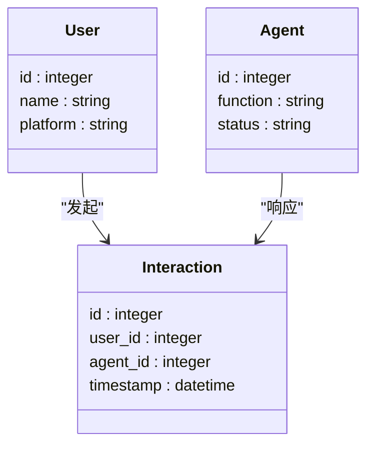
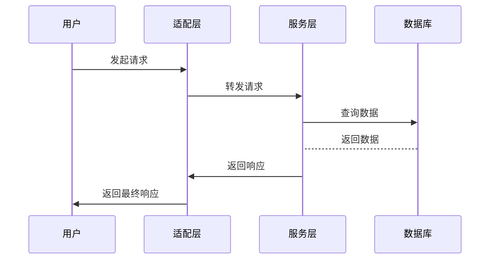

                 


# 跨平台AI Agent：PC、移动端和IoT设备的统一体验

> 关键词：跨平台AI Agent、PC、移动端、IoT设备、统一体验、技术实现、用户交互

> 摘要：本文将深入探讨跨平台AI Agent的设计与实现，涵盖PC、移动端和IoT设备的统一体验。通过分析AI Agent的核心概念、算法原理、系统架构以及实际项目案例，全面解析跨平台整合的关键技术与实践经验，帮助读者理解如何在不同平台上实现统一且高效的AI交互体验。

---

# 第1章 背景介绍：跨平台AI Agent的核心概念与问题背景

## 1.1 背景介绍

### 1.1.1 AI Agent的基本概念

AI Agent（人工智能代理）是指能够感知环境、自主决策并执行任务的智能实体。它可以以软件或实体形式存在，广泛应用于自然语言处理、推荐系统、自动化控制等领域。AI Agent的核心能力包括感知、推理、规划和执行。

跨平台AI Agent的目标是将AI Agent的能力扩展到多个平台（如PC、移动端和IoT设备），并实现统一的用户体验。

### 1.1.2 跨平台整合的重要性

随着智能设备的普及，用户期望在不同设备上获得一致的AI交互体验。跨平台整合能够提升用户体验、降低开发成本并扩展功能覆盖。

### 1.1.3 统一用户体验的意义

统一用户体验是跨平台整合的核心目标。通过统一交互界面和功能，用户可以在不同设备上无缝切换，获得一致的使用体验。

## 1.2 核心问题与挑战

### 1.2.1 多平台兼容性挑战

不同平台的硬件性能、操作系统和开发环境差异较大，导致AI Agent在不同平台上的实现存在诸多挑战。

### 1.2.2 用户体验一致性问题

如何在不同设备上实现一致的交互方式和反馈机制，是跨平台AI Agent设计的关键问题。

### 1.2.3 跨平台通信机制

跨平台通信是实现AI Agent统一功能的核心技术，需要解决设备间的数据传递和同步问题。

## 1.3 边界与外延

### 1.3.1 跨平台AI Agent的定义

跨平台AI Agent是指能够在多个平台上运行，并为用户提供一致AI服务的智能实体。

### 1.3.2 核心要素组成

跨平台AI Agent的核心要素包括：

1. 平台适配层：适配不同平台的硬件和软件环境。
2. 统一交互层：提供一致的用户交互界面和反馈机制。
3. 跨平台通信协议：实现设备间高效的数据传递和同步。

## 1.4 本章小结

本章介绍了跨平台AI Agent的基本概念、重要性、核心问题和边界，为后续章节的深入分析奠定了基础。

---

# 第2章 核心概念与联系：跨平台AI Agent的技术原理

## 2.1 核心概念原理

### 2.1.1 跨平台适配机制

跨平台适配机制通过抽象层屏蔽不同平台的差异性，确保AI Agent能够在多个平台上运行。

### 2.1.2 统一交互模型

统一交互模型定义了跨平台AI Agent的输入输出接口和交互逻辑，确保不同平台的用户体验一致。

### 2.1.3 跨平台通信协议

跨平台通信协议规范了设备间的数据传递格式和通信机制，确保高效可靠的数据交换。

## 2.2 核心属性特征对比

下表展示了跨平台AI Agent的核心属性特征对比：

| 属性 | PC端 | 移动端 | IoT设备 |
|------|------|--------|----------|
| 处理能力 | 高 | 中 | 低 |
| 交互方式 | 键盘/鼠标 | 触控/语音 | 智能传感器 |
| 通信需求 | 高带宽 | 低带宽 | 低带宽 |

## 2.3 ER实体关系图

以下是跨平台AI Agent的实体关系图：

```mermaid
erDiagram
    class Platform {
        id : integer
        name : string
        type : string
    }
    class Agent {
        id : integer
        platform_id : integer
        function : string
    }
    class Interaction {
        id : integer
        agent_id : integer
        user_id : integer
        timestamp : datetime
    }
    Platform --> Agent : "属于"
    Agent --> Interaction : "产生"
```

---

# 第3章 算法原理讲解：跨平台AI Agent的核心算法

## 3.1 算法原理概述

### 3.1.1 自然语言处理算法

自然语言处理（NLP）是AI Agent实现人机交互的核心技术。常用算法包括词袋模型（Bag of Words）和词嵌入模型（Word2Vec）。

### 3.1.2 强化学习算法

强化学习（Reinforcement Learning）用于AI Agent的自主决策和优化。常用算法包括Q-learning和Deep Q-Networks（DQN）。

## 3.2 算法实现代码示例

以下是基于Python的自然语言处理示例代码：

```python
import numpy as np

class NLPProcessor:
    def __init__(self, vocab_size):
        self.vocab_size = vocab_size

    def tokenize(self, sentence):
        return [word for word in sentence.split()]

    def embedding(self, words, embedding_dim=100):
        word_embeddings = np.random.randn(len(words), embedding_dim)
        return word_embeddings

# 示例使用
nlp = NLPProcessor(vocab_size=10000)
text = "Hello, how are you?"
tokens = nlp.tokenize(text)
embeddings = nlp.embedding(tokens)
print("Tokenized text:", tokens)
print("Embedding shape:", embeddings.shape)
```

## 3.3 数学模型与公式

### 3.3.1 词嵌入模型

词嵌入模型的目标是最小化词向量的重建误差。数学表达式为：

$$
\min_{\theta} \sum_{i=1}^{n} (x_i - W\theta_i)^2
$$

其中，$x_i$是词袋模型表示的输入词，$W$是词嵌入矩阵，$\theta_i$是词的嵌入向量。

### 3.3.2 强化学习模型

强化学习模型通过状态、动作和奖励的循环来优化策略。数学表达式为：

$$
Q(s, a) = r + \gamma \max_{a'} Q(s', a')
$$

其中，$s$是当前状态，$a$是当前动作，$r$是奖励，$\gamma$是折扣因子，$s'$是下一个状态。

---

# 第4章 系统分析与架构设计方案

## 4.1 系统分析

### 4.1.1 问题场景介绍

用户在PC、移动端和IoT设备上使用AI Agent时，需要统一的交互界面和功能。现有系统缺乏跨平台适配机制，导致用户体验不一致。

### 4.1.2 项目介绍

本项目旨在设计并实现一个跨平台AI Agent系统，支持PC、移动端和IoT设备的统一交互体验。

## 4.2 系统功能设计

### 4.2.1 领域模型

以下是系统领域模型：



### 4.2.2 系统架构设计

以下是系统架构图：


### 4.2.3 接口设计

系统接口设计如下：

1. 用户注册与登录接口：`POST /api/auth`
2. AI Agent调用接口：`POST /api/agent/action`
3. 交互记录查询接口：`GET /api/interactions`

### 4.2.4 交互流程

以下是交互流程图：



---

# 第5章 项目实战：跨平台AI Agent的实现

## 5.1 环境安装

### 5.1.1 安装Python环境

```bash
python -m pip install --upgrade pip
pip install flask requests numpy
```

### 5.1.2 安装开发工具

安装PyCharm或VS Code作为开发工具，配置Python解释器。

## 5.2 系统核心实现

### 5.2.1 适配层实现

以下是适配层代码示例：

```python
import requests

def call_agent_api(agent_id, action):
    url = f"http://localhost:5000/api/agent/{agent_id}"
    headers = {'Content-Type': 'application/json'}
    payload = {'action': action}
    response = requests.post(url, headers=headers, json=payload)
    return response.json()
```

### 5.2.2 服务层实现

以下是服务层代码示例：

```python
from flask import Flask, request, jsonify

app = Flask(__name__)

@app.route('/api/agent/<agent_id>', methods=['POST'])
def handle_agent(agent_id):
    action = request.json['action']
    # 处理逻辑
    return jsonify({'status': 'success', 'result': 'Processed action: {}'.format(action)})

if __name__ == '__main__':
    app.run(port=5000)
```

## 5.3 代码应用解读与分析

### 5.3.1 适配层解读

适配层代码通过`requests`库向服务层发起HTTP请求，实现了不同平台间的通信适配。

### 5.3.2 服务层解读

服务层代码使用Flask框架实现API接口，负责接收并处理来自适配层的请求，返回处理结果。

## 5.4 实际案例分析

### 5.4.1 案例介绍

假设用户在PC端通过键盘输入指令，适配层将其转换为HTTP请求发送到服务层，服务层处理后返回响应。

### 5.4.2 详细实现说明

1. 用户在PC端发起请求：`POST /api/agent/1?action=search`
2. 适配层调用`call_agent_api(1, 'search')`
3. 服务层接收请求并处理
4. 返回响应：`{'status': 'success', 'result': 'Search completed'}`

## 5.5 项目小结

本项目通过适配层和服务层的设计，实现了跨平台AI Agent的基本功能，验证了技术方案的可行性。

---

# 第6章 最佳实践与注意事项

## 6.1 最佳实践

### 6.1.1 平台适配技巧

建议使用跨平台开发框架（如React Native）来降低平台适配成本。

### 6.1.2 交互一致性优化

通过统一的交互规范和用户指南，确保不同平台的用户体验一致。

### 6.1.3 跨平台通信优化

采用高效的通信协议（如WebSocket）和压缩算法，提升通信效率。

## 6.2 注意事项

1. **性能优化**：注意设备间的通信延迟和带宽限制，优化数据传输效率。
2. **兼容性测试**：在不同平台上进行充分的兼容性测试，确保功能正常。
3. **安全问题**：确保跨平台通信的安全性，防止数据泄露和攻击。

## 6.3 拓展阅读

推荐阅读以下资源：

1.《Cross-Platform Development with React Native》
2.《Distributed Systems: Concepts and Designs》
3.《Reinforcement Learning: Theory and Algorithms》

---

# 作者：AI天才研究院 & 禅与计算机程序设计艺术

本文由AI天才研究院与禅与计算机程序设计艺术联合撰写，旨在分享跨平台AI Agent的技术实践与创新思考。

