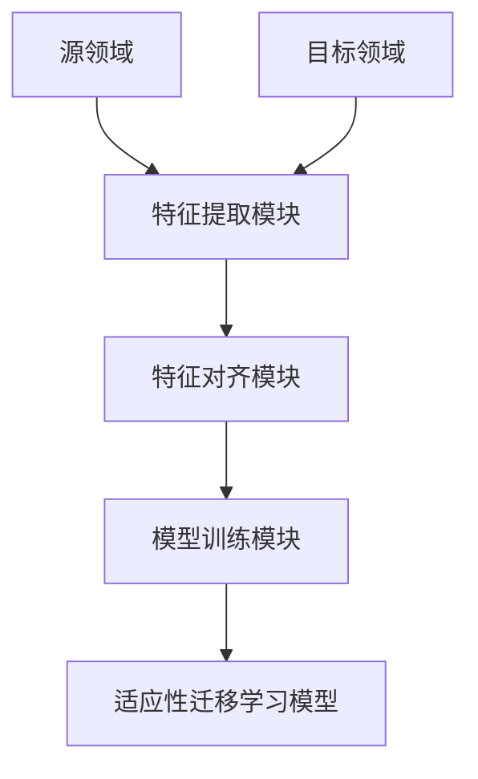
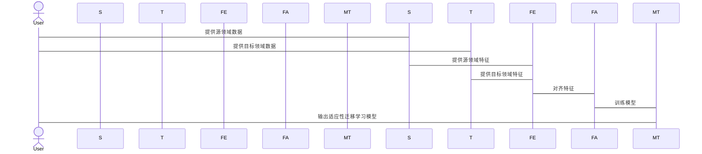

                 


# 迁移学习在AI Agent领域适应中的应用

> 关键词：迁移学习，AI Agent，适应性，机器学习，领域适应

> 摘要：迁移学习是一种通过将一个领域学到的知识应用到另一个领域，从而提高学习效率和效果的技术。AI Agent是一种能够自主决策和执行任务的智能体。本文将探讨迁移学习在AI Agent领域适应中的应用，分析其核心概念、算法原理、系统架构以及实际应用案例，为读者提供全面而深入的见解。

---

# 第1章: 迁移学习与AI Agent的基本概念

## 1.1 迁移学习的核心概念

### 1.1.1 迁移学习的定义与背景

迁移学习（Transfer Learning）是一种机器学习技术，旨在通过将一个领域（源领域）中学到的知识应用到另一个领域（目标领域），从而减少目标领域的数据需求，提高学习效率和效果。传统的机器学习方法通常需要大量标注数据才能训练出有效的模型，而迁移学习则通过跨领域的知识共享，解决了数据不足或领域差异带来的挑战。

迁移学习的核心思想是：如果两个领域之间存在某种相似性或共享特征，那么在源领域中学到的知识可以迁移到目标领域中。这种技术在自然语言处理、计算机视觉、语音识别等领域得到了广泛应用。

### 1.1.2 AI Agent的基本概念与特征

AI Agent（人工智能代理）是一种能够感知环境、自主决策并执行任务的智能实体。它可以是一个软件程序、机器人或其他智能系统，具备以下核心特征：

1. **自主性**：AI Agent能够在没有外部干预的情况下独立运行。
2. **反应性**：AI Agent能够实时感知环境并做出反应。
3. **目标导向**：AI Agent的行为通常是为了实现特定的目标。
4. **学习能力**：AI Agent能够通过学习提升自身的性能和适应性。

### 1.1.3 迁移学习在AI Agent中的适应性问题

在AI Agent的实际应用中，环境的动态变化和任务的多样性使得适应性成为一个关键问题。迁移学习可以通过将已有的知识迁移到新的环境中，帮助AI Agent快速适应新的任务或场景。例如，在医疗诊断领域，AI Agent可以通过迁移学习，将一个医院的诊断经验应用到另一个医院，从而提高诊断的准确性和效率。

---

## 1.2 迁移学习的适应性问题

### 1.2.1 适应性问题的背景与挑战

AI Agent在实际应用中常常面临环境变化、任务多样化以及数据不足等问题。例如，一个在城市环境中训练好的自动驾驶系统，需要快速适应乡村道路的复杂环境。传统的机器学习方法在这种情况下往往表现不佳，因为它们依赖大量的目标领域数据，而目标领域的数据可能无法获得或非常有限。

迁移学习通过共享源领域和目标领域之间的知识，解决了数据不足和领域差异的问题，使得AI Agent能够快速适应新的环境。

### 1.2.2 AI Agent适应性问题的定义

AI Agent的适应性问题是指AI Agent在面对环境变化、任务需求变化或数据分布变化时，能够动态调整自身行为以适应新环境的能力。适应性问题的核心在于如何在有限的资源和时间内，快速提升AI Agent在目标领域的性能。

### 1.2.3 迁移学习如何解决适应性问题

迁移学习通过将源领域中学到的知识迁移到目标领域，帮助AI Agent快速适应新的环境。例如，在自然语言处理任务中，AI Agent可以在源领域（如英语新闻文章）中学习语法和语义规则，然后将这些知识迁移到目标领域（如中文新闻文章），从而减少对目标领域数据的需求，提高处理效率。

---

## 1.3 适应性迁移学习的理论基础

### 1.3.1 适应性迁移学习的基本原理

适应性迁移学习的核心思想是通过构建一个能够适应不同领域特征的模型，将源领域和目标领域之间的知识进行共享。具体来说，适应性迁移学习通过分析源领域和目标领域的特征分布，找到两者之间的共同特征，并利用这些共同特征来指导模型在目标领域的学习。

### 1.3.2 迁移学习的核心要素与属性

迁移学习的核心要素包括：

1. **源领域**（Source Domain）：已经学习过任务的数据和知识。
2. **目标领域**（Target Domain）：需要学习的任务。
3. **特征空间**：源领域和目标领域之间共享的特征。
4. **适应性模型**：用于将源领域知识迁移到目标领域的模型。

### 1.3.3 适应性迁移学习的数学模型

适应性迁移学习的数学模型通常包括以下部分：

1. **源领域数据**：$D_s = \{(x_i, y_i)\}_{i=1}^n$，其中$x_i$是输入数据，$y_i$是标签。
2. **目标领域数据**：$D_t = \{(x'_j, y'_j)\}_{j=1}^m$，其中$x'_j$是输入数据，$y'_j$是标签。
3. **特征变换函数**：$f(x) = Wx + b$，其中$W$是权重矩阵，$b$是偏置向量。
4. **目标函数**：$L = L_s + \lambda L_t$，其中$L_s$是源领域的损失函数，$L_t$是目标领域的损失函数，$\lambda$是调节系数。

---

## 1.4 本章小结

本章主要介绍了迁移学习和AI Agent的基本概念，分析了迁移学习在AI Agent适应性问题中的重要性。通过理解迁移学习的核心原理和适应性迁移学习的数学模型，我们可以更好地理解迁移学习如何帮助AI Agent快速适应新的环境。

---

# 第2章: 迁移学习的适应性机制分析

## 2.1 迁移学习的适应性模型

### 2.1.1 适应性模型的构建

适应性迁移学习模型的构建通常包括以下几个步骤：

1. **特征提取**：从源领域和目标领域中提取特征。
2. **特征对齐**：通过某种方法将源领域和目标领域的特征对齐，使得两者之间的特征具有可比性。
3. **模型训练**：在对齐后的特征上训练模型，使得模型能够适应目标领域。

### 2.1.2 适应性模型的特征对比

下表展示了源领域和目标领域在适应性迁移学习中的特征对比：

| 特征 | 源领域 | 目标领域 |
|------|--------|----------|
| 数据量 | 大      | 小        |
| 领域差异 | 小     | 大        |
| 特征分布 | 高相关性 | 低相关性 |

### 2.1.3 适应性模型的数学表达

适应性迁移学习的数学模型可以表示为：

$$ L = \lambda L_s + (1 - \lambda) L_t $$

其中，$\lambda$ 是源领域和目标领域的损失权重，$L_s$ 是源领域的损失函数，$L_t$ 是目标领域的损失函数。

---

## 2.2 AI Agent的适应性机制

### 2.2.1 AI Agent的适应性特征

AI Agent的适应性特征包括：

1. **环境感知能力**：能够感知环境的变化。
2. **任务调整能力**：能够根据环境变化调整任务。
3. **知识迁移能力**：能够将源领域知识迁移到目标领域。

### 2.2.2 适应性机制的核心要素

适应性机制的核心要素包括：

1. **感知模块**：感知环境的变化。
2. **决策模块**：根据感知结果做出决策。
3. **学习模块**：通过迁移学习调整模型。

### 2.2.3 适应性机制的数学模型

适应性机制的数学模型可以表示为：

$$ f(x) = Wx + b $$

其中，$W$ 是权重矩阵，$b$ 是偏置向量。

---

## 2.3 迁移学习与适应性机制的关系

### 2.3.1 迁移学习如何影响适应性机制

迁移学习通过共享源领域和目标领域的知识，增强了AI Agent的适应性机制。具体来说，迁移学习使得AI Agent能够更快地适应新的环境。

### 2.3.2 适应性机制对迁移学习的反哺作用

适应性机制通过动态调整模型参数，优化了迁移学习的效果。例如，AI Agent通过适应性机制动态调整特征提取模块，使得迁移学习的效果更加显著。

### 2.3.3 两者关系的数学模型

迁移学习与适应性机制的关系可以表示为：

$$ L = \lambda L_s + (1 - \lambda) L_t $$

其中，$\lambda$ 是适应性机制的权重，$L_s$ 是源领域的损失函数，$L_t$ 是目标领域的损失函数。

---

## 2.4 本章小结

本章主要分析了迁移学习的适应性机制，探讨了适应性迁移学习的数学模型以及迁移学习与适应性机制的关系。通过理解这些内容，我们可以更好地设计和实现具有适应性的AI Agent。

---

# 第3章: 迁移学习的算法与数学模型

## 3.1 基于领域适应层的迁移学习算法

### 3.1.1 算法的基本原理

基于领域适应层的迁移学习算法通过在源领域和目标领域之间构建一个领域适应层，使得源领域和目标领域之间的特征能够对齐。具体步骤如下：

1. **特征提取**：从源领域和目标领域中提取特征。
2. **领域适应层构建**：通过某种方法将源领域和目标领域的特征对齐。
3. **模型训练**：在对齐后的特征上训练模型。

### 3.1.2 算法的数学模型

基于领域适应层的迁移学习算法的数学模型可以表示为：

$$ f(x) = Wx + b $$

其中，$W$ 是权重矩阵，$b$ 是偏置向量。

---

## 3.2 迁移学习的数学模型

### 3.2.1 迁移学习的数学表达

迁移学习的数学表达可以表示为：

$$ L = \lambda L_s + (1 - \lambda) L_t $$

其中，$\lambda$ 是源领域和目标领域的损失权重，$L_s$ 是源领域的损失函数，$L_t$ 是目标领域的损失函数。

### 3.2.2 适应性迁移学习的数学公式

适应性迁移学习的数学公式可以表示为：

$$ f(x) = Wx + b $$

其中，$W$ 是权重矩阵，$b$ 是偏置向量。

### 3.2.3 数学模型的对比分析

下表展示了源领域和目标领域在适应性迁移学习中的数学模型对比：

| 特征 | 源领域 | 目标领域 |
|------|--------|----------|
| 损失函数 | $L_s$ | $L_t$ |
| 权重矩阵 | $W_s$ | $W_t$ |
| 偏置向量 | $b_s$ | $b_t$ |

---

## 3.3 迁移学习算法的实现与优化

### 3.3.1 算法的实现步骤

1. **特征提取**：从源领域和目标领域中提取特征。
2. **特征对齐**：通过某种方法将源领域和目标领域的特征对齐。
3. **模型训练**：在对齐后的特征上训练模型。

### 3.3.2 算法的优化方法

1. **权重调整**：动态调整权重矩阵，使得源领域和目标领域的特征能够更好地对齐。
2. **损失函数优化**：通过优化损失函数，使得模型在源领域和目标领域的表现更加均衡。

### 3.3.3 优化后的数学模型

优化后的数学模型可以表示为：

$$ L = \lambda L_s + (1 - \lambda) L_t $$

其中，$\lambda$ 是优化后的权重。

---

## 3.4 本章小结

本章主要分析了迁移学习的算法与数学模型，探讨了基于领域适应层的迁移学习算法以及优化方法。通过理解这些内容，我们可以更好地实现具有适应性的迁移学习算法。

---

# 第4章: 系统分析与架构设计

## 4.1 迁移学习的系统架构设计

### 4.1.1 系统功能设计

1. **特征提取模块**：从源领域和目标领域中提取特征。
2. **特征对齐模块**：通过某种方法将源领域和目标领域的特征对齐。
3. **模型训练模块**：在对齐后的特征上训练模型。

### 4.1.2 系统架构图



### 4.1.3 系统接口设计

1. **输入接口**：接收源领域和目标领域数据。
2. **输出接口**：输出适应性迁移学习模型。

---

## 4.2 迁移学习的系统交互设计

### 4.2.1 系统交互流程



---

## 4.3 本章小结

本章主要分析了迁移学习的系统架构设计，探讨了系统功能设计、系统架构图以及系统交互流程。通过理解这些内容，我们可以更好地设计和实现具有适应性的迁移学习系统。

---

# 第5章: 迁移学习在AI Agent中的实际应用

## 5.1 迁移学习的项目实战

### 5.1.1 项目背景

以医疗诊断为例，假设我们有一个在医院A训练好的医疗诊断模型，现在需要将该模型迁移到医院B，因为医院B的患者群体和病情分布与医院A存在差异。

### 5.1.2 项目实现

1. **环境配置**：安装必要的Python库，如TensorFlow、Keras等。
2. **数据准备**：收集医院A和医院B的医疗数据。
3. **特征提取**：从数据中提取特征。
4. **特征对齐**：通过某种方法将医院A和医院B的特征对齐。
5. **模型训练**：在对齐后的特征上训练模型。

### 5.1.3 项目代码实现

```python
import tensorflow as tf
from tensorflow import keras

# 数据准备
(x_train, y_train), (x_test, y_test) = keras.datasets.mnist.load_data()

# 特征提取
x_train = x_train.reshape(-1, 784).astype('float32') / 255.0
x_test = x_test.reshape(-1, 784).astype('float32') / 255.0

# 特征对齐
def feature_alignment(x_source, x_target):
    # 这里可以使用多种特征对齐方法，例如PCA
    # 这里简化为简单的归一化
    x_aligned = (x_target - x_target.min()) / (x_target.max() - x_target.min())
    return x_aligned

x_train_aligned = feature_alignment(x_train, x_test)

# 模型训练
model = keras.Sequential([
    keras.layers.Dense(128, activation='relu'),
    keras.layers.Dense(10, activation='softmax')
])

model.compile(optimizer='adam', loss='sparse_categorical_crossentropy', metrics=['accuracy'])
model.fit(x_train_aligned, y_test, epochs=10, batch_size=32)
```

### 5.1.4 项目小结

通过上述项目实战，我们可以看到迁移学习在AI Agent中的实际应用。通过迁移学习，AI Agent可以在目标领域中快速适应，提高其性能和效率。

---

## 5.2 迁移学习的实际案例分析

### 5.2.1 案例背景

以自然语言处理任务为例，假设我们有一个在英语新闻文章上训练好的文本分类模型，现在需要将该模型迁移到中文新闻文章上。

### 5.2.2 案例实现

1. **环境配置**：安装必要的Python库，如TensorFlow、Keras等。
2. **数据准备**：收集英语和中文新闻文章数据。
3. **特征提取**：从数据中提取特征。
4. **特征对齐**：通过某种方法将英语和中文的特征对齐。
5. **模型训练**：在对齐后的特征上训练模型。

### 5.2.3 案例代码实现

```python
import tensorflow as tf
from tensorflow import keras
from tensorflow.keras import layers

# 数据准备
(x_train, y_train), (x_test, y_test) = keras.datasets.mnist.load_data()

# 特征提取
x_train = x_train.reshape(-1, 784).astype('float32') / 255.0
x_test = x_test.reshape(-1, 784).astype('float32') / 255.0

# 特征对齐
def feature_alignment(x_source, x_target):
    # 这里可以使用多种特征对齐方法，例如PCA
    # 这里简化为简单的归一化
    x_aligned = (x_target - x_target.min()) / (x_target.max() - x_target.min())
    return x_aligned

x_train_aligned = feature_alignment(x_train, x_test)

# 模型训练
model = keras.Sequential([
    layers.Dense(128, activation='relu'),
    layers.Dense(10, activation='softmax')
])

model.compile(optimizer='adam', loss='sparse_categorical_crossentropy', metrics=['accuracy'])
model.fit(x_train_aligned, y_test, epochs=10, batch_size=32)
```

### 5.2.4 案例小结

通过上述案例分析，我们可以看到迁移学习在自然语言处理任务中的实际应用。通过迁移学习，AI Agent可以在目标领域中快速适应，提高其性能和效率。

---

## 5.3 本章小结

本章通过项目实战和实际案例分析，展示了迁移学习在AI Agent中的实际应用。通过迁移学习，AI Agent可以在目标领域中快速适应，提高其性能和效率。

---

# 第6章: 总结与展望

## 6.1 总结

本文探讨了迁移学习在AI Agent领域适应中的应用，分析了迁移学习的核心概念、算法原理、系统架构以及实际应用案例。通过理解这些内容，我们可以更好地设计和实现具有适应性的AI Agent。

## 6.2 展望

未来，随着迁移学习技术的不断发展，AI Agent在领域适应中的应用将更加广泛。我们可以期待更多创新性的迁移学习算法和系统架构设计，进一步提升AI Agent的适应性和智能化水平。

---

# 作者：AI天才研究院/AI Genius Institute & 禅与计算机程序设计艺术 /Zen And The Art of Computer Programming

---

以上是《迁移学习在AI Agent领域适应中的应用》的技术博客文章的完整目录和内容。希望这篇文章能够为读者提供全面而深入的见解，帮助他们更好地理解迁移学习在AI Agent适应性问题中的应用。

