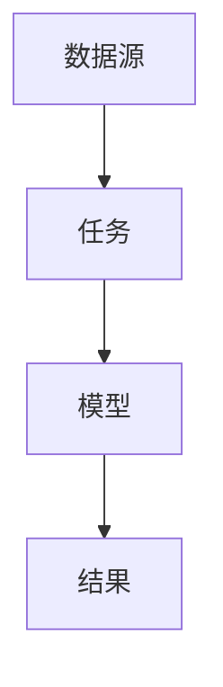
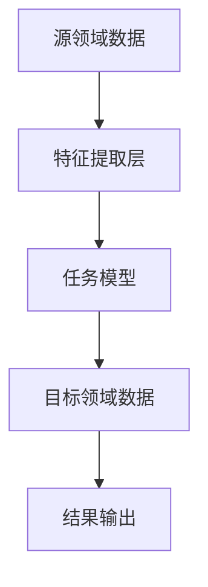
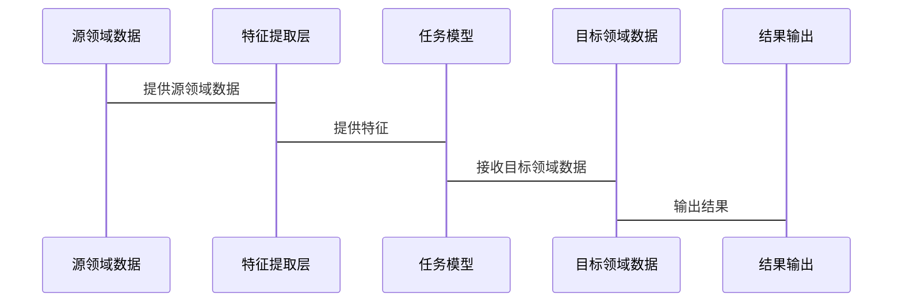

                 


# 迁移学习：快速适应新领域的AI Agent

> 关键词：迁移学习，AI Agent，机器学习，领域适应，模型迁移

> 摘要：迁移学习是一种通过将已有的知识和经验迁移到新领域或新任务中的技术，能够显著提高AI Agent在新环境中的适应能力和表现。本文将从迁移学习的核心概念、算法原理、系统架构、项目实战等多方面展开，深入探讨迁移学习的理论与实践，帮助读者快速掌握这一技术的核心要点。

---

# 第一部分: 迁移学习基础与核心概念

## 第1章: 迁移学习的背景与定义

### 1.1 迁移学习的定义与背景

迁移学习（Transfer Learning）是一种机器学习技术，旨在通过将已有的知识和经验迁移到新领域或新任务中，以提高模型在新环境中的性能和适应能力。与传统机器学习不同，迁移学习的核心在于处理数据分布的偏移问题，即在源领域和目标领域之间存在分布差异时，如何有效利用源领域的知识来提升目标领域的模型性能。

#### 1.1.1 机器学习的基本概念

在深入迁移学习之前，我们需要回顾机器学习的基本概念。机器学习是一种通过数据训练模型，使其能够从数据中学习并做出预测或决策的技术。传统的机器学习算法（如支持向量机、随机森林等）通常假设训练数据和测试数据来自相同的分布。然而，在现实应用中，这种情况往往难以满足，尤其是在动态变化的环境中。

#### 1.1.2 迁移学习的定义与特点

迁移学习的定义可以简单概括为：在两个或多个相关任务之间，利用已有的知识和经验来提高新任务的性能。其核心特点包括：

- **领域差异性**：源领域和目标领域之间存在数据分布的差异。
- **任务相关性**：源任务和目标任务之间具有一定的关联性。
- **知识可迁移性**：模型能够将从源领域学到的知识迁移到目标领域。

#### 1.1.3 迁移学习的应用场景

迁移学习在多个领域都有广泛的应用，例如：

- **自然语言处理**：将预训练语言模型迁移到特定领域的文本分类任务。
- **计算机视觉**：将图像分类模型迁移到目标检测或图像分割任务。
- **医疗领域**：将一种疾病的诊断模型迁移到相关疾病的诊断任务。

---

### 1.2 迁移学习的核心问题

迁移学习的核心问题在于如何处理数据分布的偏移，同时保持模型的泛化能力。以下是迁移学习面临的主要挑战：

#### 1.2.1 数据分布偏移的挑战

数据分布偏移（Distribution Shift）是指源领域和目标领域之间的数据分布存在差异。这种差异可能源于数据采集方式、样本数量、特征分布等方面的差异。

#### 1.2.2 领域适应的核心问题

领域适应（Domain Adaptation）是迁移学习的核心问题之一，旨在通过调整模型或数据，使得模型能够在目标领域中表现良好。

#### 1.2.3 迁移学习的挑战与解决方案

迁移学习的主要挑战包括数据稀缺性、领域差异性、任务相关性等。为了解决这些问题，迁移学习提出了多种方法，例如领域适应、多任务学习、自适应特征提取等。

---

### 1.3 迁移学习与传统机器学习的区别

迁移学习与传统机器学习的主要区别在于对数据分布的处理方式：

#### 1.3.1 数据依赖性的对比

- 传统机器学习：假设训练数据和测试数据来自相同的分布。
- 迁移学习：允许训练数据和测试数据来自不同的分布。

#### 1.3.2 模型适应性的对比

- 传统机器学习：模型的泛化能力依赖于训练数据的多样性。
- 迁移学习：模型能够通过迁移学习适应新的数据分布。

#### 1.3.3 迁移学习的优势与劣势

优势：
- 能够在数据稀缺的情况下提高模型性能。
- 能够快速适应新领域或新任务。

劣势：
- 数据分布偏移可能导致模型性能下降。
- 迁移学习算法的设计和实现较为复杂。

---

### 1.4 迁移学习的重要性与应用前景

#### 1.4.1 迁移学习在AI Agent中的作用

AI Agent需要在复杂多变的环境中快速适应新任务，迁移学习为其提供了强大的技术支撑。

#### 1.4.2 迁移学习的潜在应用领域

- **智能家居**：通过迁移学习快速适应家庭成员的习惯。
- **自动驾驶**：将预训练的驾驶模型迁移到不同道路条件下的场景。
- **医疗诊断**：将一种疾病的诊断模型迁移到相关疾病的诊断任务。

#### 1.4.3 迁移学习的挑战与机遇

迁移学习的挑战主要在于如何有效处理数据分布偏移，而机遇则在于其广泛的应用前景。

---

### 1.5 本章小结

本章主要介绍了迁移学习的基本概念、核心问题以及与传统机器学习的区别。通过对比分析，我们明确了迁移学习在AI Agent中的重要性，同时也为后续章节的学习奠定了基础。

---

## 第2章: 迁移学习的核心概念与联系

### 2.1 迁移学习的核心原理

迁移学习的核心原理在于通过共享特征或参数，将源领域的知识迁移到目标领域。

#### 2.1.1 数据分布的可迁移性

数据分布的可迁移性是迁移学习的关键，源领域和目标领域之间的特征分布决定了迁移的效果。

#### 2.1.2 模型的可迁移性

模型的可迁移性是指模型能够将从源领域学到的知识迁移到目标领域的能力。

#### 2.1.3 任务之间的关联性

任务之间的关联性是迁移学习的理论基础，源任务和目标任务之间的关系决定了迁移的难易程度。

---

### 2.2 迁移学习的类型与特点

迁移学习可以根据不同的标准进行分类，以下是常见的分类方式：

#### 2.2.1 基于样本的迁移学习

基于样本的迁移学习通过共享样本特征进行迁移。

#### 2.2.2 基于特征的迁移学习

基于特征的迁移学习通过提取共享特征进行迁移。

#### 2.2.3 基于模型的迁移学习

基于模型的迁移学习通过共享模型参数进行迁移。

---

### 2.3 迁移学习的核心要素对比

以下是迁移学习的核心要素对比：

| 对比维度 | 源领域 | 目标领域 |
|----------|--------|----------|
| 数据分布 | D_s    | D_t      |
| 任务     | T_s    | T_t      |
| 模型     | M_s    | M_t      |

---

### 2.4 迁移学习的实体关系图



---

## 第3章: 迁移学习的算法原理

### 3.1 基于领域适应的迁移学习算法

#### 3.1.1 最大均值差异

最大均值差异（Maximum Mean Discrepancy, MMD）是一种常用的领域适应方法，其核心思想是通过最小化源领域和目标领域的均值差异来实现领域适应。

公式：
$$
\text{MMD}^2(D_s, D_t) = \mathbb{E}_{x \sim D_s}[f(x)] - \mathbb{E}_{x \sim D_t}[f(x)]
$$

---

### 3.2 基于多任务学习的迁移学习算法

#### 3.2.1 跨任务学习的流程

跨任务学习通过共享任务之间的特征或参数来实现迁移。

---

## 第4章: 迁移学习的系统架构与设计

### 4.1 问题场景介绍

迁移学习的系统架构设计需要考虑源领域和目标领域的数据分布差异。

---

### 4.2 系统功能设计

系统功能设计包括领域模型的设计、任务模型的设计等。

---

### 4.3 系统架构设计



---

### 4.4 系统接口设计

系统接口设计需要考虑数据输入、模型训练、结果输出等接口。

---

### 4.5 系统交互流程



---

## 第5章: 迁移学习的项目实战

### 5.1 环境安装

需要安装的环境包括Python、TensorFlow等。

---

### 5.2 核心代码实现

以下是迁移学习的核心代码实现：

```python
def transfer_learning_model():
    # 源领域模型
    source_model = ...
    # 目标领域模型
    target_model = ...
    # 迁移层
    transfer_layer = ...
    # 训练
    train(source_model, transfer_layer, target_model)
```

---

### 5.3 代码解读与分析

代码解读包括迁移层的设计、模型的训练过程等。

---

### 5.4 案例分析

通过具体的案例分析，展示迁移学习的应用效果。

---

## 第6章: 总结与展望

### 6.1 本章总结

总结迁移学习的核心概念、算法原理、系统设计和项目实战。

---

### 6.2 未来挑战与展望

讨论迁移学习的未来挑战和应用前景。

---

### 6.3 最佳实践 tips

- 数据预处理是关键。
- 模型选择要谨慎。
- 迁移学习的效果依赖于领域之间的关联性。

---

作者：AI天才研究院/AI Genius Institute & 禅与计算机程序设计艺术 /Zen And The Art of Computer Programming

