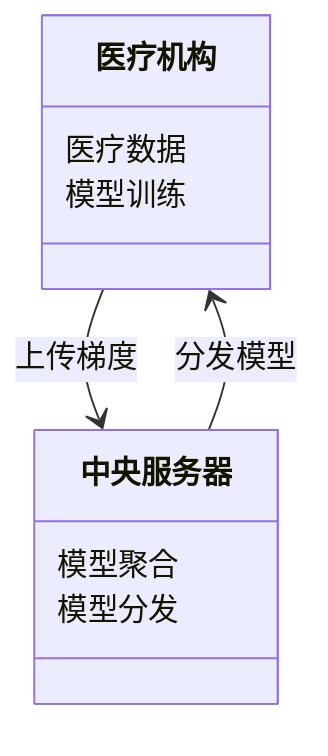
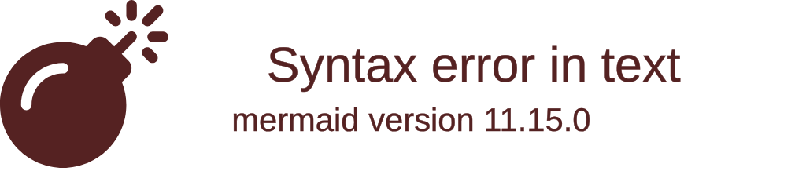
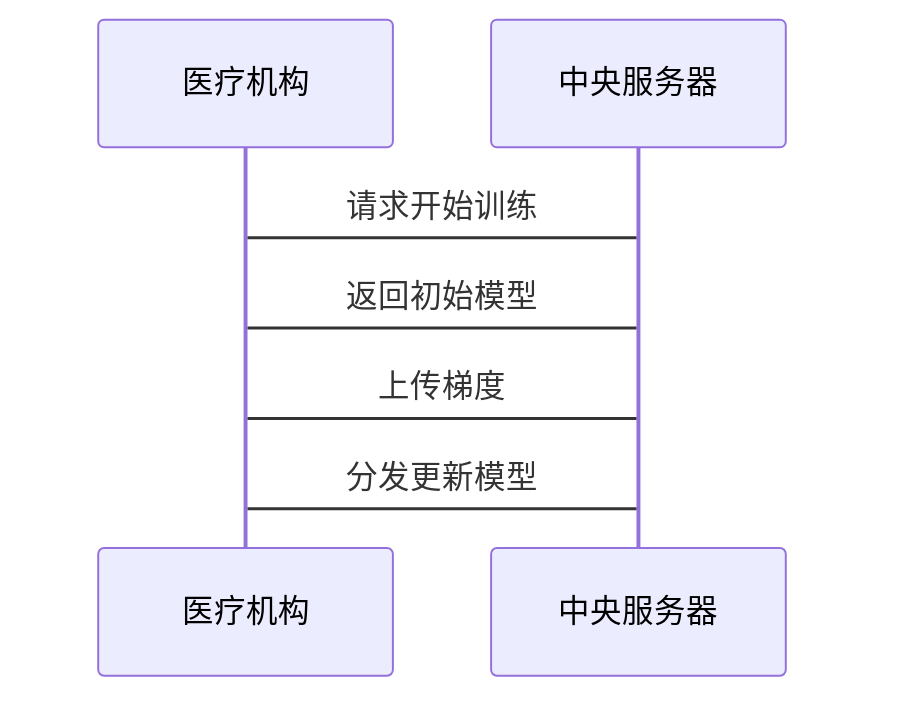

                 


# 隐私保护AI：在数据安全与功能之间寻找平衡

## 关键词：  
隐私保护、人工智能、数据安全、算法、联邦学习、差分隐私

## 摘要：  
在人工智能技术迅速发展的今天，隐私保护与数据安全成为社会各界关注的焦点。本文深入探讨隐私保护AI的核心概念、算法原理、系统架构以及实际应用，分析隐私保护与AI功能之间的平衡点，为技术开发者和决策者提供实用的指导和建议。

---

## 第一部分：隐私保护AI的背景与概述

### 第1章：隐私保护AI的概述

#### 1.1 隐私保护AI的背景与重要性

##### 1.1.1 数字化时代的数据安全挑战
随着数字化进程的加速，数据成为推动社会进步的重要资源。然而，数据的收集、存储和使用过程中，隐私泄露的风险也在增加。例如，社交媒体平台上的个人信息、医疗健康数据的滥用、金融交易数据的非法获取等问题频发。

##### 1.1.2 AI技术的快速发展与隐私问题
人工智能技术的快速发展依赖于海量数据的训练和优化。然而，数据的集中使用也带来了隐私泄露的风险。例如，面部识别技术可能被用于非法监控，自动驾驶汽车的数据可能被黑客攻击，医疗AI系统的患者数据可能被滥用。

##### 1.1.3 隐私保护AI的核心目标与意义
隐私保护AI的目标是在确保数据安全的前提下，最大化AI的功能和价值。其意义在于平衡数据利用与隐私保护，为AI技术的可持续发展提供保障。

#### 1.2 隐私保护AI的基本概念

##### 1.2.1 隐私保护的定义与分类
隐私保护是指保护个人或组织的敏感信息不被未经授权的访问或滥用。分类包括数据加密、匿名化、数据最小化等。

##### 1.2.2 AI技术的基本原理
AI通过数据训练模型，学习数据中的模式和规律，实现智能化决策和预测。

##### 1.2.3 隐私保护AI的实现方式与特点
隐私保护AI通过加密、匿名化等技术，在数据处理过程中保护隐私，同时保持模型的准确性。

#### 1.3 隐私保护AI的挑战与机遇

##### 1.3.1 数据隐私与AI功能的平衡难题
如何在保护隐私的同时，确保AI模型的准确性和效率是当前面临的主要挑战。

##### 1.3.2 隐私保护AI在不同领域的应用潜力
医疗、金融、教育等领域都存在隐私保护AI的应用需求。

##### 1.3.3 技术进步与法律法规的双重推动
技术进步推动隐私保护AI的发展，同时法律法规也为隐私保护提供了框架。

---

## 第二部分：隐私保护AI的核心概念与技术原理

### 第2章：隐私保护AI的核心技术

#### 2.1 数据加密与隐私保护

##### 2.1.1 数据加密的基本原理
数据加密通过加密算法将明文转换为密文，确保数据在传输和存储过程中的安全性。

##### 2.1.2 加密在AI数据处理中的应用
加密数据在AI模型训练中的应用，例如联邦学习中的加密通信。

##### 2.1.3 常见加密算法及其优缺点
- 对称加密：速度快，但密钥管理复杂。
- 非对称加密：安全性高，但计算开销大。

#### 2.2 数据匿名化与脱敏技术

##### 2.2.1 数据匿名化的定义与方法
数据匿名化通过去除或变形数据中的标识信息，降低数据被重新识别的风险。

##### 2.2.2 数据脱敏技术的实现方式
数据脱敏可以通过替换、遮盖、加密等方法实现。

##### 2.2.3 匿名化数据的可用性与安全性
匿名化数据在保护隐私的同时，仍需保持数据的可用性，以支持AI模型的训练。

#### 2.3 数据最小化原则

##### 2.3.1 数据最小化的基本概念
数据最小化原则要求在数据收集和使用过程中，仅收集和处理必要的数据。

##### 2.3.2 数据最小化在AI中的应用
在AI模型训练中，仅收集必要的数据特征，减少隐私泄露风险。

##### 2.3.3 数据最小化与隐私保护的关系
数据最小化是实现隐私保护的重要手段，通过减少数据量降低隐私泄露风险。

---

## 第三部分：隐私保护AI的算法原理

### 第3章：隐私保护AI的核心算法

#### 3.1 联邦学习（Federated Learning）

##### 3.1.1 联邦学习的定义与特点
联邦学习是一种分布式机器学习技术，允许多个参与方在不共享原始数据的情况下共同训练模型。

##### 3.1.2 联邦学习的流程与实现
1. **数据准备**：各参与方本地数据预处理。
2. **模型初始化**：各参与方初始化模型参数。
3. **模型训练**：各参与方在本地数据上训练模型，并将梯度上传到中央服务器。
4. **模型聚合**：中央服务器聚合各参与方的梯度，更新全局模型。
5. **模型分发**：中央服务器将更新后的模型分发给各参与方。

##### 3.1.3 联邦学习的优缺点与适用场景
- 优点：保护数据隐私，支持分布式训练。
- 缺点：通信开销大，模型收敛速度慢。
- 适用场景：医疗、金融等对数据隐私要求高的领域。

##### 3.1.4 联邦学习的数学模型与公式
- 梯度上传公式：
  $$
  g_i = \nabla L_i(\theta_{t})
  $$
- 模型聚合公式：
  $$
  \theta_{t+1} = \theta_t + \sum_{i=1}^{n} \frac{g_i}{n}
  $$

##### 3.1.5 联邦学习的实现代码示例
```python
import numpy as np

# 初始化模型参数
theta = np.random.randn(2, 1)

# 模型训练过程
for _ in range(num_epochs):
    # 各参与方计算梯度
    gradients = []
    for participant in participants:
        gradient = participant.compute_gradient(theta)
        gradients.append(gradient)
    
    # 聚合梯度
    aggregated_gradient = np.mean(gradients, axis=0)
    
    # 更新模型参数
    theta = theta + aggregated_gradient * learning_rate
```

---

### 第4章：差分隐私（Differential Privacy）

#### 4.1 差分隐私的定义与特点
差分隐私是一种通过在数据中添加噪声，确保查询结果不会泄露个体信息的隐私保护方法。

#### 4.2 差分隐私的核心原理
通过在数据中添加随机噪声，使得单个数据点的改变不会显著影响整体结果，从而保护个体隐私。

#### 4.3 差分隐私的实现方式
- 在数据发布前，对数据进行噪声添加。
- 在数据查询时，返回加噪声的结果。

#### 4.4 差分隐私的数学模型与公式
- 噬噪函数：
  $$
  f(x) = x + \text{Laplace}(\lambda)
  $$
- 差分隐私的保障条件：
  $$
  \Pr[f(x) = y] \leq \Pr[f(x') = y] + \epsilon
  $$

#### 4.5 差分隐私的优缺点与适用场景
- 优点：提供严格的隐私保护保障。
- 缺点：可能降低数据的准确性。
- 适用场景：适用于需要严格隐私保护的敏感数据发布。

#### 4.6 差分隐私的实现代码示例
```python
import numpy as np
import random

# 定义拉普拉斯分布函数
def laplace_noise(b):
    beta = random.random()
    return b * np.log(beta / (1 - beta))

# 应用差分隐私的数据发布
def differentially_private_query(x, epsilon):
    b = 1 / epsilon
    noisy_x = x + laplace_noise(b)
    return noisy_x
```

---

## 第四部分：系统分析与架构设计方案

### 第5章：隐私保护AI的系统架构

#### 5.1 项目介绍
本项目旨在设计一个基于联邦学习的隐私保护AI系统，用于医疗数据的分析和诊断。

#### 5.2 系统功能设计

##### 5.2.1 领域模型（Domain Model）


##### 5.2.2 系统架构设计


##### 5.2.3 系统接口设计
- 医疗机构接口：数据预处理、模型训练、梯度上传。
- 中央服务器接口：接收梯度、聚合模型、分发模型。

##### 5.2.4 系统交互流程


---

## 第五部分：项目实战

### 第6章：隐私保护AI的项目实战

#### 6.1 环境安装
- 安装必要的Python库：`numpy`, `pytorch`, `fl-pytorch`。

#### 6.2 系统核心实现源代码

##### 6.2.1 联邦学习实现
```python
import torch
import torch.nn as nn
import torch.optim as optim

# 定义模型
class LinearModel(nn.Module):
    def __init__(self, input_dim, output_dim):
        super(LinearModel, self).__init__()
        self.linear = nn.Linear(input_dim, output_dim)
    
    def forward(self, x):
        return self.linear(x)

# 初始化模型参数
model = LinearModel(2, 1)
optimizer = optim.SGD(model.parameters(), lr=0.1)

# 联邦学习训练过程
for epoch in range(num_epochs):
    # 各参与方计算梯度
    gradients = []
    for participant in participants:
        outputs = model(participant.data)
        loss = nn.MSELoss()(outputs, participant.target)
        loss.backward()
        gradients.append(participant.linear.weight.grad)
    
    # 聚合梯度
    aggregated_gradient = torch.mean(torch.stack(gradients), dim=0)
    
    # 更新模型参数
    optimizer.zero_grad()
    model.linear.weight.grad = aggregated_gradient
    optimizer.step()
```

##### 6.2.2 差分隐私实现
```python
import numpy as np

# 定义差分隐私机制
def add_laplace_noise(budget):
    beta = np.random.random()
    noise = budget * np.log(beta / (1 - beta))
    return noise

# 应用差分隐私的数据发布
def differentially_private_query(x, epsilon):
    budget = 1 / epsilon
    noisy_x = x + add_laplace_noise(budget)
    return noisy_x

# 示例数据
x = np.array([1, 2, 3, 4, 5])
epsilon = 1.0
noisy_x = [differentially_private_query(num, epsilon) for num in x]
print("Original data:", x)
print("Noisy data:", noisy_x)
```

#### 6.3 实际案例分析与详细解读

##### 6.3.1 案例分析
以医疗数据为例，使用联邦学习技术训练一个疾病预测模型，同时通过差分隐私保护患者数据。

##### 6.3.2 代码实现与分析
- 数据预处理：将医疗数据匿名化处理，去除敏感信息。
- 模型训练：使用联邦学习技术，各医疗机构本地训练模型，并上传梯度。
- 模型优化：中央服务器聚合梯度，更新全局模型，分发给各医疗机构。

##### 6.3.3 案例结果与总结
通过联邦学习和差分隐私技术，实现了医疗数据的隐私保护，同时保证了模型的准确性。

---

## 第六部分：最佳实践与总结

### 第7章：隐私保护AI的最佳实践

#### 7.1 最佳实践 tips

##### 7.1.1 数据最小化原则
仅收集必要的数据，减少隐私泄露风险。

##### 7.1.2 加密技术的应用
在数据传输和存储过程中，使用加密技术保护数据安全。

##### 7.1.3 差分隐私的使用场景
在需要严格隐私保护的数据发布中，可以采用差分隐私技术。

##### 7.1.4 联邦学习的应用场景
适用于多个参与方需要共同训练模型，同时保护数据隐私的场景。

##### 7.1.5 模型透明性与可解释性
确保AI模型的透明性，便于审计和监控。

#### 7.2 小结

隐私保护AI技术在数据安全与功能之间找到了平衡点，为AI技术的可持续发展提供了保障。

#### 7.3 注意事项

- 定期进行安全审计，发现潜在漏洞。
- 加强法律法规的学习与遵守，确保合规性。
- 提高用户隐私保护意识，获得用户的信任。

#### 7.4 拓展阅读

- 《Data Privacy and Machine Learning》
- 《Differential Privacy: A Primer for the Perplexed》
- 《Secure Multi-Party Computation for Machine Learning》

---

## 作者信息

作者：AI天才研究院/AI Genius Institute & 禅与计算机程序设计艺术 /Zen And The Art of Computer Programming

---

以上是《隐私保护AI：在数据安全与功能之间寻找平衡》的技术博客文章的完整目录大纲和内容。希望这篇文章能够为读者提供清晰、系统的技术指导，帮助他们在隐私保护与AI功能之间找到最佳的平衡点。

