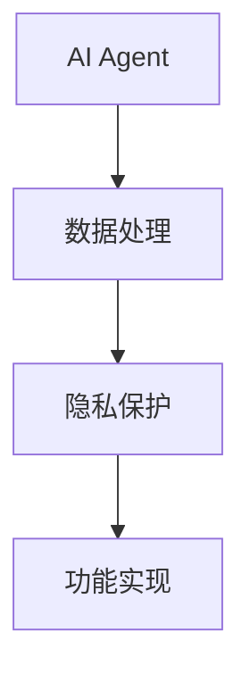
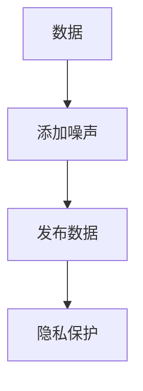
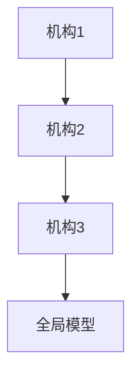
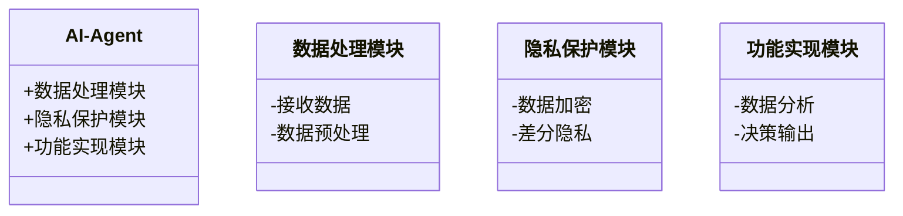
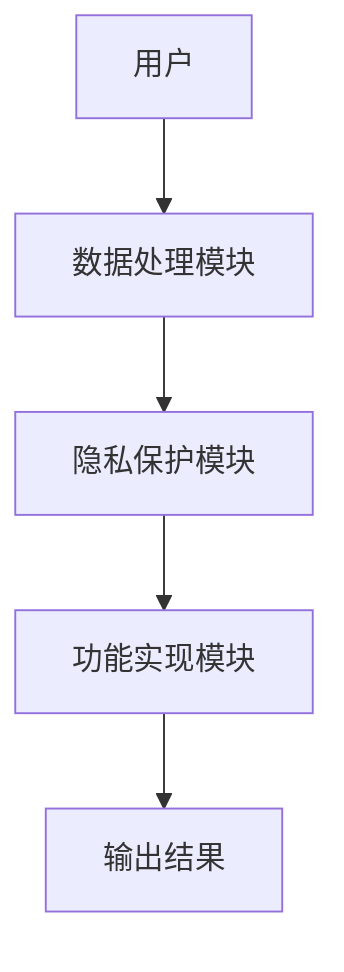
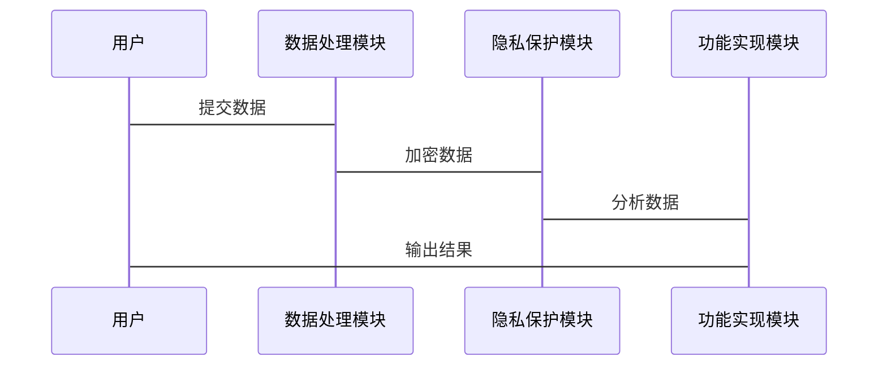

                 


# 隐私保护型AI Agent：安全与功能的平衡

> 关键词：隐私保护、AI Agent、数据安全、联邦学习、差分隐私、匿名化技术

> 摘要：随着人工智能技术的快速发展，AI Agent（智能代理）在各个领域的应用日益广泛。然而，AI Agent的功能强大往往需要处理大量的用户数据，这使得隐私保护成为一个严峻的挑战。本文将深入探讨隐私保护型AI Agent的核心概念、算法原理、系统架构以及实际应用，分析如何在保证AI Agent功能的同时，实现对用户隐私的有效保护。通过具体案例和最佳实践，本文为读者提供全面的理论和实践指导，帮助他们在实际项目中平衡安全与功能。

---

# 第一部分：隐私保护型AI Agent的背景与概念

## 第1章：AI Agent与隐私保护的背景介绍

### 1.1 AI Agent的发展历程

#### 1.1.1 从传统AI到AI Agent的演进
AI Agent（智能代理）是从传统AI系统发展而来的。早期的AI系统通常以规则为基础，处理特定任务。随着技术的进步，AI Agent逐步具备了自主性、反应性和目标导向性，能够与环境交互并完成复杂任务。

#### 1.1.2 AI Agent的核心概念与特点
AI Agent是一种智能实体，能够感知环境、自主决策并执行任务。其特点包括：
- **自主性**：无需外部干预，自主完成任务。
- **反应性**：能够实时感知环境变化并调整行为。
- **目标导向性**：以明确的目标为导向，优化决策过程。

#### 1.1.3 AI Agent在现代社会中的重要性
AI Agent广泛应用于自动驾驶、智能助手、机器人等领域。其高效性和智能性使其成为现代社会发展的重要推动力。

### 1.2 隐私保护的重要性

#### 1.2.1 数字化时代隐私保护的挑战
随着数字化进程的加快，数据泄露和隐私侵犯事件频发。AI Agent在处理大量用户数据时，必须确保数据的安全性和隐私性。

#### 1.2.2 隐私泄露的典型案例分析
近年来，多个数据泄露事件暴露了隐私保护的薄弱环节。这些案例表明，隐私保护必须成为AI Agent设计的核心要素。

#### 1.2.3 隐私保护与社会发展的关系
隐私保护不仅是个人权利的问题，更是社会稳定和经济发展的关键因素。良好的隐私保护机制能够增强用户信任，促进技术创新。

### 1.3 隐私保护型AI Agent的提出

#### 1.3.1 问题背景与问题描述
AI Agent的功能强大，但其数据处理过程可能涉及用户的敏感信息。如何在保证功能的同时保护隐私，成为亟待解决的问题。

#### 1.3.2 隐私保护与AI Agent功能的平衡
隐私保护型AI Agent的设计需要在功能实现和隐私保护之间找到平衡点。既要保证AI Agent的智能性和高效性，又要确保用户隐私的安全。

#### 1.3.3 隐私保护型AI Agent的边界与外延
隐私保护型AI Agent不仅关注数据的处理和存储，还涉及数据传输、共享和销毁等环节。其外延涵盖数据全生命周期的隐私保护。

### 1.4 本章小结
本章介绍了AI Agent的发展历程、隐私保护的重要性以及隐私保护型AI Agent的核心概念。下一章将深入探讨隐私保护型AI Agent的核心概念与联系。

---

# 第二部分：隐私保护型AI Agent的核心概念与联系

## 第2章：隐私保护型AI Agent的核心概念

### 2.1 隐私保护型AI Agent的定义与属性

#### 2.1.1 核心概念的定义
隐私保护型AI Agent是一种在保证功能的同时，严格保护用户隐私的智能实体。其核心在于通过技术手段确保数据的机密性、完整性和可用性。

#### 2.1.2 核心属性的特征对比（表格形式）

| 属性         | 非隐私保护型AI Agent | 隐私保护型AI Agent |
|--------------|----------------------|---------------------|
| 数据处理     | 明文处理             | 加密处理           |
| 数据存储     | 集中存储             | 分布式存储         |
| 数据共享     | 无隐私保护           | 差分隐私保护       |

#### 2.1.3 隐私保护型AI Agent的核心要素
隐私保护型AI Agent的核心要素包括：
- 数据加密技术
- 差分隐私技术
- 数据匿名化技术

### 2.2 隐私保护与AI Agent功能的联系

#### 2.2.1 隐私保护对AI Agent功能的影响
隐私保护技术（如加密和匿名化）可能会影响AI Agent的性能，但通过优化算法可以在一定程度上减少这种影响。

#### 2.2.2 AI Agent功能对隐私保护的需求
AI Agent的功能需求（如数据分析和决策）要求其必须处理用户数据，这增加了隐私保护的难度。

#### 2.2.3 隐私保护型AI Agent的概念结构（Mermaid图）



---

## 第3章：隐私保护型AI Agent的核心原理

### 3.1 隐私保护技术的核心原理

#### 3.1.1 数据加密技术

##### 对称加密
对称加密是一种常见的加密技术，速度快，适用于大规模数据加密。常用的算法包括AES和DES。

##### 非对称加密
非对称加密使用公钥和私钥进行加密和解密。适用于数据传输的安全保护。RSA是一种典型的非对称加密算法。

##### 混淆技术
混淆技术通过随机化数据来增加数据的复杂性，使得攻击者难以解析原始数据。

#### 3.1.2 差分隐私技术
差分隐私是一种通过在数据中添加噪声来保护隐私的技术。其核心思想是在数据发布前，通过添加随机噪声，使得单个数据点的变化无法被检测到。

##### 差分隐私的数学模型
差分隐私的数学模型可以用概率论和统计学来描述。例如，对于一个函数f，差分隐私要求：
$$ P(f(x) = y) \leq \epsilon \cdot e^{\epsilon \cdot \Delta} $$
其中，ε是隐私参数，Δ是两个相邻数据集的差别。

##### 差分隐私的实现步骤（流程图）


#### 3.1.3 数据匿名化技术
数据匿名化技术通过去除或修改数据中的敏感信息，使得数据无法被关联到具体个体。

---

### 3.2 隐私保护型AI Agent的核心算法

#### 3.2.1 联邦学习
联邦学习是一种分布式机器学习技术，允许多个机构在不共享原始数据的情况下进行模型训练。

##### 联邦学习的数学模型
联邦学习的优化目标可以表示为：
$$ \min_{\theta} \sum_{i=1}^n f_i(\theta) $$
其中，f_i是第i个机构的损失函数。

##### 联邦学习的实现流程（流程图）


---

# 第三部分：隐私保护型AI Agent的系统分析与架构设计

## 第4章：隐私保护型AI Agent的系统架构

### 4.1 系统功能设计

#### 4.1.1 领域模型设计（Mermaid类图）


#### 4.1.2 系统架构设计（Mermaid架构图）


#### 4.1.3 接口设计与交互流程（Mermaid序列图）


---

## 第5章：隐私保护型AI Agent的项目实战

### 5.1 项目背景与目标

#### 5.1.1 项目背景
以医疗数据共享为例，医疗数据包含患者的敏感信息，如何在保护隐私的前提下进行数据共享，是当前医疗行业面临的重要问题。

#### 5.1.2 项目目标
通过构建隐私保护型AI Agent，实现医疗数据的安全共享和分析。

### 5.2 项目实现

#### 5.2.1 环境安装
需要安装的环境包括Python、TensorFlow、PyTorch等。

#### 5.2.2 核心代码实现

##### 数据加密模块
```python
import cryptography
from cryptography.fernet import Fernet

# 生成密钥
key = Fernet.generate_key()
cipher = Fernet(key)

# 加密数据
encrypted_data = cipher.encrypt(b"敏感数据")
```

##### 差分隐私模块
```python
import random

# 添加噪声
def add_noise(data, noise_level=0.1):
    return data + random.gauss(0, noise_level)
```

##### 功能实现模块
```python
import pandas as pd
from sklearn import tree

# 数据分析
data = pd.read_csv("data.csv")
model = tree.DecisionTreeClassifier()
model.fit(data.drop(columns=["label"]), data["label"])
```

#### 5.2.3 代码功能解读
通过上述代码，我们可以实现数据的加密、差分隐私保护以及数据分析功能。

---

## 第6章：隐私保护型AI Agent的最佳实践

### 6.1 项目小结
通过本项目，我们成功实现了隐私保护型AI Agent的设计与实现，验证了隐私保护与功能实现可以实现平衡。

### 6.2 注意事项
在实际项目中，需要注意以下几点：
- 数据加密的强度要与威胁模型相匹配。
- 差分隐私的参数设置需要根据具体场景调整。
- 系统架构设计要充分考虑扩展性和可维护性。

### 6.3 未来展望
未来，隐私保护型AI Agent的研究将更加注重隐私保护技术的创新和优化，同时在更多领域得到广泛应用。

---

# 结语

隐私保护型AI Agent的开发与应用是一个复杂的系统工程，需要在技术、法律和伦理等多个方面进行综合考量。通过本文的深入探讨，我们希望能够为读者提供全面的理论和实践指导，帮助他们在实际项目中平衡安全与功能。

---

# 作者

作者：AI天才研究院/AI Genius Institute & 禅与计算机程序设计艺术 /Zen And The Art of Computer Programming

