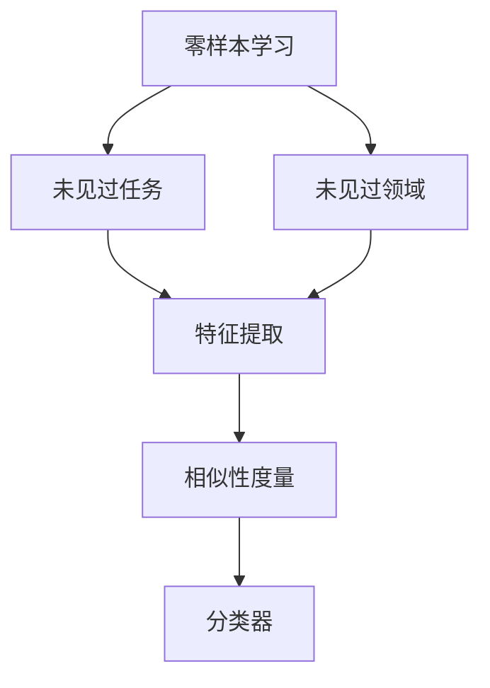
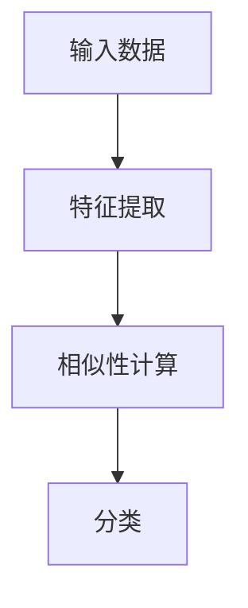
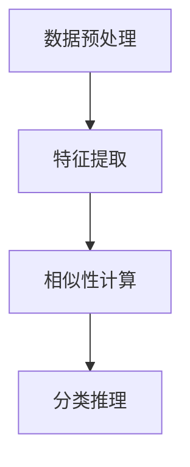
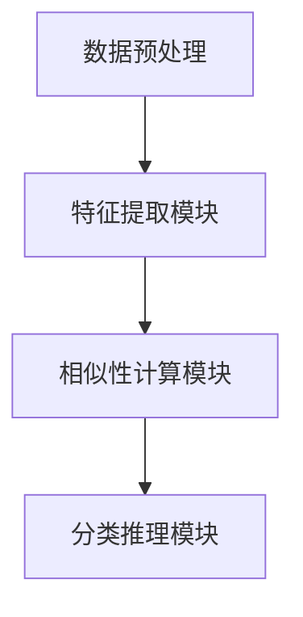
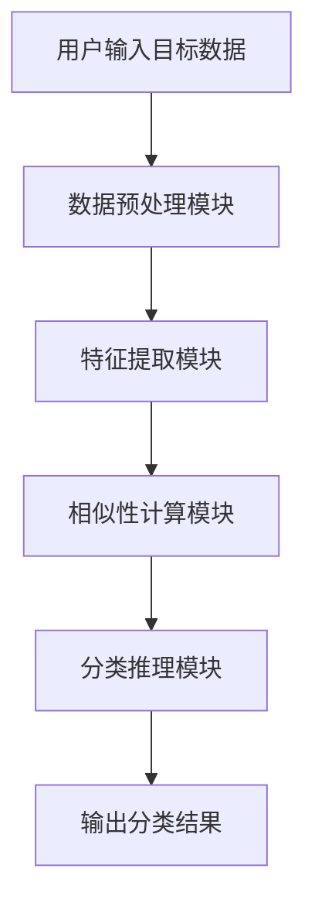

                 


# 零样本学习：应对未见过的任务和领域

> 关键词：零样本学习，未见过任务，领域迁移，特征提取，相似性度量，机器学习

> 摘要：零样本学习是一种新兴的机器学习范式，旨在在没有见过的任务和领域上实现有效的学习和推理。本文系统地介绍了零样本学习的核心概念、算法原理、系统架构以及实际应用，帮助读者全面理解这一技术的潜力和挑战。

---

# 第一部分: 零样本学习的背景与核心概念

## 第1章: 零样本学习的定义与问题背景

### 1.1 零样本学习的定义
零样本学习（Zero-shot Learning，ZSL）是一种机器学习范式，其核心目标是在没有训练数据的情况下，模型能够直接处理未见过的任务或领域。与传统的监督学习不同，零样本学习依赖于领域知识和任务间的关系，通过跨任务或跨领域的信息共享来实现泛化能力。

#### 1.1.1 零样本学习的定义
零样本学习是指在无监督或弱监督条件下，利用领域知识图谱、语义关系或特征表示等手段，将已知领域的知识迁移到未见过的任务或领域上，从而实现对未知数据的分类、回归或生成。

#### 1.1.2 零样本学习的核心目标
- 在未见过的任务或领域上实现准确的预测或分类。
- 利用领域间的共享特征或语义关系，减少对新任务数据的依赖。
- 提高模型的泛化能力，使其能够适应多样化的应用场景。

#### 1.1.3 零样本学习的适用场景
- 数据获取成本高昂，无法为每个新任务收集大量数据。
- 需要处理领域多样化的任务，且每个领域的数据量有限。
- 对模型的通用性和灵活性要求较高。

### 1.2 零样本学习的问题背景
零样本学习的提出源于机器学习领域中数据获取和任务多样性的双重挑战。

#### 1.2.1 数据获取的挑战
在实际应用中，许多领域或任务的数据获取成本高昂，例如医学图像分析、小语种自然语言处理等场景。传统的监督学习方法需要大量标注数据，而零样本学习通过共享领域知识，降低了数据依赖性。

#### 1.2.2 领域迁移的必要性
在多领域或多任务的应用场景中，模型需要能够快速适应新领域或新任务。零样本学习通过跨领域的特征共享，实现了领域间的知识迁移，从而避免了每个领域都需要独立训练的高成本。

#### 1.2.3 未见过任务的处理方法
传统的迁移学习方法依赖于源任务和目标任务之间的相似性，而零样本学习则进一步扩展了这一概念，允许模型在没有任何目标任务数据的情况下直接进行推理。

### 1.3 零样本学习与其他学习范式的对比
为了更好地理解零样本学习的核心思想，我们需要将其与其他相关学习范式进行对比。

#### 1.3.1 监督学习
- **定义**：监督学习通过大量标注数据进行模型训练，适用于已知任务。
- **特点**：需要大量标注数据，不适用于新任务或新领域。
- **对比**：零样本学习不需要目标任务数据，适用于未见过任务。

#### 1.3.2 迁移学习
- **定义**：迁移学习通过共享源任务和目标任务之间的特征或参数，实现跨任务的学习。
- **特点**：需要目标任务的部分数据或相似性，适用于领域迁移。
- **对比**：零样本学习进一步减少了对目标任务数据的依赖，适用于完全未见过的任务。

#### 1.3.3 对比学习
- **定义**：对比学习通过学习数据间的相似性或不相似性，进行无监督或自监督学习。
- **特点**：适用于无标签数据，但需要设计有效的对比策略。
- **对比**：零样本学习结合了特征提取和相似性度量，适用于未见过任务的分类。

### 1.4 零样本学习的应用价值
零样本学习在多个领域具有重要的应用价值，特别是在数据获取成本高、任务多样性要求高的场景中。

#### 1.4.1 减少数据依赖
通过共享领域知识和特征提取，零样本学习减少了对目标任务数据的依赖，降低了数据获取成本。

#### 1.4.2 提高模型泛化能力
零样本学习通过跨领域的特征共享，提高了模型的泛化能力，使其能够适应多样化的任务和领域。

#### 1.4.3 支持小样本或零样本任务
在数据量极小或为零的场景中，零样本学习能够通过领域间的知识迁移，实现有效的任务处理。

---

## 第2章: 零样本学习的核心概念与联系

### 2.1 零样本学习的原理
零样本学习的实现依赖于以下几个关键步骤：特征提取、相似性度量和分类推理。

#### 2.1.1 特征提取与表示学习
- **特征提取**：通过编码器、词嵌入或其他表示方法，将输入数据（如图像、文本）映射到一个低维的特征空间。
- **表示学习**：利用深度学习模型（如卷积神经网络、循环神经网络）提取数据的高阶特征表示。

#### 2.1.2 相似性度量与分类
- **相似性度量**：基于特征空间中的距离或相似性度量（如余弦相似度、欧氏距离），计算目标数据与已知类别的相似性。
- **分类推理**：根据相似性度量结果，将目标数据分类到最相似的类别或任务。

#### 2.1.3 领域适应与任务迁移
- **领域适应**：通过共享特征或参数，实现不同领域之间的知识迁移。
- **任务迁移**：利用领域间的语义关系，将已知任务的知识迁移到未见过的任务。

### 2.2 核心概念对比表
为了更好地理解零样本学习的核心概念，我们将其与相关术语进行对比。

| 概念 | 零样本学习 | 监督学习 | 迁移学习 |
|------|------------|----------|----------|
| 数据需求 | 无 | 有标注 | 部分标注 |
| 适用场景 | 未见过任务 | 已知任务 | 跨领域任务 |
| 核心技术 | 特征提取+相似性度量 | 标签分类 | 预训练+微调 |

### 2.3 实体关系图
零样本学习的核心要素之间的关系可以通过以下实体关系图表示：



---

## 第3章: 零样本学习的算法原理

### 3.1 基于特征的零样本学习
基于特征的零样本学习通过提取数据的特征表示，利用相似性度量进行分类。

#### 3.1.1 算法流程


#### 3.1.2 特征提取方法
##### 3.1.2.1 线性变换
- **方法**：通过线性变换（如PCA）将高维数据映射到低维空间。
- **优点**：简单高效，适合处理线性可分的数据。
- **缺点**：无法捕捉复杂的非线性关系。

##### 3.1.2.2 非线性变换
- **方法**：利用深度学习模型（如CNN、RNN）提取非线性特征。
- **优点**：能够捕捉复杂的特征关系。
- **缺点**：需要大量计算资源。

##### 3.1.2.3 聚类分析
- **方法**：通过聚类算法（如K-means）提取特征簇。
- **优点**：适用于无监督场景。
- **缺点**：需要预先确定簇的数量。

### 3.2 基于度量的零样本学习
基于度量的零样本学习通过学习数据间的相似性度量，进行分类或回归。

#### 3.2.1 度量学习
- **方法**：学习一个度量矩阵，使得相似的数据点距离更近，不相似的数据点距离更远。
- **优点**：能够捕捉数据间的语义关系。
- **缺点**：需要设计有效的度量学习目标函数。

#### 3.2.2 度量矩阵构建
- **方法**：利用已知数据对构建相似性矩阵，通过优化算法学习度量矩阵。
- **优点**：适用于多任务学习场景。
- **缺点**：计算复杂度较高。

#### 3.2.3 度量应用
- **方法**：将目标数据与已知数据进行相似性计算，基于度量结果进行分类。
- **优点**：能够利用领域间的相似性信息。
- **缺点**：需要预先构建相似性矩阵。

### 3.3 基于概率的零样本学习
基于概率的零样本学习通过概率建模，计算目标数据的后验概率。

#### 3.3.1 贝叶斯方法
- **方法**：利用贝叶斯定理，计算目标数据属于每个类别的后验概率。
- **优点**：能够处理类别间的概率关系。
- **缺点**：需要预先确定先验概率。

#### 3.3.2 概率模型构建
- **方法**：构建概率生成模型（如高斯混合模型），基于模型推断目标数据的类别。
- **优点**：能够处理复杂的概率分布。
- **缺点**：需要大量计算资源。

#### 3.3.3 概率分类
- **方法**：基于概率模型，计算目标数据的条件概率，选择概率最高的类别。
- **优点**：适用于概率建模场景。
- **缺点**：需要设计复杂的概率模型。

### 3.4 基于生成对抗网络的零样本学习
基于生成对抗网络的零样本学习通过生成对抗训练，学习数据的分布表示。

#### 3.4.1 GAN结构
- **方法**：利用生成器和判别器的对抗训练，学习数据的生成分布。
- **优点**：能够生成高质量的特征表示。
- **缺点**：训练不稳定，需要精心设计的损失函数。

#### 3.4.2 对抗训练
- **方法**：通过对抗训练，优化生成器和判别器的参数，使得生成数据能够欺骗判别器。
- **优点**：适用于生成式学习场景。
- **缺点**：需要大量计算资源和优化技巧。

---

## 第4章: 零样本学习的系统架构设计

### 4.1 问题场景介绍
零样本学习的系统架构设计需要解决以下问题：
- 如何高效地提取数据的特征表示？
- 如何构建领域间的相似性度量？
- 如何实现零样本任务的分类推理？

### 4.2 系统功能设计
系统功能模块包括：
- 数据预处理模块：对输入数据进行清洗和标准化。
- 特征提取模块：利用深度学习模型提取数据的特征表示。
- 相似性计算模块：基于特征表示计算数据间的相似性度量。
- 分类推理模块：根据相似性结果进行目标数据的分类。

#### 4.2.1 领域模型设计


#### 4.2.2 系统架构设计


#### 4.2.3 系统接口设计
系统接口包括：
- 输入接口：接收目标数据和已知数据。
- 输出接口：返回目标数据的分类结果。
- 参数配置接口：配置系统参数，如特征提取模型、相似性度量方法等。

#### 4.2.4 系统交互流程图


---

## 第5章: 零样本学习的项目实战

### 5.1 环境安装
- **Python版本**：3.6及以上
- **深度学习框架**：TensorFlow或PyTorch
- **其他依赖**：Scikit-learn、Matplotlib

### 5.2 系统核心实现
#### 5.2.1 特征提取模块
```python
import tensorflow as tf
from tensorflow.keras import layers

def feature_extractor(input_shape):
    model = tf.keras.Sequential()
    model.add(layers.Conv2D(32, (3,3), activation='relu', input_shape=input_shape))
    model.add(layers.MaxPooling2D((2,2)))
    model.add(layers.Conv2D(64, (3,3), activation='relu'))
    model.add(layers.MaxPooling2D((2,2)))
    model.add(layers.Flatten())
    model.add(layers.Dense(128, activation='relu'))
    return model
```

#### 5.2.2 相似性计算模块
```python
from sklearn.metrics.pairwise import cosine_similarity

def compute_similarity(features):
    similarity_matrix = cosine_similarity(features)
    return similarity_matrix
```

#### 5.2.3 分类推理模块
```python
import numpy as np

def classify(features, similarity_matrix, labels):
    similarities = compute_similarity(features)
    predictions = []
    for feature in features:
        sims = similarity_matrix.dot(feature)
        sims = sims / np.linalg.norm(sims)
        sims = sims / np.linalg.norm(feature)
        prediction = np.argmax(sims)
        predictions.append(labels[prediction])
    return predictions
```

### 5.3 实际案例分析
#### 5.3.1 图像分类案例
- **环境安装**：安装TensorFlow、Keras、Scikit-learn。
- **代码实现**：
  ```python
  import tensorflow as tf
  from tensorflow.keras import datasets, layers, models
  from sklearn.metrics import accuracy_score

  # 加载数据
  (train_images, train_labels), (test_images, test_labels) = datasets.cifar10.load_data()

  # 特征提取
  feature_model = feature_extractor((32, 32, 3))
  extracted_features = feature_model.predict(test_images)

  # 相似性计算
  similarity_matrix = compute_similarity(extracted_features)

  # 分类推理
  predictions = classify(extracted_features, similarity_matrix, train_labels)
  accuracy = accuracy_score(test_labels.flatten(), predictions)
  print(f"Accuracy: {accuracy}")
  ```

#### 5.3.2 文本分类案例
- **环境安装**：安装TensorFlow、Keras、Scikit-learn。
- **代码实现**：
  ```python
  import tensorflow as tf
  from tensorflow.keras import layers
  from sklearn.metrics import accuracy_score

  # 加载数据
  from sklearn.datasets import fetch_20newsgroups

  newsgroups = fetch_20newsgroups()
  train_texts = newsgroups['data']
  train_labels = newsgroups['target']

  # 特征提取
  from tensorflow.keras.preprocessing.text import Tokenizer
  tokenizer = Tokenizer(num_words=10000)
  tokenizer.fit_on_texts(train_texts)
  train_sequences = tokenizer.texts_to_sequences(train_texts)

  # 相似性计算
  from sklearn.feature_extraction.text import TfidfVectorizer

  vectorizer = TfidfVectorizer(ngram_range=(1,2))
  train_features = vectorizer.fit_transform(train_texts)

  # 分类推理
  from sklearn.neighbors import NearestNeighbors

  neighbors = NearestNeighbors(n_neighbors=1).fit(train_features)
  _, indices = neighbors.kneighbors(train_features)
  predictions = [train_labels[indices[i][0]] for i in range(len(train_features))]
  accuracy = accuracy_score(train_labels, predictions)
  print(f"Accuracy: {accuracy}")
  ```

### 5.4 项目小结
通过实际案例分析，我们可以看到零样本学习在图像分类和文本分类中的应用效果。尽管在某些场景下，零样本学习的准确率可能不如监督学习，但其在数据获取成本高昂的情况下具有重要的应用价值。

---

## 第6章: 零样本学习的最佳实践

### 6.1 小结
零样本学习通过共享领域知识和特征提取，实现了在未见过任务和领域的有效学习。其核心思想是利用领域间的相似性，减少对目标任务数据的依赖。

### 6.2 注意事项
- **数据质量**：零样本学习对数据质量要求较高，尤其是特征提取阶段的数据清洗和标准化。
- **特征选择**：选择合适的特征提取方法，能够显著提高零样本学习的准确率。
- **领域适应**：在跨领域应用中，需要考虑领域间的差异性，避免过度拟合源领域。

### 6.3 拓展阅读
- [Zero-shot Learning: A Comprehensive Survey](https://arxiv.org/abs/2006.14547)
- [Deep Learning for Zero-shot Learning](https://arxiv.org/abs/1604.06924)
- [Generative Adversarial Networks for Zero-shot Learning](https://arxiv.org/abs/1702.05053)

---

# 作者：AI天才研究院/AI Genius Institute & 禅与计算机程序设计艺术 /Zen And The Art of Computer Programming

---

本文系统地介绍了零样本学习的核心概念、算法原理、系统架构以及实际应用，帮助读者全面理解这一技术的潜力和挑战。通过实际案例分析和代码实现，读者可以更好地掌握零样本学习的实现细节和应用场景。希望本文能够为从事机器学习和人工智能研究的读者提供有价值的参考和启发。

