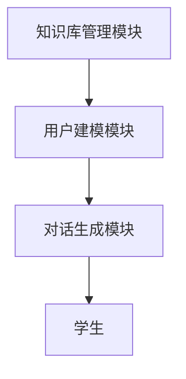

                 


# AI Agent 在教育领域的应用：LLM 驱动的智能导师

---

## 关键词：AI Agent, LLM, 教育技术, 智能导师, 个性化学习, 人工智能, 大语言模型

---

## 摘要

随着人工智能技术的飞速发展，教育领域的智能化转型已成为不可逆转的趋势。本文深入探讨了AI Agent（人工智能代理）在教育中的应用，特别是基于大语言模型（LLM）的智能导师系统。通过分析AI Agent和LLM的核心概念、算法原理、系统架构，以及实际项目案例，本文揭示了LLM驱动的智能导师如何通过个性化学习支持、实时反馈与指导，实现高效的教育体验。文章还结合实际应用场景，详细讲解了系统的实现过程，并总结了最佳实践和未来发展方向。

---

## 第一章: AI Agent与LLM的基本概念

### 1.1 AI Agent的定义与特点

#### 1.1.1 AI Agent的基本概念

AI Agent（人工智能代理）是一种能够感知环境并采取行动以实现目标的智能实体。在教育领域，AI Agent可以以虚拟助手或智能导师的形式，与学生互动并提供学习支持。AI Agent的核心在于其智能化的决策和执行能力，能够根据学生的反馈动态调整教学策略。

#### 1.1.2 AI Agent的核心特点

- **自主性**：AI Agent能够自主决策，无需人工干预。
- **反应性**：能够实时感知环境并做出响应。
- **学习能力**：通过机器学习算法不断优化自身的知识库和决策逻辑。
- **适应性**：能够根据学生的学习进度和风格调整教学策略。

#### 1.1.3 AI Agent与传统教育技术的区别

| 特性       | AI Agent驱动的教育技术 | 传统教育技术 |
|------------|-----------------------|--------------|
| 个性化     | 高度个性化             | 较低          |
| 实时性     | 实时响应               | 延时          |
| 智能性     | 高度智能化             | 较低          |
| 可扩展性   | 易扩展                 | 较难          |

### 1.2 LLM的基本概念与特点

#### 1.2.1 大语言模型的定义

LLM（Large Language Model）是一种基于深度学习的自然语言处理模型，能够理解和生成人类语言。其核心是通过大量数据的预训练，掌握语言的语义结构和上下文关系。

#### 1.2.2 LLM的核心特点

- **大规模训练**：基于海量数据的预训练，具备广泛的知识覆盖。
- **上下文理解**：能够理解复杂文本的上下文关系。
- **生成能力**：能够生成自然语言文本，用于对话、翻译等多种任务。

#### 1.2.3 LLM与AI Agent的结合

AI Agent通过集成LLM，能够实现更智能的自然语言处理功能，包括对话生成、问题解答和内容推荐。这种结合使AI Agent在教育中的应用更加广泛，能够提供更个性化的学习体验。

### 1.3 AI Agent在教育中的核心作用

- **个性化学习支持**：AI Agent能够根据学生的学习情况，提供定制化的学习计划和资源推荐。
- **实时反馈与指导**：通过LLM的实时对话能力，AI Agent能够为学生提供即时的学习反馈和指导。
- **知识整合与扩展**：AI Agent能够整合多个学科的知识点，帮助学生建立跨学科的知识体系。

---

## 第二章: AI Agent在教育中的应用背景

### 2.1 教育技术的发展趋势

#### 2.1.1 从传统教育到现代教育技术

传统教育主要依赖教师的面对面教学，而现代教育技术通过引入人工智能、大数据和云计算等技术，推动教育的智能化和个性化。

#### 2.1.2 AI与教育的深度融合

AI技术的引入，使得教育系统能够更高效地处理学生数据，提供个性化的学习体验。AI Agent作为其中的重要组成部分，正在改变传统的教学模式。

#### 2.1.3 LLM在教育中的潜力

LLM的强大生成能力和理解能力，使其在教育领域具有广泛的应用潜力，包括智能辅导、作业批改和学习资源推荐等。

### 2.2 教育中的AI Agent优势

#### 2.2.1 个性化学习支持

AI Agent能够根据学生的学习进度和兴趣，提供个性化的学习计划和资源推荐，帮助学生更高效地掌握知识。

#### 2.2.2 实时反馈与指导

通过实时分析学生的学习行为和表现，AI Agent能够提供即时的反馈和指导，帮助学生及时纠正错误，提升学习效果。

#### 2.2.3 跨学科知识整合

AI Agent能够整合多个学科的知识点，帮助学生建立跨学科的知识体系，提升综合能力。

### 2.3 LLM驱动的智能导师系统

#### 2.3.1 系统的核心功能

- **知识库管理**：整合多学科的知识点，提供丰富的学习资源。
- **用户建模**：通过分析学生的行为数据，建立个性化的学习模型。
- **对话生成**：通过LLM生成自然的对话，与学生进行互动。

#### 2.3.2 系统的目标用户

- **学生**：需要个性化学习支持的学生。
- **教师**：希望通过AI工具辅助教学的教师。
- **教育机构**：希望提升教育效率的学校或教育机构。

---

## 第三章: LLM驱动的智能导师系统

### 3.1 智能导师系统的定义

智能导师系统是一种基于AI技术的教育辅助系统，通过整合知识库、用户建模和对话生成等模块，为学生提供个性化的学习支持。

### 3.2 LLM在智能导师中的角色

#### 3.2.1 作为知识库的管理者

LLM能够管理和更新知识库，确保知识的准确性和时效性。

#### 3.2.2 作为对话生成器

通过自然语言处理能力，LLM能够与学生进行对话，提供实时的反馈和指导。

#### 3.2.3 作为学习策略的制定者

基于学生的学习数据，LLM能够制定个性化的学习策略，优化学习效果。

### 3.3 智能导师系统的实现过程

#### 3.3.1 知识库的构建

- **数据收集**：收集多学科的知识点，构建结构化的知识库。
- **数据清洗**：去除冗余和不准确的数据，确保知识库的准确性。
- **数据存储**：将知识库存储在数据库中，方便快速检索。

#### 3.3.2 用户建模

- **用户画像**：基于学生的学习数据，构建个性化的用户画像。
- **学习路径规划**：根据用户的学习目标和兴趣，制定个性化的学习路径。

#### 3.3.3 对话生成

- **对话逻辑设计**：设计对话的流程和逻辑，确保对话的流畅性。
- **对话内容生成**：通过LLM生成自然的对话内容，与学生进行互动。

---

## 第四章: LLM驱动的智能导师系统实现

### 4.1 系统架构设计

#### 4.1.1 系统功能模块

- **知识库管理模块**：负责知识库的构建和维护。
- **用户建模模块**：负责用户画像的构建和学习路径的规划。
- **对话生成模块**：负责与学生进行对话，提供实时的反馈和指导。

#### 4.1.2 系统架构图



### 4.2 对话生成算法

#### 4.2.1 对话生成逻辑

1. 接收学生的输入。
2. 分析输入的内容，提取关键信息。
3. 根据知识库和用户建模结果，生成合适的回复。
4. 输出回复内容。

#### 4.2.2 对话生成示例

- **学生输入**：我需要学习数学中的二次方程。
- **系统回复**：好的，我将为你提供相关的学习资源和练习题。

### 4.3 对话生成的数学模型

对话生成的数学模型通常基于概率论，例如：

$$ P(y|x) = \frac{1}{\sqrt{2\pi\sigma^2}} e^{-\frac{(x-\mu)^2}{2\sigma^2}} $$

其中，$$x$$ 是输入，$$y$$ 是输出，$$\mu$$ 是均值，$$\sigma^2$$ 是方差。

---

## 第五章: 项目实战

### 5.1 项目背景与目标

#### 5.1.1 项目背景

本项目旨在开发一个基于LLM的智能导师系统，为学生提供个性化的学习支持。

#### 5.1.2 项目目标

- 实现知识库的构建与管理。
- 开发用户建模模块，制定个性化的学习策略。
- 实现对话生成模块，与学生进行实时互动。

### 5.2 环境安装

#### 5.2.1 安装Python

```bash
python --version
```

确保安装了Python 3.8或更高版本。

#### 5.2.2 安装必要的库

```bash
pip install numpy
pip install pandas
pip install transformers
```

---

## 第六章: 系统优化与测试

### 6.1 系统优化

#### 6.1.1 知识库优化

- 定期更新知识库，确保内容的准确性和时效性。
- 增加多语言支持，满足不同学生的需求。

#### 6.1.2 对话生成优化

- 提高对话生成的流畅性，优化用户体验。
- 增加情感分析功能，理解学生的情感状态。

### 6.2 系统测试

#### 6.2.1 功能测试

- 知识库的准确性和完整性。
- 对话生成的流畅性和准确性。

#### 6.2.2 性能测试

- 系统的响应速度和稳定性。
- 多用户同时访问时的性能表现。

---

## 第七章: 总结与展望

### 7.1 总结

AI Agent在教育领域的应用前景广阔，特别是基于LLM的智能导师系统，能够为学生提供个性化的学习支持。通过本文的详细讲解，读者可以深入了解AI Agent和LLM的核心概念、算法原理和系统架构，为实际应用提供理论支持。

### 7.2 展望

未来，随着AI技术的不断发展，AI Agent在教育中的应用将更加广泛和深入。通过进一步优化知识库、对话生成和用户建模模块，智能导师系统将能够提供更加智能化和个性化的学习支持，推动教育的全面智能化转型。

---

## 作者：AI天才研究院 & 禅与计算机程序设计艺术

---

本文通过系统化的讲解，全面剖析了AI Agent在教育领域的应用，特别是基于LLM的智能导师系统的实现与优化。希望本文能够为教育领域的技术实践者和研究者提供有价值的参考和启发。

