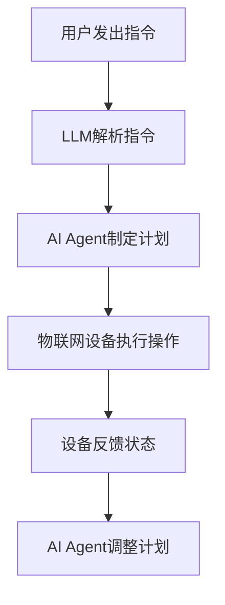
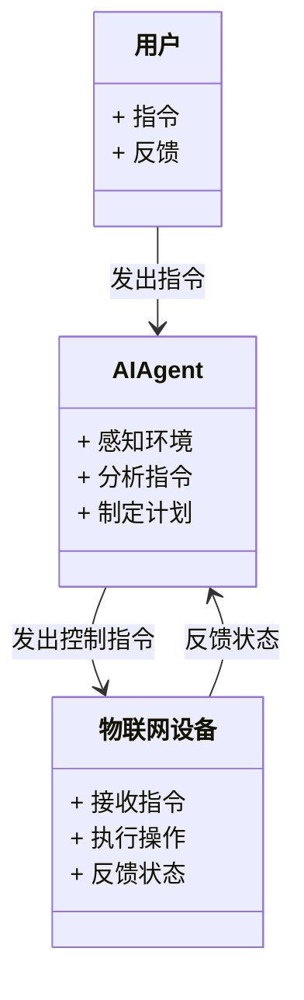
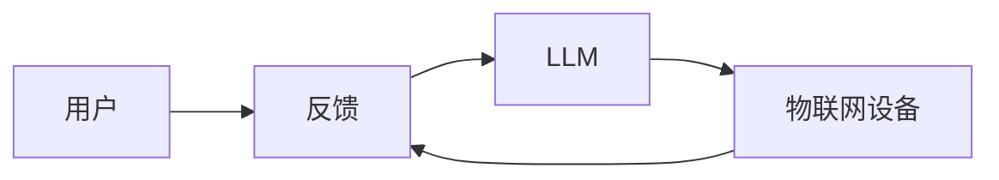
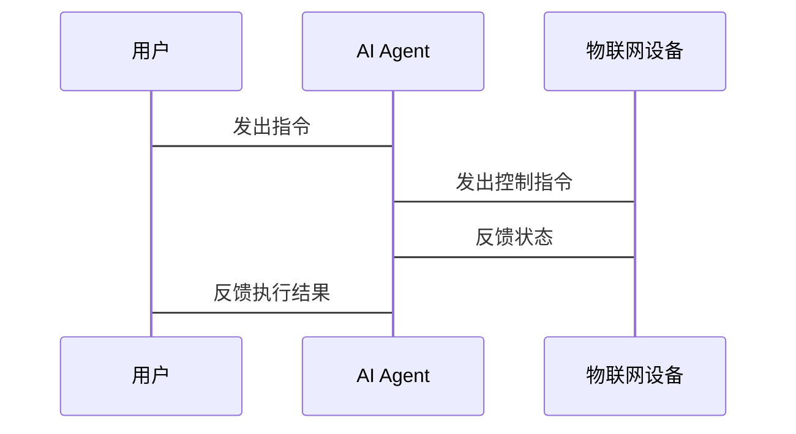

                 


# AI Agent 在智能家居中的应用：LLM 控制物联网设备

## 关键词：AI Agent, LLM, 智能家居, 物联网设备, 自然语言处理, 智能控制, 自动化系统

## 摘要：
本文探讨AI Agent如何通过大语言模型（LLM）控制物联网设备，提升智能家居的智能化水平。通过详细分析AI Agent与LLM的核心原理，系统架构设计，以及实际应用场景，本文展示了如何实现智能家居中的智能设备控制。文章还提供了具体的代码实现和案例分析，总结了最佳实践和注意事项。

---

## 第1章: AI Agent与智能家居概述

### 1.1 AI Agent的基本概念

#### 1.1.1 什么是AI Agent
AI Agent（人工智能代理）是指能够感知环境、自主决策并执行任务的智能实体。它通过传感器获取信息，利用算法进行分析，并通过执行器与环境交互。

#### 1.1.2 AI Agent的核心特征
- **自主性**：能够在没有外部干预的情况下独立运行。
- **反应性**：能够实时感知环境并做出响应。
- **目标导向**：具有明确的目标，并根据目标做出决策。
- **学习能力**：能够通过经验优化自身行为。

#### 1.1.3 AI Agent与传统自动化的区别
AI Agent不仅仅是被动执行指令的工具，它具备自主决策和学习能力，能够适应复杂多变的环境。

### 1.2 大语言模型（LLM）的基本概念

#### 1.2.1 什么是大语言模型
大语言模型是一种基于深度学习的自然语言处理模型，能够理解和生成人类语言。常见的LLM包括GPT系列、BERT等。

#### 1.2.2 LLM的核心技术特点
- **大规模训练**：通过海量数据训练，具备强大的语言理解能力。
- **上下文理解**：能够理解对话的上下文，提供连贯的响应。
- **多任务处理**：支持多种语言处理任务，如翻译、问答、文本生成等。

#### 1.2.3 LLM与AI Agent的关系
LLM作为AI Agent的核心组件，负责处理自然语言指令，提供决策支持。

### 1.3 智能家居的定义与现状

#### 1.3.1 智能家居的定义
智能家居是指通过物联网技术将家中的设备连接起来，实现智能化管理和控制的居住环境。

#### 1.3.2 智能家居的发展历程
从简单的设备连接到智能化控制，智能家居经历了多个发展阶段，目前正向高度智能化和个性化方向发展。

#### 1.3.3 当前智能家居的主要技术
- **物联网技术**：设备互联互通的基础。
- **自然语言处理**：提升用户交互体验。
- **人工智能**：实现智能化决策和控制。

## 第2章: AI Agent在智能家居中的应用背景

### 2.1 智能家居中的问题与挑战

#### 2.1.1 设备互联互通的难点
不同品牌和类型的设备之间存在兼容性问题，导致互联互通困难。

#### 2.1.2 用户交互的便捷性问题
传统的手动控制或简单的语音指令难以满足用户的复杂需求。

#### 2.1.3 智能家居系统的智能化升级需求
用户对智能家居系统的智能化和个性化需求日益增长，传统系统难以满足。

### 2.2 LLM在智能家居中的应用潜力

#### 2.2.1 LLM的自然语言处理能力
LLM能够理解复杂的自然语言指令，支持多轮对话，提升用户体验。

#### 2.2.2 LLM在设备控制中的应用
通过LLM解析用户的自然语言指令，AI Agent能够精准控制物联网设备。

#### 2.2.3 LLM在智能家居场景中的创新应用
LLM可以实现场景化服务，如智能安防、能源管理、健康监测等，提升智能家居的综合服务能力。

### 2.3 本章小结

---

## 第3章: AI Agent与LLM的核心概念与联系

### 3.1 AI Agent与LLM的核心原理

#### 3.1.1 AI Agent的工作原理
AI Agent通过感知环境、分析信息、制定计划并执行任务来实现目标。

#### 3.1.2 LLM的工作原理
LLM通过深度学习模型处理自然语言数据，生成与输入匹配的输出。

#### 3.1.3 AI Agent与LLM的结合
AI Agent利用LLM的自然语言处理能力，实现更智能的设备控制和用户交互。

### 3.2 核心概念属性对比

| 核心概念 | AI Agent | LLM |
|----------|-----------|------|
| 主要功能 | 感知与决策 | 语言处理与生成 |
| 输入 | 环境信息、用户指令 | 文本输入 |
| 输出 | 设备控制指令 | 文本输出 |
| 学习能力 | 可以通过经验优化 | 可以通过数据微调优化 |

### 3.3 ER实体关系图

```mermaid
er
    title 实体关系图
    %% 实体：AI Agent、物联网设备、用户
    %% 关系：AI Agent控制物联网设备，用户与AI Agent交互
    rectangle AI Agent {
        + 感知环境
        + 分析信息
        + 制定计划
        + 执行任务
    }
    rectangle 物联网设备 {
        + 接收指令
        + 执行操作
        + 反馈状态
    }
    rectangle 用户 {
        + 发出指令
        + 接收反馈
    }
    AI Agent -->> 物联网设备: 控制
    用户 -->> AI Agent: 交互
```

### 3.4 本章小结

---

## 第4章: 算法原理讲解

### 4.1 LLM的算法原理

#### 4.1.1 Transformer模型
Transformer是一种基于注意力机制的深度学习模型，广泛应用于自然语言处理任务。

#### 4.1.2 注意力机制
注意力机制通过计算输入序列中每个位置的重要性，提高模型的上下文理解能力。

#### 4.1.3 LLM的训练过程
1. 数据预处理
2. 模型构建
3. 模型训练
4. 模型优化

### 4.2 AI Agent的算法原理

#### 4.2.1 感知与决策算法
- **感知算法**：通过传感器获取环境信息。
- **决策算法**：基于感知信息制定行动方案。

#### 4.2.2 执行算法
AI Agent根据决策结果生成控制指令，通过执行器作用于环境。

### 4.3 算法流程图



### 4.4 代码实现

#### 4.4.1 LLM的Python代码示例

```python
import torch
import torch.nn as nn

class Transformer(nn.Module):
    def __init__(self, input_dim, hidden_dim):
        super(Transformer, self).__init__()
        self.encoder = nn.Embedding(input_dim, hidden_dim)
        self.decoder = nn.Linear(hidden_dim, input_dim)

    def forward(self, input_seq):
        encoded = self.encoder(input_seq)
        decoded = self.decoder(encoded)
        return decoded
```

#### 4.4.2 AI Agent的Python代码示例

```python
class AI_Agent:
    def __init__(self, llm_model):
        self.llm = llm_model

    def process_command(self, command):
        # 解析指令
        intent = self.llm.parse_command(command)
        # 制定计划
        plan = self.llm.generate_plan(intent)
        # 执行操作
        self.execute_plan(plan)

    def execute_plan(self, plan):
        # 执行具体的设备控制操作
        pass
```

### 4.5 本章小结

---

## 第5章: 数学模型与公式推导

### 5.1 LLM的数学模型

#### 5.1.1 Transformer模型的数学公式
- **自注意力机制**：
  $$\text{Attention}(Q, K, V) = \text{softmax}\left(\frac{QK^T}{\sqrt{d_k}}\right)V$$

- **前馈网络**：
  $$\text{FFN}(x) = \text{ReLU}(W_1x + b_1) + W_2\text{ReLU}(W_1x + b_1) + b_2$$

### 5.2 AI Agent的数学模型

#### 5.2.1 感知模型
$$\text{感知值} = \sum_{i=1}^n w_i s_i$$
其中，\(w_i\) 是传感器权重，\(s_i\) 是传感器读数。

#### 5.2.2 决策模型
$$\text{决策} = \arg\max_{a} \sum_{t=1}^T \text{奖励}(a_t)$$
其中，\(a_t\) 是第\(t\)步的动作，\(T\) 是总步数。

### 5.3 本章小结

---

## 第6章: 系统分析与架构设计方案

### 6.1 系统场景介绍

#### 6.1.1 智能家居场景
用户通过自然语言指令控制智能家居设备，系统通过AI Agent和LLM实现设备的智能化控制。

### 6.2 系统功能设计

#### 6.2.1 领域模型



### 6.3 系统架构设计

#### 6.3.1 总体架构



### 6.4 接口设计

#### 6.4.1 用户接口
- **输入接口**：接收用户的自然语言指令。
- **输出接口**：反馈设备的执行状态。

#### 6.4.2 设备接口
- **输入接口**：接收AI Agent的控制指令。
- **输出接口**：反馈设备的运行状态。

### 6.5 交互流程图



### 6.6 本章小结

---

## 第7章: 项目实战

### 7.1 环境安装

#### 7.1.1 安装Python
```bash
sudo apt-get install python3
```

#### 7.1.2 安装必要的库
```bash
pip install torch transformers
```

### 7.2 系统核心实现

#### 7.2.1 LLM模型实现
```python
from transformers import AutoTokenizer, AutoModel

tokenizer = AutoTokenizer.from_pretrained("gpt2")
model = AutoModel.from_pretrained("gpt2")
```

#### 7.2.2 AI Agent实现
```python
class AI_Agent:
    def __init__(self, llm_model):
        self.llm = llm_model

    def process_command(self, command):
        # 解析指令
        intent = self.llm.parse_command(command)
        # 制定计划
        plan = self.llm.generate_plan(intent)
        # 执行操作
        self.execute_plan(plan)

    def execute_plan(self, plan):
        # 执行具体的设备控制操作
        pass
```

#### 7.2.3 设备控制实现
```python
class SmartDevice:
    def __init__(self, device_type):
        self.type = device_type

    def receive_command(self, command):
        # 解析并执行命令
        pass

    def send_feedback(self):
        # 反馈设备状态
        pass
```

### 7.3 代码应用解读

#### 7.3.1 LLM模型的应用
通过LLM模型解析用户的自然语言指令，生成对应的设备控制指令。

#### 7.3.2 AI Agent的应用
AI Agent接收用户的指令，通过LLM解析后生成设备控制指令，并通过物联网设备执行。

### 7.4 实际案例分析

#### 7.4.1 案例一：智能灯泡控制
用户指令：“请把客厅的灯调暗。”
- AI Agent解析指令，生成控制指令：调整亮度到50%。
- 智能灯泡接收指令并执行。

#### 7.4.2 案例二：智能空调控制
用户指令：“请把空调温度调到25度。”
- AI Agent解析指令，生成控制指令：设置目标温度为25度。
- 智能空调接收指令并执行。

### 7.5 本章小结

---

## 第8章: 最佳实践与注意事项

### 8.1 最佳实践

#### 8.1.1 设备兼容性
确保不同品牌和类型的物联网设备能够互联互通。

#### 8.1.2 用户隐私与安全
重视用户数据的隐私和安全，防止数据泄露和滥用。

#### 8.1.3 系统可扩展性
设计系统时考虑未来的扩展性，方便新增设备和功能。

### 8.2 注意事项

#### 8.2.1 设备兼容性问题
不同设备之间的协议和接口可能存在差异，需要进行适配处理。

#### 8.2.2 用户交互的自然流畅性
确保用户的自然语言指令能够被准确解析，避免歧义和错误。

#### 8.2.3 系统稳定性与可靠性
确保系统在长时间运行中稳定可靠，避免崩溃和故障。

### 8.3 拓展阅读
- 《大语言模型在智能家居中的应用》
- 《人工智能代理与物联网设备控制》
- 《自然语言处理在智能系统中的应用》

### 8.4 本章小结

---

## 第9章: 总结与展望

### 9.1 总结

通过本文的探讨，我们了解了AI Agent如何通过LLM控制物联网设备，实现智能家居的智能化管理。从理论到实践，我们详细分析了AI Agent与LLM的核心原理，系统架构设计，以及实际项目的实现。

### 9.2 展望

随着技术的不断进步，AI Agent与LLM在智能家居中的应用将更加广泛和深入。未来的智能家居系统将更加智能化、个性化，为用户提供更优质的生活体验。

---

## 作者：AI天才研究院 & 禅与计算机程序设计艺术

---

**全文完**

