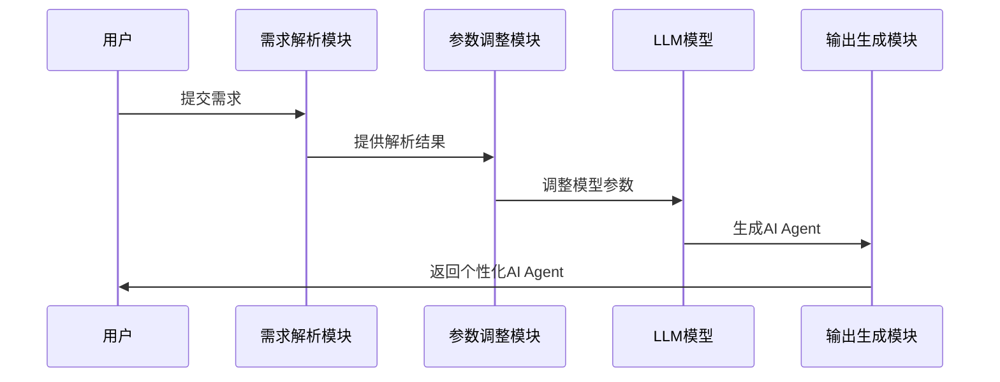

                 


# AI Agent 的个性化定制：调教 LLM 以适应不同用户

## 关键词：
- AI Agent
- 大语言模型
- 个性化定制
- 用户需求
- 模型调教

## 摘要：
本文详细探讨了如何通过个性化定制AI Agent来满足不同用户的需求，重点分析了大语言模型（LLM）在个性化定制中的核心概念、算法原理和系统架构。通过实际案例分析和代码实现，本文展示了如何根据用户需求调整LLM的参数和功能，以实现高度个性化的AI Agent。文章还总结了个性化定制的关键点和未来发展方向。

---

# 第二部分: AI Agent 的个性化定制实现

# 第4章: 系统分析与架构设计

## 4.1 系统功能设计
### 4.1.1 需求分析
- 用户输入：自然语言描述需求
- 系统输出：个性化AI Agent

### 4.1.2 功能模块划分
- 需求解析模块：解析用户需求，提取关键参数
- 参数调整模块：根据需求调整LLM的模型参数
- 输出生成模块：基于调整后的模型生成个性化AI Agent

## 4.2 系统架构设计


## 4.3 系统接口设计
### 4.3.1 输入接口
- REST API：接收用户需求
- 数据格式：JSON

### 4.3.2 输出接口
- REST API：返回个性化AI Agent
- 数据格式：JSON

## 4.4 系统交互流程


## 4.5 本章小结
...

# 第5章: 项目实战与案例分析

## 5.1 环境配置
### 5.1.1 安装依赖
```bash
pip install torch transformers
```

### 5.1.2 环境要求
- Python 3.8+
- CUDA支持（可选）

## 5.2 核心代码实现
### 5.2.1 需求解析模块
```python
def parse_request(request):
    # 解析用户需求，提取关键参数
    # 返回解析结果
    pass
```

### 5.2.2 参数调整模块
```python
def adjust_parameters(model, params):
    # 根据解析结果调整模型参数
    # 返回调整后的模型
    pass
```

### 5.2.3 输出生成模块
```python
def generate_agent(model):
    # 基于调整后的模型生成AI Agent
    # 返回生成结果
    pass
```

## 5.3 案例分析
### 5.3.1 案例背景
- 用户需求：个性化聊天机器人

### 5.3.2 实现步骤
1. 解析用户需求，提取关键参数
2. 调整LLM模型参数
3. 生成个性化AI Agent

### 5.3.3 实现代码
```python
def main():
    request = input("请输入您的需求：")
    model = load_model()
    parsed_params = parse_request(request)
    adjusted_model = adjust_parameters(model, parsed_params)
    agent = generate_agent(adjusted_model)
    print("生成个性化AI Agent完成！")

if __name__ == "__main__":
    main()
```

## 5.4 案例分析与总结
### 5.4.1 案例实现过程
- 解析用户需求：提取关键词和意图
- 调整模型参数：根据需求调整生成策略
- 生成AI Agent：输出符合用户需求的个性化结果

### 5.4.2 实现中的关键点
- 需求解析的准确性
- 参数调整的合理性
- 输出生成的稳定性

## 5.5 本章小结
...

# 第6章: 总结与展望

## 6.1 核心内容总结
- AI Agent 的个性化定制是根据用户需求调整LLM模型的关键
- 通过参数调整和功能模块设计，可以实现高度个性化的AI Agent
- 系统架构设计和代码实现是实现个性化定制的重要保障

## 6.2 未来发展方向
- 更智能的需求解析方法
- 更高效的参数调整算法
- 更灵活的系统架构设计

## 6.3 最佳实践 Tips
- 在需求解析中，建议使用多种特征提取方法
- 在参数调整中，建议结合领域知识进行优化
- 在系统设计中，建议采用模块化设计，便于维护和扩展

## 6.4 本章小结
...

---

作者：AI天才研究院/AI Genius Institute & 禅与计算机程序设计艺术 /Zen And The Art of Computer Programming

---

**注意**：由于篇幅限制，以上目录和内容仅为示例，实际文章需要根据上述结构进一步扩展每个部分的具体内容，包括详细的技术分析、代码实现、案例解读等。

