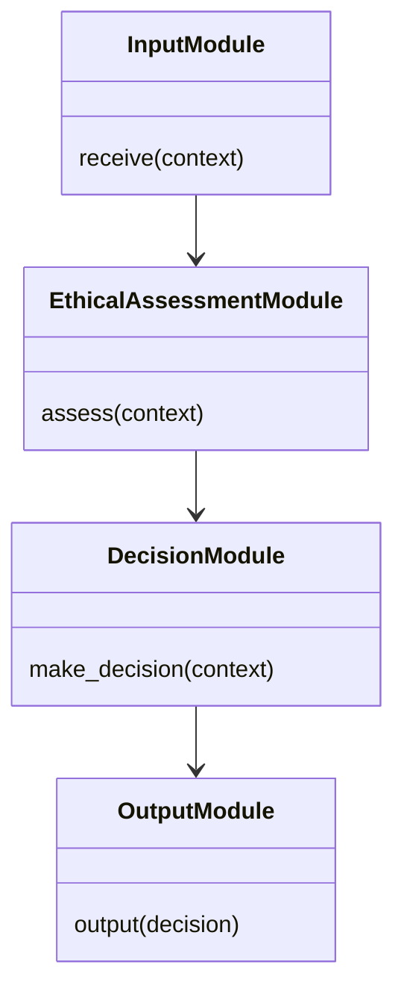

                 


# AI Agent 的伦理决策：在 LLM 中植入道德框架

> 关键词：AI Agent, 伦理决策, LLM, 道德框架, 人工智能伦理, 系统架构

> 摘要：随着人工智能技术的快速发展，AI Agent在各个领域的应用日益广泛。然而，AI Agent的决策过程往往缺乏明确的伦理指导，导致潜在的伦理风险。本文将探讨如何在大型语言模型（LLM）中植入道德框架，以确保AI Agent的决策既符合伦理规范，又能满足实际应用的需求。通过详细分析伦理决策的背景、核心概念、算法实现、系统架构及实际案例，本文为构建具备伦理决策能力的AI系统提供了理论支持和实践指导。

---

# 目录

1. **AI Agent 伦理决策的背景与问题**
2. **伦理框架的核心概念**
3. **伦理框架的算法实现**
4. **伦理决策系统的架构**
5. **项目实战：在LLM中植入伦理框架**
6. **最佳实践与小结**

---

# 1. AI Agent 伦理决策的背景与问题

## 1.1 伦理决策的背景

### 1.1.1 AI Agent 的发展与挑战

随着人工智能技术的快速发展，AI Agent（智能体）在各个领域的应用日益广泛。从自动驾驶到智能助手，AI Agent通过复杂的决策过程为人类提供服务。然而，随着应用场景的复杂化，AI Agent的决策过程逐渐暴露出伦理问题。

### 1.1.2 伦理决策的重要性

AI Agent的决策直接影响用户的安全和利益。例如，在自动驾驶中，AI Agent需要在紧急情况下做出决策，这可能涉及生命安全。伦理决策的重要性在于确保AI的行为符合社会道德规范，避免引发伦理争议。

### 1.1.3 当前AI Agent的伦理困境

当前，许多AI Agent的决策过程缺乏明确的伦理指导，导致以下问题：
- **决策不可控性**：AI可能做出不符合人类伦理的决策。
- **用户信任问题**：用户对AI的决策缺乏信任。
- **伦理框架的缺失**：缺乏统一的伦理规范，导致决策混乱。

---

## 1.2 问题描述

### 1.2.1 AI决策的不可控性

AI Agent的决策过程往往基于复杂的算法，但缺乏明确的伦理约束。这可能导致AI做出违背人类伦理的选择。

### 1.2.2 用户信任问题

用户对AI的决策缺乏理解，导致信任缺失。例如，用户可能不知道AI为何做出某个决策，从而怀疑其合理性。

### 1.2.3 伦理框架的缺失

当前，AI Agent的决策缺乏统一的伦理框架，导致不同系统之间的伦理决策标准不一致。

---

## 1.3 伦理决策的解决思路

### 1.3.1 植入伦理框架的必要性

为了确保AI Agent的决策符合伦理规范，必须在系统中植入伦理框架。这可以帮助AI在决策过程中遵循明确的伦理准则。

### 1.3.2 伦理框架的设计原则

- **明确性**：伦理框架应明确具体的行为准则。
- **可解释性**：框架应易于理解和解释。
- **可扩展性**：框架应能适应不同场景和需求。

### 1.3.3 伦理决策的实现路径

- **规则植入**：将伦理规则嵌入AI的决策算法中。
- **动态调整**：根据实际场景动态调整伦理框架。

---

## 1.4 边界与外延

### 1.4.1 伦理决策的适用范围

伦理决策适用于所有涉及人类安全和利益的AI应用，如医疗、金融、自动驾驶等。

### 1.4.2 与其他AI功能的区分

伦理决策与AI的其他功能（如推荐系统）不同，它专注于确保决策的伦理合规性。

### 1.4.3 伦理框架的可扩展性

伦理框架应具备灵活性，能够根据不同的应用场景进行调整。

---

## 1.5 核心要素组成

### 1.5.1 伦理规则体系

伦理规则体系是伦理框架的核心，包括基本的伦理准则（如不伤害人类）。

### 1.5.2 决策评估机制

决策评估机制用于验证AI的决策是否符合伦理框架。

### 1.5.3 用户反馈机制

用户反馈机制帮助系统不断优化伦理框架，确保决策更符合人类伦理。

---

# 2. 伦理框架的核心概念

## 2.1 伦理框架的定义与属性

### 2.1.1 伦理框架的定义

伦理框架是一种用于指导AI Agent决策的规则和准则的集合，确保决策符合伦理规范。

### 2.1.2 核心属性对比表

| 属性       | 描述                                           |
|------------|-----------------------------------------------|
| 明确性      | 决策准则明确具体                               |
| 可解释性    | 决策过程易于理解和解释                         |
| 可扩展性    | 能够适应不同应用场景                           |
| 动态调整    | 根据反馈不断优化                               |

---

## 2.2 道德决策模型

### 2.2.1 模型结构

道德决策模型通常包括以下几个步骤：
1. **识别问题**：确定决策的情境和目标。
2. **分析选项**：评估所有可能的决策选项。
3. **评估伦理影响**：根据伦理框架评估每个选项的伦理影响。
4. **选择最优决策**：基于评估结果选择最佳决策。

### 2.2.2 实现方式

道德决策模型的实现可以通过规则引擎或基于机器学习的模型来完成。

---

## 2.3 伦理框架与AI Agent的关系

### 2.3.1 依赖关系

AI Agent依赖于伦理框架来指导其决策过程。

### 2.3.2 互动机制

伦理框架通过规则和反馈与AI Agent互动，确保决策的伦理合规性。

---

# 3. 伦理框架的算法实现

## 3.1 基于规则的决策算法

### 3.1.1 算法流程

1. **输入决策情境**：AI Agent接收决策情境。
2. **匹配规则**：根据情境匹配相关伦理规则。
3. **生成决策**：基于匹配的规则生成决策。
4. **输出决策**：输出最终决策。

### 3.1.2 代码实现

```python
def ethical_decision-making(context):
    # 匹配相关伦理规则
    matching_rules = match_rules(context)
    # 评估规则的影响
    evaluated_rules = evaluate_rules(matching_rules)
    # 选择最优决策
    optimal_decision = select_optimal_rule(evaluated_rules)
    return optimal_decision
```

### 3.1.3 示例分析

假设在自动驾驶中，AI面临紧急情况，需要在保护乘客和保护路人之间做出决策。基于规则的算法会根据预设的伦理规则（如优先保护乘客）生成决策。

---

## 3.2 基于案例的推理算法

### 3.2.1 算法流程

1. **输入决策情境**：AI Agent接收决策情境。
2. **匹配相似案例**：根据情境匹配相似的历史案例。
3. **推理决策**：基于匹配案例推理出决策。
4. **输出决策**：输出最终决策。

### 3.2.2 代码实现

```python
def case_based_reasoning(context):
    # 匹配相似案例
    similar_cases = find_similar_cases(context)
    # 推理决策
    inferred_decision = infer_decision(similar_cases)
    return inferred_decision
```

### 3.2.3 示例分析

在医疗诊断中，AI Agent通过匹配类似病例，推理出最佳诊断方案。

---

## 3.3 基于效用的优化算法

### 3.3.1 算法流程

1. **输入决策情境**：AI Agent接收决策情境。
2. **评估决策的效用**：计算每个决策的效用值。
3. **选择最优决策**：基于效用值选择最优决策。
4. **输出决策**：输出最终决策。

### 3.3.2 代码实现

```python
def utility_based_optimization(context):
    # 评估决策的效用
    utility_values = calculate_utility(context)
    # 选择最优决策
    optimal_decision = select_max_utility(utility_values)
    return optimal_decision
```

### 3.3.3 示例分析

在金融投资中，AI Agent通过评估不同投资方案的效用，选择最佳投资策略。

---

# 4. 伦理决策系统的架构

## 4.1 问题场景介绍

### 4.1.1 使用场景

伦理决策系统广泛应用于自动驾驶、医疗诊断、金融投资等领域。

### 4.1.2 业务流程

1. **接收输入**：系统接收决策情境。
2. **伦理评估**：系统根据伦理框架评估决策。
3. **生成决策**：系统生成符合伦理的决策。
4. **输出结果**：系统输出最终决策。

---

## 4.2 系统功能设计

### 4.2.1 功能模块

- **输入模块**：接收决策情境。
- **评估模块**：评估决策的伦理影响。
- **决策模块**：生成符合伦理的决策。
- **输出模块**：输出最终决策。

### 4.2.2 领域模型

领域模型通过Mermaid类图展示系统各模块之间的关系。



---

## 4.3 系统架构设计

### 4.3.1 模块划分

- **前端模块**：接收用户输入。
- **后端模块**：处理决策逻辑。
- **伦理评估模块**：评估决策的伦理影响。

### 4.3.2 交互流程

后端模块接收前端模块的输入，通过伦理评估模块评估决策，生成决策后返回前端模块。

---

## 4.4 系统接口设计

### 4.4.1 接口

- **输入接口**：接收决策情境。
- **输出接口**：输出最终决策。

---

## 4.5 系统交互设计

### 4.5.1 交互流程

1. 用户通过前端模块输入决策情境。
2. 系统接收输入并传递给后端模块。
3. 后端模块调用伦理评估模块评估决策。
4. 伦理评估模块生成评估结果并返回给后端模块。
5. 后端模块根据评估结果生成决策并返回给前端模块。
6. 用户通过前端模块查看最终决策。

---

# 5. 项目实战：在LLM中植入伦理框架

## 5.1 环境安装

### 5.1.1 安装Python环境

```bash
python -m pip install --user --upgrade pip
python -m pip install transformers
```

### 5.1.2 安装LLM框架

```bash
pip install torch transformers
```

---

## 5.2 核心功能实现

### 5.2.1 伦理框架实现

```python
class EthicalFramework:
    def __init__(self, rules):
        self.rules = rules
```

### 5.2.2 决策算法实现

```python
class DecisionAlgorithm:
    def __init__(self, ethical_framework):
        self.ethical_framework = ethical_framework

    def make_decision(self, context):
        # 匹配规则
        matching_rules = [rule for rule in self.ethical_framework.rules if rule.matches(context)]
        # 评估规则
        evaluated_rules = self.assess_rules(matching_rules)
        # 选择最优规则
        optimal_rule = max(evaluated_rules, key=lambda x: x['utility'])
        return optimal_rule['action']
```

---

## 5.3 实际案例分析

### 5.3.1 案例描述

假设在自动驾驶中，AI面临紧急情况，需要在保护乘客和保护路人之间做出决策。

### 5.3.2 代码实现

```python
# 定义伦理规则
rules = [
    {
        'name': '乘客优先',
        'description': '优先保护乘客的生命安全',
        'matches': lambda context: context['乘客存在'],
        'utility': 0.9
    },
    {
        'name': '路人优先',
        'description': '优先保护路人',
        'matches': lambda context: context['乘客不存在'],
        'utility': 0.7
    }
]

# 初始化伦理框架
ethical_framework = EthicalFramework(rules)

# 创建决策算法
decision_algorithm = DecisionAlgorithm(ethical_framework)

# 输入决策情境
context = {'乘客存在': True}

# 生成决策
decision = decision_algorithm.make_decision(context)
print(decision)  # 输出：乘客优先
```

### 5.3.3 系统输出

最终决策为“乘客优先”。

---

# 6. 最佳实践与小结

## 6.1 小结

本文详细探讨了在LLM中植入伦理框架的必要性、实现方法和系统架构设计。通过具体的案例分析，展示了如何确保AI Agent的决策既符合伦理规范，又能满足实际应用的需求。

## 6.2 注意事项

- **伦理框架的可扩展性**：框架应能够适应不同场景的需求。
- **用户反馈机制**：及时收集用户反馈，优化伦理框架。
- **动态调整**：根据实际情况动态调整伦理框架。

## 6.3 未来研究方向

- **动态伦理框架**：研究如何根据场景动态调整伦理框架。
- **多模态伦理决策**：结合多种数据源进行伦理决策。
- **伦理决策的可解释性**：提升伦理决策的透明度和可解释性。

---

# 作者

作者：AI天才研究院/AI Genius Institute & 禅与计算机程序设计艺术 /Zen And The Art of Computer Programming

