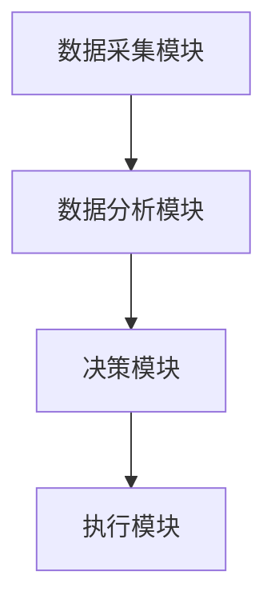
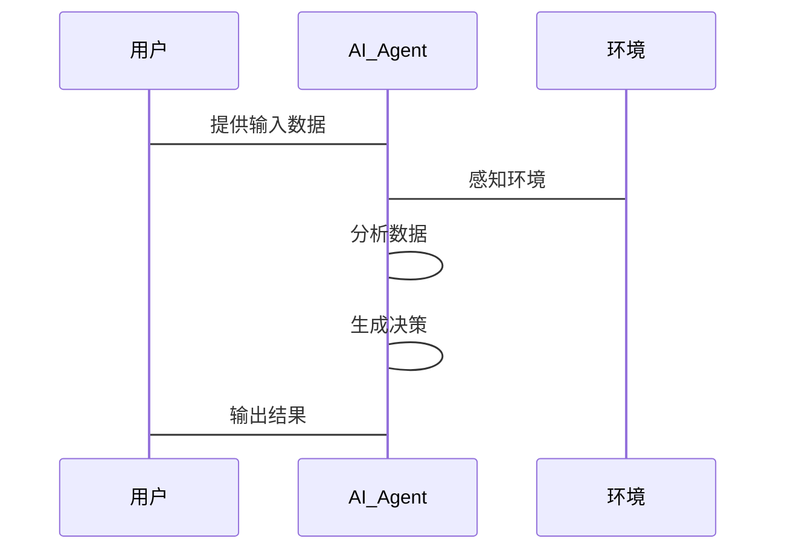

                 


# AI Agent 的伦理约束：LLM 的安全性与道德性设计

## 关键词：AI Agent，LLM，伦理约束，安全性，道德性设计

## 摘要：  
随着大语言模型（LLM）在AI Agent中的广泛应用，伦理约束和道德性设计成为确保AI系统安全性和可靠性的关键。本文深入探讨了AI Agent与LLM的基本概念、伦理约束的重要性、安全性问题、道德性设计的核心原理，以及如何通过系统架构设计和项目实战实现AI Agent的安全性和道德性。文章结合理论与实践，详细分析了AI Agent在实际应用中的伦理挑战，并提出了具体的解决方案和最佳实践。

---

## 第一部分: AI Agent 与 LLM 的基础概念

### 第1章: AI Agent 的基本概念

#### 1.1 AI Agent 的定义与特点

**1.1.1 AI Agent 的定义**  
AI Agent（人工智能代理）是指能够感知环境、自主决策并执行任务的智能实体。它能够通过传感器获取信息，利用推理能力进行分析，并通过执行器与环境交互。

**1.1.2 AI Agent 的核心特点**  
- **自主性**：AI Agent能够在没有外部干预的情况下自主决策。  
- **反应性**：能够实时感知环境变化并做出响应。  
- **目标导向**：基于目标驱动行为，优化决策过程。  
- **学习能力**：通过数据和经验不断优化自身性能。

**1.1.3 AI Agent 与传统程序的区别**  
AI Agent的核心区别在于其具备自主决策和问题解决的能力，而传统程序通常按照预设规则执行任务。

#### 1.2 LLM 的基本概念

**1.2.1 大语言模型的定义**  
LLM（Large Language Model）是指基于深度学习的自然语言处理模型，能够理解和生成人类语言。  

**1.2.2 LLM 的核心特点**  
- **大规模训练数据**：通常使用海量文本数据进行训练。  
- **上下文理解**：能够理解语言的上下文关系。  
- **生成能力**：能够生成连贯且符合逻辑的文本。  
- **可微调性**：可以根据具体任务进行微调。

**1.2.3 LLM 与传统语言模型的区别**  
LLM 的核心优势在于其规模和复杂性，能够处理更复杂的语言任务，并具备更强的生成能力。

#### 1.3 AI Agent 的应用场景

**1.3.1 人工智能在各领域的应用**  
- 医疗：辅助诊断、药物研发。  
- 金融：风险评估、智能投顾。  
- 教育：个性化学习、智能辅导。  
- 交通：自动驾驶、智能导航。  

**1.3.2 AI Agent 在实际场景中的应用案例**  
例如，在智能客服中，AI Agent 可以通过LLM生成自然的对话，为用户提供解决方案。

**1.3.3 LLM 在 AI Agent 中的作用**  
LLM 为AI Agent提供了强大的语言理解和生成能力，使其能够更好地与人类交互并完成复杂任务。

---

### 第2章: AI Agent 的伦理约束背景

#### 2.1 伦理约束的重要性

**2.1.1 为什么需要对 AI Agent 进行伦理约束**  
AI Agent 的自主性和决策能力使其可能对人类社会产生重大影响。例如，自动驾驶汽车的决策可能影响生命安全。

**2.1.2 伦理约束的核心目标**  
确保 AI Agent 的行为符合伦理规范，避免对人类或社会造成伤害。

**2.1.3 伦理约束的实现方式**  
通过在算法设计中加入伦理规则，或者在决策过程中引入伦理评估机制。

#### 2.2 LLM 的安全性问题

**2.2.1 LLM 的潜在风险**  
- **误导性回答**：LLM 可能生成错误或有害的信息。  
- **偏见**：模型可能继承训练数据中的偏见。  
- **滥用**：LLM 可能被用于恶意目的。  

**2.2.2 安全性问题的表现形式**  
- 生成虚假信息。  
- 滥用技术进行犯罪活动。  
- 内部算法漏洞被攻击。  

**2.2.3 安全性问题的解决方案**  
- 数据清洗：去除有害信息。  
- 模型监控：实时监测模型输出。  
- 用户权限控制：限制模型的使用范围。  

#### 2.3 道德性设计的必要性

**2.3.1 道德性设计的核心理念**  
确保 AI Agent 的行为符合社会道德规范，避免对人类造成伤害。

**2.3.2 道德性设计的实现方法**  
- 在模型训练中引入伦理数据。  
- 设计伦理评分机制。  
- 建立伦理审查流程。  

**2.3.3 道德性设计与伦理约束的关系**  
道德性设计是实现伦理约束的重要手段，而伦理约束是道德性设计的目标。

---

## 第二部分: AI Agent 的伦理约束与道德性设计

### 第3章: 伦理约束的核心概念

#### 3.1 伦理约束的理论基础

**3.1.1 伦理学的基本概念**  
伦理学是研究道德原则和行为准则的学科。  

**3.1.2 伦理约束的理论框架**  
- **义务论**：基于行为的义务和责任。  
- **效果论**：基于行为的结果和效用。  
- **美德伦理**：基于行为者的美德和品格。  

**3.1.3 伦理约束与 AI 的结合**  
通过将伦理原则转化为可执行的算法规则，实现 AI Agent 的伦理约束。

#### 3.2 伦理约束的实现机制

**3.2.1 伦理约束的实现方式**  
- **规则约束**：设定明确的伦理规则，限制 AI Agent 的行为。  
- **情境约束**：根据具体情境动态调整伦理规则。  
- **反馈约束**：通过用户反馈优化伦理约束策略。  

**3.2.2 伦理约束的数学模型**  
我们可以将伦理约束表示为一个函数，例如：
$$ f(x) = \begin{cases} 
1 & \text{如果行为符合伦理规范} \\
0 & \text{否则}
\end{cases} $$  

**3.2.3 伦理约束的算法实现**  
在AI Agent的决策过程中，伦理约束可以通过以下步骤实现：
1. 感知环境，获取输入数据。  
2. 分析数据，生成决策候选。  
3. 对每个候选决策进行伦理评估。  
4. 选择符合伦理约束的决策。  

### 第4章: 道德性设计的核心原理

#### 4.1 道德性设计的理论基础

**4.1.1 道德性设计的基本概念**  
道德性设计是指在AI Agent的设计过程中，考虑道德规范和伦理约束。  

**4.1.2 道德性设计的理论框架**  
- **道德框架**：定义 AI Agent 需要遵守的道德原则。  
- **道德推理**：AI Agent 根据道德框架进行推理，生成符合道德的决策。  

**4.1.3 道德性设计与伦理约束的关系**  
道德性设计是实现伦理约束的具体方法，而伦理约束是道德性设计的目标。

#### 4.2 道德性设计的实现机制

**4.2.1 道德性设计的实现方式**  
- **伦理规则嵌入**：将伦理规则嵌入 AI Agent 的算法中。  
- **动态伦理评估**：根据环境变化动态调整伦理评估标准。  
- **多目标优化**：在多个目标之间寻找伦理最优解。  

**4.2.2 道德性设计的数学模型**  
我们可以将道德性设计表示为一个多目标优化问题：
$$ \max \{ f_1(x), f_2(x), \dots, f_n(x) \} $$  
其中，$f_i(x)$ 表示不同的道德目标函数。

**4.2.3 道德性设计的算法实现**  
在AI Agent的决策过程中，道德性设计可以通过以下步骤实现：
1. 定义道德目标函数。  
2. 优化算法选择最优解。  
3. 输出符合道德规范的决策。  

### 第5章: AI Agent 的安全性与道德性设计

#### 5.1 安全性与道德性设计的核心概念

**5.1.1 安全性设计的理论基础**  
安全性设计是指在 AI Agent 的设计中，确保其行为不会对人类或社会造成伤害。  

**5.1.2 道德性设计的理论基础**  
道德性设计是指在 AI Agent 的设计中，确保其行为符合道德规范。  

**5.1.3 安全性与道德性设计的关系**  
安全性设计是道德性设计的基础，而道德性设计是安全性设计的延伸。

#### 5.2 基于伦理的约束实现

**5.2.1 基于伦理的约束实现方法**  
- **伦理规则嵌入**：将伦理规则嵌入 AI Agent 的算法中。  
- **伦理评估机制**：在决策过程中引入伦理评估机制。  
- **伦理反馈优化**：通过用户反馈优化伦理约束策略。  

**5.2.2 基于伦理的约束实现的数学模型**  
我们可以将伦理约束表示为一个函数：
$$ g(x) = \begin{cases} 
\text{允许} & \text{如果行为符合伦理规范} \\
\text{禁止} & \text{否则}
\end{cases} $$  

**5.2.3 基于伦理的约束实现的算法流程**  
1. 感知环境，获取输入数据。  
2. 分析数据，生成决策候选。  
3. 对每个候选决策进行伦理评估。  
4. 选择符合伦理约束的决策。  

#### 5.3 基于道德的约束实现

**5.3.1 基于道德的约束实现方法**  
- **道德规则嵌入**：将道德规则嵌入 AI Agent 的算法中。  
- **道德推理机制**：在决策过程中引入道德推理机制。  
- **道德反馈优化**：通过用户反馈优化道德约束策略。  

**5.3.2 基于道德的约束实现的数学模型**  
我们可以将道德约束表示为一个函数：
$$ h(x) = \begin{cases} 
\text{允许} & \text{如果行为符合道德规范} \\
\text{禁止} & \text{否则}
\end{cases} $$  

**5.3.3 基于道德的约束实现的算法流程**  
1. 感知环境，获取输入数据。  
2. 分析数据，生成决策候选。  
3. 对每个候选决策进行道德评估。  
4. 选择符合道德约束的决策。  

---

## 第六部分: 系统架构设计与项目实战

### 第6章: 系统架构设计

#### 6.1 问题场景介绍

**6.1.1 系统功能模块**  
- 数据采集模块：负责获取环境数据。  
- 数据分析模块：对数据进行分析和处理。  
- 决策模块：基于分析结果生成决策。  
- 执行模块：执行决策并输出结果。  

**6.1.2 系统架构图**  
以下是一个AI Agent 的系统架构图：



#### 6.2 项目介绍

**6.2.1 项目目标**  
实现一个具备伦理约束和道德性设计的AI Agent系统。

**6.2.2 项目核心实现源代码**  
以下是AI Agent 的核心实现代码：

```python
class AI_Agent:
    def __init__(self):
        self伦理约束 = Ethical_Constraint()
        self道德性设计 = Moral_Design()

    def 感知环境(self, 输入数据):
        # 数据分析和处理
        pass

    def 生成决策(self):
        # 基于伦理约束和道德性设计生成决策
        pass

    def 执行决策(self, 决策):
        # 执行决策并输出结果
        pass
```

#### 6.3 系统架构设计

**6.3.1 系统功能设计**  
- 数据采集模块：负责获取环境数据。  
- 数据分析模块：对数据进行分析和处理。  
- 决策模块：基于分析结果生成决策。  
- 执行模块：执行决策并输出结果。  

**6.3.2 系统架构图**  
以下是一个AI Agent 的系统架构图：


#### 6.4 系统接口设计

**6.4.1 系统接口设计**  
- 数据输入接口：负责接收环境数据。  
- 数据输出接口：负责输出决策结果。  
- 用户交互接口：负责与用户进行交互。  

#### 6.5 系统交互流程图



---

## 第七部分: 最佳实践、小结与注意事项

### 第7章: 最佳实践

#### 7.1 小结

**7.1.1 伦理约束的重要性**  
伦理约束是确保AI Agent安全性和可靠性的关键。  

**7.1.2 道德性设计的必要性**  
道德性设计是实现伦理约束的重要手段。  

**7.1.3 系统架构设计的优化**  
通过优化系统架构设计，可以进一步提升AI Agent的安全性和道德性。

#### 7.2 注意事项

**7.2.1 数据安全**  
确保数据的安全性，避免数据泄露。  

**7.2.2 用户隐私**  
保护用户的隐私，避免滥用。  

**7.2.3 持续优化**  
定期评估和优化伦理约束和道德性设计。  

#### 7.3 扩展阅读

**7.3.1 相关书籍**  
- 《人工智能：一种现代的方法》  
- 《伦理与人工智能》  

**7.3.2 相关工具**  
- OpenAI的GPT模型  
- Hugging Face的Transformers库  

---

## 作者：AI天才研究院/AI Genius Institute & 禅与计算机程序设计艺术 /Zen And The Art of Computer Programming

