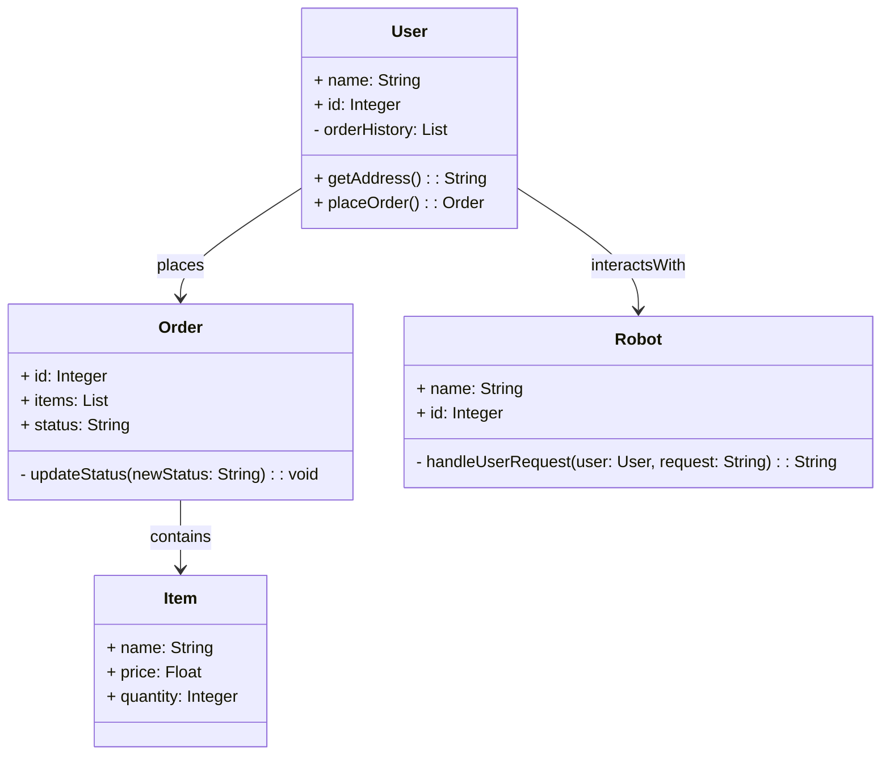
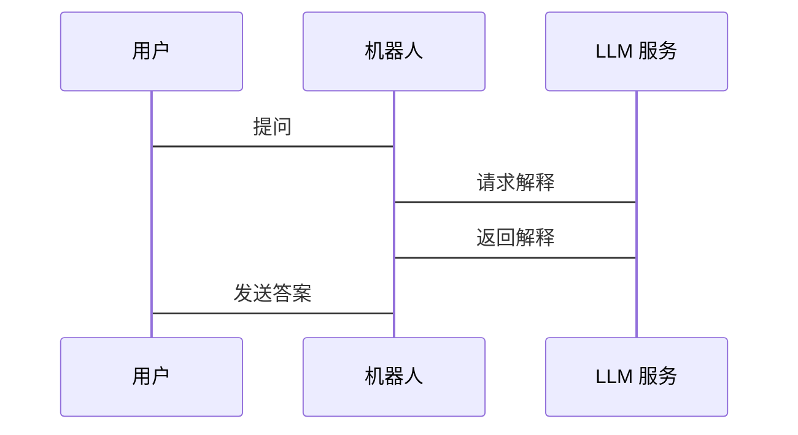

                 


好的，我将按照您的要求逐步分析和撰写《AI Agent 的决策系统：基于 LLM 的推理与规划》这篇文章。让我们先从文章的结构开始。

# AI Agent 的决策系统：基于 LLM 的推理与规划

## 关键词
- AI Agent
- 大语言模型
- 推理与规划
- 决策系统
- 系统架构
- 数学模型
- 项目实战

## 摘要
本文将深入探讨AI Agent 的决策系统，重点分析基于大语言模型（LLM）的推理与规划技术。文章从AI Agent 的基本概念出发，结合LLM 的工作原理，系统地介绍决策系统的数学模型与算法原理，分析其在多智能体环境中的应用，最后通过实际案例展示如何构建基于LLM 的决策系统，并总结相关经验与最佳实践。

---

## 第一部分: AI Agent 的决策系统基础

### 第1章: AI Agent 的基本概念与背景

#### 1.1 AI Agent 的定义与特点
##### 1.1.1 什么是 AI Agent
AI Agent（人工智能代理）是一种能够感知环境、自主决策并采取行动的智能实体。它通过与环境交互，实现特定目标，例如优化资源分配、提供个性化服务或完成复杂任务。

##### 1.1.2 AI Agent 的核心特点
- **自主性**：能够在没有外部干预的情况下独立运行。
- **反应性**：能够实时感知环境变化并做出响应。
- **目标导向性**：基于预设目标或动态目标进行决策。
- **学习能力**：通过经验或数据优化自身的决策策略。

##### 1.1.3 AI Agent 的分类与应用场景
AI Agent 可以分为 **简单反射型代理**、**基于模型的反射型代理**、**目标驱动代理** 和 **效用驱动代理**。应用场景包括自动驾驶、智能助手、机器人控制、游戏AI 等。

#### 1.2 LLM 的基本原理
##### 1.2.1 大语言模型的定义
大语言模型（Large Language Model, LLM）是基于深度学习的自然语言处理模型，具有 billions 的参数量，能够理解和生成人类语言。

##### 1.2.2 LLM 的核心工作原理
- **编码器-解码器架构**：通过编码器将输入文本映射到潜在空间，再通过解码器生成输出文本。
- **注意力机制**：关注输入序列中重要的部分，提升模型的上下文理解能力。
- **多层神经网络**：通过多层网络提取文本的深层特征。

##### 1.2.3 LLM 与传统 NLP 的区别
| 特性       | 传统 NLP                  | LLM                     |
|------------|--------------------------|--------------------------|
| 参数量     | 小（百万级别）           | 大（ billions 级别）     |
| 模型复杂度 | 简单                     | 复杂                     |
| 任务适用性 | 适用于简单任务（如分类）  | 适用于复杂任务（如对话生成） |

#### 1.3 AI Agent 决策系统的背景与意义
##### 1.3.1 决策系统在 AI Agent 中的作用
AI Agent 的决策系统是其核心模块，负责根据环境信息和目标，制定最优行动方案。

##### 1.3.2 基于 LLM 的决策系统的优势
- **强大的语言理解能力**：LLM 可以处理复杂的语义信息。
- **动态推理能力**：能够根据上下文动态调整决策。
- **可解释性**：LLM 的决策过程相对透明，便于分析和优化。

##### 1.3.3 当前决策系统的挑战与机遇
- **挑战**：处理不确定性和动态变化的环境，平衡效率与准确性的矛盾。
- **机遇**：通过结合 LLM 的能力，提升决策系统的智能化水平。

---

### 第2章: AI Agent 决策系统的数学模型与算法原理

#### 2.1 决策系统的数学模型
##### 2.1.1 决策树模型
决策树是一种树状结构，通过节点和边表示决策过程。每个内部节点代表一个决策，叶子节点代表结果。

##### 2.1.2 马尔可夫决策过程（MDP）
马尔可夫决策过程是一种描述决策过程的数学模型，由状态、动作、转移概率和奖励函数组成。

##### 2.1.3 Q-Learning 算法
Q-Learning 是一种基于价值的强化学习算法，通过学习状态-动作值函数（Q-value）来优化决策。

#### 2.2 基于 LLM 的推理与规划算法
##### 2.2.1 基于 LLM 的多步推理
多步推理是一种通过多次调用 LLM 来逐步推理问题的方法，适用于复杂问题的分解与解决。

##### 2.2.2 基于 LLM 的目标规划
目标规划是一种通过设定目标并分解任务来实现规划的方法，利用 LLM 的语言理解和生成能力优化任务执行。

##### 2.2.3 基于 LLM 的情境分析
情境分析是通过 LLM 的上下文理解能力，分析当前环境并生成合理的行动方案。

---

### 第3章: AI Agent 决策系统的系统架构与设计

#### 3.1 问题场景介绍
在本章中，我们将以一个智能客服机器人为例，介绍基于 LLM 的决策系统的架构设计。

#### 3.2 系统功能设计
##### 3.2.1 领域模型（Mermaid 类图）


##### 3.2.2 系统架构设计（Mermaid 架构图）


##### 3.2.3 系统接口设计
- **输入接口**：接收用户的输入请求。
- **输出接口**：生成并返回响应内容。
- **状态接口**：管理系统的运行状态。

##### 3.2.4 系统交互（Mermaid 序列图）


---

## 第四部分: 项目实战与最佳实践

### 第4章: 项目实战

#### 4.1 环境安装
安装必要的库和工具：
```bash
pip install transformers torch mermaid
```

#### 4.2 系统核心实现（Python 代码）
```python
class AIAssistant:
    def __init__(self, model):
        self.model = model

    def decide(self, input_text):
        # 调用 LLM 进行推理
        response = self.model.generate(input_text)
        return response
```

#### 4.3 代码解读与分析
- **AIAssistant 类**：封装了 LLM 的调用接口，负责处理输入并生成输出。
- **decide 方法**：接收输入文本，调用 LLM 生成决策结果。

#### 4.4 案例分析
以智能客服机器人为例，展示如何基于 LLM 实现对话理解和生成。

---

### 第5章: 最佳实践与总结

#### 5.1 小结
- 基于 LLM 的决策系统具有强大的语言理解和生成能力。
- 在实际应用中，需要结合具体场景优化算法和架构设计。

#### 5.2 注意事项
- 确保系统的安全性和隐私保护。
- 定期更新和优化模型，提升决策的准确性和效率。

#### 5.3 拓展阅读
建议阅读相关领域的最新论文和技术报告，了解 LLM 在决策系统中的最新应用。

---

## 作者
作者：AI天才研究院 & 禅与计算机程序设计艺术

