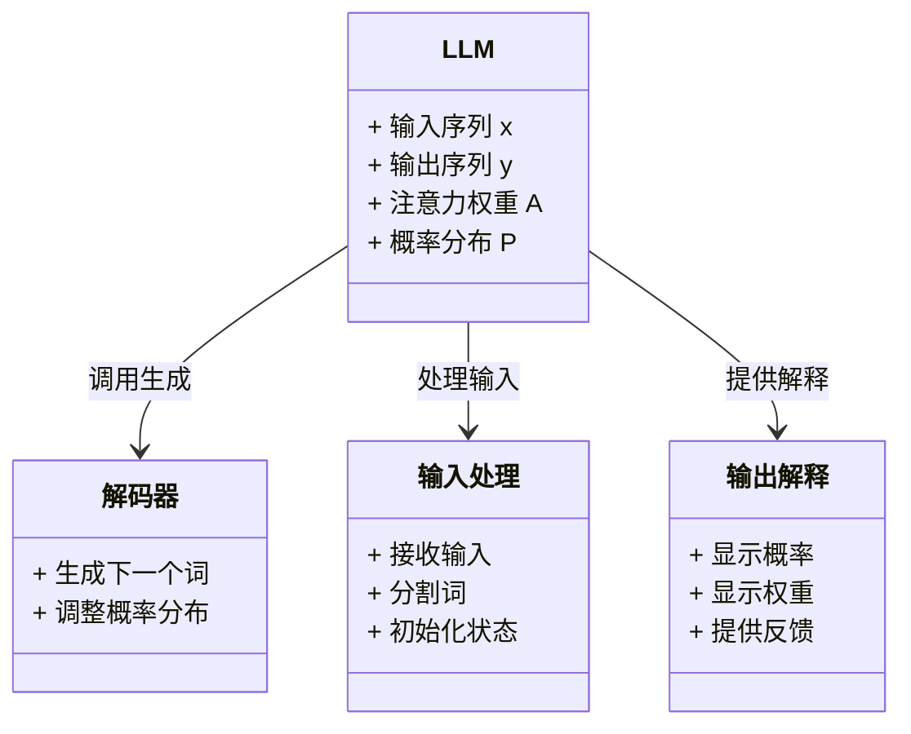
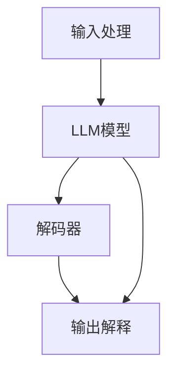
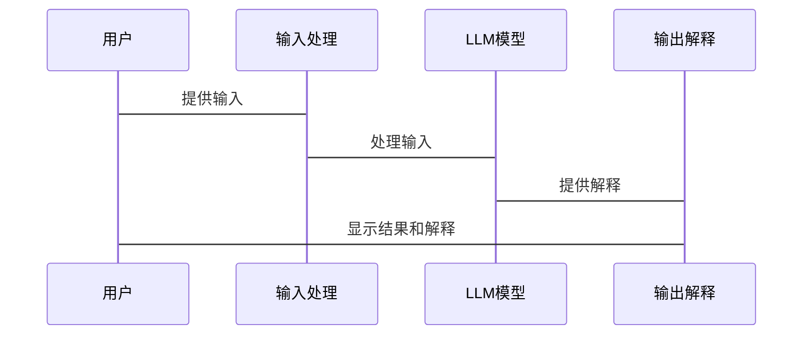

                 


# AI Agent 的可解释性：深入理解 LLM 的决策过程

## 关键词：AI Agent，可解释性，LLM，决策过程，数学模型，系统架构，项目实战

## 摘要：本文深入探讨AI Agent的可解释性，特别是LLM的决策过程。通过分析内部机制、算法原理和系统架构，结合实际案例和最佳实践，揭示LLM的决策过程如何实现可解释性，帮助读者理解AI系统的运作。

---

## 第5章: AI Agent 可解释性的算法原理

### 5.1 LLM 决策过程的算法原理

#### 5.1.1 概率生成模型的算法原理

概率生成模型（如GPT系列）基于概率分布生成输出。其核心是计算每个词的概率，选择概率最高的词序列。公式如下：

$$ P(y|x) = \prod_{i=1}^{n} P(y_i|x, y_{<i}) $$

其中，$y$是生成的序列，$x$是输入，$y_{<i}$表示生成序列中前$i-1$个词。

#### 5.1.2 注意力机制的算法原理

注意力机制通过计算输入序列中每个词的重要性，生成加权后的表示。公式如下：

$$ \text{Attention}(Q, K, V) = \text{softmax}\left(\frac{QK^T}{\sqrt{d_k}}\right)V $$

其中，$Q$是查询向量，$K$是键向量，$V$是值向量，$d_k$是键的维度。

#### 5.1.3 解码器的生成策略

解码器通过自回归方式逐步生成词，每一步都根据当前状态和输入生成下一个词的概率分布。例如，生成第$i$个词时：

$$ P(y_i|x, y_{<i}) = \text{softmax}(W y_{i-1}^T) $$

其中，$W$是词嵌入权重矩阵。

---

### 5.2 LLM 决策过程的数学模型

#### 5.2.1 概率生成模型的数学表达

概率生成模型的目标是最小化生成文本与真实文本的交叉熵损失：

$$ \mathcal{L} = -\sum_{i=1}^{N} \log P(y_i|x) $$

其中，$N$是训练样本数。

#### 5.2.2 注意力机制的数学公式

注意力机制的权重计算公式为：

$$ \text{Attention}(Q, K, V) = \text{softmax}\left(\frac{QK^T}{\sqrt{d_k}}\right)V $$

其中，$Q$和$K$是线性变换后的查询和键向量。

---

## 第6章: 系统分析与架构设计

### 6.1 问题场景介绍

为了实现AI Agent的可解释性，我们需要设计一个能够展示LLM决策过程的系统。该系统应包括输入处理、内部计算、结果解释和用户交互模块。

### 6.2 系统功能设计

#### 6.2.1 领域模型（Mermaid类图）



---

### 6.3 系统架构设计

#### 6.3.1 系统架构图（Mermaid架构图）



---

### 6.4 系统接口设计

系统接口包括：

1. 输入接口：接收用户输入。
2. 输出接口：显示生成结果和解释信息。
3. 解释接口：提供概率分布和注意力权重。

---

### 6.5 系统交互流程图（Mermaid序列图）



---

## 第7章: 项目实战

### 7.1 环境安装

安装必要的库：

```bash
pip install transformers mermaid4jupyter jupyter
```

---

### 7.2 系统核心实现源代码

#### 7.2.1 输入处理

```python
def process_input(input_text):
    tokens = tokenizer.encode(input_text)
    return tokens
```

#### 7.2.2 解码器实现

```python
def decode_step(hidden_state, attention_weights):
    next_token = decoder.generate(hidden_state)
    return next_token
```

#### 7.2.3 输出解释

```python
def explain_output(tokens, attention_weights):
    print(f"生成的词：{tokens}")
    print(f"注意力权重：{attention_weights}")
```

---

### 7.3 代码应用解读与分析

通过上述代码，我们可以逐步分析LLM的决策过程。例如，输入处理将文本转换为词的索引，解码器根据当前状态生成下一个词，输出解释展示生成的词和注意力权重。

---

### 7.4 案例分析

以输入“今天天气怎么样？”为例，系统会生成“很好”并显示概率分布和注意力权重。

---

## 第8章: 最佳实践与小结

### 8.1 最佳实践 tips

1. 使用可解释性工具展示决策过程。
2. 通过注意力权重分析关键因素。
3. 提供用户友好的解释界面。

---

### 8.2 小结

本文系统地分析了AI Agent的可解释性，特别是LLM的决策过程。通过数学模型、算法原理和系统架构的详细讲解，结合实际案例和最佳实践，帮助读者深入理解AI系统的运作。

---

## 作者：AI天才研究院 & 禅与计算机程序设计艺术

