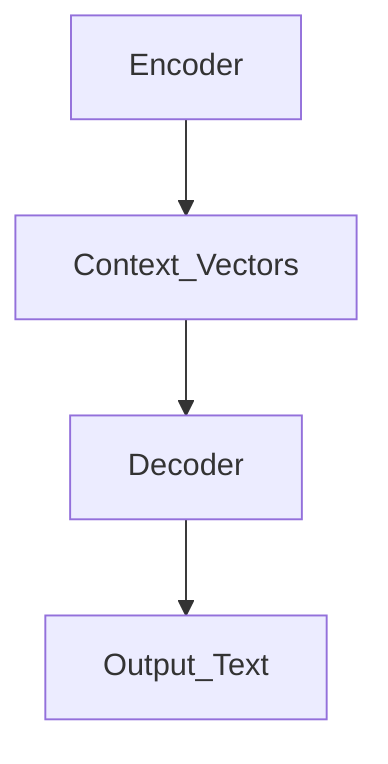
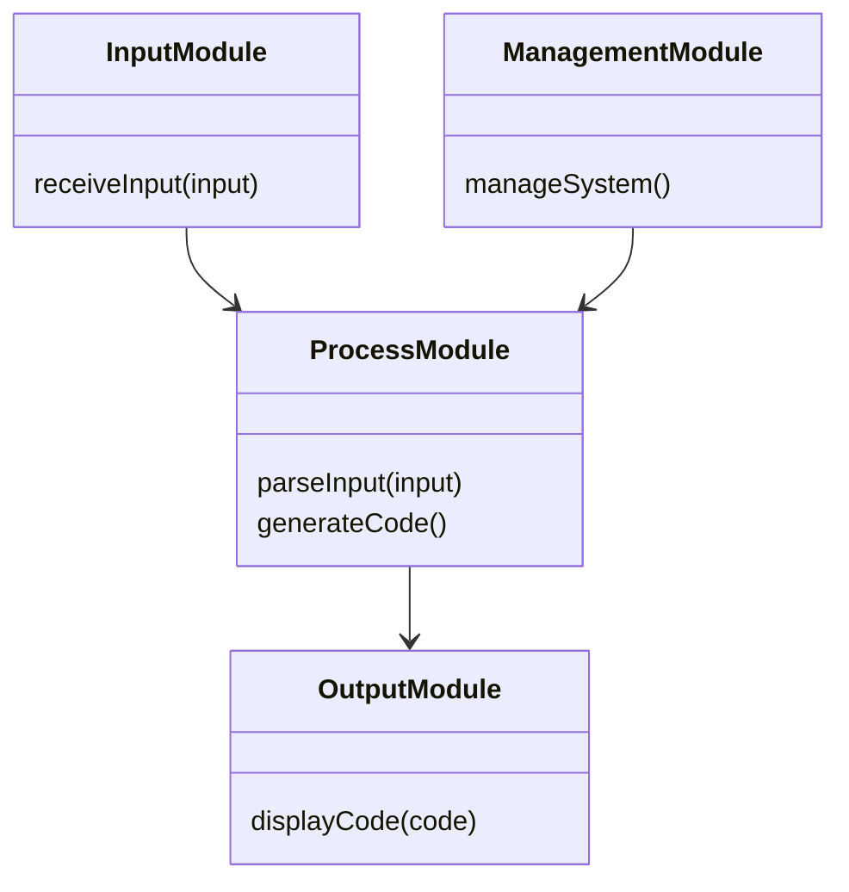
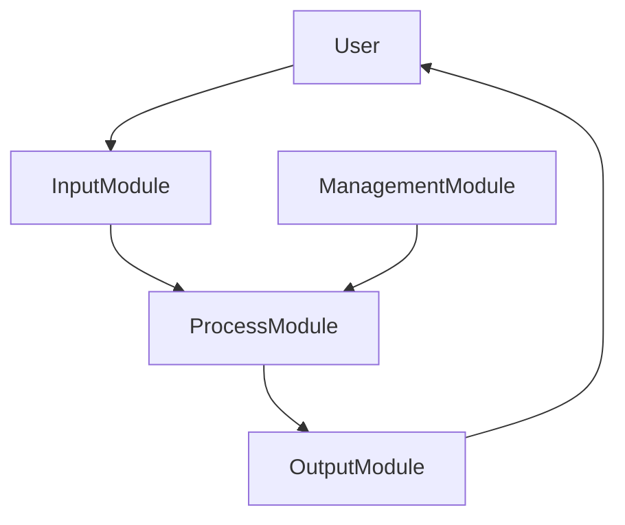
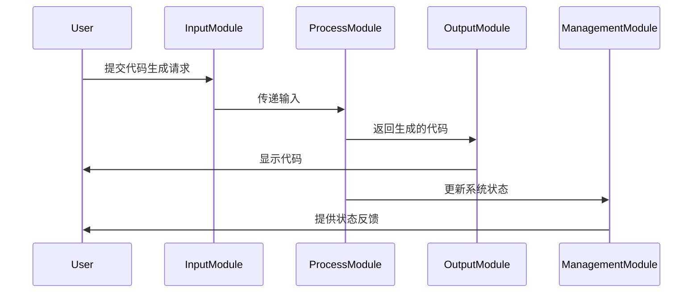

                 


# AI Agent 的多语言代码生成：LLM 在跨语言开发中的应用

> 关键词：AI Agent，多语言代码生成，大语言模型，LLM，跨语言开发，代码生成

> 摘要：随着人工智能技术的飞速发展，AI Agent 在软件开发中的应用日益广泛。本文深入探讨了 AI Agent 如何利用大语言模型（LLM）实现多语言代码生成，详细分析了其在跨语言开发中的应用场景、技术原理和系统架构。通过实际案例，展示了如何构建一个多语言代码生成系统，并总结了相关的最佳实践和未来发展方向。

---

# 第1章 AI Agent与多语言代码生成概述

## 1.1 AI Agent的基本概念

### 1.1.1 AI Agent的定义

AI Agent（人工智能代理）是一种能够感知环境、自主决策并执行任务的智能体。它通过接收输入信息，分析需求，生成相应的输出或执行操作，以实现特定目标。

**核心特点：**
1. **自主性**：能够独立决策和行动。
2. **反应性**：能够实时感知环境变化并做出反应。
3. **目标导向性**：所有行为都以实现特定目标为导向。

### 1.1.2 AI Agent的核心特征

- **智能性**：能够理解和处理复杂信息。
- **交互性**：能够与用户或其他系统进行交互。
- **适应性**：能够根据环境变化调整行为。
- **学习能力**：能够通过经验改进性能。

### 1.1.3 多语言代码生成的背景与意义

**背景：**
- 软件开发日益复杂，跨语言开发需求增加。
- 开发者需要在不同编程语言之间切换，效率低下。
- 人工编写代码耗时，容易出错。

**意义：**
- 提高开发效率，降低错误率。
- 支持多语言开发，简化跨平台开发。
- 为AI Agent提供强大的代码生成能力，提升其智能性。

## 1.2 大语言模型（LLM）的概述

### 1.2.1 LLM的基本概念

LLM（Large Language Model）是基于深度学习的自然语言处理模型，能够理解和生成人类语言。其核心是通过大量数据训练，学习语言的语法、语义和上下文。

### 1.2.2 LLM的主要特点

- **大规模训练数据**：通常使用数十亿参数进行训练。
- **通用性**：能够处理多种任务，如文本生成、翻译、问答。
- **上下文理解**：能够理解长上下文，生成连贯文本。

### 1.2.3 LLM在代码生成中的应用

- **代码补全**：根据用户输入，生成后续代码。
- **代码翻译**：将一种编程语言的代码转换为另一种语言。
- **代码优化**：生成更高效、更简洁的代码。

## 1.3 多语言代码生成的背景与挑战

### 1.3.1 跨语言开发的背景

- **全球化需求**：软件需要支持多种语言和文化。
- **技术多样性**：不同编程语言适用于不同场景。
- **效率需求**：减少手动编写多语言代码的时间。

### 1.3.2 多语言代码生成的挑战

- **语言差异**：不同编程语言语法、语义差异大。
- **模型泛化能力**：要求模型能够理解多种语言的语法和语义。
- **代码上下文**：需要准确理解代码上下文，避免错误生成。

### 1.3.3 LLM在跨语言开发中的优势

- **统一模型**：LLM可以同时处理多种编程语言。
- **上下文理解**：能够理解代码的上下文，生成准确的代码。
- **可扩展性**：支持不断增加新的编程语言。

## 1.4 本章小结

本章介绍了AI Agent和多语言代码生成的基本概念，分析了多语言代码生成的背景、挑战和LLM的优势。接下来的章节将深入探讨LLM的原理和技术，AI Agent的核心技术，以及如何利用这些技术实现多语言代码生成。

---

# 第2章 大语言模型（LLM）的原理与技术

## 2.1 LLM的基本原理

### 2.1.1 概念模型

LLM的核心是基于Transformer的架构，通过自注意力机制和前馈网络，对输入文本进行编码和解码。

**公式：**
$$
\text{输出} = \text{解码器}(\text{编码器}(输入))
$$

### 2.1.2 模型结构

**Transformer架构：**
- **编码器**：将输入文本编码为上下文向量。
- **解码器**：根据编码器生成的向量生成输出文本。

**Mermaid图：**


### 2.1.3 训练方法

- **预训练**：在大规模数据集上无监督训练。
- **微调**：针对特定任务进行有监督训练。
- **提示工程**：通过设计提示（prompt）引导模型生成期望的输出。

## 2.2 多语言支持的LLM

### 2.2.1 多语言模型的训练策略

- **多语言预训练**：在多种语言的混合数据集上训练。
- **语言特定微调**：针对特定语言进行微调。
- **语言标签嵌入**：在输入时添加语言标签。

**公式：**
$$
\text{模型} = f_{\text{语言1}}, f_{\text{语言2}}, ..., f_{\text{语言N}}
$$

### 2.2.2 多语言模型的评估指标

- **BLEU**：基于n-gram的精确度。
- **ROUGE**：基于召回率的评估指标。
- **准确率**：生成代码的正确性。

### 2.2.3 多语言模型的应用场景

- **代码翻译**：将一种语言的代码翻译为另一种语言。
- **多语言代码生成**：根据描述生成多种语言的代码。
- **跨平台开发**：支持多种平台的代码生成。

## 2.3 LLM在代码生成中的应用

### 2.3.1 代码生成的基本流程

1. **输入解析**：解析用户的输入需求。
2. **意图识别**：识别用户的生成意图。
3. **代码生成**：根据意图生成代码。
4. **代码优化**：优化生成的代码。

### 2.3.2 基于LLM的代码生成模型

- **模型选择**：选择适合任务的LLM模型。
- **输入处理**：设计输入格式，方便模型处理。
- **输出处理**：处理生成的代码，确保正确性。

### 2.3.3 多语言代码生成的实现思路

1. **支持多语言模型**：选择支持多语言的LLM模型。
2. **语言切换机制**：实现语言切换功能。
3. **代码验证**：验证生成代码的正确性。

## 2.4 本章小结

本章详细讲解了LLM的基本原理和多语言支持的技术，分析了LLM在代码生成中的应用。接下来的章节将深入探讨AI Agent的核心技术，以及如何利用这些技术实现多语言代码生成。

---

# 第3章 AI Agent的核心技术

## 3.1 自然语言理解

### 3.1.1 NLU的基本概念

NLU（Natural Language Understanding）是理解用户输入的自然语言的处理技术。

**流程：**
1. **分词**：将输入文本分割成词语或短语。
2. **句法分析**：分析句子的语法结构。
3. **语义理解**：理解句子的语义和意图。

### 3.1.2 基于LLM的NLU实现

- **预训练模型**：利用LLM进行语义理解。
- **意图识别**：通过训练数据识别用户意图。
- **上下文理解**：理解上下文信息，生成准确的响应。

### 3.1.3 多语言NLU的挑战

- **语言差异**：不同语言的语法和语义差异大。
- **数据稀缺性**：某些语言的数据量少，影响模型性能。
- **文化差异**：不同语言背后的文化差异影响语义理解。

## 3.2 意图识别与对话管理

### 3.2.1 意图识别的基本原理

意图识别是通过分析用户输入，识别用户的意图。

**方法：**
1. **基于规则的方法**：通过预定义规则匹配意图。
2. **基于模型的方法**：利用机器学习模型识别意图。

### 3.2.2 基于LLM的意图识别

- **上下文理解**：LLM能够理解上下文，准确识别意图。
- **动态调整**：根据对话历史动态调整意图识别结果。

### 3.2.3 对话管理的实现策略

- **状态管理**：维护对话状态，跟踪上下文信息。
- **策略选择**：根据当前状态选择合适的响应策略。
- **反馈机制**：根据用户反馈调整对话策略。

## 3.3 多语言支持的技术实现

### 3.3.1 多语言模型的训练与优化

- **多语言预训练**：在多种语言的数据上进行预训练。
- **语言特定优化**：针对特定语言进行优化。
- **语言标签嵌入**：在模型中引入语言标签，增强多语言支持能力。

### 3.3.2 多语言代码生成的实现

- **语言切换机制**：实现语言切换功能。
- **代码验证**：验证生成代码的正确性。
- **错误处理**：处理生成代码中的错误，确保代码可用性。

## 3.4 本章小结

本章深入探讨了AI Agent的核心技术，包括自然语言理解、意图识别和对话管理。通过这些技术，AI Agent能够准确理解用户需求，并生成相应的代码。接下来的章节将讨论系统架构设计和项目实战。

---

# 第4章 系统架构与设计

## 4.1 问题场景介绍

### 4.1.1 问题背景

- **多语言开发需求**：用户需要生成多种语言的代码。
- **代码生成效率**：提高代码生成效率，降低开发成本。
- **跨平台支持**：支持多种平台的代码生成。

### 4.1.2 问题描述

- **需求分析**：用户需要一个能够生成多种语言代码的系统。
- **技术选型**：选择合适的AI技术和工具实现代码生成。
- **实现思路**：设计系统的模块划分和交互流程。

### 4.1.3 问题解决

- **模块划分**：设计系统的功能模块。
- **交互流程**：设计系统的交互流程。
- **实现策略**：选择合适的算法和工具实现代码生成。

## 4.2 项目介绍

### 4.2.1 项目目标

- **目标1**：实现一个多语言代码生成系统。
- **目标2**：支持多种编程语言的代码生成。
- **目标3**：提供友好的用户界面，方便用户使用。

### 4.2.2 项目范围

- **范围1**：支持Python、Java、C++等语言。
- **范围2**：提供代码生成、代码优化功能。
- **范围3**：支持多语言模型的训练和部署。

### 4.2.3 项目计划

- **阶段1**：需求分析与技术选型。
- **阶段2**：系统设计与模块实现。
- **阶段3**：系统测试与优化。

## 4.3 系统功能设计

### 4.3.1 功能模块划分

- **输入模块**：接收用户的输入。
- **处理模块**：解析输入并生成代码。
- **输出模块**：输出生成的代码。
- **管理模块**：管理系统的运行状态。

### 4.3.2 领域模型（Mermaid类图）



### 4.3.3 系统架构设计（Mermaid架构图）



### 4.3.4 系统接口设计

- **输入接口**：接收用户的输入需求。
- **输出接口**：输出生成的代码。
- **管理接口**：管理系统的运行状态。

### 4.3.5 系统交互（Mermaid序列图）



## 4.4 本章小结

本章详细设计了多语言代码生成系统的架构，包括功能模块划分、系统架构设计和交互流程。接下来的章节将通过项目实战，展示如何实现这一系统。

---

# 第5章 项目实战

## 5.1 环境安装

### 5.1.1 系统要求

- **操作系统**：Windows 10或更高版本，macOS 10.15或更高版本，Linux（推荐Ubuntu 20.04或更高版本）。
- **Python版本**：Python 3.8或更高版本。
- **GPU支持**：建议使用NVIDIA GPU，并安装NVIDIA驱动和CUDA toolkit。

### 5.1.2 安装依赖

```bash
pip install transformers torch numpy
```

### 5.1.3 环境配置

```bash
conda create -n ai-agent python=3.9
conda activate ai-agent
pip install transformers torch
```

## 5.2 系统核心实现

### 5.2.1 模型选择与加载

```python
from transformers import AutoTokenizer, AutoModelForCausalLM
tokenizer = AutoTokenizer.from_pretrained('gpt2')
model = AutoModelForCausalLM.from_pretrained('gpt2')
```

### 5.2.2 输入处理与代码生成

```python
def generate_code(prompt, max_length=100):
    inputs = tokenizer(prompt, return_tensors='np')
    outputs = model.generate(inputs.input_ids, max_length=max_length)
    code = tokenizer.decode(outputs[0])
    return code
```

### 5.2.3 多语言支持实现

```python
def generate_code_multilingual(prompt, language, max_length=100):
    # 添加语言标签
    inputs = tokenizer(f"Language: {language}\n{prompt}", return_tensors='np')
    outputs = model.generate(inputs.input_ids, max_length=max_length)
    code = tokenizer.decode(outputs[0])
    return code
```

### 5.2.4 代码验证与优化

```python
def validate_code(code):
    try:
        # 根据语言选择验证方式
        if 'Python' in code:
            exec(code)
            return True
        elif 'Java' in code:
            # 假设在Java环境中
            subprocess.run(['javac', 'temp.java'], check=True)
            return True
        # 其他语言可以根据需要扩展
    except:
        return False
```

## 5.3 代码应用解读与分析

### 5.3.1 系统实现流程

1. **模型加载**：加载预训练的LLM模型。
2. **输入处理**：接收用户的输入需求。
3. **代码生成**：根据输入生成代码。
4. **代码验证**：验证生成的代码是否正确。
5. **结果输出**：将生成的代码返回给用户。

### 5.3.2 代码生成示例

**输入：**
```plaintext
生成一个计算斐波那契数列的Python函数
```

**生成代码：**
```python
def fibonacci(n):
    a, b = 0, 1
    while n > 0:
        a, b = b, a + b
        n -= 1
    return a
```

### 5.3.3 项目小结

本章通过项目实战，展示了如何利用LLM实现多语言代码生成。通过具体的代码示例，详细讲解了系统的实现过程，包括模型选择、输入处理、代码生成和验证等步骤。接下来的章节将总结最佳实践和未来发展方向。

---

# 第6章 最佳实践与未来展望

## 6.1 最佳实践

### 6.1.1 模型选择

- **选择合适的模型**：根据任务需求选择模型。
- **模型微调**：在特定领域数据上进行微调，提升性能。
- **模型评估**：通过评估指标选择最优模型。

### 6.1.2 代码生成策略

- **代码验证**：生成代码后进行验证，确保正确性。
- **代码优化**：生成代码后进行优化，提高效率。
- **多语言支持**：在生成代码时考虑语言差异，确保代码正确性。

### 6.1.3 系统优化

- **性能优化**：优化系统性能，提高响应速度。
- **资源管理**：合理管理系统资源，降低运行成本。
- **错误处理**：设计完善的错误处理机制，提升用户体验。

## 6.2 未来展望

### 6.2.1 技术发展

- **更强大的模型**：随着技术的发展，会出现更强大的LLM模型。
- **多模态支持**：未来的AI Agent将支持更多模态，如图像、声音等。
- **实时反馈**：生成代码后，系统能够实时反馈修改建议。

### 6.2.2 应用场景扩展

- **更多编程语言支持**：支持更多编程语言的代码生成。
- **智能辅助开发**：AI Agent成为开发者更智能的助手。
- **自动化测试**：自动生成测试用例，提高开发效率。

## 6.3 总结

AI Agent的多语言代码生成技术将极大提升软件开发的效率和质量。随着技术的不断发展，未来的AI Agent将更加智能，能够支持更多语言和更多场景，为开发者提供更强大的支持。

---

# 作者

作者：AI天才研究院/AI Genius Institute & 禅与计算机程序设计艺术/Zen And The Art of Computer Programming

---

以上是基于用户需求设计的完整技术博客文章目录结构和内容。

