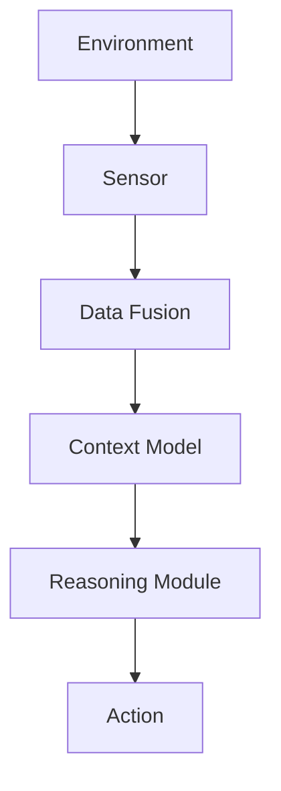
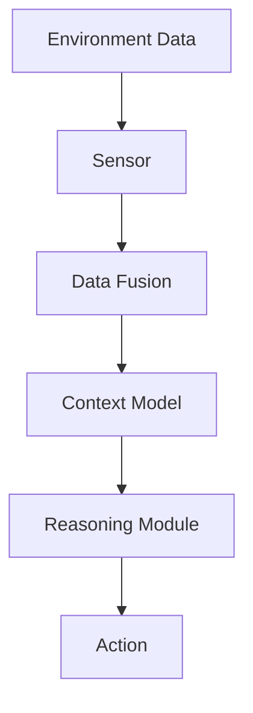
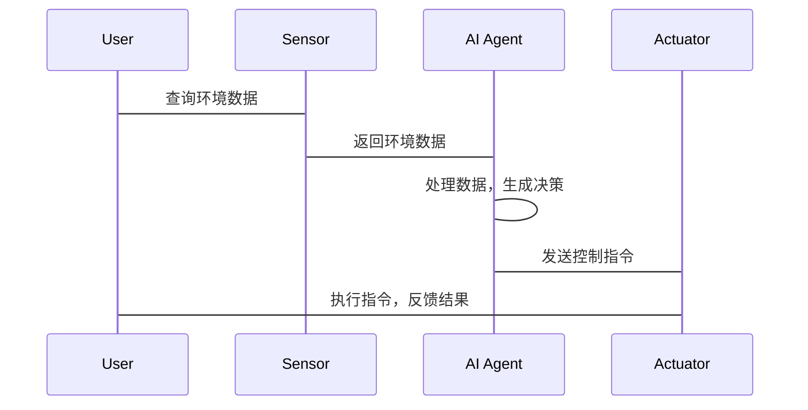

                 


# AI Agent 的情境感知：增强 LLM 的环境适应能力

## 关键词：
- AI Agent
- 情境感知
- LLM
- 环境适应能力
- 多模态数据
- 动态环境建模

## 摘要：
AI Agent 的情境感知能力是增强大型语言模型 (LLM) 在复杂环境中适应性的关键。本文深入探讨了 AI Agent 的核心概念、算法原理、数学模型、系统架构以及实际应用案例，展示了如何通过多模态数据融合、动态环境建模和自适应推理机制来提升 LLM 的环境适应能力。文章从背景介绍入手，逐步分析了情境感知的重要性，详细讲解了算法实现和系统设计，并通过智能家居案例展示了技术的应用。最后，总结了当前研究的成果，并展望了未来的发展方向。

---

## 第一部分：背景介绍

### 第1章：AI Agent与情境感知的背景

#### 1.1 问题背景
- 1.1.1 AI Agent的定义与核心能力  
  AI Agent 是一种能够感知环境、自主决策并执行任务的智能实体，具备学习、推理和自适应能力。
- 1.1.2 情境感知的重要性  
  情境感知是 AI Agent 理解环境、用户意图和任务目标的关键能力，能够显著提升其在复杂环境中的表现。
- 1.1.3 当前AI Agent在环境适应中的挑战  
  当前 AI Agent 在环境适应中面临数据不足、动态变化难以建模以及多模态数据融合困难等问题。

#### 1.2 问题描述
- 1.2.1 LLM在环境适应中的局限性  
  LLM 通常依赖于预训练数据，难以直接适应动态变化的环境。
- 1.2.2 情境感知如何解决环境适应问题  
  情境感知通过实时感知环境信息，帮助 AI Agent 更准确地理解任务需求。
- 1.2.3 现有技术的不足与改进方向  
  现有技术在多模态数据融合和动态环境建模方面仍有不足，需要进一步优化。

#### 1.3 问题解决方法
- 1.3.1 增强LLM的情境感知能力  
  通过多模态数据输入和动态环境建模，增强 LLM 的情境理解能力。
- 1.3.2 多模态数据融合技术  
  将文本、图像、语音等多种数据源进行融合，提升 AI Agent 的环境感知能力。
- 1.3.3 动态环境建模方法  
  建立动态环境模型，实时更新环境信息，帮助 AI Agent 适应变化。

#### 1.4 边界与外延
- 1.4.1 情境感知的边界条件  
  情境感知仅关注环境信息，不直接处理任务决策。
- 1.4.2 相关领域的区别与联系  
  区分情境感知与传统 NLP 任务，强调其在 AI Agent 中的独特作用。
- 1.4.3 未来可能的发展方向  
  结合边缘计算和实时反馈机制，进一步提升 AI Agent 的环境适应能力。

---

## 第二部分：核心概念与联系

### 第2章：核心概念解析

#### 2.1 AI Agent的核心要素
- 2.1.1 感知层：环境数据的采集与处理  
  通过传感器、摄像头等设备采集环境数据，如图像、语音和地理位置信息。
- 2.1.2 决策层：基于情境的推理与决策  
  根据感知到的环境信息，结合任务目标，生成决策策略。
- 2.1.3 执行层：行动与反馈机制  
  根据决策结果执行具体动作，并通过反馈机制优化后续行为。

#### 2.2 情境感知的核心要素
- 2.2.1 多模态数据融合  
  将文本、图像、语音等多种数据源进行融合，提升感知的全面性。
- 2.2.2 动态环境建模  
  实时更新环境模型，反映环境变化。
- 2.2.3 自适应推理机制  
  根据环境变化动态调整推理策略。

#### 2.3 情境感知与传统 NLP 的区别与联系
- 2.3.1 区别：  
  - 情境感知关注环境信息，传统 NLP 侧重文本处理。
  - 情境感知需要实时反馈，传统 NLP 依赖预训练数据。
- 2.3.2 联系：  
  - 情境感知可以结合 NLP 技术，提升环境理解能力。
  - 传统 NLP 可以为情境感知提供语义理解基础。

#### 2.4 ER实体关系图


---

## 第三部分：算法原理

### 第3章：算法原理详解

#### 3.1 多模态数据融合算法
- 3.1.1 数据融合流程  
  1. 数据采集：通过多种传感器获取环境数据。  
  2. 数据预处理：清洗和标准化数据。  
  3. 数据融合：使用加权融合方法，将多模态数据整合为统一表示。
- 3.1.2 数据融合的加权方法  
  - 使用注意力机制，根据数据源的重要性动态调整权重。
- 3.1.3 代码示例  
  ```python
  import numpy as np
  def weighted_fusion(modalities, weights):
      return np.sum(modalities * weights, axis=1)
  ```

#### 3.2 动态环境建模算法
- 3.2.1 环境建模的步骤  
  1. 数据采集：实时获取环境信息。  
  2. 模型更新：使用流式算法更新环境模型。  
  3. 模型推理：基于更新后的模型进行推理。
- 3.2.2 流式算法实现  
  - 使用增量式学习方法，逐步更新模型参数。
- 3.2.3 代码示例  
  ```python
  def incremental_learning(new_data, model):
      model.update_weights(new_data)
      return model
  ```

#### 3.3 自适应推理机制
- 3.3.1 推理流程  
  1. 感知环境：获取实时环境数据。  
  2. 建模：构建动态环境模型。  
  3. 推理：基于模型生成推理结果。
- 3.3.2 基于强化学习的推理优化  
  - 使用强化学习算法优化推理策略。
- 3.3.3 代码示例  
  ```python
  import tensorflow as tf
  def adaptive_reasoning(environment, model):
      model.update(environment)
      return model.predict(environment)
  ```

#### 3.4 数学模型与公式
- 3.4.1 多模态数据融合的加权模型  
  $$ y = \sum_{i=1}^{n} w_i x_i $$
  其中，$w_i$ 是第 $i$ 个数据源的权重，$x_i$ 是输入数据。
- 3.4.2 动态环境建模的更新公式  
  $$ \theta_{t+1} = \theta_t + \alpha (y_t - \hat{y}_t) $$
  其中，$\theta$ 是模型参数，$\alpha$ 是学习率，$y_t$ 是目标值，$\hat{y}_t$ 是预测值。

---

## 第四部分：系统分析与架构设计

### 第4章：系统架构设计

#### 4.1 问题场景介绍
- 智能家居环境中的 AI Agent，需要实时感知家庭成员的活动、设备状态和环境变化，提供个性化服务。

#### 4.2 系统功能设计
- 感知层：采集环境数据，如温度、湿度、人员位置等。
- 决策层：基于感知数据，生成任务决策，如调节温度、开启灯光等。
- 执行层：执行决策指令，如控制家电。

#### 4.3 系统架构图


#### 4.4 系统接口设计
- 输入接口：传感器数据输入。
- 输出接口：控制指令输出。
- 交互接口：用户与 AI Agent 的交互界面。

#### 4.5 系统交互序列图


---

## 第五部分：项目实战

### 第5章：项目实战

#### 5.1 环境安装
- 安装必要的库：TensorFlow、Keras、NumPy、OpenCV。
- 配置传感器和设备接口。

#### 5.2 核心代码实现
- 数据融合模块：
  ```python
  def fuse_data(modalities, weights):
      return np.dot(modalities, weights)
  ```
- 动态环境建模模块：
  ```python
  def update_model(model, new_data):
      model.fit(new_data)
      return model
  ```

#### 5.3 代码应用解读
- 数据融合模块通过加权融合多模态数据，提升感知精度。
- 动态环境建模模块实时更新环境模型，确保模型准确反映环境变化。

#### 5.4 实际案例分析
- 案例：智能家居中的温度调节。
  - 感知层：采集室内温度、用户位置和时间信息。
  - 决策层：基于融合数据，生成温度调节决策。
  - 执行层：发送指令，调节空调温度。

#### 5.5 项目小结
- 通过多模态数据融合和动态环境建模，显著提升了 AI Agent 在智能家居中的环境适应能力。

---

## 第六部分：总结与展望

### 第6章：总结与展望

#### 6.1 核心内容回顾
- AI Agent 的情境感知能力是增强 LLM 环境适应能力的关键。
- 多模态数据融合和动态环境建模是实现情境感知的核心技术。

#### 6.2 未来研究方向
- 更高效的数据处理方法。
- 更智能的自适应推理机制。
- 更广泛的应用场景探索。

#### 6.3 最佳实践 Tips
- 在实际应用中，建议优先处理关键环境信息，逐步扩展感知能力。
- 注意数据隐私和安全问题，确保系统的可靠性。

#### 6.4 小结
- 情境感知是 AI Agent 的核心能力，通过多模态数据融合和动态环境建模，可以显著提升 LLM 的环境适应能力。
- 未来的研究需要进一步优化算法，拓展应用场景。

---

## 作者信息

作者：AI天才研究院/AI Genius Institute & 禅与计算机程序设计艺术 /Zen And The Art of Computer Programming

---

通过以上结构，文章从背景、核心概念、算法原理、系统设计到实际应用，全面探讨了 AI Agent 的情境感知能力，为增强 LLM 的环境适应能力提供了系统的解决方案和实践指导。

