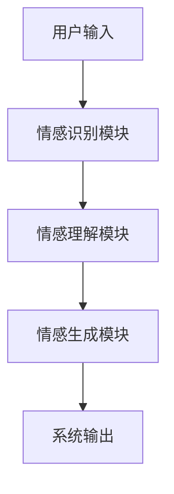
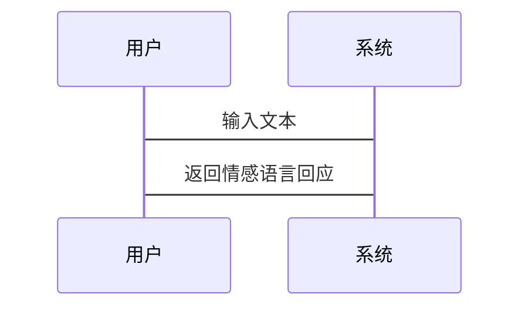

                 


# AI Agent 的情感共情：提升 LLM 的人文关怀能力

> 关键词：AI Agent, 情感共情, LLM, 人文关怀, 情感计算, 同理心模型, 情感智能

> 摘要：随着人工智能技术的快速发展，AI Agent 在各个领域的应用越来越广泛。然而，如何让 AI Agent 具备情感共情能力，从而提升其人文关怀能力，成为了当前研究的热点问题。本文从情感共情的定义、核心概念、算法原理、系统设计、项目实战等多个方面进行深入分析，探讨如何通过技术手段实现 AI Agent 的情感共情能力，从而使其更加贴近人类的需求和情感，提升用户体验和人机交互的自然性。

---

# 正文

## 第1章: AI Agent 的情感共情概述

### 1.1 情感共情的定义与重要性

情感共情是指个体能够理解、感受并共情于他人的情感状态。在 AI Agent 的语境下，情感共情能力指的是 AI 系统能够识别、理解并回应人类的情感需求。这一能力不仅能够提升人机交互的自然性，还能够增强用户对 AI 系统的信任和满意度。

情感共情的重要性体现在以下几个方面：

1. **提升用户体验**：通过理解用户的情感状态，AI Agent 能够提供更加个性化的服务，满足用户的情感需求。
2. **增强信任感**：具备情感共情能力的 AI Agent 能够更好地理解用户的情感需求，从而增强用户对系统的信任。
3. **拓展应用场景**：情感共情能力使得 AI Agent 可以在更多领域（如心理健康支持、教育辅助等）中发挥重要作用。

### 1.2 AI Agent 的基本概念

AI Agent 是指具有智能和自主性的计算机系统，能够感知环境、理解任务目标并采取行动以实现目标。AI Agent 可以分为两类：**反应式 Agent** 和 **认知式 Agent**。反应式 Agent 基于当前感知做出反应，而认知式 Agent 则具有推理和规划能力。

LLM（Large Language Model）是一种基于深度学习的自然语言处理模型，能够理解并生成人类语言。LLM 的核心优势在于其强大的语言理解和生成能力，但其情感共情能力仍有待提升。

### 1.3 情感共情能力的实现路径

情感共情能力的实现路径可以分为以下三个层次：

1. **数据驱动方法**：通过收集和分析大量情感数据，训练 AI 系统识别情感特征。
2. **模型优化策略**：在现有模型基础上，优化算法以增强情感共情能力。
3. **人机协作模式**：通过人机协作的方式，结合人类的情感智慧和 AI 的计算能力，共同提升情感共情能力。

---

## 第2章: 情感共情的核心概念与原理

### 2.1 情感共情的理论基础

情感共情的理论基础主要包括以下三个部分：

1. **情感计算（Affective Computing）**：情感计算是研究如何利用计算技术分析、识别和处理人类情感的学科。它涉及情感识别、情感理解、情感生成等多个方面。
2. **同理心（Empathy）**：同理心是指个体能够理解和感受他人情感状态的能力。在 AI Agent 中，同理心模型是实现情感共情的核心技术。
3. **情感智能（Emotional Intelligence）**：情感智能是指个体在识别、理解、管理和运用情感方面的能力。在 AI Agent 中，情感智能的实现能够增强系统与用户之间的互动效果。

### 2.2 情感共情的核心要素

情感共情的核心要素包括情感识别、情感理解和情感生成。

1. **情感识别（Emotion Recognition）**：情感识别是指通过分析用户的行为、语言和语调，识别出用户的情感状态。
2. **情感理解（Emotion Understanding）**：情感理解是指 AI 系统能够理解用户情感的背景、原因和潜在需求。
3. **情感生成（Emotion Generation）**：情感生成是指 AI 系统能够根据用户情感状态生成相应的语言或行为回应。

### 2.3 情感共情与 LLM 的结合

情感共情与 LLM 的结合主要体现在以下几个方面：

1. **情感分析**：通过分析用户的输入文本，识别用户的情感倾向。
2. **情感驱动的对话生成**：在对话过程中，根据用户情感状态生成更加贴切的语言回应。
3. **情感反馈优化**：通过情感反馈优化算法，提升 LLM 的情感共情能力。

---

## 第3章: 情感共情能力的算法原理

### 3.1 情感分析算法

情感分析算法是实现情感共情能力的基础。以下是几种常见的情感分析算法：

1. **基于传统机器学习的情感分析**：
   - 使用特征工程提取文本特征（如词袋模型、TF-IDF 等）。
   - 基于朴素贝叶斯、SVM 等算法进行分类。

2. **基于深度学习的情感分析**：
   - 使用循环神经网络（RNN）或变换器（Transformer）模型。
   - 例如，使用预训练的 LLM（如BERT）进行情感分析。

3. **情感分析的优缺点对比**：
   | 方法 | 优点 | 缺点 |
   |------|------|------|
   | 传统机器学习 | 实现简单，计算效率高 | 特征工程耗时，效果受限 |
   | 深度学习 | 效果好，能够处理复杂情感 | 需要大量数据，计算资源消耗高 |

### 3.2 同理心模型的构建

同理心模型是实现情感共情的核心技术。以下是同理心模型的构建步骤：

1. **基于规则的同理心模型**：
   - 根据特定情感规则生成情感回应。
   - 例如，当用户表达悲伤时，系统生成安慰性的语言。

2. **基于数据驱动的同理心模型**：
   - 使用情感数据训练模型，生成情感回应。
   - 例如，使用监督学习训练模型，使其能够根据输入生成情感化的语言。

3. **同理心模型的评估指标**：
   | 指标 | 定义 |
   |------|------|
   | 准确率 | 模型正确预测情感的次数与总次数的比值 |
   | 召回率 | 模型正确预测情感的次数与实际属于该情感的总次数的比值 |

### 3.3 情感生成算法

情感生成算法是实现情感共情能力的关键。以下是几种常见的情感生成算法：

1. **基于模板的情感生成**：
   - 使用预定义的模板生成情感语言。
   - 例如，当用户表达喜悦时，系统生成“太好了，恭喜您！”之类的语言。

2. **基于生成模型的情感生成**：
   - 使用生成模型（如 GAN、VAE）生成情感语言。
   - 例如，使用预训练的 LLM 进行情感化的语言生成。

3. **情感生成的挑战与解决方案**：
   - 情感生成的多样性与真实性之间的平衡。
   - 解决方案：结合规则和数据驱动的方法，生成更加自然的情感语言。

---

## 第4章: 情感共情的数学模型与公式

### 4.1 情感分析的数学模型

情感分析的数学模型可以基于朴素贝叶斯分类器进行实现。以下是朴素贝叶斯分类器的公式：

$$ P(y|x) = \frac{P(x|y)P(y)}{P(x)} $$

其中，$y$ 表示情感类别，$x$ 表示输入文本。

### 4.2 同理心模型的数学公式

同理心模型的数学公式可以基于条件概率进行实现。以下是同理心模型的公式：

$$ P(response|emotion) = \frac{P(emotion|response)P(response)}{P(emotion)} $$

其中，$response$ 表示情感回应，$emotion$ 表示情感类别。

### 4.3 情感生成的数学模型

情感生成的数学模型可以基于生成模型进行实现。以下是生成模型的公式：

$$ G(z, c) = \text{生成情感语言} $$

其中，$z$ 表示随机变量，$c$ 表示情感类别。

---

## 第5章: 系统分析与架构设计方案

### 5.1 问题场景介绍

假设我们正在开发一个智能客服系统，希望通过情感共情能力提升用户体验。以下是系统的功能需求：

1. **情感识别**：识别用户的当前情感状态。
2. **情感理解**：理解用户情感的背景和原因。
3. **情感生成**：生成与用户情感相匹配的语言回应。

### 5.2 系统功能设计

以下是系统的功能设计：

1. **情感识别模块**：
   - 输入：用户输入文本。
   - 输出：情感类别（如快乐、悲伤、愤怒等）。
   
2. **情感理解模块**：
   - 输入：情感类别。
   - 输出：情感理解结果（如用户因工作压力而感到悲伤）。
   
3. **情感生成模块**：
   - 输入：情感理解结果。
   - 输出：情感化的语言回应。

### 5.3 系统架构设计

以下是系统的架构设计：



### 5.4 系统交互流程图

以下是系统的交互流程图：



---

## 第6章: 项目实战

### 6.1 环境安装

以下是项目实战的环境安装步骤：

1. 安装 Python 和相关库（如 `numpy`, `pandas`, `scikit-learn`, `transformers`）。
2. 安装预训练的 LLM（如 `bert-base-cased`）。

### 6.2 核心代码实现

以下是核心代码实现：

```python
from transformers import AutoTokenizer, AutoModelForMaskedLM
import torch

# 加载预训练模型和分词器
model_name = 'bert-base-cased'
tokenizer = AutoTokenizer.from_pretrained(model_name)
model = AutoModelForMaskedLM.from_pretrained(model_name)

# 情感生成函数
def generate_emotional_response(prompt, tokenizer, model):
    inputs = tokenizer(prompt, return_tensors='np')
    outputs = model.generate(inputs.input_ids, max_length=50)
    response = tokenizer.decode(outputs[0], skip_special_tokens=True)
    return response

# 示例
prompt = "我感到非常难过，"
response = generate_emotional_response(prompt, tokenizer, model)
print(response)
```

### 6.3 案例分析

以下是情感共情能力在智能客服系统中的应用案例：

1. **用户输入**：我感到非常难过，最近工作压力很大。
2. **情感识别**：识别出用户的情感状态为“悲伤”。
3. **情感理解**：用户因工作压力而感到悲伤。
4. **情感生成**：系统生成语言回应：“我能理解您的感受，工作压力确实很大。您是否愿意分享一下具体的情况？”

---

## 第7章: 最佳实践与总结

### 7.1 最佳实践 tips

1. 在实现情感共情能力时，建议结合规则和数据驱动的方法，以实现更加自然的情感生成。
2. 在训练情感共情模型时，需要注意数据的多样性和代表性，以避免模型偏见。

### 7.2 小结

情感共情能力是提升 AI Agent 人文关怀能力的关键。通过结合情感计算、同理心模型和情感生成算法，可以实现更加自然和智能的情感交互。未来的研究方向可以包括情感共情的跨文化适应性、情感共情的动态优化等。

### 7.3 注意事项

1. 在实际应用中，需要注意情感共情能力的边界问题，避免过度干预用户的决策。
2. 在训练情感共情模型时，需要注意数据隐私和伦理问题。

### 7.4 拓展阅读

1. 情感计算领域的经典论文。
2. 同理心模型的最新研究成果。

---

## 作者

作者：AI天才研究院/AI Genius Institute & 禅与计算机程序设计艺术 /Zen And The Art of Computer Programming

