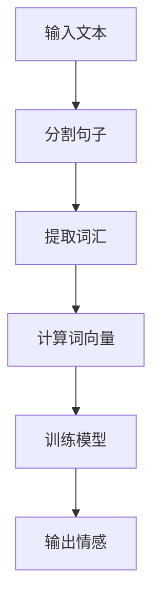
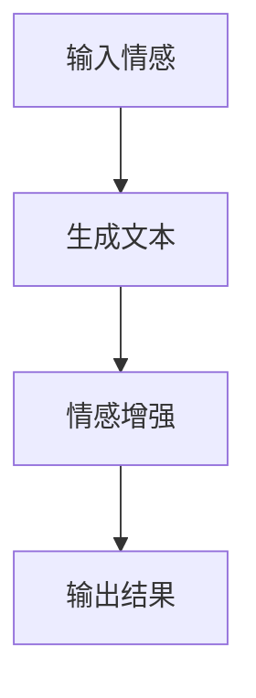
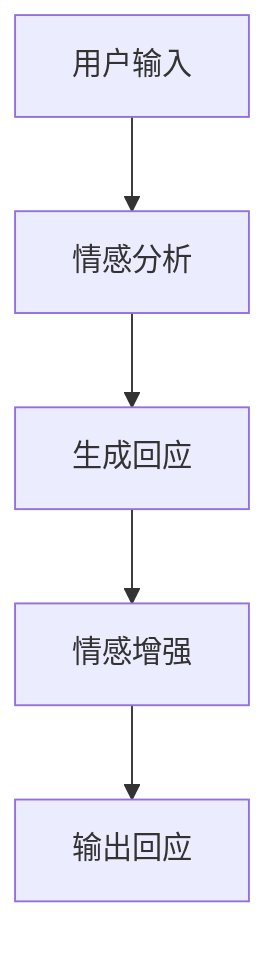
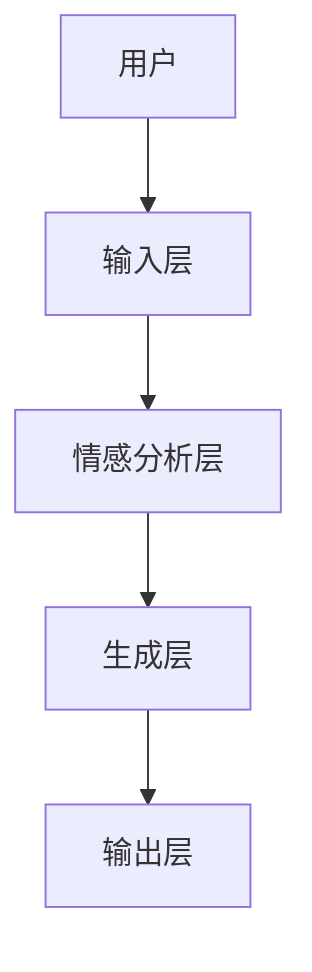

                 


# AI Agent 的情感计算：增强 LLM 的情感交互能力

> 关键词：AI Agent, 情感计算, LLM, 情感交互, 机器学习, 深度学习, 自然语言处理

> 摘要：本文探讨了如何通过情感计算增强大型语言模型（LLM）的情感交互能力，分析了AI Agent在情感计算中的应用，详细讲解了情感计算的原理、算法实现、系统架构设计及实战案例，为提升人机交互的情感智能提供了理论与实践指导。

---

## 第1章：引言

### 1.1 问题背景

#### 1.1.1 AI Agent的发展现状
AI Agent（人工智能代理）作为智能系统的核心组件，近年来随着深度学习和自然语言处理技术的进步，展现出强大的任务执行能力。然而，在复杂的情感交互任务中，AI Agent的表现仍有不足，主要体现在对用户情感的理解和回应不够自然。

#### 1.1.2 情感计算在人机交互中的重要性
情感计算是理解用户情感状态并作出适当回应的关键技术。在医疗、教育、客服等领域，准确的情感识别和生成能够显著提升用户体验，增强人机交互的自然性。

#### 1.1.3 当前LLM在情感交互中的局限性
尽管大型语言模型（LLM）在文本生成和理解方面表现出色，但在处理复杂情感交互时，仍面临挑战。模型难以准确捕捉细微情感，生成的回应有时显得机械，缺乏情感深度。

### 1.2 问题描述

#### 1.2.1 情感计算的核心问题
情感计算涉及从文本中提取情感信息，并根据情感生成合适的回应。核心挑战在于准确识别情感，并在生成回应时保持语境一致性和情感一致性。

#### 1.2.2 LLM在情感交互中的挑战
LLM在处理情感任务时，常受限于训练数据的情感分布和生成策略，导致情感回应不够灵活。此外，模型可能难以处理复杂的情感依赖关系，影响交互的连贯性。

#### 1.2.3 解决方法
通过引入情感计算技术，增强LLM的情感理解能力。结合情感分析和生成模型，优化情感交互的准确性和自然度。

### 1.3 问题解决

#### 1.3.1 情感计算的基本思路
将情感计算分为情感分析和情感生成两个阶段。首先识别用户情感，然后根据情感生成合适的回应。

#### 1.3.2 增强LLM情感交互的方法
引入情感增强模块，对LLM的输出进行情感优化，确保回应的情感一致性。

#### 1.3.3 技术路线与实现框架
结合深度学习模型，构建情感增强的预训练模型，优化LLM的情感交互能力。

### 1.4 边界与外延

#### 1.4.1 情感计算的适用场景
适用于需要情感交互的领域，如客服、教育和医疗。

#### 1.4.2 与相关领域的区别与联系
区别于传统NLP任务，情感计算更关注情感理解和生成，与任务导向型AI Agent结合紧密。

#### 1.4.3 本书的局限性与未来扩展方向
主要关注情感计算在LLM中的应用，未来可扩展到多模态情感计算和实时交互优化。

---

## 第2章：情感计算的原理与方法

### 2.1 情感计算的基本原理

#### 2.1.1 情感分析的定义与分类
情感分析旨在识别文本中的情感倾向，分为二分类、多分类和情感强度分析。

#### 2.1.2 情感生成的机制与模型
情感生成基于生成模型，如GPT系列，通过情感向量引导生成过程。

#### 2.1.3 情感计算的数学模型
结合概率模型和深度学习模型，计算文本的情感向量，用于情感分类和生成。

### 2.2 情感计算的核心方法

#### 2.2.1 基于规则的情感计算
使用情感词典和规则匹配，识别文本中的情感倾向，适用于简单场景。

#### 2.2.2 基于统计的情感计算
利用统计学习方法，如朴素贝叶斯，分析情感特征，适用于特定领域数据。

#### 2.2.3 基于深度学习的情感计算
采用神经网络模型，如LSTM和Transformer，捕捉文本中的情感信息，提升准确性和鲁棒性。

### 2.3 情感计算与LLM的结合

#### 2.3.1 LLM在情感分析中的应用
利用LLM进行情感分类，优化特征提取和模型训练。

#### 2.3.2 LLM在情感生成中的应用
结合情感向量，指导生成模型输出情感化的文本，提升交互的自然度。

#### 2.3.3 情感计算对LLM性能的提升
通过情感增强模块，优化LLM的情感交互能力，增强用户体验。

### 2.4 情感计算的对比分析

#### 2.4.1 不同方法的特征对比
| 方法         | 基于规则 | 基于统计 | 基于深度学习 |
|--------------|----------|----------|--------------|
| 优点         | 简单高效 | 高度准确 | 强大学习能力 |
| 缺点         | 灵活性差 | 计算复杂 | 数据依赖性高 |

#### 2.4.2 方法优缺点分析
基于规则方法简单但缺乏灵活性；基于统计方法准确但计算复杂；深度学习方法性能优越但依赖数据量。

#### 2.4.3 情感计算的未来发展趋势
向多模态和实时交互方向发展，结合图像和语音信息，提升情感识别的准确性和鲁棒性。

---

## 第3章：情感计算算法的实现

### 3.1 情感分析算法

#### 3.1.1 基于词袋模型的情感分析
利用情感词典，统计文本中积极和消极词汇的数量，计算情感倾向。

#### 3.1.2 基于词嵌入的情感分析
使用词嵌入模型，如Word2Vec，将文本转化为向量表示，进行情感分类。

#### 3.1.3 基于深度学习的情感分析
采用LSTM或Transformer模型，捕捉文本中的长距离依赖关系，提升分类准确性。

#### 3.1.4 情感分析的流程图


### 3.2 情感生成算法

#### 3.2.1 情感生成的基本思路
基于生成模型，如GPT，生成与输入情感一致的文本。

#### 3.2.2 情感增强的生成策略
通过情感向量引导生成过程，确保生成文本的情感一致性。

#### 3.2.3 情感生成的流程图


### 3.3 情感计算的数学模型

#### 3.3.1 情感分类的数学模型
使用交叉熵损失函数：
$$ \text{Loss} = -\sum_{i=1}^{n} y_i \log(p_i) + (1-y_i) \log(1-p_i) $$
其中，$y_i$是真实标签，$p_i$是预测概率。

#### 3.3.2 情感生成的数学模型
利用Transformer模型的自注意力机制，计算文本的情感向量：
$$ \text{Attention}(Q, K, V) = \text{softmax}(\frac{QK^T}{\sqrt{d}})V $$

---

## 第4章：系统分析与架构设计

### 4.1 项目背景

#### 4.1.1 项目目标
开发一个基于LLM的情感增强AI Agent，提升人机交互的情感智能。

#### 4.1.2 项目需求
实现情感分析、情感生成和情感增强功能，支持多轮交互。

### 4.2 系统功能设计

#### 4.2.1 系统模块划分
- 情感分析模块：识别用户情感。
- 情感生成模块：生成情感化回应。
- 情感增强模块：优化LLM的情感交互能力。

#### 4.2.2 系统功能流程图


### 4.3 系统架构设计

#### 4.3.1 系统架构图


#### 4.3.2 系统接口设计
- 输入接口：接收用户文本输入。
- 输出接口：发送情感化回应。

### 4.4 系统交互设计

#### 4.4.1 交互流程图


---

## 第5章：项目实战

### 5.1 环境安装

#### 5.1.1 安装Python
```bash
python --version
pip install --upgrade pip
```

#### 5.1.2 安装依赖库
```bash
pip install numpy
pip install matplotlib
pip install transformers
```

### 5.2 核心代码实现

#### 5.2.1 情感分析代码
```python
from transformers import pipeline

sentiment_pipeline = pipeline("sentiment-analysis")
result = sentiment_pipeline("This is a great day!")
print(result)
```

#### 5.2.2 情感生成代码
```python
from transformers import AutoModelForCausalLM, AutoTokenizer

model_name = "gpt2"
tokenizer = AutoTokenizer.from_pretrained(model_name)
model = AutoModelForCausalLM.from_pretrained(model_name)

inputs = tokenizer("I feel happy today.", return_tensors="pt")
outputs = model.generate(inputs.input_ids, max_length=50)
print(tokenizer.decode(outputs[0], skip_special_tokens=True))
```

### 5.3 代码解读与分析

#### 5.3.1 情感分析代码解读
使用预训练的情感分析模型，对输入文本进行情感分类，输出情感标签和置信度。

#### 5.3.2 情感生成代码解读
利用GPT模型生成与输入情感一致的文本，确保回应的情感一致性。

### 5.4 实际案例分析

#### 5.4.1 情感分析案例
输入文本：“I am so disappointed with the service.”，模型识别出消极情感。

#### 5.4.2 情感生成案例
输入情感：积极，生成回应：“Thank you for your kind words! We’re here to help.”

### 5.5 项目小结

#### 5.5.1 项目总结
通过情感计算增强LLM的情感交互能力，实现更自然的人机对话。

#### 5.5.2 经验总结
在实际应用中，需不断优化情感模型，提升交互的准确性和自然度。

---

## 第6章：总结与展望

### 6.1 内容回顾

#### 6.1.1 核心内容总结
本文详细探讨了情感计算在增强LLM情感交互中的应用，分析了算法原理和系统架构。

### 6.1.2 技术总结
通过情感计算提升LLM的交互能力，增强用户体验。

### 6.2 未来展望

#### 6.2.1 情感计算的未来方向
向多模态情感计算和实时交互优化方向发展，结合图像和语音信息，提升情感识别的准确性和鲁棒性。

#### 6.2.2 AI Agent的未来趋势
随着技术进步，AI Agent将具备更强的情感理解能力，推动人机交互进入新阶段。

### 6.3 小结

#### 6.3.1 技术上的不足
当前模型仍需优化，以应对复杂的情感交互场景。

#### 6.3.2 实际应用中的挑战
数据获取和模型训练成本是实际应用中的主要挑战。

---

## 作者

作者：AI天才研究院/AI Genius Institute & 禅与计算机程序设计艺术 /Zen And The Art of Computer Programming

---

以上是《AI Agent 的情感计算：增强 LLM 的情感交互能力》的完整目录大纲及内容，涵盖背景介绍、核心概念、算法实现、系统设计和项目实战，提供详细的技术指导和实践案例，帮助读者深入理解情感计算在AI Agent中的应用，提升大型语言模型的情感交互能力。

