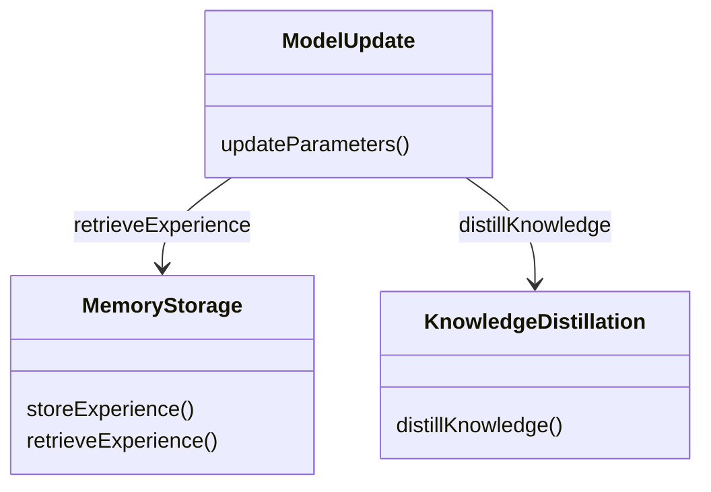
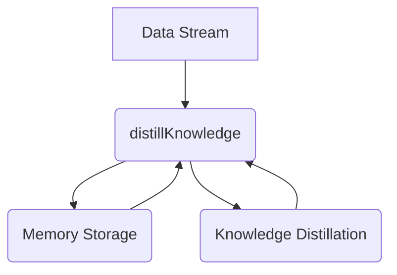
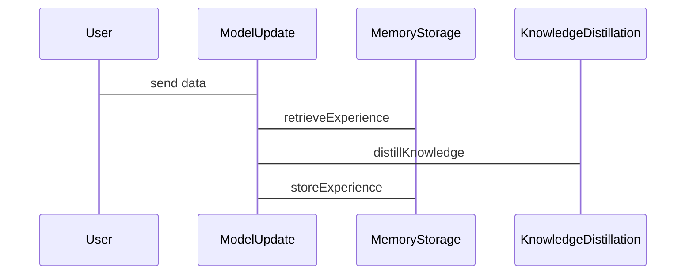

                 


# AI Agent 的持续学习：实现 LLM 的终身学习能力

> 关键词：AI Agent，持续学习，LLM，终身学习能力，大语言模型，机器学习

> 摘要：本文探讨了AI Agent实现LLM的终身学习能力，分析了持续学习的核心机制、算法原理、系统架构，并通过实际案例展示了如何将这些理论应用于实践。文章深入浅出地解释了相关技术，并提供了详细的代码示例和系统设计图，帮助读者全面理解AI Agent的持续学习能力。

---

## 第1章：AI Agent 的持续学习概述

### 1.1 AI Agent 的基本概念

#### 1.1.1 AI Agent 的定义与分类

AI Agent（人工智能代理）是指能够感知环境、自主决策并执行任务的智能体。根据功能和智能水平，AI Agent可以分为简单反射型、基于模型的反应型、目标驱动型和实用驱动型等类别。AI Agent广泛应用于自动驾驶、智能助手、机器人等领域。

#### 1.1.2 持续学习的定义与特点

持续学习是一种机器学习范式，允许模型在新数据流上不断更新和优化，而不必重新训练整个模型。其特点是在线学习、增量学习和模型适应性。

#### 1.1.3 LLM 的终身学习能力

大语言模型（LLM）通过持续学习可以不断更新知识库，适应新数据和任务，提升理解和生成能力。终身学习能力使LLM能够像人类一样，通过经验不断进化。

### 1.2 持续学习的背景与技术背景

#### 1.2.1 当前 AI Agent 的局限性

传统AI Agent在固定任务中表现优异，但面对新任务和动态环境时，需要频繁重训，效率低下。持续学习解决了这一问题，使AI Agent能够在线更新，适应新环境。

#### 1.2.2 持续学习的核心思想

持续学习强调模型的可更新性和适应性，允许模型在新数据流中逐步优化，避免了从头训练的高计算成本。

#### 1.2.3 LLM 与持续学习的结合

LLM具备强大的上下文理解和生成能力，结合持续学习，可以在不重训的情况下，逐步优化模型，适应新数据和任务。

### 1.3 持续学习的必要性与挑战

#### 1.3.1 为什么要实现 LLM 的持续学习能力

实时更新：允许AI Agent实时更新知识，适应动态环境。

降低计算成本：持续学习避免了每次新任务都从头训练，节省计算资源。

增强适应性：提升模型在多任务环境中的表现，适应多样化需求。

#### 1.3.2 持续学习面临的挑战

模型遗忘：模型在学习新任务时可能忘记旧任务的知识，导致性能下降。

计算资源：持续学习需要实时处理数据，对计算资源要求较高。

数据质量：新数据可能噪声多，影响模型更新。

#### 1.3.3 当前研究现状与未来趋势

当前研究集中在模型更新算法、记忆机制和知识蒸馏技术。未来趋势是结合边缘计算和分布式学习，实现更高效的持续学习。

---

## 第2章：持续学习的核心概念与联系

### 2.1 持续学习的机制与原理

#### 2.1.1 在线学习与离线学习的对比

在线学习实时处理数据，适合动态环境；离线学习批量处理，适合静态任务。选择哪种方式取决于任务需求。

#### 2.1.2 记忆增强与知识蒸馏的原理

记忆增强通过存储关键信息帮助模型快速更新；知识蒸馏将知识压缩到小模型中，减少存储需求。

#### 2.1.3 参数更新与模型优化的关系

参数更新是模型优化的基础，持续更新参数使模型适应新数据。

### 2.2 持续学习的核心算法与模型

#### 2.2.1 模型更新算法的分类

包括基于梯度的方法（如SGD、Adam）和非参数化方法（如经验重放、模型平均）。基于梯度的方法适用于在线更新，非参数化方法适用于增量学习。

#### 2.2.2 记忆机制的实现方式

通过注意力机制和增强学习率控制，强化模型对重要信息的更新。

#### 2.2.3 知识蒸馏的具体步骤

将知识从大模型迁移到小模型，减少计算需求，同时保持性能。

### 2.3 持续学习的系统架构

#### 2.3.1 系统架构的模块划分

包括数据流、模型更新、记忆存储和知识蒸馏模块。

#### 2.3.2 各模块之间的关系

数据流驱动模型更新，记忆存储辅助更新，知识蒸馏优化模型。

#### 2.3.3 系统架构的优化建议

采用分布式架构，利用边缘计算，减少数据传输延迟。

---

## 第3章：持续学习的算法原理

### 3.1 模型更新算法

#### 3.1.1 基于梯度的更新方法

使用Adam优化器，计算梯度并更新模型参数，公式如下：

$$ \theta_{t+1} = \theta_t - \eta \nabla L(\theta_t) $$

#### 3.1.2 参数化更新与非参数化更新的对比

参数化更新直接调整模型参数，适合在线学习；非参数化更新存储经验，适合增量学习。

#### 3.1.3 模型更新的数学公式推导

结合梯度下降和动量优化，公式如下：

$$ v_t = \beta v_{t-1} + (1-\beta) g_t $$
$$ \theta_{t+1} = \theta_t - \eta v_t $$

### 3.2 记忆增强机制

#### 3.2.1 基于注意力机制的记忆网络

通过自注意力机制，关注重要信息，公式如下：

$$ \alpha_i = \frac{exp(w_i^T x)}{\sum exp(w_j^T x)} $$

#### 3.2.2 增量式记忆存储的实现

使用经验重放缓冲区，存储代表性样本，按比例回放，公式：

$$ p(i) = \frac{1}{1 + \sum \exp(-\lambda t_i)} $$

#### 3.2.3 记忆网络的数学模型

记忆网络通过门控机制控制信息更新，公式：

$$ f(t) = \sigma(w_f x + u_f h_{t-1}) $$
$$ h_t = f(t) \cdot g(x) + (1 - f(t)) \cdot h_{t-1} $$

### 3.3 知识蒸馏技术

#### 3.3.1 知识蒸馏的步骤

1. 训练教师模型，获取知识表示。
2. 使用学生模型学习教师模型的软标签。
3. 蒸馏知识到学生模型，优化其预测。

#### 3.3.2 知识蒸馏的数学模型

教师模型输出概率分布：

$$ P(y|x) = \text{softmax}(f(x)) $$

学生模型优化目标：

$$ \mathcal{L} = -\sum_{i=1}^n P(y|x_i) \log Q(y|x_i) $$

---

## 第4章：系统分析与架构设计方案

### 4.1 问题场景介绍

动态环境中的AI Agent需要实时更新模型，适应新任务，如在线客服系统，需要实时更新知识库回答用户问题。

### 4.2 项目介绍

设计一个支持持续学习的AI Agent系统，使用LLM处理文本数据，具备在线更新和记忆增强功能。

### 4.3 系统功能设计

领域模型类图展示各模块关系：



### 4.4 系统架构设计

系统架构图展示各模块的交互：



### 4.5 系统接口设计

接口定义：

1. `updateParameters(data)`: 更新模型参数。
2. `retrieveExperience()`: 获取经验数据。
3. `distillKnowledge()`: 执行知识蒸馏。

### 4.6 系统交互设计

序列图展示交互流程：



---

## 第5章：项目实战

### 5.1 环境安装

安装Python和相关库，如TensorFlow、Keras、Transformers。

### 5.2 系统核心实现

实现模型更新、记忆存储和知识蒸馏模块，代码示例如下：

```python
class ModelUpdater:
    def __init__(self, model):
        self.model = model
        self.optimizer = Adam(lr=1e-3)
    
    def update_parameters(self, inputs, labels):
        with tf.GradientTape() as tape:
            outputs = self.model(inputs)
            loss = loss_fn(labels, outputs)
        gradients = tape.gradient(loss, self.model.trainable_weights)
        self.optimizer.apply_gradients(zip(gradients, self.model.trainable_weights))
        return loss
```

### 5.3 代码解读与分析

代码实现模型更新，使用Adam优化器，计算梯度并更新参数，返回损失值。

### 5.4 实际案例分析

以在线客服系统为例，展示如何实时更新模型回答用户问题。

### 5.5 项目小结

实现了一个支持持续学习的AI Agent系统，展示了模型更新、记忆存储和知识蒸馏的实现。

---

## 第6章：最佳实践与总结

### 6.1 小结

本文详细探讨了AI Agent的持续学习能力，从理论到实践，展示了如何实现LLM的终身学习能力。

### 6.2 注意事项

持续学习需要平衡模型更新与性能，避免遗忘旧知识。

### 6.3 拓展阅读

推荐阅读关于持续学习的最新论文和相关技术博客，深入了解前沿研究。

---

## 作者

作者：AI天才研究院/AI Genius Institute & 禅与计算机程序设计艺术 /Zen And The Art of Computer Programming

---

以上就是《AI Agent 的持续学习：实现 LLM 的终身学习能力》的完整内容，涵盖从背景到实践的各个层面，帮助读者全面理解AI Agent的持续学习能力。

