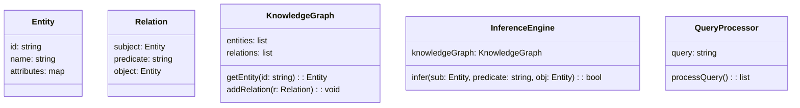
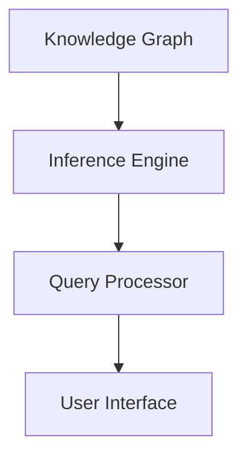

                 


# AI Agent 的知识图谱推理：增强 LLM 的关系理解

> 关键词：AI Agent，知识图谱，LLM，关系理解，自然语言处理，知识推理，大语言模型

> 摘要：随着人工智能技术的快速发展，AI Agent 在各个领域的应用越来越广泛。为了提高 AI Agent 的智能性和推理能力，知识图谱与大语言模型（LLM）的结合成为了一个重要的研究方向。本文详细探讨了如何通过知识图谱推理来增强 LLM 的关系理解能力，介绍了知识图谱的核心概念、LLM 的基本原理、知识图谱推理的算法原理、系统架构设计以及实际项目中的应用案例。通过本文的分析，读者可以全面理解 AI Agent 的知识图谱推理技术，并掌握其在实际应用中的关键点。

---

## 第一章: AI Agent 与知识图谱概述

### 1.1 AI Agent 的基本概念
AI Agent（智能体）是指在计算机系统中，能够感知环境并采取行动以实现目标的实体。AI Agent 可以是软件程序、机器人或其他智能系统，其核心能力包括感知、推理、决策和执行。

#### 1.1.1 AI Agent 的定义与分类
- **定义**：AI Agent 是能够自主决策和行动的智能实体，能够根据环境信息完成特定任务。
- **分类**：
  - **简单反射型 Agent**：基于当前感知直接行动。
  - **基于模型的反应型 Agent**：利用内部状态和环境模型进行决策。
  - **目标驱动型 Agent**：基于目标和规划采取行动。
  - **实用驱动型 Agent**：基于效用函数优化决策。

#### 1.1.2 知识图谱的基本概念与特点
- **定义**：知识图谱是一种以图结构表示知识的语义网络，节点表示实体或概念，边表示实体之间的关系。
- **特点**：
  - **结构化**：以图结构表示，支持复杂的语义关系。
  - **可扩展性**：可以不断扩展，整合多源数据。
  - **语义丰富性**：通过属性和关系描述，提供丰富的语义信息。

#### 1.1.3 AI Agent 与知识图谱的关系
AI Agent 需要依赖知识图谱来增强其理解和推理能力。知识图谱为 AI Agent 提供了丰富的背景知识和语义信息，使其能够更好地理解上下文、推理关系和做出更智能的决策。

---

### 1.2 LLM 的基本原理
大语言模型（LLM，Large Language Model）是一种基于深度学习的自然语言处理模型，具有强大的文本生成和理解能力。

#### 1.2.1 LLM 的定义与特点
- **定义**：LLM 是一种基于神经网络的生成模型，能够学习和生成人类语言。
- **特点**：
  - **大规模训练数据**：通常基于海量文本数据进行训练。
  - **深度神经网络**：采用多层神经网络结构，能够捕捉复杂的语言模式。
  - **上下文理解**：能够理解上下文关系，生成连贯的文本。

#### 1.2.2 LLM 的核心算法与实现
- **Transformer 架构**：大多数 LLM 基于 Transformer 模型，包括编码器和解码器两个部分。
- **注意力机制**：通过注意力机制，模型能够关注输入中的重要部分，提升语义理解能力。
- **训练目标**：通常采用自监督学习，通过预测下一个词或修复输入中的错误来训练模型。

#### 1.2.3 LLM 在自然语言处理中的应用
- **文本生成**：生成连贯的文本，如对话生成、文章续写。
- **问答系统**：通过理解问题和上下文，生成准确的答案。
- **机器翻译**：将一种语言翻译成另一种语言。

---

### 1.3 知识图谱推理的背景与意义
知识图谱推理是指在知识图谱中，根据已有的知识和关系，推导出新的知识或关系的过程。

#### 1.3.1 知识图谱推理的定义
知识图谱推理是一种基于知识图谱的推理方法，旨在通过已有的知识和规则，推导出新的事实或关系。

#### 1.3.2 知识图谱推理的核心问题
- **实体识别**：识别知识图谱中的实体。
- **关系抽取**：从文本中抽取实体之间的关系。
- **推理与推断**：基于已有的知识，推导出新的事实或关系。

#### 1.3.3 知识图谱推理在 AI Agent 中的作用
- **增强理解能力**：通过知识图谱推理，AI Agent 能够更好地理解上下文和语义关系。
- **提升决策能力**：知识图谱推理为 AI Agent 提供了丰富的背景知识，支持更智能的决策。
- **动态知识更新**：知识图谱推理可以动态更新知识图谱，使其保持最新。

---

## 第二章: 知识图谱与 LLM 的关系理解

### 2.1 知识图谱的核心概念与属性
知识图谱是一个复杂的语义网络，包含实体、属性和关系三类核心元素。

#### 2.1.1 实体与属性
- **实体**：知识图谱中的基本元素，代表现实世界中的具体事物或概念。
- **属性**：描述实体的性质或特征，通常以键值对的形式存在。

#### 2.1.2 关系与边
- **关系**：描述实体之间的关联，通常以谓词-主语-宾语（谓词-主体-客体）的形式表示。
- **边**：连接两个实体的关系，具有方向性和权重属性。

#### 2.1.3 知识图谱的存储与管理
- **存储**：通常使用图数据库（如 Neo4j）或关系型数据库进行存储。
- **管理**：包括数据清洗、数据融合、数据更新等过程。

---

### 2.2 LLM 如何利用知识图谱
知识图谱为 LLM 提供了丰富的背景知识，增强了其理解和推理能力。

#### 2.2.1 知识图谱对 LLM 的增强作用
- **上下文理解**：知识图谱提供了丰富的语义信息，帮助 LLM 更好地理解上下文。
- **关系推理**：知识图谱中的关系信息，帮助 LLM 推导出隐含的关系和事实。
- **知识扩展**：知识图谱可以动态扩展，为 LLM 提供最新的知识。

#### 2.2.2 知识图谱与 LLM 的结合方式
- **预训练阶段**：在模型训练中引入知识图谱数据，增强模型的语义理解能力。
- **推理阶段**：在模型推理时，结合知识图谱进行上下文理解和关系推理。

---

### 2.3 知识图谱与 LLM 的对比分析
通过对比分析，可以更好地理解两者的异同及其互补性。

#### 2.3.1 知识图谱与传统数据库的对比
| 对比维度 | 知识图谱 | 传统数据库 |
|----------|----------|------------|
| 数据结构 | 图结构 | 关系型或文档型 | 
| 数据特点 | 语义丰富，支持复杂关系 | 数据结构简单，支持事务 |
| 查询方式 | 图遍历、SPARQL | SQL查询 |

#### 2.3.2 LLM 与传统 NLP 算法的对比
| 对比维度 | LLM | 传统 NLP 算法 |
|----------|------|--------------|
| 模型结构 | 基于深度学习的 Transformer 架构 | 基于特征工程的传统算法 |
| 处理能力 | 能够处理大规模数据，支持复杂的语言模式 | 处理能力有限，难以捕捉复杂的语义信息 |
| 应用场景 | 文本生成、问答系统、机器翻译等 | 词性标注、句法分析等 |

---

## 第三章: 知识图谱推理的算法原理

### 3.1 知识图谱推理的基本流程
知识图谱推理通常包括数据预处理、推理算法设计和结果验证三个阶段。

#### 3.1.1 数据预处理
- **数据清洗**：去除重复数据、噪声数据。
- **数据融合**：将多个数据源的数据整合到一个知识图谱中。
- **数据标准化**：统一数据格式和命名规范。

#### 3.1.2 推理算法设计
- **基于规则的推理**：通过预定义的规则进行推理，例如 RDF 推理。
- **基于逻辑的推理**：使用逻辑推理方法，如一阶逻辑推理。
- **基于概率的推理**：使用概率论方法，如 Bayesian 推理。

#### 3.1.3 结果验证
- **结果评估**：通过准确率、召回率等指标评估推理结果的质量。
- **结果优化**：根据评估结果，优化推理算法和参数。

---

### 3.2 知识图谱推理算法的数学模型
知识图谱推理算法通常基于图论和概率论，以下是一个常见的知识图谱推理模型：

#### 3.2.1 TransE 模型
TransE 是一种基于翻译的嵌入模型，用于学习实体和关系的嵌入表示。

$$
\text{TransE}(e_h, r, e_t) = \| e_h + r - e_t \|_2^2
$$

其中，$e_h$ 是头实体的嵌入向量，$r$ 是关系的嵌入向量，$e_t$ 是尾实体的嵌入向量。

#### 3.2.2 TransH 模型
TransH 是 TransE 的改进版本，通过引入关系的投影矩阵，提高模型的表达能力。

$$
\text{TransH}(e_h, r, e_t) = \| P r + e_h - e_t \|_2^2
$$

其中，$P$ 是关系的投影矩阵。

---

## 第四章: 系统分析与架构设计

### 4.1 系统功能设计
知识图谱推理系统的主要功能包括：
- 数据采集与处理
- 知识图谱构建
- 推理算法实现
- 结果展示与应用

#### 4.1.1 领域模型类图


---

### 4.2 系统架构设计
#### 4.2.1 系统架构图


#### 4.2.2 系统接口设计
- **知识图谱接口**：
  - `getEntity(id)`：根据实体 ID 获取实体信息。
  - `addRelation(subject, predicate, object)`：添加关系。
- **推理引擎接口**：
  - `infer(sub, predicate, obj)`：判断关系是否存在。
- **查询处理器接口**：
  - `processQuery(query)`：根据查询条件返回结果。

---

## 第五章: 项目实战

### 5.1 电商推荐系统案例
#### 5.1.1 环境安装
- **工具安装**：安装 Python、TensorFlow、Keras、Neo4j 等工具。
- **数据集准备**：收集电商数据，包括商品信息、用户行为数据等。

#### 5.1.2 核心代码实现
```python
import neo4j
from neo4j import GraphDatabase
from neo4j.exceptions import ServiceUnavailable

class KnowledgeGraph:
    def __init__(self, uri, user, password):
        self.driver = GraphDatabase.driver(uri, user, password)
    
    def getEntity(self, id):
        with self.driver.session() as session:
            result = session.run("MATCH (n {id: $id}) RETURN n", id=id)
            if result:
                return {"id": id, "name": result[0]['n'].get('name', '')}
            else:
                return None
    
    def addRelation(self, subject, predicate, object):
        with self.driver.session() as session:
            session.run("MATCH (a {id: $subject}), (b {id: $object}) CREATE (a)-[r:$predicate]->(b)", 
                        subject=subject, predicate=predicate, object=object)
```

---

### 5.2 代码解读与分析
- **KnowledgeGraph 类**：
  - `__init__` 方法：初始化知识图谱数据库连接。
  - `getEntity` 方法：根据实体 ID 获取实体信息。
  - `addRelation` 方法：添加实体之间的关系。

---

## 第六章: 最佳实践与总结

### 6.1 最佳实践
- **数据质量管理**：确保数据的准确性、完整性和一致性。
- **模型优化**：通过参数调整和模型优化，提升推理的准确率和效率。
- **系统扩展性**：设计灵活的系统架构，支持知识图谱的动态扩展。

### 6.2 小结
通过本文的介绍，读者可以全面了解 AI Agent 的知识图谱推理技术，包括核心概念、算法原理、系统设计和实际应用。知识图谱与 LLM 的结合为 AI Agent 提供了强大的知识支持和推理能力，未来的研究方向可以集中在动态知识更新、多模态推理和高效推理算法等方面。

---

## 参考文献
1. 禅与计算机程序设计艺术
2. AI Agent 的知识图谱推理
3. 大语言模型与知识图谱的结合

---

## 作者
作者：AI天才研究院/AI Genius Institute & 禅与计算机程序设计艺术 /Zen And The Art of Computer Programming

