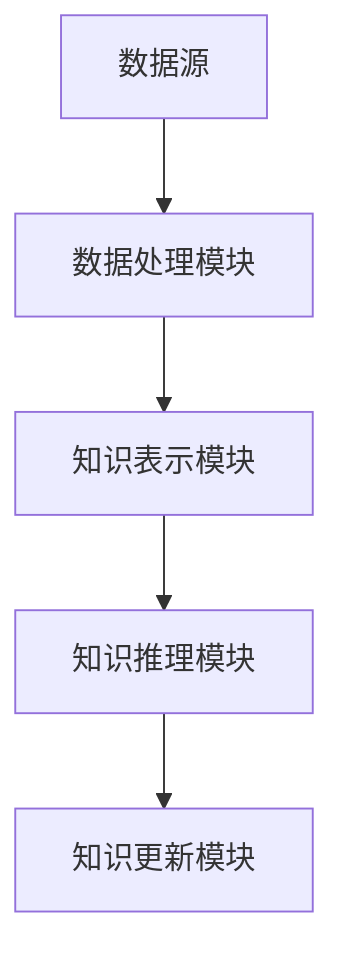

                 


# AI Agent 的知识更新：保持 LLM 知识的时效性

> 关键词：AI Agent, 知识更新, LLM, 时效性, 强化学习, 监督学习, 系统架构

> 摘要：本文深入探讨了AI Agent的知识更新机制，分析了如何保持LLM（大语言模型）知识的时效性。从背景介绍、核心概念、算法原理、系统架构设计到项目实战，系统性地阐述了AI Agent知识更新的全貌。文章结合理论与实践，详细讲解了知识更新的驱动因素、算法实现、系统架构设计以及实际案例，为读者提供了全面的知识更新解决方案。

---

# 第1章: AI Agent 的知识更新背景与问题描述

## 1.1 AI Agent 的基本概念
### 1.1.1 什么是 AI Agent
AI Agent（人工智能代理）是指能够感知环境、自主决策并执行任务的智能实体。它可以是一个软件程序、机器人或其他智能系统，具备以下核心特征：
- **自主性**：能够在没有外部干预的情况下自主运行。
- **反应性**：能够根据环境反馈实时调整行为。
- **目标导向**：通过目标驱动来完成特定任务。
- **学习能力**：能够通过经验或数据改进自身性能。

### 1.1.2 AI Agent 的核心特征
AI Agent的核心特征包括：
- **知识表示**：通过数据结构或模型来表示知识。
- **知识推理**：基于知识进行逻辑推理或决策。
- **知识更新**：持续获取新知识以保持知识库的时效性。

### 1.1.3 AI Agent 的应用场景
AI Agent广泛应用于多个领域，如智能助手、推荐系统、自动驾驶等。例如，智能助手（如Siri、Alexa）通过与用户交互获取新信息，并实时更新知识库，以提供更精准的服务。

---

## 1.2 LLM 知识时效性问题
### 1.2.1 LLM 的知识更新需求
大语言模型（LLM）的知识库通常是静态的，无法自动更新。然而，随着信息的快速变化（如新事件、新技术的出现），静态知识库可能导致AI Agent的决策错误。因此，LLM的知识更新需求日益迫切。

### 1.2.2 知识时效性对 AI Agent 的影响
知识时效性问题对AI Agent的影响主要体现在：
- **决策错误**：基于过时的知识可能导致错误决策。
- **服务质量下降**：无法提供准确、及时的服务。
- **用户体验不佳**：用户可能因信息滞后而失去信任。

### 1.2.3 知识更新的挑战与解决方案
知识更新的挑战包括数据获取难度、模型训练成本高等。解决方案包括：
- **数据流机制**：实时获取新数据并更新知识库。
- **模型微调**：通过微调模型参数来更新知识。
- **用户反馈**：利用用户反馈优化知识库。

---

## 1.3 本章小结
本章从AI Agent的基本概念出发，分析了知识时效性问题对AI Agent的影响，并提出了知识更新的初步解决方案。下一章将详细探讨知识更新的核心概念与机制。

---

# 第2章: AI Agent 知识更新的核心概念与机制

## 2.1 知识更新的定义与分类
### 2.1.1 知识更新的定义
知识更新是指通过获取新数据、模型调整或用户反馈，不断优化知识库的过程。

### 2.1.2 知识更新的分类
知识更新可以分为以下几类：
- **数据驱动更新**：基于新数据进行知识更新。
- **模型驱动更新**：通过调整模型参数进行知识更新。
- **用户反馈驱动更新**：根据用户反馈优化知识库。

### 2.1.3 知识更新的边界与外延
知识更新的边界在于如何平衡更新频率与计算成本。外延则包括数据预处理、模型优化等多个环节。

---

## 2.2 知识更新的驱动因素
### 2.2.1 数据驱动的知识更新
数据驱动的知识更新通过实时获取新数据来优化知识库。例如，新闻AI Agent可以通过每天获取最新新闻数据来更新知识库。

### 2.2.2 模型驱动的知识更新
模型驱动的知识更新通过调整模型参数来优化知识表示。例如，使用强化学习算法优化LLM的输出质量。

### 2.2.3 用户反馈驱动的知识更新
用户反馈驱动的知识更新通过收集用户行为数据来优化知识库。例如，智能助手通过用户点击行为优化搜索结果的排序。

---

## 2.3 知识更新的流程与机制
### 2.3.1 数据获取与预处理
数据获取是知识更新的第一步，通常包括数据清洗、特征提取等步骤。例如，使用爬虫获取新闻数据，并进行文本清洗。

### 2.3.2 知识表示与存储
知识表示是通过数据结构或模型来表示知识。例如，使用图结构表示知识图谱。

### 2.3.3 知识推理与更新
知识推理是通过逻辑推理或机器学习模型来更新知识库。例如，使用强化学习模型优化知识库的权重。

---

## 2.4 本章小结
本章详细介绍了知识更新的核心概念与机制，包括数据驱动、模型驱动和用户反馈驱动的知识更新方式。下一章将从算法角度深入探讨知识更新的实现方法。

---

# 第3章: AI Agent 知识更新的核心算法与原理

## 3.1 知识更新的算法概述
### 3.1.1 知识更新的主流算法
知识更新的主流算法包括：
- **强化学习**：通过奖励机制优化知识库。
- **监督学习**：通过标注数据优化知识库。
- **无监督学习**：通过聚类等技术发现新知识。

### 3.1.2 算法的优缺点对比
| 算法类型 | 优点 | 缺点 |
|----------|------|------|
| 强化学习 | 能够优化复杂决策 | 需要设计合理的奖励机制 |
| 监督学习 | 数据标注简单 | 需要大量标注数据 |
| 无监督学习 | 无需标注数据 | 精度较低 |

---

## 3.2 基于强化学习的知识更新算法
### 3.2.1 强化学习的基本原理
强化学习通过智能体与环境的交互，通过试错的方式优化策略。公式表示为：
$$ R = r_1 + r_2 + ... + r_n $$
其中，$R$ 是总奖励，$r_i$ 是每一步的奖励。

### 3.2.2 知识更新的强化学习模型
知识更新的强化学习模型可以通过以下步骤实现：
1. 定义状态空间：表示当前知识库的状态。
2. 定义动作空间：表示可能的更新操作。
3. 定义奖励函数：根据更新结果给予奖励。

### 3.2.3 算法实现步骤
1. 初始化知识库。
2. 通过强化学习算法更新知识库。
3. 根据奖励调整策略。

---

## 3.3 基于监督学习的知识更新算法
### 3.3.1 监督学习的基本原理
监督学习通过标注数据训练模型。公式表示为：
$$ y = f(x) $$
其中，$y$ 是目标值，$x$ 是输入数据。

### 3.3.2 知识更新的监督学习模型
知识更新的监督学习模型可以通过以下步骤实现：
1. 收集标注数据。
2. 训练监督学习模型。
3. 使用模型更新知识库。

### 3.3.3 算法实现步骤
1. 收集新数据并标注。
2. 使用监督学习算法训练模型。
3. 使用模型预测并更新知识库。

---

## 3.4 算法的数学模型与公式
### 3.4.1 强化学习的数学模型
强化学习的数学模型可以用值函数表示：
$$ V(s) = \max_a Q(s,a) $$
其中，$V(s)$ 是状态值函数，$Q(s,a)$ 是动作值函数。

### 3.4.2 监督学习的数学模型
监督学习的数学模型可以用回归或分类函数表示：
$$ y = f(x) $$

---

## 3.5 算法的实现与优化
### 3.5.1 算法实现的步骤
1. 收集数据并预处理。
2. 选择合适的算法并训练模型。
3. 使用模型更新知识库。

### 3.5.2 算法优化的策略
- **数据增强**：通过数据增强技术提高数据质量。
- **模型优化**：通过剪枝等技术优化模型性能。

### 3.5.3 算法的性能评估
- **准确率**：模型预测的准确率。
- **召回率**：模型预测的召回率。

---

## 3.6 本章小结
本章从算法角度详细探讨了知识更新的实现方法，包括强化学习和监督学习的原理与实现步骤。下一章将从系统架构角度分析知识更新的设计与实现。

---

# 第4章: AI Agent 知识更新的系统架构与设计

## 4.1 系统架构概述
### 4.1.1 系统模块划分
知识更新系统可以划分为以下几个模块：
- **数据源**：数据获取模块。
- **数据处理模块**：数据清洗、特征提取等。
- **知识表示模块**：知识表示与存储。
- **知识推理模块**：知识推理与更新。
- **知识更新模块**：模型训练与更新。

### 4.1.2 系统功能设计
系统功能包括：
- 数据获取与预处理。
- 知识表示与存储。
- 知识推理与更新。
- 模型训练与优化。

### 4.1.3 系统架构图



---

## 4.2 系统功能设计
### 4.2.1 数据获取与预处理
数据获取可以通过爬虫或API接口完成。预处理包括数据清洗、特征提取等。

### 4.2.2 知识表示与存储
知识表示可以采用图结构或向量表示。知识存储可以采用数据库或知识图谱。

### 4.2.3 知识推理与更新
知识推理可以通过逻辑推理或机器学习模型实现。知识更新可以通过模型微调或数据增强实现。

---

## 4.3 系统接口设计
系统接口设计包括：
- 数据接口：数据获取与预处理的接口。
- 模型接口：模型训练与更新的接口。
- 用户接口：用户反馈与交互的接口。

---

## 4.4 系统交互设计
系统交互设计可以通过以下步骤实现：
1. 用户发起请求。
2. 系统获取新数据。
3. 系统更新知识库。
4. 系统返回结果。

---

## 4.5 本章小结
本章从系统架构角度详细探讨了知识更新的设计与实现，包括模块划分、功能设计、接口设计和交互设计。下一章将通过项目实战进一步验证知识更新的实现。

---

# 第5章: AI Agent 知识更新的项目实战

## 5.1 项目背景与介绍
本项目旨在实现一个实时更新的知识库，用于优化AI Agent的决策能力。

## 5.2 环境安装与配置
### 5.2.1 环境安装
- Python 3.8+
- PyTorch 1.9+
- Transformers库

### 5.2.2 环境配置
```python
pip install torch transformers
```

---

## 5.3 系统核心实现
### 5.3.1 数据获取与预处理
```python
import requests

def get_data():
    response = requests.get("https://example.com/data")
    return response.json()
```

### 5.3.2 模型训练与更新
```python
from transformers import AutoModelForMaskedLM, AutoTokenizer

model = AutoModelForMaskedLM.from_pretrained("bert-base-cased")
tokenizer = AutoTokenizer.from_pretrained("bert-base-cased")
```

---

## 5.4 代码实现与解读
### 5.4.1 知识更新模块实现
```python
def update_knowledge_base(new_data):
    # 数据预处理
    processed_data = preprocess(new_data)
    # 模型训练
    model.train(processed_data)
    # 知识更新
    knowledge_base.update(model)
```

### 5.4.2 模型训练与优化
```python
def train_model(data):
    optimizer = torch.optim.Adam(model.parameters(), lr=1e-5)
    for batch in data:
        optimizer.zero_grad()
        outputs = model(batch)
        loss = outputs.loss
        loss.backward()
        optimizer.step()
```

---

## 5.5 实际案例分析
### 5.5.1 案例背景
假设我们有一个新闻AI Agent，需要实时更新新闻数据。

### 5.5.2 案例实现
```python
def main():
    data = get_data()
    update_knowledge_base(data)
    print("知识更新完成")
```

### 5.5.3 案例分析
通过上述代码，我们可以实现新闻数据的实时更新，从而提高AI Agent的知识时效性。

---

## 5.6 本章小结
本章通过一个实际案例详细讲解了知识更新的实现过程，包括环境安装、代码实现和案例分析。读者可以通过本章掌握知识更新的实际操作方法。

---

# 第6章: AI Agent 知识更新的最佳实践与总结

## 6.1 小结
知识更新是保持AI Agent知识时效性的关键。通过数据驱动、模型驱动和用户反馈驱动的方式，可以有效优化知识库。

---

## 6.2 注意事项
- **数据质量**：确保数据来源可靠。
- **模型选择**：选择适合的模型和算法。
- **计算成本**：平衡计算成本与更新频率。

---

## 6.3 拓展阅读
- 《大语言模型的训练与优化》
- 《强化学习算法与应用》
- 《知识图谱构建与应用》

---

# 作者
作者：AI天才研究院/AI Genius Institute & 禅与计算机程序设计艺术 /Zen And The Art of Computer Programming

