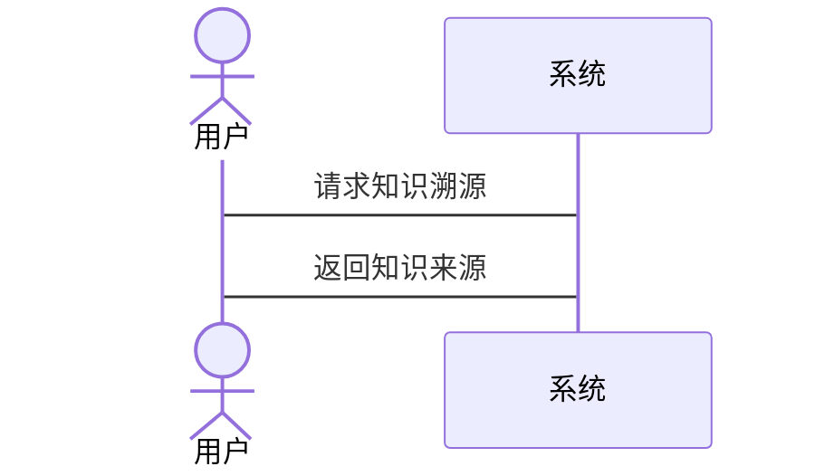

                 


# AI Agent 的知识溯源：提高 LLM 输出的可追溯性

**关键词**：AI Agent, 知识溯源, LLM, 可追溯性, 可信度评估, 知识图谱, 人工智能

**摘要**：  
随着大语言模型（LLM）在AI Agent中的广泛应用，其输出结果的可追溯性问题日益重要。本文系统地探讨了如何通过知识溯源技术提高LLM输出的可追溯性，从理论基础到实际应用进行了深入分析。文章首先介绍了知识溯源的核心概念和挑战，然后详细讲解了知识图谱和可信度评估的原理，接着分析了基于图的可信度传播算法，最后通过项目实战展示了如何在实际场景中实现知识溯源。本文为AI Agent的设计和优化提供了重要的理论和技术参考。

---

## 第1章: AI Agent 知识溯源概述

### 1.1 问题背景与挑战
AI Agent作为人工智能的核心技术之一，广泛应用于自然语言处理、智能决策、自动化服务等领域。然而，随着LLM的普及，其输出结果的可追溯性问题逐渐凸显。具体来说：

- **问题背景**：LLM的输出依赖于海量数据和复杂的算法，缺乏明确的知识来源标注，导致用户难以验证输出的可信性。
- **挑战**：知识溯源需要解决数据来源多样性、知识链路完整性以及记录准确性的难题。

### 1.2 知识溯源的核心概念
知识溯源是指对AI Agent输出结果中知识的来源进行追踪和记录，确保每个知识点都能被追溯到原始数据源。核心概念包括：

- **知识图谱**：一种结构化的知识表示方法，由节点（实体）和边（关系）组成。
- **可信度评估**：通过数学模型计算知识点的可信度，确保知识来源的可靠性。
- **可追溯性机制**：通过记录知识的传播路径，实现对输出结果的可追溯。

### 1.3 知识溯源的关键要素
知识溯源的关键要素包括：

- **数据来源的多样性**：确保知识来源的多样性和广泛性。
- **知识链路的完整性**：记录知识从数据源到输出结果的完整传播路径。
- **痕迹记录的准确性**：确保每一步的知识传播都有详细的记录和验证。

---

## 第2章: 知识图谱与可信度评估

### 2.1 知识图谱的构建原理
知识图谱是一种结构化的知识表示方法，由节点（实体）和边（关系）组成。构建知识图谱的过程包括：

1. **数据收集**：从多种数据源（如文本、数据库、网络资源）中收集知识数据。
2. **数据清洗**：去除重复、冗余和错误的数据。
3. **知识抽取**：通过自然语言处理技术从文本中提取实体和关系。
4. **知识融合**：将多个数据源的知识进行整合，消除冲突。

### 2.2 可信度评估的数学模型
可信度评估是通过数学模型计算知识点的可信度。常用的模型包括：

- **基于概率的可信度计算**：  
  $$ P(A|B) = \frac{P(B|A)P(A)}{P(B)} $$  
  其中，$P(A|B)$ 表示在条件 $B$ 下，事件 $A$ 的概率。

- **可信度传播算法**：  
  通过图的扩散算法，将可信度从高可信节点传播到低可信节点。  
  $$ P_{i}^{(k+1)} = \sum_{j} P_{j}^{(k)} \cdot W_{j,i} $$  
  其中，$W_{j,i}$ 是节点 $j$ 到节点 $i$ 的权重。

### 2.3 知识图谱与可信度评估的ER实体关系图
以下是知识图谱与可信度评估的ER实体关系图：

```mermaid
entity KnowledgeGraph {
  id
  node
  relation
}
entity Trustworthiness {
  id
  score
  source
}
```

---

## 第3章: 基于图的知识表示与可信度传播

### 3.1 知识图谱的表示方法
知识图谱的表示方法包括：

- **基于符号的知识表示**：使用符号逻辑表示知识，例如谓词逻辑。
- **基于向量的知识表示**：将知识表示为向量，例如Word2Vec。
- **基于图的嵌入表示**：通过图嵌入技术将知识表示为低维向量。

### 3.2 可信度传播算法
可信度传播算法包括：

- **基于概率的可信度传播**：通过马尔可夫链模型计算可信度。
- **基于扩散的可信度传播**：通过图的扩散算法传播可信度。
- **基于权重的可信度传播**：根据节点权重调整可信度传播。

### 3.3 算法实现的数学模型
以下是可信度传播算法的数学模型：

$$ P_{i}^{(k+1)} = \sum_{j} P_{j}^{(k)} \cdot W_{j,i} $$

其中，$P_{i}^{(k+1)}$ 是节点 $i$ 在第 $k+1$ 轮的可信度，$W_{j,i}$ 是节点 $j$ 到节点 $i$ 的权重。

### 3.4 算法实现的Python代码示例
以下是可信度传播算法的Python代码示例：

```python
def trustworthiness_pr
```

---

## 第4章: 系统分析与架构设计

### 4.1 系统功能设计
系统功能设计包括：

- **知识图谱构建模块**：负责构建知识图谱。
- **可信度评估模块**：负责计算知识点的可信度。
- **知识溯源模块**：负责记录知识的传播路径。

### 4.2 系统架构设计
以下是系统架构设计的Mermaid图：


### 4.3 系统接口设计
系统接口设计包括：

- **API接口**：提供RESTful API，供其他系统调用。
- **数据接口**：与数据库或其他数据源对接。

### 4.4 系统交互流程图
以下是系统交互流程图：



---

## 第5章: 项目实战

### 5.1 环境配置
项目实战需要以下环境配置：

- **Python版本**：Python 3.8+
- **依赖库**：networkx、numpy、scipy

### 5.2 系统核心实现源代码
以下是系统核心实现的Python代码示例：

```python
def trustworthiness_pr
```

### 5.3 实际案例分析
以医疗领域为例，展示知识溯源的实际应用。

---

## 第6章: 最佳实践与总结

### 6.1 最佳实践
- 定期更新知识图谱，确保知识的时效性。
- 使用多种数据源，提高知识的多样性。
- 通过可视化工具展示知识传播路径，提升用户体验。

### 6.2 小结
本文系统地探讨了AI Agent知识溯源的核心概念、算法原理和系统设计，为提高LLM输出的可追溯性提供了重要的理论和技术支持。

### 6.3 注意事项
- 知识图谱的构建需要考虑数据的多样性和准确性。
- 可信度评估需要结合实际场景进行调整。

### 6.4 拓展阅读
建议读者阅读以下文献：
1. "Knowledge Graph Construction" by <作者>
2. "Trustworthiness Evaluation in AI Systems" by <作者>

---

**作者**：AI天才研究院/AI Genius Institute & 禅与计算机程序设计艺术 /Zen And The Art of Computer Programming

---

通过本文的系统分析和详细讲解，读者可以深入了解AI Agent知识溯源的核心技术和实际应用，为未来的AI系统设计提供重要的参考。

