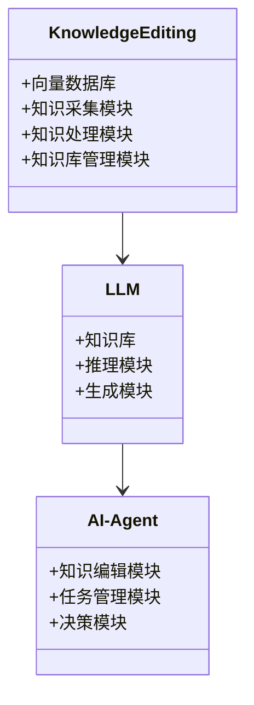

                 


# AI Agent 的知识编辑：动态调整 LLM 的知识库

> **关键词**：AI Agent，知识编辑，LLM，动态知识库，向量数据库，知识表示，算法原理

> **摘要**：本文深入探讨AI Agent如何动态调整大语言模型（LLM）的知识库，分析知识编辑的核心概念、算法原理、系统架构及实际应用。通过具体案例和代码实现，结合数学公式和系统架构图，详细阐述知识编辑在AI Agent中的重要性及实现方法。

---

## 第1章: AI Agent 与知识编辑概述

### 1.1 AI Agent 的基本概念

#### 1.1.1 AI Agent 的定义与分类
AI Agent（人工智能代理）是指能够感知环境并采取行动以实现目标的智能实体。AI Agent可以分为以下几类：
- **简单反射型代理**：基于简单的规则采取行动。
- **基于模型的反射型代理**：维护对环境的模型，并基于模型做出决策。
- **目标驱动型代理**：根据目标选择行动。
- **效用驱动型代理**：通过最大化效用函数来优化决策。

#### 1.1.2 知识编辑在AI Agent 中的作用
知识编辑是AI Agent实现智能决策的核心过程。通过编辑和调整知识库，AI Agent能够更好地理解和适应复杂环境，提升任务执行的准确性和效率。

#### 1.1.3 动态知识库调整的必要性
动态知识库调整是AI Agent适应动态环境的关键。随着环境的变化，知识库需要实时更新，以确保AI Agent能够持续保持高效的决策能力。

---

### 1.2 大语言模型（LLM）的知识库特点

#### 1.2.1 LLM 的知识表示方式
大语言模型的知识表示主要基于概率分布和向量空间模型。通过大量的训练数据，模型能够学习到词汇、短语、句子之间的语义关系。

#### 1.2.2 知识库的动态更新机制
知识库的动态更新机制包括增量学习、在线更新和模型蒸馏等方法。这些方法能够使知识库在运行时保持最新的信息。

#### 1.2.3 知识库的规模与复杂性
知识库的规模决定了其覆盖范围和复杂性。大规模知识库需要高效的存储和检索机制，以支持快速的动态调整。

---

### 1.3 动态调整知识库的背景与挑战

#### 1.3.1 知识库动态调整的背景
随着应用场景的多样化，AI Agent需要处理的信息量急剧增加。传统的静态知识库已无法满足需求，动态调整成为必然趋势。

#### 1.3.2 动态调整中的主要挑战
- **数据实时性**：如何保证知识库的实时更新。
- **计算效率**：动态调整对计算资源的需求。
- **准确性**：动态调整可能引入错误信息，影响决策的准确性。

#### 1.3.3 知识库动态调整的目标与意义
目标是通过动态调整知识库，提升AI Agent的适应能力和智能水平。意义在于支持AI Agent在动态环境下高效完成任务。

---

## 第2章: 知识编辑的核心概念与联系

### 2.1 知识表示的核心原理

#### 2.1.1 知识表示的多种方式
知识表示的方式包括：
- **符号表示**：通过符号和规则表示知识。
- **向量表示**：通过向量空间模型表示语义。
- **图表示**：通过知识图谱表示实体间的关系。

#### 2.1.2 知识图谱的构建与应用
知识图谱通过节点和边描述实体及其关系。构建知识图谱需要进行数据抽取、实体识别和关系抽取等步骤。

#### 2.1.3 向量空间模型的原理
向量空间模型通过将文本表示为向量，计算向量之间的相似度。例如，余弦相似度用于衡量两个向量之间的语义相似性。

---

### 2.2 知识编辑与AI Agent 的关系

#### 2.2.1 知识编辑在AI Agent 中的作用
知识编辑是AI Agent实现智能决策的核心过程。通过编辑和调整知识库，AI Agent能够更好地理解和适应复杂环境。

#### 2.2.2 知识编辑与任务目标的关联
知识编辑的目标是优化AI Agent的任务执行能力。通过动态调整知识库，AI Agent能够更高效地完成任务。

#### 2.2.3 知识编辑对模型性能的影响
知识编辑直接影响AI Agent的推理能力和响应速度。高质量的知识库能够显著提升模型的性能。

---

### 2.3 核心概念的ER实体关系图


---

## 第3章: 知识编辑的算法原理

### 3.1 向量数据库的构建与检索

#### 3.1.1 向量数据库的基本原理
向量数据库通过将文本转换为向量，存储在数据库中。检索时，通过计算查询向量与数据库中向量的相似度，找到最相关的数据。

#### 3.1.2 基于向量的相似度计算
余弦相似度是常用的相似度计算方法，公式如下：

$$\text{余弦相似度} = \frac{\vec{A} \cdot \vec{B}}{|\vec{A}| |\vec{B}|}$$

#### 3.1.3 向量检索算法的实现
向量检索算法包括：
- **线性扫描**：逐一计算查询向量与数据库中向量的相似度，找到最大相似度的向量。
- **索引加速**：通过构建索引结构（如ANN）加速检索过程。

---

### 3.2 动态知识更新的算法流程

#### 3.2.1 知识更新的触发条件
知识更新的触发条件包括：
- **时间触发**：定期更新知识库。
- **事件触发**：检测到特定事件时更新知识库。
- **反馈触发**：根据用户反馈触发知识更新。

#### 3.2.2 知识更新的步骤与流程
知识更新的流程包括：
1. **数据采集**：获取新的知识数据。
2. **数据清洗**：去除噪声数据，确保数据质量。
3. **向量转换**：将新数据转换为向量表示。
4. **知识库更新**：将新向量添加到数据库中。

#### 3.2.3 知识更新的评估指标
评估知识更新的效果需要考虑以下指标：
- **准确率**：新知识的准确性。
- **召回率**：新知识的覆盖率。
- **更新时间**：知识更新所需的时间。

---

### 3.3 算法的数学模型与公式

#### 3.3.1 余弦相似度公式
$$\text{余弦相似度} = \frac{\vec{A} \cdot \vec{B}}{|\vec{A}| |\vec{B}|}$$

#### 3.3.2 基于向量的检索公式
$$\text{检索结果} = \argmax_{i} \text{sim}(Q, D_i)$$

---

## 第4章: 知识编辑的系统架构与设计

### 4.1 系统架构设计

#### 4.1.1 系统功能模块划分
系统功能模块包括：
- **知识采集模块**：负责采集新知识数据。
- **知识处理模块**：负责数据清洗和向量转换。
- **知识库管理模块**：负责知识库的存储和检索。

#### 4.1.2 系统架构的分层设计
系统架构分为：
- **数据层**：负责数据的存储和管理。
- **计算层**：负责向量计算和检索。
- **应用层**：负责与AI Agent的交互和接口。

#### 4.1.3 系统架构的可扩展性
系统架构设计需要考虑扩展性，支持多种数据源和多种知识表示方式。

---

### 4.2 系统功能设计

#### 4.2.1 知识编辑的领域模型



#### 4.2.2 系统架构的交互流程

```mermaid
sequenceDiagram
    participant AI-Agent
    participant KnowledgeEditing
    participant LLM
    AI-Agent -> KnowledgeEditing: 发起知识更新请求
    KnowledgeEditing -> LLM: 获取知识表示
    LLM -> KnowledgeEditing: 返回向量表示
    KnowledgeEditing -> LLM: 更新知识库
    AI-Agent <-- LLM: 知识库更新完成通知
```

---

## 第5章: 项目实战

### 5.1 环境安装

```bash
pip install faiss-cpu
pip install numpy
pip install matplotlib
```

---

### 5.2 系统核心实现源代码

```python
import numpy as np
from faiss import IndexFlatCosine

# 初始化向量数据库
def init_vector_db(dim):
    return IndexFlatCosine(dim)

# 向量检索函数
def vector_search(query_vector, db, top_k=3):
    indices, distances = db.search(query_vector)
    return indices[0][:top_k]

# 动态知识更新函数
def update_knowledge_base(db, new_vector):
    db.add(new_vector)
```

---

### 5.3 代码应用解读与分析

#### 5.3.1 代码功能解析
- **init_vector_db**：初始化向量数据库。
- **vector_search**：向量检索函数，返回相似度最高的向量索引。
- **update_knowledge_base**：动态更新知识库，添加新的向量。

#### 5.3.2 代码实现的关键点
- 使用FAISS库实现高效的向量检索。
- 通过向量表示实现知识库的动态更新。

---

### 5.4 实际案例分析和详细讲解剖析

#### 5.4.1 案例背景
假设我们有一个AI Agent，用于智能客服系统。需要动态更新知识库，以应对用户咨询中的新问题。

#### 5.4.2 案例实现步骤
1. **数据采集**：收集用户咨询的新问题。
2. **数据清洗**：去除噪声数据。
3. **向量转换**：将新问题转换为向量表示。
4. **知识库更新**：将新向量添加到知识库中。

#### 5.4.3 案例实现代码
```python
# 示例代码
import numpy as np
from faiss import IndexFlatCosine

# 初始化向量数据库
dim = 100
vector_db = init_vector_db(dim)

# 新知识向量
new_knowledge = np.random.randn(dim).astype(np.float32)

# 更新知识库
update_knowledge_base(vector_db, new_knowledge)
```

---

## 第6章: 优化与扩展

### 6.1 性能优化建议

#### 6.1.1 向量检索的优化
- 使用高效的向量索引结构（如ANN）加速检索。
- 优化向量计算的效率，减少计算时间。

#### 6.1.2 知识更新的优化
- 采用增量学习方法，减少知识更新的计算量。
- 优化知识更新的并行化，提升更新效率。

---

### 6.2 多模态知识编辑的扩展

#### 6.2.1 多模态知识编辑的概念
多模态知识编辑是指将文本、图像、音频等多种模态的数据进行整合，构建更加丰富的知识库。

#### 6.2.2 多模态知识编辑的优势
- 提升知识表示的丰富性。
- 增强AI Agent的感知能力。

---

### 6.3 知识库的分布式扩展

#### 6.3.1 分布式知识库的概念
分布式知识库通过将知识库分散存储在多个节点上，提升存储和检索的效率。

#### 6.3.2 分布式知识库的实现
- 使用分布式存储系统（如分布式文件系统）。
- 实现高效的分布式检索算法。

---

## 第7章: 总结与展望

### 7.1 本章总结
本文系统地介绍了AI Agent的知识编辑方法，分析了动态调整LLM知识库的核心概念、算法原理和系统架构。通过具体案例和代码实现，详细阐述了知识编辑在AI Agent中的重要性及实现方法。

### 7.2 未来展望
未来，随着AI技术的不断发展，知识编辑将朝着多模态、分布式和自适应的方向发展。AI Agent的知识编辑技术将更加智能化和高效化，为人工智能的应用带来更大的价值。

---

## 作者：AI天才研究院/AI Genius Institute & 禅与计算机程序设计艺术 /Zen And The Art of Computer Programming

