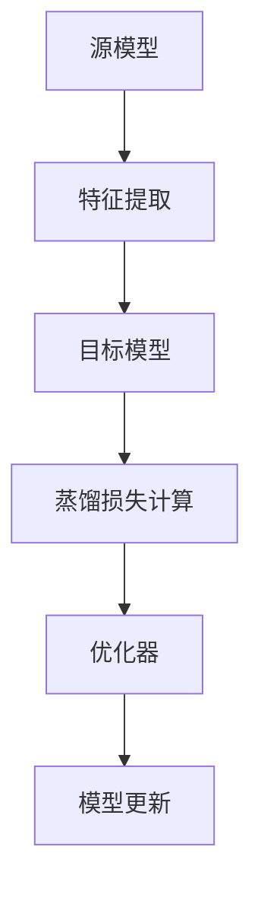
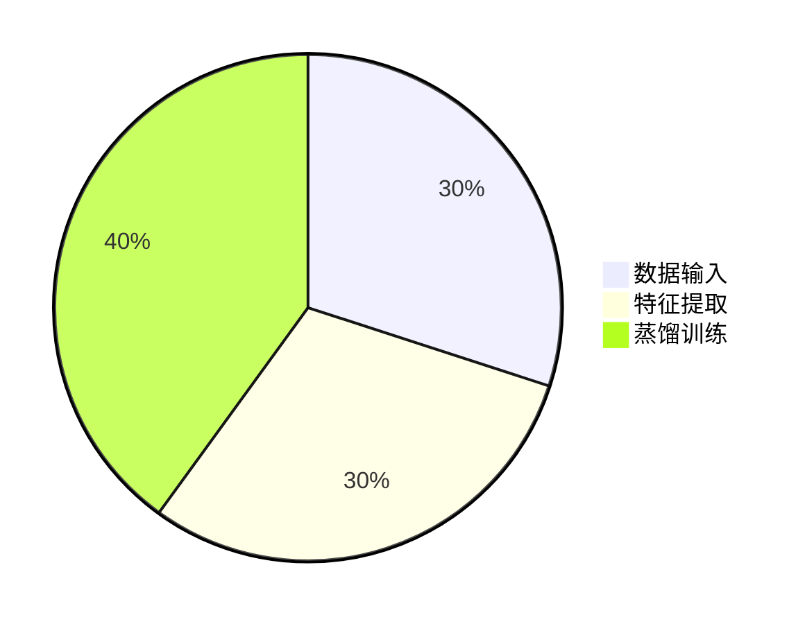
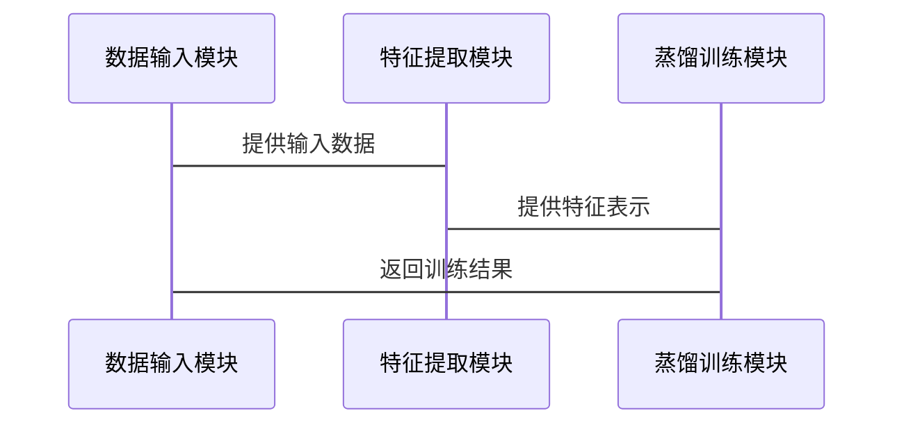

                 


# AI Agent 的知识蒸馏：从大型 LLM 到轻量级模型

> **关键词：** AI Agent, 知识蒸馏, 大型 LLM, 轻量级模型, 模型压缩, 深度学习

> **摘要：** 知识蒸馏是一种将大型语言模型的知识迁移到轻量级模型的技术，旨在解决大型模型的计算资源消耗问题，同时保持其性能。本文从AI Agent的视角出发，详细探讨知识蒸馏的核心原理、算法实现、系统架构及实际应用，帮助读者理解如何高效地将大型模型的知识转化为轻量级模型。

---

## 目录

### 目录大纲：

1. 第1章：AI Agent 的知识蒸馏背景与概念
   - 1.1 知识蒸馏的定义与背景
     - 1.1.1 知识蒸馏的基本概念
     - 1.1.2 AI Agent 的应用场景
     - 1.1.3 大型 LLM 的局限性
   - 1.2 问题背景与挑战
     - 1.2.1 计算资源的限制
     - 1.2.2 部署环境的多样性
     - 1.2.3 知识蒸馏的目标
   - 1.3 知识蒸馏的核心概念
     - 1.3.1 源模型与目标模型的关系
     - 1.3.2 蒸馏过程中的信息传递
     - 1.3.3 轻量级模型的特点

2. 第2章：知识蒸馏的核心原理
   - 2.1 知识蒸馏的基本原理
     - 2.1.1 软蒸馏与硬蒸馏的区别
     - 2.1.2 蒸馏过程中的信息损失
     - 2.1.3 知识蒸馏的关键步骤
   - 2.2 知识蒸馏的技术细节
     - 2.2.1 源模型的特征提取
     - 2.2.2 目标模型的构建
     - 2.2.3 蒸馏损失函数的设计
   - 2.3 知识蒸馏的数学模型
     - 2.3.1 KL散度的计算公式
     - 2.3.2 蒸馏损失的优化方法
     - 2.3.3 算法的收敛性分析

3. 第3章：知识蒸馏的算法实现
   - 3.1 算法实现的步骤
     - 3.1.1 数据预处理
     - 3.1.2 源模型的特征提取
     - 3.1.3 目标模型的训练与优化
   - 3.2 蒸馏算法的流程图
     - 图1：知识蒸馏的流程图（使用 Mermaid 绘制）
   - 3.3 蒸馏算法的 Python 实现
     - 代码示例：知识蒸馏的核心代码实现

4. 第4章：知识蒸馏的系统架构
   - 4.1 系统功能设计
     - 4.1.1 数据输入模块
     - 4.1.2 特征提取模块
     - 4.1.3 蒸馏训练模块
   - 4.2 系统架构图
     - 图2：系统架构图（使用 Mermaid 绘制）
   - 4.3 接口与交互设计
     - 图3：系统交互流程图（使用 Mermaid 绘制）

5. 第5章：知识蒸馏的项目实战
   - 5.1 项目背景与目标
   - 5.2 核心代码实现
     - 代码示例：知识蒸馏的完整代码实现
   - 5.3 案例分析与解读
     - 案例1：文本分类任务的蒸馏过程
     - 案例2：问答系统中的蒸馏应用
   - 5.4 实战总结与经验分享

6. 第6章：知识蒸馏的最佳实践
   - 6.1 小结与总结
   - 6.2 注意事项与常见问题
   - 6.3 拓展阅读与深入学习

---

### 作者：AI天才研究院/AI Genius Institute & 禅与计算机程序设计艺术 /Zen And The Art of Computer Programming

---

### 正文：

---

#### 第1章：AI Agent 的知识蒸馏背景与概念

##### 1.1 知识蒸馏的定义与背景

###### 1.1.1 知识蒸馏的基本概念
知识蒸馏（Knowledge Distillation）是一种将复杂模型的知识迁移到简单模型的技术。通过蒸馏过程，我们可以将大型语言模型（LLM）的知识提取出来，训练一个更小、更高效的模型，从而在资源受限的场景中实现高性能。

###### 1.1.2 AI Agent 的应用场景
AI Agent 是一类能够感知环境、执行任务并做出决策的智能体。在实际应用中，AI Agent 需要处理多种复杂任务，例如自然语言理解、推理、规划等。然而，大型 LLM 的计算资源需求较高，难以在资源受限的环境中部署。

###### 1.1.3 大型 LLM 的局限性
尽管大型 LLM 在性能上表现出色，但其计算成本和资源消耗过高，限制了其在实际场景中的广泛应用。例如，训练和推理过程需要大量的计算资源，难以在移动设备、边缘计算等场景中部署。

##### 1.2 问题背景与挑战

###### 1.2.1 计算资源的限制
资源受限的环境（如移动设备、嵌入式系统）通常无法支持大型模型的运行，因此需要一种轻量化的方法来保持模型的性能。

###### 1.2.2 部署环境的多样性
不同的应用场景对模型的计算资源需求不同，轻量级模型能够更好地适应多样化的部署环境。

###### 1.2.3 知识蒸馏的目标
知识蒸馏的目标是将大型模型的知识迁移到轻量级模型，同时保持或接近源模型的性能。这不仅能够降低计算成本，还能提高模型的部署灵活性。

##### 1.3 知识蒸馏的核心概念

###### 1.3.1 源模型与目标模型的关系
在知识蒸馏中，源模型（Teacher）通常是大型 LLM，目标模型（Student）是轻量级模型。目标模型通过学习源模型的输出或内部特征，逐步掌握源模型的知识。

###### 1.3.2 蒸馏过程中的信息传递
蒸馏过程通过损失函数引导目标模型模仿源模型的行为。信息传递的关键在于如何有效地提取和传递源模型的知识。

###### 1.3.3 轻量级模型的特点
轻量级模型通常具有较小的参数量和较低的计算复杂度，能够在资源受限的环境中高效运行。

---

#### 第2章：知识蒸馏的核心原理

##### 2.1 知识蒸馏的基本原理

###### 2.1.1 软蒸馏与硬蒸馏的区别
- **软蒸馏**：通过概率分布的形式传递知识，目标模型通过模仿源模型的输出概率分布进行学习。
- **硬蒸馏**：直接将源模型的输出作为目标模型的标签，通常用于分类任务。

###### 2.1.2 蒸馏过程中的信息损失
由于目标模型的复杂度较低，蒸馏过程中可能会出现信息损失，影响目标模型的性能。因此，如何最大化地保留源模型的知识是蒸馏技术的关键。

###### 2.1.3 知识蒸馏的关键步骤
1. **特征提取**：从源模型中提取有用的特征表示。
2. **损失函数设计**：设计合适的损失函数，引导目标模型学习源模型的知识。
3. **优化训练**：通过优化算法训练目标模型，使其性能接近源模型。

##### 2.2 知识蒸馏的技术细节

###### 2.2.1 源模型的特征提取
源模型通常会输出概率分布或特征向量。在蒸馏过程中，这些特征可以被目标模型用来学习。

###### 2.2.2 目标模型的构建
目标模型通常是一个小型的神经网络，具有较低的计算复杂度。常见的目标模型包括小型 LLM 或者其他轻量级模型。

###### 2.2.3 蒸馏损失函数的设计
蒸馏损失函数通常由两部分组成：主蒸馏损失和分类损失。主蒸馏损失用于衡量目标模型与源模型的输出差异，分类损失用于监督目标模型的分类任务。

##### 2.3 知识蒸馏的数学模型

###### 2.3.1 KL散度的计算公式
$$
\text{KL}(S||T) = \sum_i S_i \log \frac{S_i}{T_i}
$$
其中，$S_i$ 是目标模型的输出概率，$T_i$ 是源模型的输出概率。

###### 2.3.2 蒸馏损失的优化方法
蒸馏损失函数通常采用交叉熵损失，优化目标是最小化蒸馏损失。

###### 2.3.3 算法的收敛性分析
通过适当的优化策略和学习率调整，蒸馏算法可以逐步收敛，目标模型的性能逐渐接近源模型。

---

#### 第3章：知识蒸馏的算法实现

##### 3.1 算法实现的步骤

###### 3.1.1 数据预处理
将数据集分为训练集和验证集，确保数据的均衡分布。

###### 3.1.2 源模型的特征提取
使用源模型对数据进行特征提取，通常包括中间层的特征向量。

###### 3.1.3 目标模型的训练与优化
通过反向传播优化目标模型的参数，使其输出尽可能接近源模型的输出。

##### 3.2 蒸馏算法的流程图



##### 3.3 蒸馏算法的 Python 实现

```python
import torch
import torch.nn as nn

class Distiller(nn.Module):
    def __init__(self, student, teacher):
        super().__init__()
        self.student = student
        self.teacher = teacher
        self.criterion = nn.KLDivLoss(reduction='batchmean')

    def forward(self, x):
        student_output = self.student(x)
        teacher_output = self.teacher(x)
        loss = self.criterion(torch.softmax(student_output, dim=1), torch.softmax(teacher_output, dim=1))
        return loss
```

---

#### 第4章：知识蒸馏的系统架构

##### 4.1 系统功能设计

###### 4.1.1 数据输入模块
负责接收输入数据并进行预处理。

###### 4.1.2 特征提取模块
从源模型中提取特征表示。

###### 4.1.3 蒸馏训练模块
对目标模型进行训练，优化其性能。

##### 4.2 系统架构图



##### 4.3 接口与交互设计



---

#### 第5章：知识蒸馏的项目实战

##### 5.1 项目背景与目标
通过实际案例展示知识蒸馏的应用，验证其在轻量级模型中的效果。

##### 5.2 核心代码实现

```python
import torch
import torch.nn as nn

class StudentModel(nn.Module):
    def __init__(self):
        super().__init__()
        self.fc = nn.Linear(100, 10)
    
    def forward(self, x):
        return self.fc(x)

class TeacherModel(nn.Module):
    def __init__(self):
        super().__init__()
        self.fc = nn.Linear(100, 10)
    
    def forward(self, x):
        return self.fc(x)

distiller = Distiller(StudentModel(), TeacherModel())
optimizer = torch.optim.Adam(distiller.parameters(), lr=0.001)
```

##### 5.3 案例分析与解读
通过具体案例分析蒸馏过程中的关键参数和优化策略，验证蒸馏技术的有效性。

##### 5.4 实战总结与经验分享
总结实战经验，提出改进建议，为读者提供有价值的参考。

---

#### 第6章：知识蒸馏的最佳实践

##### 6.1 小结与总结
知识蒸馏是一种有效的模型轻量化技术，能够将大型模型的知识迁移到轻量级模型，满足实际应用的需求。

##### 6.2 注意事项与常见问题
- 确保源模型的性能足够优秀
- 选择合适的蒸馏温度和损失函数
- 避免过早终止训练

##### 6.3 拓展阅读与深入学习
推荐相关书籍和论文，帮助读者进一步深入学习知识蒸馏技术。

---

### 作者：AI天才研究院/AI Genius Institute & 禅与计算机程序设计艺术 /Zen And The Art of Computer Programming

