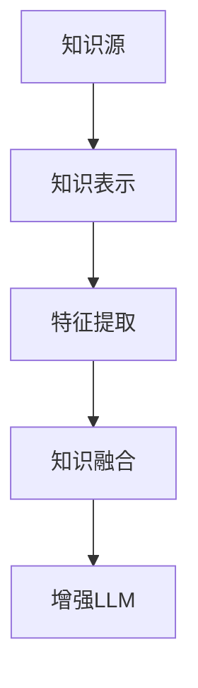
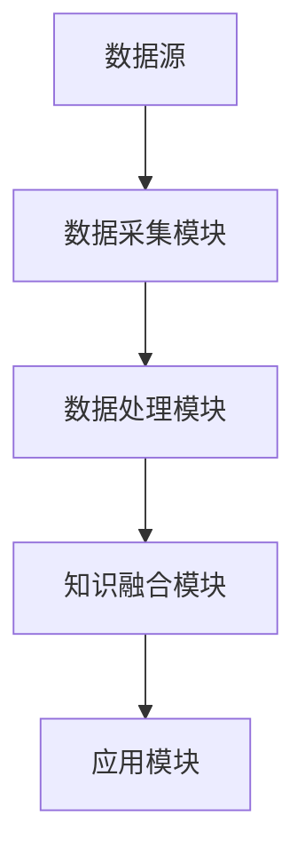
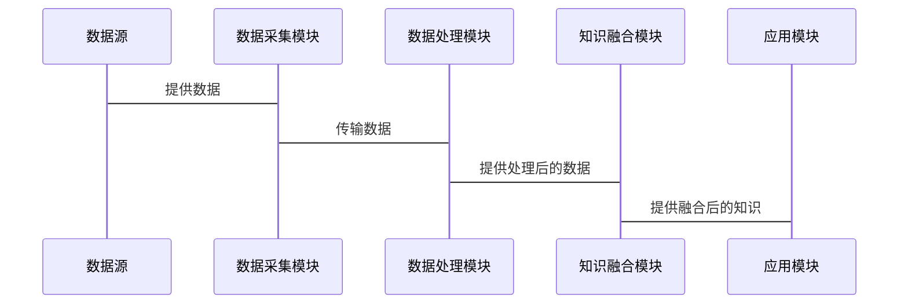

                 


# AI Agent 的知识融合：整合多源信息增强 LLM

## 关键词：
- AI Agent
- 知识融合
- 多源信息
- LLM
- 信息整合

## 摘要：
本文深入探讨了AI Agent的知识融合技术，通过整合多源信息来增强大语言模型（LLM）的能力。文章从问题背景出发，详细分析了知识融合的核心概念、算法原理、系统架构设计以及项目实战，并通过丰富的案例和代码示例，展示了如何在实际应用中实现这一目标。最后，文章总结了当前的研究进展，并展望了未来的发展方向。

---

# 第一部分: AI Agent 的知识融合概述

## 第1章: 问题背景与核心概念

### 1.1 问题背景
#### 1.1.1 当前AI Agent的发展现状
随着人工智能技术的快速发展，AI Agent（智能体）在各个领域的应用越来越广泛。AI Agent能够通过与环境交互，感知信息并采取行动，以实现特定目标。然而，现有的AI Agent在处理复杂任务时，往往面临知识不足的问题，尤其是在需要整合多源信息时，其能力受到限制。

#### 1.1.2 多源信息整合的必要性
在现实场景中，信息往往分布在多个来源中，例如文本、图像、视频、数据库等。这些信息可能是异构的，格式、结构和语义各不相同。为了使AI Agent具备更强的智能，需要将这些分散的信息整合起来，形成统一的知识表示。

#### 1.1.3 LLM在AI Agent中的角色
大语言模型（LLM）凭借其强大的文本处理能力，已成为AI Agent的核心组件之一。然而，LLM的能力主要依赖于其训练数据的质量和多样性。通过知识融合，可以将多源信息整合到LLM中，进一步提升其理解和推理能力。

### 1.2 问题描述
#### 1.2.1 知识融合的核心问题
知识融合的核心问题是如何将来自多个来源的信息整合成一致、完整且准确的知识表示。这需要解决数据清洗、特征提取、语义理解等一系列技术难题。

#### 1.2.2 多源信息的异构性挑战
多源信息的异构性主要体现在以下几个方面：
- **格式异构**：不同数据源的格式可能不同，例如文本、图像、表格等。
- **结构异构**：不同数据源的组织方式不同，例如线性文本、树状结构、图结构等。
- **语义异构**：同一概念在不同数据源中的表达可能不同，例如“价格”可能表示“成本”或“售价”。

#### 1.2.3 知识整合的目标与边界
知识整合的目标是将多源信息转化为统一的知识表示，以便AI Agent能够更好地理解和应用这些知识。其边界在于，知识融合并不追求完全消除信息的多样性，而是在保持信息的多样性和准确性之间找到平衡。

### 1.3 核心概念与联系
#### 1.3.1 知识融合的核心概念
知识融合涉及多个核心概念，包括知识表示、特征提取、融合策略等。这些概念相互关联，共同构成了知识融合的整体框架。

#### 1.3.2 多源信息的特征对比
| 特征 | 描述 |
|------|------|
| 格式 | 文本、图像、表格等 |
| 结构 | 线性、树状、图状等 |
| 语义 | 同一概念的不同表达 |

#### 1.3.3 AI Agent与传统LLM的对比
| 特性 | AI Agent | 传统LLM |
|------|----------|----------|
| 输入 | 多源信息 | 单一文本 |
| 输出 | 行动策略 | 文本生成 |
| 能力 | 知识整合 | 文本处理 |

### 1.4 实体关系图


---

## 第2章: 知识融合的核心原理

### 2.1 知识表示与存储
#### 2.1.1 知识表示的多样性
知识可以以多种形式表示，例如文本、图像、表格等。不同的表示形式具有不同的特点和应用场景。

#### 2.1.2 知识图谱的构建
知识图谱是一种将知识以图的形式表示的技术，节点表示实体，边表示实体之间的关系。知识图谱能够有效地整合多源信息。

#### 2.1.3 知识库的组织与存储
知识库是存储知识的主要载体，其组织方式直接影响知识融合的效率和效果。常见的知识库组织方式包括层次化存储和图结构存储。

### 2.2 多源信息的特征提取
#### 2.2.1 文本特征提取
文本特征提取是将文本信息转化为数值表示的过程。常见的文本特征提取方法包括词袋模型、TF-IDF、词嵌入等。

#### 2.2.2 图像特征提取
图像特征提取是将图像信息转化为数值表示的过程。常见的图像特征提取方法包括SIFT、HOG、CNN等。

#### 2.2.3 音频特征提取
音频特征提取是将音频信息转化为数值表示的过程。常见的音频特征提取方法包括MFCC、STFT等。

### 2.3 知识融合的策略与方法
#### 2.3.1 基于规则的融合方法
基于规则的融合方法通过预定义的规则将多源信息进行整合。例如，可以定义规则将“价格”与“成本”视为同一概念。

#### 2.3.2 基于概率的融合方法
基于概率的融合方法利用概率论原理，将多源信息的不确定性进行建模和融合。例如，可以使用贝叶斯网络进行概率推理。

#### 2.3.3 基于机器学习的融合方法
基于机器学习的融合方法通过训练模型将多源信息进行自动融合。例如，可以使用深度学习模型对多源信息进行联合训练。

---

## 第3章: 知识融合的算法实现

### 3.1 算法流程
#### 3.1.1 数据预处理
数据预处理是知识融合的第一步，包括数据清洗、格式转换、去重等操作。

#### 3.1.2 特征提取
特征提取是将多源信息转化为数值表示的过程。例如，文本特征提取可以使用词嵌入技术将文本转化为向量。

#### 3.1.3 知识融合
知识融合是将多个来源的特征进行整合，形成统一的知识表示。例如，可以使用加权融合方法对多个特征向量进行加权求和。

### 3.2 算法实现代码示例
```python
def knowledge_fusion(data_sources):
    # 数据清洗
    cleaned_data = [clean(d) for d in data_sources]
    # 特征提取
    features = extract_features(cleaned_data)
    # 融合策略
    fused_result = merge(features)
    return fused_result
```

### 3.3 数学模型与公式
#### 3.3.1 知识融合的数学表示
$$
f: X \rightarrow Y
$$
其中，$X$ 表示多源数据集，$Y$ 表示融合后的知识表示。

#### 3.3.2 融合策略的数学模型
$$
y_i = \sum_{j=1}^{n} w_j x_j
$$
其中，$w_j$ 表示第 $j$ 个知识源的权重，$x_j$ 表示第 $j$ 个知识源的

---

## 第4章: 系统分析与架构设计

### 4.1 问题场景介绍
在实际应用中，知识融合系统需要处理多个数据源的信息，例如电商系统的商品信息、用户评价、物流信息等。这些信息分布在不同的系统中，格式和结构各不相同。

### 4.2 系统功能设计
#### 4.2.1 数据采集模块
数据采集模块负责从多个数据源采集信息，例如数据库、API、文件等。

#### 4.2.2 数据处理模块
数据处理模块负责对采集到的数据进行清洗、转换和预处理，例如去除重复数据、统一数据格式等。

#### 4.2.3 知识融合模块
知识融合模块负责将处理后的数据进行特征提取和融合，形成统一的知识表示。

#### 4.2.4 应用模块
应用模块负责将融合后的知识应用于具体任务，例如生成回答、制定策略等。

### 4.3 系统架构设计


### 4.4 系统接口设计
系统接口设计需要考虑数据输入、数据输出、服务调用等方面。例如，数据采集模块需要提供API接口，供其他模块调用。

### 4.5 系统交互流程


---

## 第5章: 项目实战

### 5.1 环境安装
知识融合项目的环境安装需要包括编程语言、开发工具、依赖库等。例如，可以使用Python作为编程语言，安装numpy、pandas、scikit-learn等依赖库。

### 5.2 核心代码实现
```python
def clean(data):
    # 数据清洗逻辑
    return cleaned_data

def extract_features(data):
    # 特征提取逻辑
    return features

def merge(features):
    # 融合策略逻辑
    return fused_result
```

### 5.3 案例分析与详细解读
以电商系统的商品信息融合为例，详细分析如何将商品描述、用户评价、物流信息等多源信息进行融合，提升LLM的理解和生成能力。

### 5.4 项目总结
总结项目实施过程中的经验教训，提出改进建议，并展望未来的研究方向。

---

## 第6章: 总结与展望

### 6.1 研究总结
总结知识融合技术的研究现状，分析其优势和不足。

### 6.2 未来展望
展望知识融合技术的未来发展，提出新的研究方向和应用前景。

---

## 第7章: 最佳实践与小结

### 7.1 最佳实践
总结知识融合技术的最佳实践，包括数据预处理、特征提取、融合策略等方面。

### 7.2 注意事项
提醒读者在实施知识融合项目时需要注意的事项，例如数据质量、模型选择等。

### 7.3 拓展阅读
推荐相关的拓展阅读材料，帮助读者进一步深入了解知识融合技术。

---

## 作者：AI天才研究院/AI Genius Institute & 禅与计算机程序设计艺术 /Zen And The Art of Computer Programming

