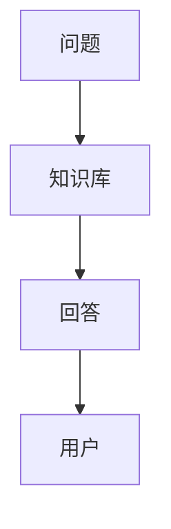
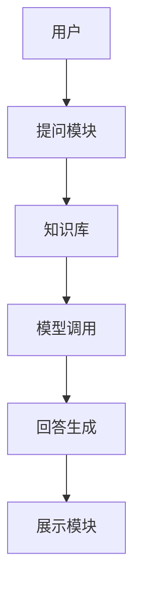

                 


# AI Agent 的知识问答：构建基于 LLM 的智能问答系统

> 关键词：AI Agent, 大语言模型, 智能问答系统, LLM, 知识表示, 问答系统设计

> 摘要：本文深入探讨了基于大语言模型（LLM）的智能问答系统的核心原理、系统架构、项目实现及优化方法。文章从AI Agent的基本概念入手，分析了LLM的工作原理，详细讲解了问答系统的构建流程，包括系统架构设计、数学模型分析和项目实战等内容，为读者提供了一个全面的视角来理解并构建高效的智能问答系统。

---

# 第一部分: AI Agent 的基础知识

## 第1章: AI Agent 的基本概念与背景

### 1.1 AI Agent 的定义与特点

AI Agent（人工智能代理）是指能够感知环境、自主决策并执行任务的智能实体。它通过与用户或系统的交互，提供基于知识和数据支持的问答服务。

#### 1.1.1 什么是 AI Agent

AI Agent 是一类能够执行特定任务的智能系统，其核心功能包括信息处理、问题解决和用户交互。它依赖于大语言模型（LLM）提供强大的自然语言处理能力，从而实现智能问答。

#### 1.1.2 AI Agent 的核心特点

- **自主性**：AI Agent 能够自主感知环境并做出决策。
- **反应性**：能够实时响应用户的输入。
- **知识性**：基于大规模数据和知识库提供准确答案。
- **适应性**：能够根据上下文调整回答策略。

#### 1.1.3 AI Agent 与传统问答系统的区别

| 特性                 | AI Agent  | 传统问答系统 |
|----------------------|------------|--------------|
| 知识来源             | 大语言模型 | 结构化知识库   |
| 适应性               | 高         | 低           |
| 自然语言处理能力     | 强         | 弱           |
| 应用场景             | 多领域     | 专用领域     |

---

### 1.2 知识问答系统的背景与问题背景

#### 1.2.1 知识问答系统的定义

知识问答系统是一种通过自然语言处理技术，为用户提供问题解答的智能系统。它利用大语言模型理解和生成文本，实现从简单到复杂的问答功能。

#### 1.2.2 当前知识问答系统的主要问题

- **准确性不足**：依赖模型的训练数据，可能存在回答错误。
- **上下文理解有限**：难以处理复杂对话中的上下文关系。
- **实时性问题**：部分系统响应速度较慢，影响用户体验。

#### 1.2.3 基于 LLM 的问答系统的优势

- **强大的语言理解能力**：基于大规模预训练模型，能够理解复杂的语义。
- **多语言支持**：支持多种语言，适用范围广。
- **动态更新**：通过持续训练，模型性能不断提升。

---

### 1.3 问题解决与边界

#### 1.3.1 问题解决的基本框架

AI Agent 在解决问题时，通常遵循以下步骤：

1. **问题理解**：解析用户的问题，提取关键信息。
2. **知识检索**：基于问题内容，从知识库中检索相关信息。
3. **生成回答**：利用语言模型生成自然的回复。
4. **反馈优化**：根据用户反馈优化回答策略。

#### 1.3.2 知识问答系统的边界与外延

- **边界**：仅限于基于文本的问答，不涉及图像或视频处理。
- **外延**：可以扩展到机器翻译、对话系统等更广泛的应用领域。

#### 1.3.3 核心概念结构与组成要素

AI Agent 的核心概念结构可以表示为一个简单的实体关系图：



---

## 第2章: 基于 LLM 的问答系统核心概念

### 2.1 LLM 的基本原理

#### 2.1.1 编码器与解码器

- **编码器**：将输入的文本转换为向量表示。
- **解码器**：根据编码结果生成输出文本。

#### 2.1.2 注意力机制

注意力机制通过计算输入文本中各词的重要性，提高模型的语义理解能力。

#### 2.1.3 概率生成模型

LLM 通过概率分布生成文本，确保生成内容的合理性和流畅性。

---

#### 2.1.4 常见 LLM 模型对比

| 模型   | 主要特点          | 适用场景         |
|--------|-------------------|------------------|
| GPT    | 连续生成，适合长文本 | 文章生成、对话系统 |
| BERT    | 适合理解任务     | 问答系统、语义分析 |

---

#### 2.1.5 LLM 的知识表示与问答机制

知识表示是将知识以结构化的方式存储，问答机制则基于这些表示生成回答。

---

## 第三部分: 系统架构与算法设计

## 第3章: 系统架构设计

### 3.1 系统功能设计

#### 3.1.1 用户提问模块

- 接收用户输入并解析问题。

#### 3.1.2 系统处理模块

- 从知识库检索相关数据。
- 调用 LLM 生成回答。

#### 3.1.3 结果展示模块

- 将生成的回答呈现给用户。

---

### 3.2 系统架构图



---

### 3.3 系统接口设计

- **输入接口**：接收用户的自然语言输入。
- **输出接口**：返回生成的回答文本。
- **数据接口**：与知识库进行数据交互。

---

## 第四部分: 项目实战与数学模型

## 第4章: 项目实战

### 4.1 环境搭建

- **安装 Python 环境**：使用 Anaconda 或虚拟环境。
- **安装 LLM 模型库**：如 Hugging Face 或 OpenAI 库。

---

### 4.2 核心代码实现

#### 4.2.1 加载 LLM 模型代码

```python
from transformers import pipeline

# 加载预训练模型
question_answerer = pipeline("question-answering", model="deepseek/quadecoder-large-hf")
```

---

#### 4.2.2 问答系统实现代码

```python
def answer_question(question, context):
    return question_answerer(question=question, context=context)
```

---

### 4.3 案例分析

#### 4.3.1 医疗咨询案例

用户提问：“新冠疫苗接种后多久可以产生抗体？”

系统回答：“通常在接种后约14天内产生抗体。”

---

### 4.4 本章小结

通过实际案例分析，展示了基于 LLM 的问答系统的强大能力。

---

## 第五部分: 数学模型与算法分析

## 第5章: LLM 的数学模型

### 5.1 概率分布

语言模型基于概率分布生成文本：

$$ P(\text{句子}) = \prod_{i=1}^{n} P(w_i | w_{i-1}, ..., w_1) $$

---

### 5.2 损失函数

交叉熵损失用于训练模型：

$$ \text{损失} = -\sum_{i=1}^{n} \log P(w_i | w_{i-1}, ..., w_1) $$

---

### 5.3 注意力机制公式

注意力权重计算公式：

$$ \alpha_i = \frac{\exp(e_i)}{\sum_{j} \exp(e_j)} $$

---

## 小结

本文详细介绍了基于 LLM 的智能问答系统，从基础概念到系统架构，再到项目实现，为读者提供了全面的知识体系。通过实际案例和数学模型分析，帮助读者更好地理解和应用这些技术。

---

作者：AI天才研究院/AI Genius Institute & 禅与计算机程序设计艺术 /Zen And The Art of Computer Programming

