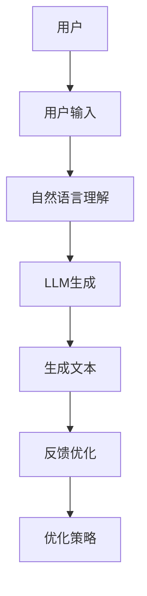
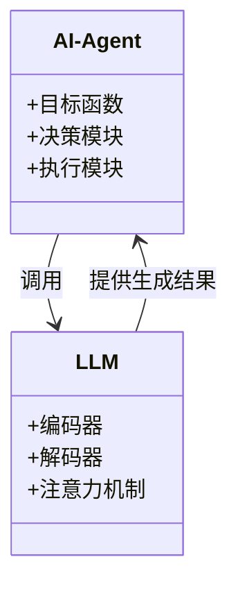

                 


# AI Agent 的语言生成：提升 LLM 的文本创作能力

**关键词**：AI Agent, 大语言模型, 文本生成, 注意力机制, 系统架构, 项目实战

**摘要**：本文深入探讨了AI Agent在语言生成中的应用，重点分析了如何通过AI Agent提升大语言模型（LLM）的文本创作能力。文章从AI Agent与LLM的基本概念入手，详细讲解了LLM的算法原理，系统分析了AI Agent驱动的LLM系统架构，并通过实战案例展示了如何实现AI Agent与LLM的协同优化。最后，本文总结了提升LLM文本创作能力的关键点，并提出了未来的优化方向。

---

## 第1章: AI Agent与大语言模型的背景介绍

### 1.1 AI Agent的基本概念

#### 1.1.1 AI Agent的定义与特点
AI Agent（人工智能代理）是指能够感知环境、自主决策并执行任务的智能实体。它具有以下特点：
- **自主性**：能够在没有外部干预的情况下独立运作。
- **反应性**：能够实时感知环境并做出响应。
- **目标导向**：具有明确的目标，通过优化目标函数来实现任务。
- **学习能力**：能够通过经验或数据改进自身的性能。

#### 1.1.2 AI Agent的核心要素与组成
AI Agent的核心组成包括：
1. **感知器**：用于获取环境信息，如传感器、摄像头等。
2. **决策器**：用于根据感知信息做出决策，通常基于逻辑推理或机器学习模型。
3. **执行器**：用于执行具体的任务，如机器人手臂、网络请求等。
4. **知识库**：用于存储任务相关的知识和经验，如规则库、数据库等。

#### 1.1.3 AI Agent在语言生成中的作用
AI Agent在语言生成中的作用主要体现在以下几个方面：
- **自然语言理解**：通过NLP技术理解用户输入的文本。
- **上下文感知**：能够结合上下文生成连贯的回复。
- **多轮对话**：支持与用户的多轮交互，保持对话的连贯性。

### 1.2 大语言模型（LLM）的概述

#### 1.2.1 大语言模型的定义与特点
大语言模型（Large Language Model, LLM）是指基于深度学习的自然语言处理模型，具有以下特点：
- **大规模训练数据**：通常使用海量的文本数据进行训练。
- **深度神经网络结构**：如Transformer架构，具有强大的非线性表达能力。
- **生成能力**：能够生成自然流畅的文本，支持多种语言和文体。

#### 1.2.2 LLM的训练与应用现状
目前，LLM的训练主要基于监督学习和无监督学习，常用的数据集包括：
- **监督学习数据**：如人工标注的问答对。
- **无监督学习数据**：如书籍、网页等公开文本。

LLM在文本生成中的应用非常广泛，包括：
- **智能客服**：自动回复用户的问题。
- **内容生成**：自动生成新闻、文章等文本。
- **代码生成**：生成代码片段或完整的程序。

#### 1.2.3 LLM在文本生成中的优势
LLM在文本生成中的优势主要体现在以下方面：
- **生成速度快**：基于深度学习的模型能够在较短时间内生成大量文本。
- **生成质量高**：通过大规模数据的训练，模型能够生成语法正确、语义连贯的文本。
- **可定制化**：通过微调模型，可以适应特定领域的文本生成需求。

### 1.3 AI Agent与大语言模型的结合

#### 1.3.1 AI Agent驱动LLM的模式
AI Agent驱动LLM的模式主要包括以下两种：
1. **直接调用**：AI Agent通过API直接调用LLM的生成接口。
2. **内部集成**：AI Agent将LLM嵌入到自身系统中，实现更高效的交互。

#### 1.3.2 LLM作为AI Agent的交互界面
LLM可以作为AI Agent的交互界面，负责处理用户的自然语言输入，并生成自然语言的输出。这种模式使得AI Agent能够与用户进行更自然的对话。

#### 1.3.3 AI Agent与LLM的协同工作流程
AI Agent与LLM的协同工作流程如下：
1. **用户输入**：用户通过自然语言向AI Agent提出请求。
2. **感知与理解**：AI Agent通过NLP技术理解用户的意图。
3. **决策与生成**：AI Agent调用LLM生成响应文本。
4. **反馈与优化**：AI Agent根据用户反馈优化生成结果。

### 1.4 本章小结
本章介绍了AI Agent和LLM的基本概念及其在语言生成中的作用。AI Agent通过调用LLM可以实现高效的文本生成，而LLM的生成能力也为AI Agent提供了强大的交互界面。

---

## 第2章: AI Agent与大语言模型的核心概念与联系

### 2.1 AI Agent的核心原理

#### 2.1.1 AI Agent的感知与决策机制
AI Agent的感知机制包括以下步骤：
1. **信息获取**：通过传感器或API获取环境信息。
2. **信息处理**：对获取的信息进行解析和理解。
3. **状态表示**：将信息转化为状态表示，用于后续决策。

AI Agent的决策机制包括：
1. **目标设定**：根据任务需求设定目标。
2. **策略选择**：基于当前状态选择最优策略。
3. **动作执行**：根据选择的策略执行具体动作。

#### 2.1.2 AI Agent的行动与反馈循环
AI Agent的行动与反馈循环包括：
1. **行动执行**：AI Agent根据决策结果执行具体动作。
2. **反馈接收**：AI Agent接收环境的反馈信息。
3. **状态更新**：根据反馈更新当前状态。
4. **循环优化**：不断优化决策策略。

#### 2.1.3 AI Agent的智能体架构模型
AI Agent的智能体架构模型包括：
1. **反应式架构**：基于当前感知做出即时反应。
2. **目标驱动架构**：以目标为导向进行决策和行动。
3. **混合式架构**：结合反应式和目标驱动的特点。

### 2.2 大语言模型的核心原理

#### 2.2.1 LLM的神经网络结构
LLM的神经网络结构通常采用Transformer架构，包括编码器和解码器两部分：
- **编码器**：将输入文本转化为向量表示。
- **解码器**：基于编码器的输出生成目标文本。

#### 2.2.2 LLM的训练目标与损失函数
LLM的训练目标是最小化生成文本与真实文本之间的差异。常用的损失函数包括：
- **交叉熵损失函数**：用于分类任务。
- **均方误差**：用于回归任务。

#### 2.2.3 LLM的生成机制
LLM的生成机制包括：
1. **解码过程**：基于编码器的输出逐步生成文本。
2. **概率生成**：通过概率分布选择下一个生成的字符或词语。
3. **温度参数**：用于控制生成结果的多样性和确定性。

### 2.3 AI Agent与LLM的关系与协作

#### 2.3.1 AI Agent如何调用LLM
AI Agent可以通过以下方式调用LLM：
1. **API调用**：通过API接口调用LLM的生成功能。
2. **内部集成**：将LLM嵌入到AI Agent的系统中，实现更高效的交互。

#### 2.3.2 LLM如何支持AI Agent的决策
LLM可以为AI Agent提供以下支持：
1. **自然语言理解**：帮助AI Agent理解用户的意图。
2. **知识检索**：通过LLM的生成能力检索相关知识。
3. **决策辅助**：基于LLM的生成结果辅助AI Agent做出决策。

#### 2.3.3 AI Agent与LLM的联合优化
AI Agent与LLM的联合优化包括：
1. **模型调优**：通过微调LLM模型优化生成结果。
2. **策略优化**：优化AI Agent的决策策略以提高生成效果。
3. **协同训练**：同时优化AI Agent和LLM的性能。

### 2.4 本章小结
本章深入分析了AI Agent和LLM的核心原理及其关系。AI Agent通过调用LLM可以实现高效的文本生成，而LLM的生成能力也为AI Agent提供了强大的支持。

---

## 第3章: 大语言模型的算法原理与数学模型

### 3.1 LLM的训练过程

#### 3.1.1 前向传播过程
前向传播过程包括：
1. **输入处理**：将输入文本转换为向量表示。
2. **编码器处理**：通过编码器生成上下文表示。
3. **解码器处理**：基于编码器的输出生成目标文本。

#### 3.1.2 损失函数计算
损失函数计算包括：
1. **计算预测概率**：基于生成的文本计算每个字符的概率。
2. **计算真实概率**：基于真实文本计算每个字符的概率。
3. **计算损失值**：通过比较预测概率和真实概率计算损失值。

#### 3.1.3 后向传播与参数更新
后向传播与参数更新包括：
1. **计算梯度**：通过反向传播计算模型参数的梯度。
2. **更新参数**：基于梯度下降算法更新模型参数。

### 3.2 注意力机制的原理

#### 3.2.1 注意力机制的数学公式
注意力机制的数学公式如下：
$$
\text{Attention}(Q, K, V) = \text{softmax}\left(\frac{QK^T}{\sqrt{d_k}}\right)V
$$

其中，$Q$是查询向量，$K$是键向量，$V$是值向量，$d_k$是键的维度。

#### 3.2.2 多头注意力的实现
多头注意力的实现包括：
1. **分割向量**：将输入向量分割为多个子向量。
2. **计算注意力权重**：对每个子向量计算注意力权重。
3. **合并结果**：将多个注意力结果合并为最终的输出。

#### 3.2.3 注意力机制的作用
注意力机制的作用包括：
1. **聚焦关键信息**：通过注意力权重聚焦于重要的输入信息。
2. **处理长序列**：通过全局注意力处理长序列数据。
3. **捕捉语义关系**：通过注意力机制捕捉输入中的语义关系。

### 3.3 解码过程与生成策略

#### 3.3.1 解码器的结构
解码器的结构包括：
1. **输入处理**：将输入文本转换为向量表示。
2. **自注意力机制**：通过自注意力机制生成上下文表示。
3. **前向网络**：通过前向网络生成最终的输出向量。

#### 3.3.2 生成策略的选择
生成策略的选择包括：
1. **贪心选择**：选择概率最大的生成结果。
2. **随机选择**：基于概率分布随机选择生成结果。
3. **束搜索**：通过束搜索生成多种候选结果并选择最优的。

#### 3.3.3 温度参数与核对机制
温度参数与核对机制包括：
1. **温度参数**：通过调整温度参数控制生成结果的多样性和确定性。
2. **核对机制**：通过核对机制避免生成不连贯或不合理的文本。

### 3.4 本章小结
本章详细讲解了LLM的算法原理与数学模型。通过注意力机制和解码过程，LLM能够生成高质量的文本。

---

## 第4章: AI Agent驱动的LLM系统架构与设计

### 4.1 系统架构概述

#### 4.1.1 问题场景介绍
本章以一个AI Agent驱动的LLM系统为例，描述系统的总体架构和功能模块。

#### 4.1.2 系统功能设计
系统功能设计包括：
1. **用户输入模块**：接收用户的自然语言输入。
2. **自然语言理解模块**：解析用户的意图。
3. **LLM生成模块**：调用LLM生成响应文本。
4. **反馈优化模块**：根据用户反馈优化生成结果。

#### 4.1.3 系统架构图
以下是一个AI Agent驱动的LLM系统的架构图：



### 4.2 系统架构设计

#### 4.2.1 领域模型设计
领域模型设计包括：
1. **实体识别**：识别文本中的实体。
2. **关系抽取**：抽取文本中的关系。
3. **意图识别**：识别用户的意图。

#### 4.2.2 系统架构图
以下是一个AI Agent驱动的LLM系统的架构图：



#### 4.2.3 系统接口设计
系统接口设计包括：
1. **输入接口**：接收用户的自然语言输入。
2. **输出接口**：输出生成的文本。
3. **反馈接口**：接收用户的反馈信息。

#### 4.2.4 系统交互流程
系统交互流程包括：
1. **用户输入**：用户向AI Agent发送自然语言请求。
2. **自然语言理解**：AI Agent解析用户的意图。
3. **调用LLM**：AI Agent调用LLM生成响应文本。
4. **生成结果**：LLM生成并返回响应文本。
5. **用户反馈**：用户对生成结果进行反馈。
6. **优化策略**：AI Agent根据反馈优化生成策略。

### 4.3 本章小结
本章详细分析了AI Agent驱动的LLM系统的架构设计。通过合理的系统架构设计，可以实现高效的文本生成。

---

## 第5章: 项目实战——基于Hugging Face的AI Agent驱动LLM实现

### 5.1 环境安装与配置

#### 5.1.1 安装依赖包
安装以下依赖包：
```bash
pip install transformers torch
```

#### 5.1.2 配置环境变量
配置以下环境变量：
```bash
export PYTHONPATH=$PYTHONPATH:.
```

### 5.2 系统核心实现源代码

#### 5.2.1 AI Agent类实现
```python
class AI-Agent:
    def __init__(self):
        self.llm = LLM()

    def generate_response(self, input_text):
        # 自然语言理解
        intent = self._parse_intent(input_text)
        # 调用LLM生成响应
        response = self.llm.generate(intent)
        return response

    def _parse_intent(self, input_text):
        # 简单的意图识别逻辑
        return input_text.lower()
```

#### 5.2.2 LLM类实现
```python
class LLM:
    def __init__(self):
        self.model = AutoModelForCausalLM.from_pretrained("gpt2")

    def generate(self, input_text):
        # 输入处理
        inputs = tokenizer(input_text, return_tensors="pt")
        # 解码过程
        outputs = model.generate(**inputs)
        # 生成结果
        response = tokenizer.decode(outputs[0], skip_special_tokens=True)
        return response
```

#### 5.2.3 总体流程实现
总体流程实现包括：
1. **用户输入**：用户向AI Agent发送自然语言请求。
2. **自然语言理解**：AI Agent解析用户的意图。
3. **调用LLM**：AI Agent调用LLM生成响应文本。
4. **生成结果**：LLM生成并返回响应文本。

### 5.3 代码应用解读与分析

#### 5.3.1 代码实现细节
代码实现细节包括：
- **AI-Agent类**：负责接收用户输入，解析意图，并调用LLM生成响应。
- **LLM类**：负责生成响应文本，基于预训练的模型进行生成。

#### 5.3.2 代码优化建议
代码优化建议包括：
1. **意图识别优化**：引入更复杂的NLP模型进行意图识别。
2. **生成结果优化**：通过微调模型优化生成结果的质量。
3. **系统性能优化**：通过并行计算优化系统的运行效率。

### 5.4 实际案例分析

#### 5.4.1 案例描述
假设用户向AI Agent发送以下请求：
```
“请写一篇关于人工智能的简短介绍。”
```

#### 5.4.2 系统处理流程
1. **用户输入**：用户输入请求。
2. **自然语言理解**：AI Agent解析用户的意图。
3. **调用LLM**：AI Agent调用LLM生成响应文本。
4. **生成结果**：LLM生成并返回响应文本。

#### 5.4.3 生成结果示例
生成结果示例：
```
“人工智能（AI）是指计算机系统执行与人类相当的智能任务，如视觉理解、语音识别和决策制定。”
```

### 5.5 项目小结
本章通过实战案例展示了如何基于Hugging Face实现AI Agent驱动的LLM系统。通过具体的代码实现和案例分析，帮助读者理解如何将理论应用于实践。

---

## 第6章: 提升LLM文本创作能力的最佳实践与小结

### 6.1 提升LLM文本创作能力的关键点

#### 6.1.1 模型优化
模型优化包括：
- **模型调优**：通过微调模型优化生成结果的质量。
- **参数优化**：通过调整模型参数优化生成效果。

#### 6.1.2 数据优化
数据优化包括：
- **数据增强**：通过数据增强技术扩展训练数据。
- **数据清洗**：通过清洗数据提高训练数据的质量。

#### 6.1.3 算法优化
算法优化包括：
- **算法改进**：通过改进算法结构优化生成效果。
- **算法融合**：通过融合多种算法优化生成结果。

### 6.2 实际应用中的注意事项

#### 6.2.1 数据隐私与安全
数据隐私与安全包括：
- **数据加密**：对敏感数据进行加密处理。
- **数据匿名化**：对数据进行匿名化处理，避免泄露用户隐私。

#### 6.2.2 系统性能优化
系统性能优化包括：
- **硬件优化**：通过优化硬件配置提高系统的运行效率。
- **算法优化**：通过优化算法结构提高系统的运行效率。

#### 6.2.3 用户体验优化
用户体验优化包括：
- **界面优化**：通过优化用户界面提高用户体验。
- **响应速度优化**：通过优化响应速度提高用户体验。

### 6.3 未来的发展方向

#### 6.3.1 多模态生成
多模态生成包括：
- **文本与图像结合**：生成与图像相关的文本内容。
- **文本与语音结合**：生成与语音相关的文本内容。

#### 6.3.2 个性化生成
个性化生成包括：
- **用户个性化定制**：根据用户的个性化需求生成定制化的文本内容。
- **模型个性化定制**：根据不同的应用场景定制不同的生成模型。

#### 6.3.3 高效生成
高效生成包括：
- **生成速度优化**：通过优化算法结构提高生成速度。
- **生成质量优化**：通过优化生成策略提高生成质量。

### 6.4 本章小结
本章总结了提升LLM文本创作能力的关键点，并提出了未来的发展方向。通过不断的优化和创新，LLM的文本生成能力将得到进一步提升。

---

## 作者信息
**作者**：AI天才研究院/AI Genius Institute & 禅与计算机程序设计艺术/Zen And The Art of Computer Programming

