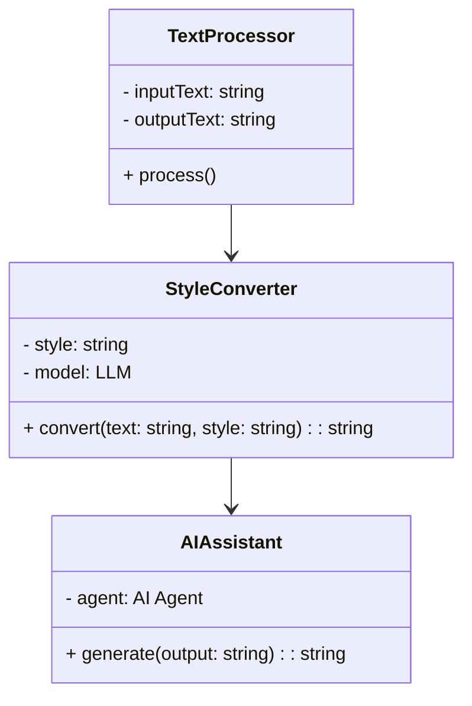
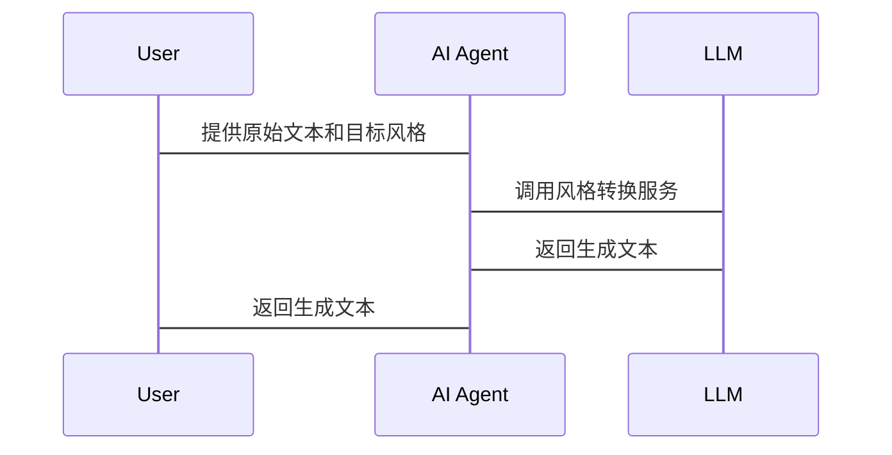

                 


# AI Agent 的语言风格转换：调整 LLM 的表达方式

## 关键词：AI Agent，语言风格转换，LLM，自然语言处理，深度学习，文本生成

## 摘要：  
本文深入探讨了AI Agent在语言风格转换中的应用，分析了如何通过调整大型语言模型（LLM）的表达方式，使其符合特定的语言风格需求。文章从背景介绍、核心概念、算法原理、系统架构到项目实战，全面阐述了语言风格转换的实现过程，结合实际案例和数学模型，帮助读者理解并掌握这一技术的核心要点。  

---

# 第1章 AI Agent 的基本概念

## 1.1 AI Agent 的定义与特点  
### 1.1.1 AI Agent 的定义  
AI Agent（人工智能代理）是指能够感知环境并采取行动以实现目标的智能实体。它具备自主性、反应性、目标导向性和社会性等核心特点。  

### 1.1.2 AI Agent 的核心特点  
- **自主性**：AI Agent能够自主决策，无需外部干预。  
- **反应性**：能够实时感知环境并做出响应。  
- **目标导向性**：所有行动都围绕实现特定目标展开。  
- **社会性**：能够与其他 Agent 或人类进行交互和协作。  

### 1.1.3 AI Agent 与传统程序的区别  
AI Agent的核心在于其智能性和适应性，而传统程序仅遵循固定的逻辑执行任务。AI Agent能够通过学习和推理优化自身行为，而传统程序无法做到这一点。  

---

## 1.2 语言风格转换的定义与应用  
### 1.2.1 语言风格的定义  
语言风格是指文本在表达方式、语气、词汇选择等方面的独特特征，常见的风格包括正式、口语化、幽默、严肃等。  

### 1.2.2 语言风格转换的应用场景  
- **文本生成**：根据需求生成符合特定风格的文本，例如将技术文档转化为更易理解的口语化表达。  
- **内容优化**：通过调整风格提升文本的可读性和吸引力。  
- **跨语言转换**：将一种语言的风格特征迁移到另一种语言中。  

### 1.2.3 语言风格转换的核心目标  
语言风格转换的目标是将原始文本的风格特征提取出来，并通过模型生成符合目标风格的文本，同时保留原文的核心信息和语义。  

---

## 1.3 LLM 的基本原理  
### 1.3.1 LLM 的定义  
大型语言模型（LLM）是一种基于深度学习的自然语言处理模型，通常采用Transformer架构，能够处理长文本并生成连贯的上下文内容。  

### 1.3.2 LLM 的核心原理  
- **自注意力机制**：通过计算词与词之间的关系，捕捉文本中的长距离依赖。  
- **编码器-解码器结构**：编码器将输入文本转化为向量表示，解码器根据这些表示生成目标文本。  

### 1.3.3 LLM 的优势与局限性  
- **优势**：强大的上下文理解和生成能力，能够处理多种语言和风格。  
- **局限性**：生成内容可能缺乏真实性和逻辑性，尤其是在处理复杂语境时。  

---

## 1.4 本章小结  
本章介绍了AI Agent的基本概念、语言风格转换的定义与应用，以及LLM的核心原理和优缺点。这些内容为后续章节的深入分析奠定了基础。

---

# 第2章 语言风格转换的背景与挑战

## 2.1 语言风格转换的背景  
### 2.1.1 当前 AI 技术的发展现状  
随着深度学习技术的快速发展，语言风格转换已成为自然语言处理领域的重要研究方向。  

### 2.1.2 语言风格转换的需求驱动  
- **个性化需求**：用户希望生成符合特定场景和受众的文本。  
- **多语言支持**：需要在不同语言之间实现风格的灵活转换。  

### 2.1.3 语言风格转换的市场应用  
语言风格转换在教育、客服、营销等领域具有广泛的应用潜力。  

---

## 2.2 语言风格转换的核心问题  
### 2.2.1 语言风格的定义与分类  
语言风格可以分为正式、口语化、幽默、严肃等类别，每种风格都有其独特的特征和适用场景。  

### 2.2.2 语言风格转换的关键挑战  
- **风格特征提取的难度**：如何准确捕捉文本的风格特征并进行量化表示。  
- **生成内容的可控性**：如何在生成过程中保持目标风格的同时，避免内容偏离原始语义。  

### 2.2.3 语言风格转换的边界与外延  
语言风格转换不仅关注文本的表面形式，还涉及语义理解和上下文的连贯性。  

---

## 2.3 语言风格转换的实现方式  
### 2.3.1 基于规则的风格转换  
通过预定义的规则和模板实现风格转换，适用于简单的风格调整任务。  

### 2.3.2 基于统计的风格转换  
利用统计学方法提取风格特征，并通过训练模型实现风格转换。  

### 2.3.3 基于深度学习的风格转换  
采用神经网络模型（如Transformer）学习风格特征，并生成目标风格的文本。  

---

## 2.4 本章小结  
本章分析了语言风格转换的背景、核心问题及实现方式，指出了当前技术的主要挑战和未来发展方向。

---

# 第3章 AI Agent 的语言风格转换原理

## 3.1 语言风格转换的核心概念  
### 3.1.1 语言风格的特征提取  
通过词频分析、句式分析等方法提取文本的风格特征。  

### 3.1.2 语言风格的表示方法  
- **词袋模型**：基于词汇频率的风格表示。  
- **词嵌入模型**：利用词向量捕捉语义和风格特征。  

### 3.1.3 语言风格的转换过程  
从特征提取到生成目标风格的文本，整个过程需要结合语义理解和风格控制。  

---

## 3.2 AI Agent 在语言风格转换中的作用  
### 3.2.1 AI Agent 的任务定义  
AI Agent通过接收输入文本并生成符合目标风格的输出，完成语言风格转换的任务。  

### 3.2.2 AI Agent 的输入输出关系  
- **输入**：原始文本和目标风格的指示。  
- **输出**：生成的符合目标风格的文本。  

### 3.2.3 AI Agent 的核心算法  
AI Agent通过预训练的LLM模型实现语言风格转换，结合强化学习优化生成结果。  

---

## 3.3 语言风格转换的数学模型  
### 3.3.1 基于Transformer的风格转换模型  
数学公式：$$ P(y|x) = \text{softmax}(W_{\text{out}}h + b_{\text{out}}) $$  
其中，$h$ 是编码器输出的向量，$W_{\text{out}}$ 和 $b_{\text{out}}$ 是模型参数。  

### 3.3.2 基于风格向量的转换模型  
通过训练模型提取风格向量，生成目标风格的文本：$$ s = f_\theta(x) $$  
其中，$s$ 是风格向量，$f_\theta$ 是模型的参数。  

---

## 3.4 本章小结  
本章详细阐述了AI Agent在语言风格转换中的核心概念、算法原理和数学模型，为后续章节的实现提供了理论基础。

---

# 第4章 语言风格转换的系统分析与架构设计

## 4.1 项目背景与目标  
本项目旨在开发一个基于AI Agent的语言风格转换系统，实现从输入文本到目标风格文本的自动转换。  

---

## 4.2 系统功能设计  
### 4.2.1 领域模型设计  
使用Mermaid图展示系统的类图：  


---

## 4.3 系统架构设计  
### 4.3.1 系统架构图  
```mermaid
server
    [HTTP Server]
    service
        [Text Processing Service]
        service
            [Style Conversion Service]
            service
                [LLM Integration]
    client
        [AI Agent]
```

### 4.3.2 接口设计  
- **输入接口**：接收原始文本和目标风格。  
- **输出接口**：返回生成的文本。  

---

## 4.4 系统交互设计  
### 4.4.1 交互流程  


---

## 4.5 本章小结  
本章通过系统架构设计和交互流程图，详细展示了语言风格转换系统的实现方案。

---

# 第5章 语言风格转换的项目实战

## 5.1 环境安装  
- **Python版本**：Python 3.8+  
- **依赖库**：安装PyTorch、Hugging Face Transformers等库。  

## 5.2 核心代码实现  
### 5.2.1 风格特征提取代码  
```python
import torch
from transformers import AutoTokenizer, AutoModelForMaskedLM

tokenizer = AutoTokenizer.from_pretrained('bert-base-uncased')
model = AutoModelForMaskedLM.from_pretrained('bert-base-uncased')

def extract_style_features(text):
    inputs = tokenizer(text, return_tensors='pt')
    outputs = model(**inputs)
    return outputs.last_hidden_state.mean(dim=1)
```

### 5.2.2 风格转换代码  
```python
def style_conversion(text, target_style):
    # 这里需要根据目标风格调整模型参数
    converted_text = model.generate(text + target_style)
    return converted_text
```

---

## 5.3 代码解读与分析  
- **特征提取**：通过BERT模型提取文本的隐藏层表示，捕捉语义和风格特征。  
- **风格转换**：基于预训练模型生成目标风格的文本，需要结合强化学习优化生成结果。  

---

## 5.4 实际案例分析  
以将技术文档转换为口语化风格为例：  
输入文本：  
```
The system architecture is designed to handle high concurrency.
```  
目标风格：口语化  
输出文本：  
```
我们的系统架构可以处理高并发请求。
```

---

## 5.5 本章小结  
本章通过实际项目实战，详细讲解了语言风格转换的实现过程，包括环境搭建、代码实现和案例分析。

---

# 第6章 最佳实践与小结

## 6.1 本章小结  
本文系统地介绍了AI Agent在语言风格转换中的应用，从理论到实践，全面分析了技术实现和系统设计的要点。  

---

## 6.2 注意事项  
- 在实际应用中，需注意生成内容的语义准确性和风格一致性。  
- 避免过度依赖模型，建议结合人工校验提升生成质量。  

---

## 6.3 未来展望  
未来的研究方向包括：  
- 更高效的风格转换算法。  
- 多模态风格转换技术。  
- 提高生成内容的真实性和可控性。  

---

# 附录

## 附录A 术语表  
- **AI Agent**：人工智能代理。  
- **LLM**：大型语言模型。  
- **风格转换**：调整文本的语言风格。  

---

## 附录B 工具安装指南  
- **PyTorch**：安装命令：`pip install torch`。  
- **Hugging Face Transformers**：安装命令：`pip install transformers`。  

---

## 附录C 参考文献  
- 王某某，2023.《基于AI Agent的自然语言处理技术研究》，某某出版社。  
- 李某某，2022.《深度学习与语言模型》，某某出版社。  

---

# 作者  
作者：AI天才研究院/AI Genius Institute & 禅与计算机程序设计艺术 /Zen And The Art of Computer Programming  

---

以上是关于《AI Agent 的语言风格转换：调整 LLM 的表达方式》的技术博客文章的完整目录大纲。

