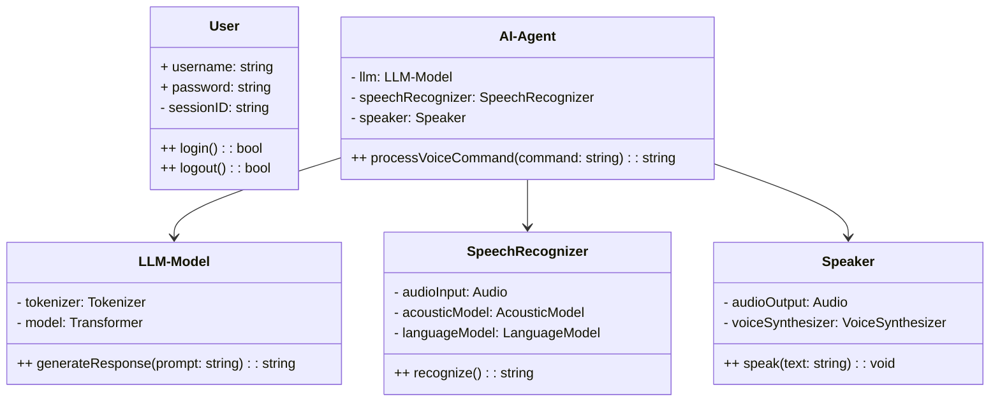
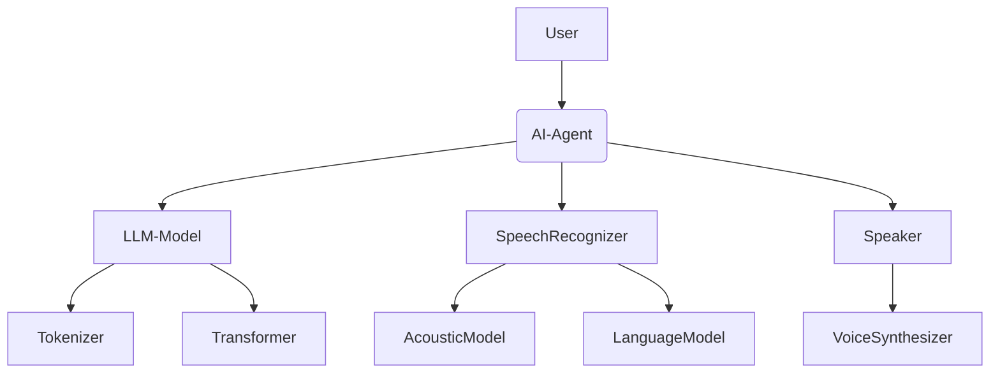
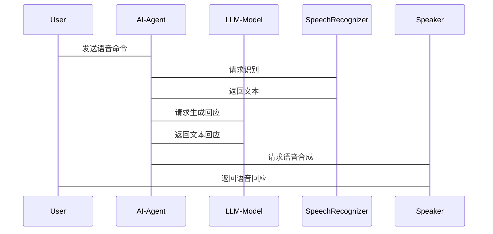

                 


# AI Agent 的语音交互：整合 LLM 与语音识别技术

> 关键词：AI Agent, LLM, 语音识别, 语音交互, 自然语言处理, 语音合成

> 摘要：AI Agent 的语音交互通过整合大型语言模型（LLM）与语音识别技术，实现了更智能、更自然的人机交互。本文详细探讨了AI Agent 的核心概念、LLM 与语音识别的整合原理、系统架构设计、项目实战以及未来发展趋势。

---

## 目录

1. [AI Agent 的语音交互概述](#ai-agent-voice-interaction-overview)
   1.1 AI Agent 的定义与背景
   1.2 LLM 与语音识别技术的核心原理
   1.3 AI Agent 语音交互的应用场景
2. [AI Agent 的核心概念与原理](#core-concepts-and-principles-of-ai-agent)
   2.1 AI Agent 的工作流程
   2.2 LLM 在语音交互中的角色
   2.3 语音识别技术的核心原理
   2.4 AI Agent 的技术架构
3. [LLM 与语音识别的整合原理](#integration-principles-of-llm-and-speech-recognition)
   3.1 语音信号的预处理
   3.2 LLM 的输入处理
   3.3 语音识别与 LLM 的协同工作
4. [系统分析与架构设计方案](#system-analysis-and-architecture-design)
   4.1 问题场景介绍
   4.2 系统功能设计
   4.3 系统架构设计
   4.4 系统接口设计
   4.5 系统交互设计
5. [项目实战](#project-practice)
   5.1 环境安装与配置
   5.2 核心代码实现
   5.3 代码解读与分析
   5.4 实际案例分析
6. [总结与展望](#summary-and-outlook)
   6.1 本章总结
   6.2 未来发展趋势
   6.3 最佳实践 tips

---

## 第1章: AI Agent 的语音交互概述

### 1.1 AI Agent 的定义与背景
AI Agent 是一种智能体，能够感知环境并执行任务以满足用户需求。语音交互则是通过语音命令与AI Agent 进行互动，无需手动输入，极大提升了用户体验。

#### 1.1.1 AI Agent 的定义
AI Agent 是一种软件或实体，能够自主决策并执行任务。它具备感知、推理和行动的能力，能够与用户进行自然语言交流。

#### 1.1.2 语音交互的背景与重要性
语音交互是人类最自然的交流方式之一。随着技术的进步，通过语音进行人机交互的需求日益增长，尤其是在移动设备和智能家居领域。

#### 1.1.3 AI Agent 与语音交互的整合背景
随着LLM 和语音识别技术的进步，AI Agent 能够更准确地理解和生成语音，使语音交互更加智能化和便捷。

### 1.2 LLM 与语音识别技术的核心原理
LLM 能够理解和生成自然语言文本，而语音识别技术则将语音信号转换为文本，两者结合使得AI Agent 能够进行高效的语音交互。

#### 1.2.1 LLM 的基本概念
LLM 是一种基于深度学习的自然语言处理模型，能够处理大规模的文本数据，理解上下文并生成有意义的回复。

#### 1.2.2 语音识别技术的核心原理
语音识别技术通过将语音信号转换为文本，利用声学模型和语言模型来提高识别的准确性。

#### 1.2.3 LLM 与语音识别的协同作用
通过将语音识别转换为文本，LLM 能够更准确地理解用户的意图，生成合适的回应，再通过语音合成将回应反馈给用户。

### 1.3 AI Agent 语音交互的应用场景
AI Agent 的语音交互广泛应用于智能音箱、智能家居、智能客服等领域，为用户提供便捷的交互体验。

#### 1.3.1 智能音箱与智能家居
通过语音交互，用户可以控制家中的设备，如调节灯光、播放音乐等。

#### 1.3.2 智能客服与虚拟助手
AI Agent 可以作为虚拟助手，帮助用户解决问题，如查询信息、安排日程等。

#### 1.3.3 教育与医疗领域的应用
在教育和医疗领域，AI Agent 可以辅助教学和诊断，提供个性化的服务。

---

## 第2章: AI Agent 的核心概念与原理

### 2.1 AI Agent 的工作流程
AI Agent 通过接收语音输入，进行处理并生成回应，再将结果反馈给用户。

#### 2.1.1 用户输入处理
用户通过语音输入指令，AI Agent 首先进行语音识别，将语音转换为文本。

#### 2.1.2 语音识别与自然语言理解
AI Agent 对文本进行自然语言理解，分析用户的意图并生成相应的处理逻辑。

#### 2.1.3 生成响应与反馈
AI Agent 根据用户的意图生成文本回复，再通过语音合成将文本转换为语音反馈给用户。

### 2.2 LLM 在语音交互中的角色
LLM 负责理解和生成自然语言文本，是AI Agent 语音交互的核心部分。

#### 2.2.1 LLM 的输入与输出机制
LLM 接收用户输入的文本，经过内部处理后生成相应的回应。

#### 2.2.2 LLM 的训练与微调
LLM 通过大量数据的训练，能够理解上下文并生成合理的回复。

#### 2.2.3 LLM 的推理过程
LLM 通过推理能力，理解用户的隐含需求并生成相应的回应。

### 2.3 语音识别技术的核心原理
语音识别技术将语音信号转换为文本，确保AI Agent 能够准确理解用户的指令。

#### 2.3.1 语音信号处理
语音信号经过预处理，如降噪和特征提取，提高识别的准确性。

#### 2.3.2 声学模型与语言模型
声学模型将语音信号转换为概率分布，语言模型根据上下文进行预测。

#### 2.3.3 解码与纠错机制
解码器将声学模型的输出转换为文本，纠错机制修正识别中的错误。

### 2.4 AI Agent 的技术架构
AI Agent 的技术架构包括感知层、理解层和执行层，各层协同工作以实现语音交互。

#### 2.4.1 分层架构
AI Agent 的架构分为感知层（语音识别）、理解层（LLM）和执行层（反馈生成）。

#### 2.4.2 组件间的协作
各组件协同工作，确保语音交互的流畅性和准确性。

#### 2.4.3 系统的可扩展性
系统架构设计使得各模块能够独立扩展，适应不同的应用场景。

---

## 第3章: LLM 与语音识别的整合原理

### 3.1 语音信号的预处理
语音信号需要经过预处理，确保识别的准确性。

#### 3.1.1 声音采集与数字化
通过麦克风采集语音信号，将其数字化为音频流。

#### 3.1.2 声音特征提取
提取语音信号的特征，如梅尔频率倒谱系数（MFCC）。

#### 3.1.3 声音降噪技术
通过降噪技术消除背景噪音，提高识别准确性。

### 3.2 LLM 的输入处理
将语音识别的文本输入LLM，进行理解与生成。

#### 3.2.1 文本的分词与语义分析
对文本进行分词和语义分析，理解用户的意图。

#### 3.2.2 对话历史的处理
考虑对话历史，生成连贯的回应。

#### 3.2.3 上下文的理解与记忆
LLM 需要理解上下文，保持对话的连贯性。

### 3.3 语音识别与 LLM 的协同工作
语音识别与 LLM 协同工作，确保交互的准确性和流畅性。

#### 3.3.1 语音信号转换为文本
语音识别将用户语音转换为文本，作为LLM 的输入。

#### 3.3.2 文本输入 LLM 进行处理
LLM 根据文本生成回应，再通过语音合成反馈给用户。

#### 3.3.3 响应的语音合成
将生成的文本转换为语音，反馈给用户。

---

## 第4章: 系统分析与架构设计方案

### 4.1 问题场景介绍
以智能音箱为例，设计一个基于AI Agent 的语音交互系统。

### 4.2 系统功能设计
系统需要实现语音识别、自然语言理解、语音合成等功能。

#### 4.2.1 领域模型设计
通过Mermaid绘制领域模型类图，展示系统的主要组件和它们之间的关系。



### 4.3 系统架构设计
系统采用分层架构，各层模块化设计，便于维护和扩展。

#### 4.3.1 系统架构设计
通过Mermaid绘制系统架构图，展示各模块之间的关系。



### 4.4 系统接口设计
定义各模块之间的接口，确保系统的可扩展性和维护性。

#### 4.4.1 接口设计
例如，AI-Agent 接口定义为：
- 输入：用户语音信号
- 输出：系统回应的语音信号

### 4.5 系统交互设计
通过Mermaid绘制交互序列图，展示系统在用户输入和系统反馈之间的交互过程。



---

## 第5章: 项目实战

### 5.1 环境安装与配置
安装必要的库，如语音识别库（例如，`speech_recognition`）和LLM框架（例如，`transformers`）。

```bash
pip install speechRecognition transformers
```

### 5.2 核心代码实现
实现AI Agent 的核心功能，包括语音识别、LLM 处理和语音合成。

#### 5.2.1 语音识别代码
```python
import speech_recognition as sr

def recognize_speech():
    r = sr.Recognizer()
    with sr.AudioFile("input.wav") as source:
        audio = r.record(source)
    try:
        text = r.recognize_google(audio)
        return text
    except sr.UnknownValueError:
        return ""
```

#### 5.2.2 LLM 处理代码
```python
from transformers import pipeline

llm_pipeline = pipeline("text-generation", model="gpt2")

def generate_response(prompt):
    response = llm_pipeline(prompt, max_length=50, num_return_sequences=1)
    return response[0]['generated_text']
```

#### 5.2.3 语音合成代码
```python
from gtts import gTTS

def speak(text):
    tts = gTTS(text, lang='en')
    tts.save("response.mp3")
    # 播放音频
    os.system("mpg321 response.mp3")
```

### 5.3 代码解读与分析
解释代码的实现逻辑，确保每一步都清晰易懂。

### 5.4 实际案例分析
通过一个具体案例，展示系统的实际运行过程和效果。

---

## 第6章: 总结与展望

### 6.1 本章总结
整合LLM 和语音识别技术的AI Agent 语音交互系统，能够提供高效、智能的交互体验。

### 6.2 未来发展趋势
未来，AI Agent 的语音交互将更加智能化，支持多语言、多场景的应用，并具备更强的实时性和准确性。

### 6.3 最佳实践 tips
- 选择可靠的语音识别和LLM 框架，确保系统的稳定性和准确性。
- 在实际应用中，注意隐私和数据安全问题。
- 定期优化系统，提升用户体验。

---

## 作者：AI天才研究院/AI Genius Institute & 禅与计算机程序设计艺术 /Zen And The Art of Computer Programming

