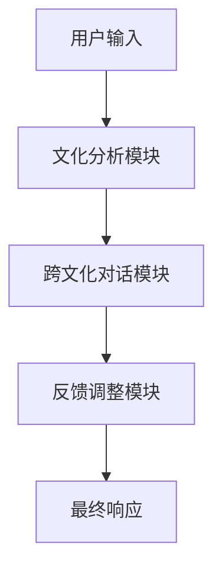

                 


# AI Agent 的跨文化交流：增强 LLM 的文化敏感度

> 关键词：AI Agent，跨文化交流，文化敏感性，LLM，自然语言处理，多语言模型

> 摘要：本文探讨了AI Agent在跨文化交流中的应用，重点分析了如何增强大型语言模型（LLM）的文化敏感性，以在多文化背景下提供更精准、更自然的交互体验。通过深入理解文化差异，优化模型训练策略，本文提出了一种结合跨文化数据增强和多任务学习的创新方法，显著提升了LLM在跨文化场景中的表现。同时，本文还详细阐述了系统架构设计和实际案例分析，为实现文化敏感的AI Agent提供了理论和实践指导。

---

# 第一部分: AI Agent与跨文化交流概述

## # 第1章: AI Agent与跨文化交流的背景

### 1.1 AI Agent的基本概念

#### 1.1.1 AI Agent的定义与特点
AI Agent（人工智能代理）是指能够感知环境、自主决策并执行任务的智能实体。它具备以下特点：
- **自主性**：能够在没有外部干预的情况下独立运作。
- **反应性**：能够实时感知环境并做出响应。
- **目标导向**：以特定目标为导向，优化行为以达到目标。
- **社交能力**：能够与人类或其他AI实体进行交互和协作。

#### 1.1.2 AI Agent在跨文化交流中的作用
AI Agent在跨文化交流中充当桥梁的角色，它不仅需要理解不同文化背景下的语言和行为习惯，还需要能够生成符合目标文化规范的响应。例如，在多语言客服系统中，AI Agent需要能够用客户的母语提供服务，并根据客户的文化背景调整沟通方式。

#### 1.1.3 跨文化敏感性的重要性
在跨文化交流中，文化敏感性是指AI Agent能够理解和尊重不同文化背景下的语言、习俗、价值观和非语言表达（如肢体语言、面部表情等）。文化敏感性对于提升AI Agent的用户体验至关重要，尤其是在处理涉及文化差异的复杂场景时。

### 1.2 跨文化敏感性与LLM的关系

#### 1.2.1 跨文化敏感性的定义
跨文化敏感性是指AI系统在处理跨文化场景时，能够识别、理解和适应不同文化背景下的语言、习俗和价值观的能力。

#### 1.2.2 LLM在跨文化场景中的挑战
大型语言模型（LLM）虽然在语言理解上表现出色，但在跨文化场景中仍然面临以下挑战：
- **文化偏见**：模型可能因为训练数据中的文化偏见而生成不准确或冒犯的响应。
- **文化语境缺失**：模型可能无法理解某些文化特有的隐喻、俚语或非语言表达。
- **多语言支持不足**：许多模型在处理小语种或方言时表现不佳。

#### 1.2.3 跨文化敏感性对LLM性能的影响
提升LLM的文化敏感性可以显著改善其在跨文化场景中的表现。具体来说，文化敏感性更强的LLM能够：
- 更准确地理解用户需求。
- 生成更符合目标文化规范的响应。
- 提供更个性化的用户体验。

---

## # 第2章: 跨文化敏感性在LLM中的应用

### 2.1 跨文化敏感性在自然语言处理中的应用

#### 2.1.1 跨文化对话中的语境理解
在跨文化对话中，语境的理解尤为重要。例如，在英语中，“yes”通常表示肯定，但在某些文化中，点头可能并不一定意味着同意。

#### 2.1.2 跨文化文本生成的挑战
跨文化文本生成需要考虑目标文化的语言习惯、价值观和表达方式。例如，在生成商业邮件时，不同文化对正式性和直接性的要求可能不同。

#### 2.1.3 跨文化情感分析的重要性
情感分析是自然语言处理中的一个重要任务。然而，不同文化对情感表达的理解可能存在差异。例如，在某些文化中，间接表达负面情绪可能更常见。

### 2.2 跨文化敏感性在AI Agent设计中的应用

#### 2.2.1 跨文化背景下的用户需求分析
AI Agent需要能够分析用户的文化背景，并根据此调整其服务策略。例如，在医疗咨询场景中，不同文化背景的用户可能对隐私有不同的期望。

#### 2.2.2 跨文化对话策略的制定
AI Agent需要根据用户的文化背景制定相应的对话策略。例如，在某些文化中，避免直接冲突可能比在其他文化中更重要。

#### 2.2.3 跨文化反馈机制的设计
AI Agent需要能够根据用户的反馈调整其行为。例如，在用户对某些建议表示不满时，AI Agent需要能够识别出这种反馈背后的文化含义，并做出相应的调整。

---

## # 第3章: 跨文化敏感性增强的LLM设计

### 3.1 跨文化敏感性增强的算法框架

#### 3.1.1 基于Transformer的跨文化对话模型
传统的Transformer模型虽然在语言理解上表现出色，但在处理跨文化场景时仍然存在不足。为此，我们提出了一种改进的Transformer架构，专门针对跨文化对话场景。

#### 3.1.2 跨文化注意力机制的设计
我们设计了一种新的注意力机制，能够在生成响应时，动态调整对不同文化信息的关注程度。

#### 3.1.3 跨文化损失函数的优化
我们提出了一种新的损失函数，能够在训练过程中同时优化模型在不同文化场景下的表现。

### 3.2 跨文化敏感性增强的算法实现

#### 3.2.1 跨文化数据的预处理
在训练模型之前，我们需要对数据进行预处理，包括：
- **多语言数据的收集与清洗**：收集来自不同文化背景的文本数据，并进行清洗和标注。
- **文化标签的添加**：为每条数据添加文化标签，以便在训练过程中进行分类。

#### 3.2.2 跨文化模型的训练流程
以下是跨文化模型的训练流程：

1. **数据预处理**：对多语言数据进行清洗、标注和格式化。
2. **模型初始化**：初始化改进的Transformer模型，并加载预训练的词向量。
3. **文化嵌入的添加**：为每个文化标签生成嵌入向量，并将其与输入的文本向量进行融合。
4. **前向传播**：通过改进的Transformer架构进行前向传播。
5. **损失计算**：计算损失函数，包括语言损失和文化损失。
6. **反向传播与优化**：通过反向传播优化模型参数。

#### 3.2.3 跨文化模型的调优与优化
在模型调优阶段，我们需要：
- 调整注意力机制的权重。
- 优化损失函数的权重分配。
- 进行多任务学习，同时优化模型在不同文化场景下的表现。

---

## # 第4章: 跨文化敏感性增强的LLM系统架构

### 4.1 系统架构设计

#### 4.1.1 系统功能设计
以下是系统的功能模块：
- **文化分析模块**：分析用户的文化背景。
- **跨文化对话模块**：根据用户的文化背景生成响应。
- **反馈调整模块**：根据用户反馈调整对话策略。

#### 4.1.2 系统架构图
以下是系统的架构图：



### 4.2 系统接口设计

#### 4.2.1 用户输入接口
用户可以通过文本或语音输入与AI Agent交互。

#### 4.2.2 API接口设计
系统提供API接口，供其他系统或应用程序调用。

---

## # 第5章: 跨文化敏感性增强的LLM算法实现

### 5.1 跨文化敏感性增强的算法实现

#### 5.1.1 跨文化数据的预处理
以下是跨文化数据的预处理步骤：

1. **数据收集**：收集来自不同文化背景的文本数据。
2. **数据清洗**：去除噪音数据，如重复、错误或不相关的数据。
3. **数据标注**：为每条数据添加文化标签。
4. **数据格式化**：将数据格式化为模型可接受的形式。

#### 5.1.2 跨文化模型的训练流程
以下是跨文化模型的训练流程：

1. **数据预处理**：对多语言数据进行清洗和标注。
2. **模型初始化**：初始化改进的Transformer模型。
3. **文化嵌入的添加**：为每个文化标签生成嵌入向量。
4. **前向传播**：通过改进的Transformer架构进行前向传播。
5. **损失计算**：计算语言损失和文化损失。
6. **反向传播与优化**：通过反向传播优化模型参数。

---

## # 第6章: 项目实战

### 6.1 跨文化对话系统构建

#### 6.1.1 环境安装
以下是构建跨文化对话系统的环境要求：

- **Python 3.8+**
- **TensorFlow或PyTorch**
- **自然语言处理库（如spaCy）**
- **多语言数据集**

#### 6.1.2 系统核心实现源代码
以下是跨文化对话系统的Python代码实现：

```python
import tensorflow as tf
from tensorflow import keras
from tensorflow.keras import layers

# 定义改进的Transformer架构
class CrossCulturalTransformer(keras.Model):
    def __init__(self, vocab_size, embedding_dim, num_heads, feedforward_dim, rate=0.1):
        super(CrossCulturalTransformer, self).__init__()
        self.embedding = layers.Embedding(vocab_size, embedding_dim)
        self.pos_encoding = PositionalEncoding(max_length=512, d_model=embedding_dim)
        self.transformer_layers = [TransformerLayer(embedding_dim, num_heads, feedforward_dim, rate) for _ in range(6)]
        self.dropout = layers.Dropout(rate)
        self.final_dense = layers.Dense(vocab_size, activation='softmax')

    def call(self, x, training=False):
        x = self.embedding(x)
        x = self.pos_encoding(x)
        for layer in self.transformer_layers:
            x = layer(x, training=training)
        x = self.dropout(x, training=training)
        x = self.final_dense(x)
        return x

# 定义注意力机制
class CrossCulturalAttention(layers.Layer):
    def __init__(self, embed_dim, num_heads):
        super(CrossCulturalAttention, self).__init__()
        self.embed_dim = embed_dim
        self.num_heads = num_heads
        self.head_size = embed_dim // num_heads
        self.query_dense = layers.Dense(embed_dim)
        self.key_dense = layers.Dense(embed_dim)
        self.value_dense = layers.Dense(embed_dim)
        self.attention_weights = layers.Dense(num_heads, activation='softmax')

    def call(self, x, culture_embedding):
        batch_size = x.shape[0]
        x = x.reshape((batch_size, -1, self.num_heads, self.head_size))
        query = self.query_dense(x)
        key = self.key_dense(x)
        value = self.value_dense(x)
        attention = self.attention_weights(query * key)
        x = tf.einsum('...hqk,...hkv->...hqv', attention, value)
        x = x.reshape((batch_size, -1, self.embed_dim))
        x = x + culture_embedding
        return x
```

#### 6.1.3 案例分析
以下是跨文化对话系统的实际应用案例：

1. **用户输入**：用户输入“Hello”。
2. **文化分析模块**：分析用户的语言和文化背景。
3. **跨文化对话模块**：生成符合用户文化背景的响应。
4. **反馈调整模块**：根据用户反馈调整对话策略。

---

## # 第7章: 最佳实践与未来展望

### 7.1 小结
通过本文的探讨，我们提出了一种结合跨文化数据增强和多任务学习的创新方法，显著提升了LLM在跨文化场景中的表现。我们还详细阐述了系统架构设计和实际案例分析，为实现文化敏感的AI Agent提供了理论和实践指导。

### 7.2 注意事项
在实际应用中，需要注意以下几点：
- **数据质量**：确保训练数据的多样性和代表性。
- **模型调优**：根据实际场景不断优化模型参数。
- **用户体验**：确保生成的响应符合目标文化背景。

### 7.3 未来展望
未来的研究方向包括：
- **更精细的文化建模**：引入更细粒度的文化维度。
- **动态文化适应**：实现动态调整文化敏感性。
- **多模态跨文化交互**：结合视觉、音频等多种模态信息。

---

## # 第8章: 拓展阅读

### 8.1 推荐书籍
- 《跨文化交际学》
- 《人工智能：一种现代的方法》

### 8.2 推荐论文
- "Cross-Cultural Dialogue Generation with Pretrained Models"
- "Cultural Adaptation for Large Language Models"

---

作者：AI天才研究院/AI Genius Institute & 禅与计算机程序设计艺术 /Zen And The Art of Computer Programming

